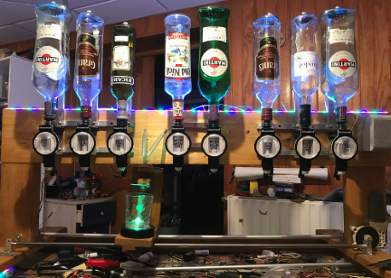
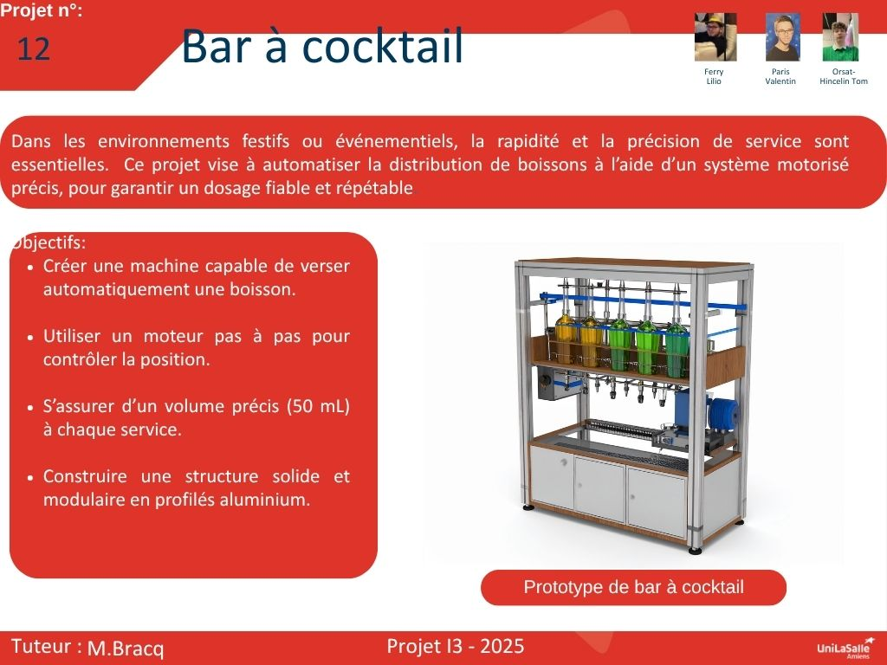

# Bienvenue sur notre documentation

Bienvenue dans la documentation du projet du bar à cocktail automatique. Ce site a pour but de fournir toutes les informations nécessaires pour comprendre, utiliser et reproduire efficacement notre projet.

## À propos du Projet

Dans les environnements festifs ou événementiels, la rapidité et la précision du service sont primordiales. Ce projet a pour objectif d’automatiser la distribution de boissons à l’aide d’un système motorisé performant, assurant un dosage fiable, régulier et reproductible..

Ce projet consiste à créer une machine capable de verser automatiquement une boisson, répondant aux exigences de rapidité, d’hygiène et de précision dans les environnements festifs ou événementiels. Le système repose sur l’utilisation d’un moteur pas à pas, permettant de contrôler avec précision la position du mécanisme de distribution. L’objectif est de garantir un volume constant de 50 mL à chaque service, en assurant un dosage fiable et reproductible. L’ensemble sera construit sur une structure solide et modulaire en profilés aluminium, afin de faciliter le montage, la maintenance et les éventuelles évolutions du dispositif.

## Poster

Voici notre affiche de notre projet 

# Vidéo 

Voici le vidéo de notre  projet :
[Uplo{
 "id": "ZQTG5WG6T3",
 "fps": {
  "num": 30,
  "den": 1
 },
 "display_ratio": {
  "num": 16,
  "den": 9
 },
 "pixel_ratio": {
  "num": 1,
  "den": 1
 },
 "width": 1280,
 "height": 720,
 "sample_rate": 48000,
 "channels": 2,
 "channel_layout": 3,
 "settings": {},
 "clips": [
  {
   "alpha": {
    "Points": [
     {
      "co": {
       "X": 1.0,
       "Y": 1.0
      },
      "handle_left": {
       "X": 0.5,
       "Y": 1.0
      },
      "handle_right": {
       "X": 0.5,
       "Y": 0.0
      },
      "handle_type": 0,
      "interpolation": 0
     }
    ]
   },
   "anchor": 0,
   "channel_filter": {
    "Points": [
     {
      "co": {
       "X": 1.0,
       "Y": -1.0
      },
      "handle_left": {
       "X": 0.5,
       "Y": 1.0
      },
      "handle_right": {
       "X": 0.5,
       "Y": 0.0
      },
      "handle_type": 0,
      "interpolation": 0
     }
    ]
   },
   "channel_mapping": {
    "Points": [
     {
      "co": {
       "X": 1.0,
       "Y": -1.0
      },
      "handle_left": {
       "X": 0.5,
       "Y": 1.0
      },
      "handle_right": {
       "X": 0.5,
       "Y": 0.0
      },
      "handle_type": 0,
      "interpolation": 0
     }
    ]
   },
   "display": 0,
   "duration": 3.4,
   "effects": [],
   "end": 3.4,
   "gravity": 4,
   "has_audio": {
    "Points": [
     {
      "co": {
       "X": 1.0,
       "Y": -1.0
      },
      "handle_left": {
       "X": 0.5,
       "Y": 1.0
      },
      "handle_right": {
       "X": 0.5,
       "Y": 0.0
      },
      "handle_type": 0,
      "interpolation": 0
     }
    ]
   },
   "has_video": {
    "Points": [
     {
      "co": {
       "X": 1.0,
       "Y": -1.0
      },
      "handle_left": {
       "X": 0.5,
       "Y": 1.0
      },
      "handle_right": {
       "X": 0.5,
       "Y": 0.0
      },
      "handle_type": 0,
      "interpolation": 0
     }
    ]
   },
   "id": "SIMUZ11UUG",
   "layer": 5000000,
   "location_x": {
    "Points": [
     {
      "co": {
       "X": 1.0,
       "Y": 0.0
      },
      "handle_left": {
       "X": 0.5,
       "Y": 1.0
      },
      "handle_right": {
       "X": 0.5,
       "Y": 0.0
      },
      "handle_type": 0,
      "interpolation": 0
     }
    ]
   },
   "location_y": {
    "Points": [
     {
      "co": {
       "X": 1.0,
       "Y": 0.0
      },
      "handle_left": {
       "X": 0.5,
       "Y": 1.0
      },
      "handle_right": {
       "X": 0.5,
       "Y": 0.0
      },
      "handle_type": 0,
      "interpolation": 0
     }
    ]
   },
   "mixing": 0,
   "origin_x": {
    "Points": [
     {
      "co": {
       "X": 1.0,
       "Y": 0.5
      },
      "handle_left": {
       "X": 0.5,
       "Y": 1.0
      },
      "handle_right": {
       "X": 0.5,
       "Y": 0.0
      },
      "handle_type": 0,
      "interpolation": 0
     }
    ]
   },
   "origin_y": {
    "Points": [
     {
      "co": {
       "X": 1.0,
       "Y": 0.5
      },
      "handle_left": {
       "X": 0.5,
       "Y": 1.0
      },
      "handle_right": {
       "X": 0.5,
       "Y": 0.0
      },
      "handle_type": 0,
      "interpolation": 0
     }
    ]
   },
   "parentObjectId": "",
   "perspective_c1_x": {
    "Points": [
     {
      "co": {
       "X": 1.0,
       "Y": -1.0
      },
      "handle_left": {
       "X": 0.5,
       "Y": 1.0
      },
      "handle_right": {
       "X": 0.5,
       "Y": 0.0
      },
      "handle_type": 0,
      "interpolation": 0
     }
    ]
   },
   "perspective_c1_y": {
    "Points": [
     {
      "co": {
       "X": 1.0,
       "Y": -1.0
      },
      "handle_left": {
       "X": 0.5,
       "Y": 1.0
      },
      "handle_right": {
       "X": 0.5,
       "Y": 0.0
      },
      "handle_type": 0,
      "interpolation": 0
     }
    ]
   },
   "perspective_c2_x": {
    "Points": [
     {
      "co": {
       "X": 1.0,
       "Y": -1.0
      },
      "handle_left": {
       "X": 0.5,
       "Y": 1.0
      },
      "handle_right": {
       "X": 0.5,
       "Y": 0.0
      },
      "handle_type": 0,
      "interpolation": 0
     }
    ]
   },
   "perspective_c2_y": {
    "Points": [
     {
      "co": {
       "X": 1.0,
       "Y": -1.0
      },
      "handle_left": {
       "X": 0.5,
       "Y": 1.0
      },
      "handle_right": {
       "X": 0.5,
       "Y": 0.0
      },
      "handle_type": 0,
      "interpolation": 0
     }
    ]
   },
   "perspective_c3_x": {
    "Points": [
     {
      "co": {
       "X": 1.0,
       "Y": -1.0
      },
      "handle_left": {
       "X": 0.5,
       "Y": 1.0
      },
      "handle_right": {
       "X": 0.5,
       "Y": 0.0
      },
      "handle_type": 0,
      "interpolation": 0
     }
    ]
   },
   "perspective_c3_y": {
    "Points": [
     {
      "co": {
       "X": 1.0,
       "Y": -1.0
      },
      "handle_left": {
       "X": 0.5,
       "Y": 1.0
      },
      "handle_right": {
       "X": 0.5,
       "Y": 0.0
      },
      "handle_type": 0,
      "interpolation": 0
     }
    ]
   },
   "perspective_c4_x": {
    "Points": [
     {
      "co": {
       "X": 1.0,
       "Y": -1.0
      },
      "handle_left": {
       "X": 0.5,
       "Y": 1.0
      },
      "handle_right": {
       "X": 0.5,
       "Y": 0.0
      },
      "handle_type": 0,
      "interpolation": 0
     }
    ]
   },
   "perspective_c4_y": {
    "Points": [
     {
      "co": {
       "X": 1.0,
       "Y": -1.0
      },
      "handle_left": {
       "X": 0.5,
       "Y": 1.0
      },
      "handle_right": {
       "X": 0.5,
       "Y": 0.0
      },
      "handle_type": 0,
      "interpolation": 0
     }
    ]
   },
   "position": 54.53333333333333,
   "reader": {
    "acodec": "aac",
    "audio_bit_rate": 315789,
    "audio_stream_index": 1,
    "audio_timebase": {
     "den": 48000,
     "num": 1
    },
    "channel_layout": 3,
    "channels": 2,
    "display_ratio": {
     "den": 16,
     "num": 9
    },
    "duration": 3.403395891189575,
    "file_size": "799923",
    "fps": {
     "den": 1001,
     "num": 30000
    },
    "has_audio": true,
    "has_single_image": false,
    "has_video": true,
    "height": 1920,
    "interlaced_frame": false,
    "metadata": {
     "compatible_brands": "mp42mp41",
     "creation_time": "2025-05-06T07:26:00.000000Z",
     "encoder": "AVC Coding",
     "handler_name": "#Mainconcept MP4 Sound Media Handler",
     "language": "eng",
     "major_brand": "mp42",
     "minor_version": "0"
    },
    "path": "../../Downloads/intro_outro_verticale (1).mp4",
    "pixel_format": 0,
    "pixel_ratio": {
     "den": 1,
     "num": 1
    },
    "sample_rate": 48000,
    "top_field_first": true,
    "type": "FFmpegReader",
    "vcodec": "h264",
    "video_bit_rate": 232896,
    "video_length": "102",
    "video_stream_index": 0,
    "video_timebase": {
     "den": 30000,
     "num": 1
    },
    "width": 1080,
    "media_type": "video",
    "id": "1LNESGUTAC"
   },
   "rotation": {
    "Points": [
     {
      "co": {
       "X": 1.0,
       "Y": 0.0
      },
      "handle_left": {
       "X": 0.5,
       "Y": 1.0
      },
      "handle_right": {
       "X": 0.5,
       "Y": 0.0
      },
      "handle_type": 0,
      "interpolation": 0
     }
    ]
   },
   "scale": 1,
   "scale_x": {
    "Points": [
     {
      "co": {
       "X": 1.0,
       "Y": 1.0
      },
      "handle_left": {
       "X": 0.5,
       "Y": 1.0
      },
      "handle_right": {
       "X": 0.5,
       "Y": 0.0
      },
      "handle_type": 0,
      "interpolation": 0
     }
    ]
   },
   "scale_y": {
    "Points": [
     {
      "co": {
       "X": 1.0,
       "Y": 1.0
      },
      "handle_left": {
       "X": 0.5,
       "Y": 1.0
      },
      "handle_right": {
       "X": 0.5,
       "Y": 0.0
      },
      "handle_type": 0,
      "interpolation": 0
     }
    ]
   },
   "shear_x": {
    "Points": [
     {
      "co": {
       "X": 1.0,
       "Y": 0.0
      },
      "handle_left": {
       "X": 0.5,
       "Y": 1.0
      },
      "handle_right": {
       "X": 0.5,
       "Y": 0.0
      },
      "handle_type": 0,
      "interpolation": 0
     }
    ]
   },
   "shear_y": {
    "Points": [
     {
      "co": {
       "X": 1.0,
       "Y": 0.0
      },
      "handle_left": {
       "X": 0.5,
       "Y": 1.0
      },
      "handle_right": {
       "X": 0.5,
       "Y": 0.0
      },
      "handle_type": 0,
      "interpolation": 0
     }
    ]
   },
   "start": 0,
   "time": {
    "Points": [
     {
      "co": {
       "X": 1.0,
       "Y": 1.0
      },
      "handle_left": {
       "X": 0.5,
       "Y": 1.0
      },
      "handle_right": {
       "X": 0.5,
       "Y": 0.0
      },
      "handle_type": 0,
      "interpolation": 0
     }
    ]
   },
   "volume": {
    "Points": [
     {
      "co": {
       "X": 1.0,
       "Y": 1.0
      },
      "handle_left": {
       "X": 0.5,
       "Y": 1.0
      },
      "handle_right": {
       "X": 0.5,
       "Y": 0.0
      },
      "handle_type": 0,
      "interpolation": 0
     }
    ]
   },
   "wave_color": {
    "alpha": {
     "Points": [
      {
       "co": {
        "X": 1.0,
        "Y": 255.0
       },
       "handle_left": {
        "X": 0.5,
        "Y": 1.0
       },
       "handle_right": {
        "X": 0.5,
        "Y": 0.0
       },
       "handle_type": 0,
       "interpolation": 0
      }
     ]
    },
    "blue": {
     "Points": [
      {
       "co": {
        "X": 1.0,
        "Y": 255.0
       },
       "handle_left": {
        "X": 0.5,
        "Y": 1.0
       },
       "handle_right": {
        "X": 0.5,
        "Y": 0.0
       },
       "handle_type": 0,
       "interpolation": 0
      }
     ]
    },
    "green": {
     "Points": [
      {
       "co": {
        "X": 1.0,
        "Y": 123.0
       },
       "handle_left": {
        "X": 0.5,
        "Y": 1.0
       },
       "handle_right": {
        "X": 0.5,
        "Y": 0.0
       },
       "handle_type": 0,
       "interpolation": 0
      }
     ]
    },
    "red": {
     "Points": [
      {
       "co": {
        "X": 1.0,
        "Y": 0.0
       },
       "handle_left": {
        "X": 0.5,
        "Y": 1.0
       },
       "handle_right": {
        "X": 0.5,
        "Y": 0.0
       },
       "handle_type": 0,
       "interpolation": 0
      }
     ]
    }
   },
   "waveform": false,
   "file_id": "1LNESGUTAC",
   "title": "intro_outro_verticale (1).mp4",
   "image": "video projet i3_assets/thumbnail/1LNESGUTAC.png"
  },
  {
   "alpha": {
    "Points": [
     {
      "co": {
       "X": 1.0,
       "Y": 1.0
      },
      "handle_left": {
       "X": 0.5,
       "Y": 1.0
      },
      "handle_right": {
       "X": 0.5,
       "Y": 0.0
      },
      "handle_type": 0,
      "interpolation": 0
     }
    ]
   },
   "anchor": 0,
   "channel_filter": {
    "Points": [
     {
      "co": {
       "X": 1.0,
       "Y": -1.0
      },
      "handle_left": {
       "X": 0.5,
       "Y": 1.0
      },
      "handle_right": {
       "X": 0.5,
       "Y": 0.0
      },
      "handle_type": 0,
      "interpolation": 0
     }
    ]
   },
   "channel_mapping": {
    "Points": [
     {
      "co": {
       "X": 1.0,
       "Y": -1.0
      },
      "handle_left": {
       "X": 0.5,
       "Y": 1.0
      },
      "handle_right": {
       "X": 0.5,
       "Y": 0.0
      },
      "handle_type": 0,
      "interpolation": 0
     }
    ]
   },
   "display": 0,
   "duration": 4.0,
   "effects": [],
   "end": 4,
   "gravity": 4,
   "has_audio": {
    "Points": [
     {
      "co": {
       "X": 1.0,
       "Y": -1.0
      },
      "handle_left": {
       "X": 0.5,
       "Y": 1.0
      },
      "handle_right": {
       "X": 0.5,
       "Y": 0.0
      },
      "handle_type": 0,
      "interpolation": 0
     }
    ]
   },
   "has_video": {
    "Points": [
     {
      "co": {
       "X": 1.0,
       "Y": -1.0
      },
      "handle_left": {
       "X": 0.5,
       "Y": 1.0
      },
      "handle_right": {
       "X": 0.5,
       "Y": 0.0
      },
      "handle_type": 0,
      "interpolation": 0
     }
    ]
   },
   "id": "LVKR3KK1P4",
   "layer": 5000000,
   "location_x": {
    "Points": [
     {
      "co": {
       "X": 1.0,
       "Y": 0.0
      },
      "handle_left": {
       "X": 0.5,
       "Y": 1.0
      },
      "handle_right": {
       "X": 0.5,
       "Y": 0.0
      },
      "handle_type": 0,
      "interpolation": 0
     }
    ]
   },
   "location_y": {
    "Points": [
     {
      "co": {
       "X": 1.0,
       "Y": 0.0
      },
      "handle_left": {
       "X": 0.5,
       "Y": 1.0
      },
      "handle_right": {
       "X": 0.5,
       "Y": 0.0
      },
      "handle_type": 0,
      "interpolation": 0
     }
    ]
   },
   "mixing": 0,
   "origin_x": {
    "Points": [
     {
      "co": {
       "X": 1.0,
       "Y": 0.5
      },
      "handle_left": {
       "X": 0.5,
       "Y": 1.0
      },
      "handle_right": {
       "X": 0.5,
       "Y": 0.0
      },
      "handle_type": 0,
      "interpolation": 0
     }
    ]
   },
   "origin_y": {
    "Points": [
     {
      "co": {
       "X": 1.0,
       "Y": 0.5
      },
      "handle_left": {
       "X": 0.5,
       "Y": 1.0
      },
      "handle_right": {
       "X": 0.5,
       "Y": 0.0
      },
      "handle_type": 0,
      "interpolation": 0
     }
    ]
   },
   "parentObjectId": "",
   "perspective_c1_x": {
    "Points": [
     {
      "co": {
       "X": 1.0,
       "Y": -1.0
      },
      "handle_left": {
       "X": 0.5,
       "Y": 1.0
      },
      "handle_right": {
       "X": 0.5,
       "Y": 0.0
      },
      "handle_type": 0,
      "interpolation": 0
     }
    ]
   },
   "perspective_c1_y": {
    "Points": [
     {
      "co": {
       "X": 1.0,
       "Y": -1.0
      },
      "handle_left": {
       "X": 0.5,
       "Y": 1.0
      },
      "handle_right": {
       "X": 0.5,
       "Y": 0.0
      },
      "handle_type": 0,
      "interpolation": 0
     }
    ]
   },
   "perspective_c2_x": {
    "Points": [
     {
      "co": {
       "X": 1.0,
       "Y": -1.0
      },
      "handle_left": {
       "X": 0.5,
       "Y": 1.0
      },
      "handle_right": {
       "X": 0.5,
       "Y": 0.0
      },
      "handle_type": 0,
      "interpolation": 0
     }
    ]
   },
   "perspective_c2_y": {
    "Points": [
     {
      "co": {
       "X": 1.0,
       "Y": -1.0
      },
      "handle_left": {
       "X": 0.5,
       "Y": 1.0
      },
      "handle_right": {
       "X": 0.5,
       "Y": 0.0
      },
      "handle_type": 0,
      "interpolation": 0
     }
    ]
   },
   "perspective_c3_x": {
    "Points": [
     {
      "co": {
       "X": 1.0,
       "Y": -1.0
      },
      "handle_left": {
       "X": 0.5,
       "Y": 1.0
      },
      "handle_right": {
       "X": 0.5,
       "Y": 0.0
      },
      "handle_type": 0,
      "interpolation": 0
     }
    ]
   },
   "perspective_c3_y": {
    "Points": [
     {
      "co": {
       "X": 1.0,
       "Y": -1.0
      },
      "handle_left": {
       "X": 0.5,
       "Y": 1.0
      },
      "handle_right": {
       "X": 0.5,
       "Y": 0.0
      },
      "handle_type": 0,
      "interpolation": 0
     }
    ]
   },
   "perspective_c4_x": {
    "Points": [
     {
      "co": {
       "X": 1.0,
       "Y": -1.0
      },
      "handle_left": {
       "X": 0.5,
       "Y": 1.0
      },
      "handle_right": {
       "X": 0.5,
       "Y": 0.0
      },
      "handle_type": 0,
      "interpolation": 0
     }
    ]
   },
   "perspective_c4_y": {
    "Points": [
     {
      "co": {
       "X": 1.0,
       "Y": -1.0
      },
      "handle_left": {
       "X": 0.5,
       "Y": 1.0
      },
      "handle_right": {
       "X": 0.5,
       "Y": 0.0
      },
      "handle_type": 0,
      "interpolation": 0
     }
    ]
   },
   "position": 0,
   "reader": {
    "acodec": "aac",
    "audio_bit_rate": 316615,
    "audio_stream_index": 1,
    "audio_timebase": {
     "den": 48000,
     "num": 1
    },
    "channel_layout": 3,
    "channels": 2,
    "display_ratio": {
     "den": 9,
     "num": 16
    },
    "duration": 4.004000186920166,
    "file_size": "1293289",
    "fps": {
     "den": 1001,
     "num": 30000
    },
    "has_audio": true,
    "has_single_image": false,
    "has_video": true,
    "height": 2160,
    "interlaced_frame": false,
    "metadata": {
     "compatible_brands": "mp42mp41",
     "creation_time": "2024-11-26T14:40:59.000000Z",
     "encoder": "AVC Coding",
     "handler_name": "#Mainconcept MP4 Sound Media Handler",
     "language": "eng",
     "major_brand": "mp42",
     "minor_version": "0"
    },
    "path": "../../Downloads/Intro_Amiens_descripteur (1).mp4",
    "pixel_format": 0,
    "pixel_ratio": {
     "den": 1,
     "num": 1
    },
    "sample_rate": 48000,
    "top_field_first": true,
    "type": "FFmpegReader",
    "vcodec": "h264",
    "video_bit_rate": 320756,
    "video_length": "120",
    "video_stream_index": 0,
    "video_timebase": {
     "den": 30000,
     "num": 1
    },
    "width": 3840,
    "media_type": "video",
    "id": "ME39J6JALG"
   },
   "rotation": {
    "Points": [
     {
      "co": {
       "X": 1.0,
       "Y": 0.0
      },
      "handle_left": {
       "X": 0.5,
       "Y": 1.0
      },
      "handle_right": {
       "X": 0.5,
       "Y": 0.0
      },
      "handle_type": 0,
      "interpolation": 0
     }
    ]
   },
   "scale": 1,
   "scale_x": {
    "Points": [
     {
      "co": {
       "X": 1.0,
       "Y": 1.0
      },
      "handle_left": {
       "X": 0.5,
       "Y": 1.0
      },
      "handle_right": {
       "X": 0.5,
       "Y": 0.0
      },
      "handle_type": 0,
      "interpolation": 0
     }
    ]
   },
   "scale_y": {
    "Points": [
     {
      "co": {
       "X": 1.0,
       "Y": 1.0
      },
      "handle_left": {
       "X": 0.5,
       "Y": 1.0
      },
      "handle_right": {
       "X": 0.5,
       "Y": 0.0
      },
      "handle_type": 0,
      "interpolation": 0
     }
    ]
   },
   "shear_x": {
    "Points": [
     {
      "co": {
       "X": 1.0,
       "Y": 0.0
      },
      "handle_left": {
       "X": 0.5,
       "Y": 1.0
      },
      "handle_right": {
       "X": 0.5,
       "Y": 0.0
      },
      "handle_type": 0,
      "interpolation": 0
     }
    ]
   },
   "shear_y": {
    "Points": [
     {
      "co": {
       "X": 1.0,
       "Y": 0.0
      },
      "handle_left": {
       "X": 0.5,
       "Y": 1.0
      },
      "handle_right": {
       "X": 0.5,
       "Y": 0.0
      },
      "handle_type": 0,
      "interpolation": 0
     }
    ]
   },
   "start": 0,
   "time": {
    "Points": [
     {
      "co": {
       "X": 1.0,
       "Y": 1.0
      },
      "handle_left": {
       "X": 0.5,
       "Y": 1.0
      },
      "handle_right": {
       "X": 0.5,
       "Y": 0.0
      },
      "handle_type": 0,
      "interpolation": 0
     }
    ]
   },
   "volume": {
    "Points": [
     {
      "co": {
       "X": 1.0,
       "Y": 1.0
      },
      "handle_left": {
       "X": 0.5,
       "Y": 1.0
      },
      "handle_right": {
       "X": 0.5,
       "Y": 0.0
      },
      "handle_type": 0,
      "interpolation": 0
     }
    ]
   },
   "wave_color": {
    "alpha": {
     "Points": [
      {
       "co": {
        "X": 1.0,
        "Y": 255.0
       },
       "handle_left": {
        "X": 0.5,
        "Y": 1.0
       },
       "handle_right": {
        "X": 0.5,
        "Y": 0.0
       },
       "handle_type": 0,
       "interpolation": 0
      }
     ]
    },
    "blue": {
     "Points": [
      {
       "co": {
        "X": 1.0,
        "Y": 255.0
       },
       "handle_left": {
        "X": 0.5,
        "Y": 1.0
       },
       "handle_right": {
        "X": 0.5,
        "Y": 0.0
       },
       "handle_type": 0,
       "interpolation": 0
      }
     ]
    },
    "green": {
     "Points": [
      {
       "co": {
        "X": 1.0,
        "Y": 123.0
       },
       "handle_left": {
        "X": 0.5,
        "Y": 1.0
       },
       "handle_right": {
        "X": 0.5,
        "Y": 0.0
       },
       "handle_type": 0,
       "interpolation": 0
      }
     ]
    },
    "red": {
     "Points": [
      {
       "co": {
        "X": 1.0,
        "Y": 0.0
       },
       "handle_left": {
        "X": 0.5,
        "Y": 1.0
       },
       "handle_right": {
        "X": 0.5,
        "Y": 0.0
       },
       "handle_type": 0,
       "interpolation": 0
      }
     ]
    }
   },
   "waveform": false,
   "file_id": "ME39J6JALG",
   "title": "Intro_Amiens_descripteur (1).mp4",
   "image": "video projet i3_assets/thumbnail/ME39J6JALG.png"
  },
  {
   "alpha": {
    "Points": [
     {
      "co": {
       "X": 1.0,
       "Y": 1.0
      },
      "handle_left": {
       "X": 0.5,
       "Y": 1.0
      },
      "handle_right": {
       "X": 0.5,
       "Y": 0.0
      },
      "handle_type": 0,
      "interpolation": 0
     }
    ]
   },
   "anchor": 0,
   "channel_filter": {
    "Points": [
     {
      "co": {
       "X": 1.0,
       "Y": -1.0
      },
      "handle_left": {
       "X": 0.5,
       "Y": 1.0
      },
      "handle_right": {
       "X": 0.5,
       "Y": 0.0
      },
      "handle_type": 0,
      "interpolation": 0
     }
    ]
   },
   "channel_mapping": {
    "Points": [
     {
      "co": {
       "X": 1.0,
       "Y": -1.0
      },
      "handle_left": {
       "X": 0.5,
       "Y": 1.0
      },
      "handle_right": {
       "X": 0.5,
       "Y": 0.0
      },
      "handle_type": 0,
      "interpolation": 0
     }
    ]
   },
   "display": 0,
   "duration": 17.166666666666668,
   "effects": [],
   "end": 12.033333333333333,
   "gravity": 4,
   "has_audio": {
    "Points": [
     {
      "co": {
       "X": 1.0,
       "Y": -1.0
      },
      "handle_left": {
       "X": 0.5,
       "Y": 1.0
      },
      "handle_right": {
       "X": 0.5,
       "Y": 0.0
      },
      "handle_type": 0,
      "interpolation": 0
     }
    ]
   },
   "has_video": {
    "Points": [
     {
      "co": {
       "X": 1.0,
       "Y": -1.0
      },
      "handle_left": {
       "X": 0.5,
       "Y": 1.0
      },
      "handle_right": {
       "X": 0.5,
       "Y": 0.0
      },
      "handle_type": 0,
      "interpolation": 0
     }
    ]
   },
   "id": "FXEJC6W3VG",
   "layer": 5000000,
   "location_x": {
    "Points": [
     {
      "co": {
       "X": 1.0,
       "Y": 0.0
      },
      "handle_left": {
       "X": 0.5,
       "Y": 1.0
      },
      "handle_right": {
       "X": 0.5,
       "Y": 0.0
      },
      "handle_type": 0,
      "interpolation": 0
     }
    ]
   },
   "location_y": {
    "Points": [
     {
      "co": {
       "X": 1.0,
       "Y": 0.0
      },
      "handle_left": {
       "X": 0.5,
       "Y": 1.0
      },
      "handle_right": {
       "X": 0.5,
       "Y": 0.0
      },
      "handle_type": 0,
      "interpolation": 0
     }
    ]
   },
   "mixing": 0,
   "origin_x": {
    "Points": [
     {
      "co": {
       "X": 1.0,
       "Y": 0.5
      },
      "handle_left": {
       "X": 0.5,
       "Y": 1.0
      },
      "handle_right": {
       "X": 0.5,
       "Y": 0.0
      },
      "handle_type": 0,
      "interpolation": 0
     }
    ]
   },
   "origin_y": {
    "Points": [
     {
      "co": {
       "X": 1.0,
       "Y": 0.5
      },
      "handle_left": {
       "X": 0.5,
       "Y": 1.0
      },
      "handle_right": {
       "X": 0.5,
       "Y": 0.0
      },
      "handle_type": 0,
      "interpolation": 0
     }
    ]
   },
   "parentObjectId": "",
   "perspective_c1_x": {
    "Points": [
     {
      "co": {
       "X": 1.0,
       "Y": -1.0
      },
      "handle_left": {
       "X": 0.5,
       "Y": 1.0
      },
      "handle_right": {
       "X": 0.5,
       "Y": 0.0
      },
      "handle_type": 0,
      "interpolation": 0
     }
    ]
   },
   "perspective_c1_y": {
    "Points": [
     {
      "co": {
       "X": 1.0,
       "Y": -1.0
      },
      "handle_left": {
       "X": 0.5,
       "Y": 1.0
      },
      "handle_right": {
       "X": 0.5,
       "Y": 0.0
      },
      "handle_type": 0,
      "interpolation": 0
     }
    ]
   },
   "perspective_c2_x": {
    "Points": [
     {
      "co": {
       "X": 1.0,
       "Y": -1.0
      },
      "handle_left": {
       "X": 0.5,
       "Y": 1.0
      },
      "handle_right": {
       "X": 0.5,
       "Y": 0.0
      },
      "handle_type": 0,
      "interpolation": 0
     }
    ]
   },
   "perspective_c2_y": {
    "Points": [
     {
      "co": {
       "X": 1.0,
       "Y": -1.0
      },
      "handle_left": {
       "X": 0.5,
       "Y": 1.0
      },
      "handle_right": {
       "X": 0.5,
       "Y": 0.0
      },
      "handle_type": 0,
      "interpolation": 0
     }
    ]
   },
   "perspective_c3_x": {
    "Points": [
     {
      "co": {
       "X": 1.0,
       "Y": -1.0
      },
      "handle_left": {
       "X": 0.5,
       "Y": 1.0
      },
      "handle_right": {
       "X": 0.5,
       "Y": 0.0
      },
      "handle_type": 0,
      "interpolation": 0
     }
    ]
   },
   "perspective_c3_y": {
    "Points": [
     {
      "co": {
       "X": 1.0,
       "Y": -1.0
      },
      "handle_left": {
       "X": 0.5,
       "Y": 1.0
      },
      "handle_right": {
       "X": 0.5,
       "Y": 0.0
      },
      "handle_type": 0,
      "interpolation": 0
     }
    ]
   },
   "perspective_c4_x": {
    "Points": [
     {
      "co": {
       "X": 1.0,
       "Y": -1.0
      },
      "handle_left": {
       "X": 0.5,
       "Y": 1.0
      },
      "handle_right": {
       "X": 0.5,
       "Y": 0.0
      },
      "handle_type": 0,
      "interpolation": 0
     }
    ]
   },
   "perspective_c4_y": {
    "Points": [
     {
      "co": {
       "X": 1.0,
       "Y": -1.0
      },
      "handle_left": {
       "X": 0.5,
       "Y": 1.0
      },
      "handle_right": {
       "X": 0.5,
       "Y": 0.0
      },
      "handle_type": 0,
      "interpolation": 0
     }
    ]
   },
   "position": 36.233333333333334,
   "reader": {
    "acodec": "aac",
    "audio_bit_rate": 192280,
    "audio_stream_index": 1,
    "audio_timebase": {
     "den": 48000,
     "num": 1
    },
    "channel_layout": 3,
    "channels": 2,
    "display_ratio": {
     "den": 9,
     "num": 16
    },
    "duration": 17.1560001373291,
    "file_size": "15588361",
    "fps": {
     "den": 1,
     "num": 30
    },
    "has_audio": true,
    "has_single_image": false,
    "has_video": true,
    "height": 720,
    "interlaced_frame": false,
    "metadata": {
     "comment": "Create videos with https://clipchamp.com/en/video-editor - free online video editor, video compressor, video converter.",
     "compatible_brands": "isomiso2avc1mp41",
     "encoder": "https://clipchamp.com",
     "handler_name": "SoundHandler",
     "language": "und",
     "major_brand": "isom",
     "minor_version": "512"
    },
    "path": "../../Downloads/Vidéo sans titre ‐ Réalisée avec Clipchamp (2).mp4",
    "pixel_format": 0,
    "pixel_ratio": {
     "den": 1,
     "num": 1
    },
    "sample_rate": 48000,
    "top_field_first": true,
    "type": "FFmpegReader",
    "vcodec": "h264",
    "video_bit_rate": 906352,
    "video_length": "515",
    "video_stream_index": 0,
    "video_timebase": {
     "den": 15360,
     "num": 1
    },
    "width": 1280,
    "media_type": "video",
    "id": "L30OIGO8WX"
   },
   "rotation": {
    "Points": [
     {
      "co": {
       "X": 1.0,
       "Y": 0.0
      },
      "handle_left": {
       "X": 0.5,
       "Y": 1.0
      },
      "handle_right": {
       "X": 0.5,
       "Y": 0.0
      },
      "handle_type": 0,
      "interpolation": 0
     }
    ]
   },
   "scale": 1,
   "scale_x": {
    "Points": [
     {
      "co": {
       "X": 1.0,
       "Y": 1.0
      },
      "handle_left": {
       "X": 0.5,
       "Y": 1.0
      },
      "handle_right": {
       "X": 0.5,
       "Y": 0.0
      },
      "handle_type": 0,
      "interpolation": 0
     }
    ]
   },
   "scale_y": {
    "Points": [
     {
      "co": {
       "X": 1.0,
       "Y": 1.0
      },
      "handle_left": {
       "X": 0.5,
       "Y": 1.0
      },
      "handle_right": {
       "X": 0.5,
       "Y": 0.0
      },
      "handle_type": 0,
      "interpolation": 0
     }
    ]
   },
   "shear_x": {
    "Points": [
     {
      "co": {
       "X": 1.0,
       "Y": 0.0
      },
      "handle_left": {
       "X": 0.5,
       "Y": 1.0
      },
      "handle_right": {
       "X": 0.5,
       "Y": 0.0
      },
      "handle_type": 0,
      "interpolation": 0
     }
    ]
   },
   "shear_y": {
    "Points": [
     {
      "co": {
       "X": 1.0,
       "Y": 0.0
      },
      "handle_left": {
       "X": 0.5,
       "Y": 1.0
      },
      "handle_right": {
       "X": 0.5,
       "Y": 0.0
      },
      "handle_type": 0,
      "interpolation": 0
     }
    ]
   },
   "start": 0,
   "time": {
    "Points": [
     {
      "co": {
       "X": 1.0,
       "Y": 1.0
      },
      "handle_left": {
       "X": 0.5,
       "Y": 1.0
      },
      "handle_right": {
       "X": 0.5,
       "Y": 0.0
      },
      "handle_type": 0,
      "interpolation": 0
     }
    ]
   },
   "volume": {
    "Points": [
     {
      "co": {
       "X": 1.0,
       "Y": 0.0
      },
      "handle_left": {
       "X": 0.5,
       "Y": 1.0
      },
      "handle_right": {
       "X": 0.5,
       "Y": 0.0
      },
      "handle_type": 0,
      "interpolation": 0
     }
    ]
   },
   "wave_color": {
    "alpha": {
     "Points": [
      {
       "co": {
        "X": 1.0,
        "Y": 255.0
       },
       "handle_left": {
        "X": 0.5,
        "Y": 1.0
       },
       "handle_right": {
        "X": 0.5,
        "Y": 0.0
       },
       "handle_type": 0,
       "interpolation": 0
      }
     ]
    },
    "blue": {
     "Points": [
      {
       "co": {
        "X": 1.0,
        "Y": 255.0
       },
       "handle_left": {
        "X": 0.5,
        "Y": 1.0
       },
       "handle_right": {
        "X": 0.5,
        "Y": 0.0
       },
       "handle_type": 0,
       "interpolation": 0
      }
     ]
    },
    "green": {
     "Points": [
      {
       "co": {
        "X": 1.0,
        "Y": 123.0
       },
       "handle_left": {
        "X": 0.5,
        "Y": 1.0
       },
       "handle_right": {
        "X": 0.5,
        "Y": 0.0
       },
       "handle_type": 0,
       "interpolation": 0
      }
     ]
    },
    "red": {
     "Points": [
      {
       "co": {
        "X": 1.0,
        "Y": 0.0
       },
       "handle_left": {
        "X": 0.5,
        "Y": 1.0
       },
       "handle_right": {
        "X": 0.5,
        "Y": 0.0
       },
       "handle_type": 0,
       "interpolation": 0
      }
     ]
    }
   },
   "waveform": false,
   "file_id": "L30OIGO8WX",
   "title": "Vidéo sans titre ‐ Réalisée avec Clipchamp (2).mp4",
   "image": "video projet i3_assets/thumbnail/L30OIGO8WX.png"
  },
  {
   "alpha": {
    "Points": [
     {
      "co": {
       "X": 1.0,
       "Y": 1.0
      },
      "handle_left": {
       "X": 0.5,
       "Y": 1.0
      },
      "handle_right": {
       "X": 0.5,
       "Y": 0.0
      },
      "handle_type": 0,
      "interpolation": 0
     }
    ]
   },
   "anchor": 0,
   "channel_filter": {
    "Points": [
     {
      "co": {
       "X": 1.0,
       "Y": -1.0
      },
      "handle_left": {
       "X": 0.5,
       "Y": 1.0
      },
      "handle_right": {
       "X": 0.5,
       "Y": 0.0
      },
      "handle_type": 0,
      "interpolation": 0
     }
    ]
   },
   "channel_mapping": {
    "Points": [
     {
      "co": {
       "X": 1.0,
       "Y": -1.0
      },
      "handle_left": {
       "X": 0.5,
       "Y": 1.0
      },
      "handle_right": {
       "X": 0.5,
       "Y": 0.0
      },
      "handle_type": 0,
      "interpolation": 0
     }
    ]
   },
   "display": 0,
   "duration": 3600.0,
   "effects": [],
   "end": 4.1,
   "gravity": 4,
   "has_audio": {
    "Points": [
     {
      "co": {
       "X": 1.0,
       "Y": -1.0
      },
      "handle_left": {
       "X": 0.5,
       "Y": 1.0
      },
      "handle_right": {
       "X": 0.5,
       "Y": 0.0
      },
      "handle_type": 0,
      "interpolation": 0
     }
    ]
   },
   "has_video": {
    "Points": [
     {
      "co": {
       "X": 1.0,
       "Y": -1.0
      },
      "handle_left": {
       "X": 0.5,
       "Y": 1.0
      },
      "handle_right": {
       "X": 0.5,
       "Y": 0.0
      },
      "handle_type": 0,
      "interpolation": 0
     }
    ]
   },
   "id": "N045LEV3FN",
   "layer": 5000000,
   "location_x": {
    "Points": [
     {
      "co": {
       "X": 1.0,
       "Y": 0.0
      },
      "handle_left": {
       "X": 0.5,
       "Y": 1.0
      },
      "handle_right": {
       "X": 0.5,
       "Y": 0.0
      },
      "handle_type": 0,
      "interpolation": 0
     }
    ]
   },
   "location_y": {
    "Points": [
     {
      "co": {
       "X": 1.0,
       "Y": 0.0
      },
      "handle_left": {
       "X": 0.5,
       "Y": 1.0
      },
      "handle_right": {
       "X": 0.5,
       "Y": 0.0
      },
      "handle_type": 0,
      "interpolation": 0
     }
    ]
   },
   "mixing": 0,
   "origin_x": {
    "Points": [
     {
      "co": {
       "X": 1.0,
       "Y": 0.5
      },
      "handle_left": {
       "X": 0.5,
       "Y": 1.0
      },
      "handle_right": {
       "X": 0.5,
       "Y": 0.0
      },
      "handle_type": 0,
      "interpolation": 0
     }
    ]
   },
   "origin_y": {
    "Points": [
     {
      "co": {
       "X": 1.0,
       "Y": 0.5
      },
      "handle_left": {
       "X": 0.5,
       "Y": 1.0
      },
      "handle_right": {
       "X": 0.5,
       "Y": 0.0
      },
      "handle_type": 0,
      "interpolation": 0
     }
    ]
   },
   "parentObjectId": "",
   "perspective_c1_x": {
    "Points": [
     {
      "co": {
       "X": 1.0,
       "Y": -1.0
      },
      "handle_left": {
       "X": 0.5,
       "Y": 1.0
      },
      "handle_right": {
       "X": 0.5,
       "Y": 0.0
      },
      "handle_type": 0,
      "interpolation": 0
     }
    ]
   },
   "perspective_c1_y": {
    "Points": [
     {
      "co": {
       "X": 1.0,
       "Y": -1.0
      },
      "handle_left": {
       "X": 0.5,
       "Y": 1.0
      },
      "handle_right": {
       "X": 0.5,
       "Y": 0.0
      },
      "handle_type": 0,
      "interpolation": 0
     }
    ]
   },
   "perspective_c2_x": {
    "Points": [
     {
      "co": {
       "X": 1.0,
       "Y": -1.0
      },
      "handle_left": {
       "X": 0.5,
       "Y": 1.0
      },
      "handle_right": {
       "X": 0.5,
       "Y": 0.0
      },
      "handle_type": 0,
      "interpolation": 0
     }
    ]
   },
   "perspective_c2_y": {
    "Points": [
     {
      "co": {
       "X": 1.0,
       "Y": -1.0
      },
      "handle_left": {
       "X": 0.5,
       "Y": 1.0
      },
      "handle_right": {
       "X": 0.5,
       "Y": 0.0
      },
      "handle_type": 0,
      "interpolation": 0
     }
    ]
   },
   "perspective_c3_x": {
    "Points": [
     {
      "co": {
       "X": 1.0,
       "Y": -1.0
      },
      "handle_left": {
       "X": 0.5,
       "Y": 1.0
      },
      "handle_right": {
       "X": 0.5,
       "Y": 0.0
      },
      "handle_type": 0,
      "interpolation": 0
     }
    ]
   },
   "perspective_c3_y": {
    "Points": [
     {
      "co": {
       "X": 1.0,
       "Y": -1.0
      },
      "handle_left": {
       "X": 0.5,
       "Y": 1.0
      },
      "handle_right": {
       "X": 0.5,
       "Y": 0.0
      },
      "handle_type": 0,
      "interpolation": 0
     }
    ]
   },
   "perspective_c4_x": {
    "Points": [
     {
      "co": {
       "X": 1.0,
       "Y": -1.0
      },
      "handle_left": {
       "X": 0.5,
       "Y": 1.0
      },
      "handle_right": {
       "X": 0.5,
       "Y": 0.0
      },
      "handle_type": 0,
      "interpolation": 0
     }
    ]
   },
   "perspective_c4_y": {
    "Points": [
     {
      "co": {
       "X": 1.0,
       "Y": -1.0
      },
      "handle_left": {
       "X": 0.5,
       "Y": 1.0
      },
      "handle_right": {
       "X": 0.5,
       "Y": 0.0
      },
      "handle_type": 0,
      "interpolation": 0
     }
    ]
   },
   "position": 14,
   "reader": {
    "acodec": "",
    "audio_bit_rate": 0,
    "audio_stream_index": -1,
    "audio_timebase": {
     "den": 1,
     "num": 1
    },
    "channel_layout": 4,
    "channels": 0,
    "display_ratio": {
     "den": 309,
     "num": 281
    },
    "duration": 3600.0,
    "file_size": "1389264",
    "fps": {
     "den": 1,
     "num": 30
    },
    "has_audio": false,
    "has_single_image": true,
    "has_video": true,
    "height": 618,
    "interlaced_frame": false,
    "metadata": {},
    "path": "../Images/Captures d’écran/Capture d'écran 2025-06-12 201757.png",
    "pixel_format": -1,
    "pixel_ratio": {
     "den": 1,
     "num": 1
    },
    "sample_rate": 0,
    "top_field_first": true,
    "type": "QtImageReader",
    "vcodec": "",
    "video_bit_rate": 0,
    "video_length": "108000",
    "video_stream_index": -1,
    "video_timebase": {
     "den": 30,
     "num": 1
    },
    "width": 562,
    "media_type": "image",
    "id": "0LM772NXUK"
   },
   "rotation": {
    "Points": [
     {
      "co": {
       "X": 1.0,
       "Y": 0.0
      },
      "handle_left": {
       "X": 0.5,
       "Y": 1.0
      },
      "handle_right": {
       "X": 0.5,
       "Y": 0.0
      },
      "handle_type": 0,
      "interpolation": 0
     }
    ]
   },
   "scale": 1,
   "scale_x": {
    "Points": [
     {
      "co": {
       "X": 1.0,
       "Y": 1.0
      },
      "handle_left": {
       "X": 0.5,
       "Y": 1.0
      },
      "handle_right": {
       "X": 0.5,
       "Y": 0.0
      },
      "handle_type": 0,
      "interpolation": 0
     }
    ]
   },
   "scale_y": {
    "Points": [
     {
      "co": {
       "X": 1.0,
       "Y": 1.0
      },
      "handle_left": {
       "X": 0.5,
       "Y": 1.0
      },
      "handle_right": {
       "X": 0.5,
       "Y": 0.0
      },
      "handle_type": 0,
      "interpolation": 0
     }
    ]
   },
   "shear_x": {
    "Points": [
     {
      "co": {
       "X": 1.0,
       "Y": 0.0
      },
      "handle_left": {
       "X": 0.5,
       "Y": 1.0
      },
      "handle_right": {
       "X": 0.5,
       "Y": 0.0
      },
      "handle_type": 0,
      "interpolation": 0
     }
    ]
   },
   "shear_y": {
    "Points": [
     {
      "co": {
       "X": 1.0,
       "Y": 0.0
      },
      "handle_left": {
       "X": 0.5,
       "Y": 1.0
      },
      "handle_right": {
       "X": 0.5,
       "Y": 0.0
      },
      "handle_type": 0,
      "interpolation": 0
     }
    ]
   },
   "start": 0,
   "time": {
    "Points": [
     {
      "co": {
       "X": 1.0,
       "Y": 1.0
      },
      "handle_left": {
       "X": 0.5,
       "Y": 1.0
      },
      "handle_right": {
       "X": 0.5,
       "Y": 0.0
      },
      "handle_type": 0,
      "interpolation": 0
     }
    ]
   },
   "volume": {
    "Points": [
     {
      "co": {
       "X": 1.0,
       "Y": 1.0
      },
      "handle_left": {
       "X": 0.5,
       "Y": 1.0
      },
      "handle_right": {
       "X": 0.5,
       "Y": 0.0
      },
      "handle_type": 0,
      "interpolation": 0
     }
    ]
   },
   "wave_color": {
    "alpha": {
     "Points": [
      {
       "co": {
        "X": 1.0,
        "Y": 255.0
       },
       "handle_left": {
        "X": 0.5,
        "Y": 1.0
       },
       "handle_right": {
        "X": 0.5,
        "Y": 0.0
       },
       "handle_type": 0,
       "interpolation": 0
      }
     ]
    },
    "blue": {
     "Points": [
      {
       "co": {
        "X": 1.0,
        "Y": 255.0
       },
       "handle_left": {
        "X": 0.5,
        "Y": 1.0
       },
       "handle_right": {
        "X": 0.5,
        "Y": 0.0
       },
       "handle_type": 0,
       "interpolation": 0
      }
     ]
    },
    "green": {
     "Points": [
      {
       "co": {
        "X": 1.0,
        "Y": 123.0
       },
       "handle_left": {
        "X": 0.5,
        "Y": 1.0
       },
       "handle_right": {
        "X": 0.5,
        "Y": 0.0
       },
       "handle_type": 0,
       "interpolation": 0
      }
     ]
    },
    "red": {
     "Points": [
      {
       "co": {
        "X": 1.0,
        "Y": 0.0
       },
       "handle_left": {
        "X": 0.5,
        "Y": 1.0
       },
       "handle_right": {
        "X": 0.5,
        "Y": 0.0
       },
       "handle_type": 0,
       "interpolation": 0
      }
     ]
    }
   },
   "waveform": false,
   "file_id": "0LM772NXUK",
   "title": "Capture d'écran 2025-06-12 201757.png",
   "image": "video projet i3_assets/thumbnail/0LM772NXUK.png"
  },
  {
   "alpha": {
    "Points": [
     {
      "co": {
       "X": 1.0,
       "Y": 1.0
      },
      "handle_left": {
       "X": 0.5,
       "Y": 1.0
      },
      "handle_right": {
       "X": 0.5,
       "Y": 0.0
      },
      "handle_type": 0,
      "interpolation": 0
     }
    ]
   },
   "anchor": 0,
   "channel_filter": {
    "Points": [
     {
      "co": {
       "X": 1.0,
       "Y": -1.0
      },
      "handle_left": {
       "X": 0.5,
       "Y": 1.0
      },
      "handle_right": {
       "X": 0.5,
       "Y": 0.0
      },
      "handle_type": 0,
      "interpolation": 0
     }
    ]
   },
   "channel_mapping": {
    "Points": [
     {
      "co": {
       "X": 1.0,
       "Y": -1.0
      },
      "handle_left": {
       "X": 0.5,
       "Y": 1.0
      },
      "handle_right": {
       "X": 0.5,
       "Y": 0.0
      },
      "handle_type": 0,
      "interpolation": 0
     }
    ]
   },
   "display": 0,
   "duration": 3600.0,
   "effects": [],
   "end": 4.966666666666667,
   "gravity": 4,
   "has_audio": {
    "Points": [
     {
      "co": {
       "X": 1.0,
       "Y": -1.0
      },
      "handle_left": {
       "X": 0.5,
       "Y": 1.0
      },
      "handle_right": {
       "X": 0.5,
       "Y": 0.0
      },
      "handle_type": 0,
      "interpolation": 0
     }
    ]
   },
   "has_video": {
    "Points": [
     {
      "co": {
       "X": 1.0,
       "Y": -1.0
      },
      "handle_left": {
       "X": 0.5,
       "Y": 1.0
      },
      "handle_right": {
       "X": 0.5,
       "Y": 0.0
      },
      "handle_type": 0,
      "interpolation": 0
     }
    ]
   },
   "id": "3Q5XUUD214",
   "layer": 5000000,
   "location_x": {
    "Points": [
     {
      "co": {
       "X": 1.0,
       "Y": 0.0
      },
      "handle_left": {
       "X": 0.5,
       "Y": 1.0
      },
      "handle_right": {
       "X": 0.5,
       "Y": 0.0
      },
      "handle_type": 0,
      "interpolation": 0
     }
    ]
   },
   "location_y": {
    "Points": [
     {
      "co": {
       "X": 1.0,
       "Y": 0.0
      },
      "handle_left": {
       "X": 0.5,
       "Y": 1.0
      },
      "handle_right": {
       "X": 0.5,
       "Y": 0.0
      },
      "handle_type": 0,
      "interpolation": 0
     }
    ]
   },
   "mixing": 0,
   "origin_x": {
    "Points": [
     {
      "co": {
       "X": 1.0,
       "Y": 0.5
      },
      "handle_left": {
       "X": 0.5,
       "Y": 1.0
      },
      "handle_right": {
       "X": 0.5,
       "Y": 0.0
      },
      "handle_type": 0,
      "interpolation": 0
     }
    ]
   },
   "origin_y": {
    "Points": [
     {
      "co": {
       "X": 1.0,
       "Y": 0.5
      },
      "handle_left": {
       "X": 0.5,
       "Y": 1.0
      },
      "handle_right": {
       "X": 0.5,
       "Y": 0.0
      },
      "handle_type": 0,
      "interpolation": 0
     }
    ]
   },
   "parentObjectId": "",
   "perspective_c1_x": {
    "Points": [
     {
      "co": {
       "X": 1.0,
       "Y": -1.0
      },
      "handle_left": {
       "X": 0.5,
       "Y": 1.0
      },
      "handle_right": {
       "X": 0.5,
       "Y": 0.0
      },
      "handle_type": 0,
      "interpolation": 0
     }
    ]
   },
   "perspective_c1_y": {
    "Points": [
     {
      "co": {
       "X": 1.0,
       "Y": -1.0
      },
      "handle_left": {
       "X": 0.5,
       "Y": 1.0
      },
      "handle_right": {
       "X": 0.5,
       "Y": 0.0
      },
      "handle_type": 0,
      "interpolation": 0
     }
    ]
   },
   "perspective_c2_x": {
    "Points": [
     {
      "co": {
       "X": 1.0,
       "Y": -1.0
      },
      "handle_left": {
       "X": 0.5,
       "Y": 1.0
      },
      "handle_right": {
       "X": 0.5,
       "Y": 0.0
      },
      "handle_type": 0,
      "interpolation": 0
     }
    ]
   },
   "perspective_c2_y": {
    "Points": [
     {
      "co": {
       "X": 1.0,
       "Y": -1.0
      },
      "handle_left": {
       "X": 0.5,
       "Y": 1.0
      },
      "handle_right": {
       "X": 0.5,
       "Y": 0.0
      },
      "handle_type": 0,
      "interpolation": 0
     }
    ]
   },
   "perspective_c3_x": {
    "Points": [
     {
      "co": {
       "X": 1.0,
       "Y": -1.0
      },
      "handle_left": {
       "X": 0.5,
       "Y": 1.0
      },
      "handle_right": {
       "X": 0.5,
       "Y": 0.0
      },
      "handle_type": 0,
      "interpolation": 0
     }
    ]
   },
   "perspective_c3_y": {
    "Points": [
     {
      "co": {
       "X": 1.0,
       "Y": -1.0
      },
      "handle_left": {
       "X": 0.5,
       "Y": 1.0
      },
      "handle_right": {
       "X": 0.5,
       "Y": 0.0
      },
      "handle_type": 0,
      "interpolation": 0
     }
    ]
   },
   "perspective_c4_x": {
    "Points": [
     {
      "co": {
       "X": 1.0,
       "Y": -1.0
      },
      "handle_left": {
       "X": 0.5,
       "Y": 1.0
      },
      "handle_right": {
       "X": 0.5,
       "Y": 0.0
      },
      "handle_type": 0,
      "interpolation": 0
     }
    ]
   },
   "perspective_c4_y": {
    "Points": [
     {
      "co": {
       "X": 1.0,
       "Y": -1.0
      },
      "handle_left": {
       "X": 0.5,
       "Y": 1.0
      },
      "handle_right": {
       "X": 0.5,
       "Y": 0.0
      },
      "handle_type": 0,
      "interpolation": 0
     }
    ]
   },
   "position": 18.1,
   "reader": {
    "acodec": "",
    "audio_bit_rate": 0,
    "audio_stream_index": -1,
    "audio_timebase": {
     "den": 1,
     "num": 1
    },
    "channel_layout": 4,
    "channels": 0,
    "display_ratio": {
     "den": 953,
     "num": 821
    },
    "duration": 3600.0,
    "file_size": "3129652",
    "fps": {
     "den": 1,
     "num": 30
    },
    "has_audio": false,
    "has_single_image": true,
    "has_video": true,
    "height": 953,
    "interlaced_frame": false,
    "metadata": {},
    "path": "../../Downloads/1000010290.jpg",
    "pixel_format": -1,
    "pixel_ratio": {
     "den": 1,
     "num": 1
    },
    "sample_rate": 0,
    "top_field_first": true,
    "type": "QtImageReader",
    "vcodec": "",
    "video_bit_rate": 0,
    "video_length": "108000",
    "video_stream_index": -1,
    "video_timebase": {
     "den": 30,
     "num": 1
    },
    "width": 821,
    "media_type": "image",
    "id": "JUP0XYZXO7"
   },
   "rotation": {
    "Points": [
     {
      "co": {
       "X": 1.0,
       "Y": 0.0
      },
      "handle_left": {
       "X": 0.5,
       "Y": 1.0
      },
      "handle_right": {
       "X": 0.5,
       "Y": 0.0
      },
      "handle_type": 0,
      "interpolation": 0
     }
    ]
   },
   "scale": 1,
   "scale_x": {
    "Points": [
     {
      "co": {
       "X": 1.0,
       "Y": 1.0
      },
      "handle_left": {
       "X": 0.5,
       "Y": 1.0
      },
      "handle_right": {
       "X": 0.5,
       "Y": 0.0
      },
      "handle_type": 0,
      "interpolation": 0
     }
    ]
   },
   "scale_y": {
    "Points": [
     {
      "co": {
       "X": 1.0,
       "Y": 1.0
      },
      "handle_left": {
       "X": 0.5,
       "Y": 1.0
      },
      "handle_right": {
       "X": 0.5,
       "Y": 0.0
      },
      "handle_type": 0,
      "interpolation": 0
     }
    ]
   },
   "shear_x": {
    "Points": [
     {
      "co": {
       "X": 1.0,
       "Y": 0.0
      },
      "handle_left": {
       "X": 0.5,
       "Y": 1.0
      },
      "handle_right": {
       "X": 0.5,
       "Y": 0.0
      },
      "handle_type": 0,
      "interpolation": 0
     }
    ]
   },
   "shear_y": {
    "Points": [
     {
      "co": {
       "X": 1.0,
       "Y": 0.0
      },
      "handle_left": {
       "X": 0.5,
       "Y": 1.0
      },
      "handle_right": {
       "X": 0.5,
       "Y": 0.0
      },
      "handle_type": 0,
      "interpolation": 0
     }
    ]
   },
   "start": 0,
   "time": {
    "Points": [
     {
      "co": {
       "X": 1.0,
       "Y": 1.0
      },
      "handle_left": {
       "X": 0.5,
       "Y": 1.0
      },
      "handle_right": {
       "X": 0.5,
       "Y": 0.0
      },
      "handle_type": 0,
      "interpolation": 0
     }
    ]
   },
   "volume": {
    "Points": [
     {
      "co": {
       "X": 1.0,
       "Y": 1.0
      },
      "handle_left": {
       "X": 0.5,
       "Y": 1.0
      },
      "handle_right": {
       "X": 0.5,
       "Y": 0.0
      },
      "handle_type": 0,
      "interpolation": 0
     }
    ]
   },
   "wave_color": {
    "alpha": {
     "Points": [
      {
       "co": {
        "X": 1.0,
        "Y": 255.0
       },
       "handle_left": {
        "X": 0.5,
        "Y": 1.0
       },
       "handle_right": {
        "X": 0.5,
        "Y": 0.0
       },
       "handle_type": 0,
       "interpolation": 0
      }
     ]
    },
    "blue": {
     "Points": [
      {
       "co": {
        "X": 1.0,
        "Y": 255.0
       },
       "handle_left": {
        "X": 0.5,
        "Y": 1.0
       },
       "handle_right": {
        "X": 0.5,
        "Y": 0.0
       },
       "handle_type": 0,
       "interpolation": 0
      }
     ]
    },
    "green": {
     "Points": [
      {
       "co": {
        "X": 1.0,
        "Y": 123.0
       },
       "handle_left": {
        "X": 0.5,
        "Y": 1.0
       },
       "handle_right": {
        "X": 0.5,
        "Y": 0.0
       },
       "handle_type": 0,
       "interpolation": 0
      }
     ]
    },
    "red": {
     "Points": [
      {
       "co": {
        "X": 1.0,
        "Y": 0.0
       },
       "handle_left": {
        "X": 0.5,
        "Y": 1.0
       },
       "handle_right": {
        "X": 0.5,
        "Y": 0.0
       },
       "handle_type": 0,
       "interpolation": 0
      }
     ]
    }
   },
   "waveform": false,
   "file_id": "JUP0XYZXO7",
   "title": "1000010290.jpg",
   "image": "video projet i3_assets/thumbnail/JUP0XYZXO7.png"
  },
  {
   "alpha": {
    "Points": [
     {
      "co": {
       "X": 1.0,
       "Y": 1.0
      },
      "handle_left": {
       "X": 0.5,
       "Y": 1.0
      },
      "handle_right": {
       "X": 0.5,
       "Y": 0.0
      },
      "handle_type": 0,
      "interpolation": 0
     }
    ]
   },
   "anchor": 0,
   "channel_filter": {
    "Points": [
     {
      "co": {
       "X": 1.0,
       "Y": -1.0
      },
      "handle_left": {
       "X": 0.5,
       "Y": 1.0
      },
      "handle_right": {
       "X": 0.5,
       "Y": 0.0
      },
      "handle_type": 0,
      "interpolation": 0
     }
    ]
   },
   "channel_mapping": {
    "Points": [
     {
      "co": {
       "X": 1.0,
       "Y": -1.0
      },
      "handle_left": {
       "X": 0.5,
       "Y": 1.0
      },
      "handle_right": {
       "X": 0.5,
       "Y": 0.0
      },
      "handle_type": 0,
      "interpolation": 0
     }
    ]
   },
   "display": 0,
   "duration": 3600.0,
   "effects": [],
   "end": 10,
   "gravity": 4,
   "has_audio": {
    "Points": [
     {
      "co": {
       "X": 1.0,
       "Y": -1.0
      },
      "handle_left": {
       "X": 0.5,
       "Y": 1.0
      },
      "handle_right": {
       "X": 0.5,
       "Y": 0.0
      },
      "handle_type": 0,
      "interpolation": 0
     }
    ]
   },
   "has_video": {
    "Points": [
     {
      "co": {
       "X": 1.0,
       "Y": -1.0
      },
      "handle_left": {
       "X": 0.5,
       "Y": 1.0
      },
      "handle_right": {
       "X": 0.5,
       "Y": 0.0
      },
      "handle_type": 0,
      "interpolation": 0
     }
    ]
   },
   "id": "WUTKT9113Q",
   "layer": 5000000,
   "location_x": {
    "Points": [
     {
      "co": {
       "X": 1.0,
       "Y": 0.0
      },
      "handle_left": {
       "X": 0.5,
       "Y": 1.0
      },
      "handle_right": {
       "X": 0.5,
       "Y": 0.0
      },
      "handle_type": 0,
      "interpolation": 0
     }
    ]
   },
   "location_y": {
    "Points": [
     {
      "co": {
       "X": 1.0,
       "Y": 0.0
      },
      "handle_left": {
       "X": 0.5,
       "Y": 1.0
      },
      "handle_right": {
       "X": 0.5,
       "Y": 0.0
      },
      "handle_type": 0,
      "interpolation": 0
     }
    ]
   },
   "mixing": 0,
   "origin_x": {
    "Points": [
     {
      "co": {
       "X": 1.0,
       "Y": 0.5
      },
      "handle_left": {
       "X": 0.5,
       "Y": 1.0
      },
      "handle_right": {
       "X": 0.5,
       "Y": 0.0
      },
      "handle_type": 0,
      "interpolation": 0
     }
    ]
   },
   "origin_y": {
    "Points": [
     {
      "co": {
       "X": 1.0,
       "Y": 0.5
      },
      "handle_left": {
       "X": 0.5,
       "Y": 1.0
      },
      "handle_right": {
       "X": 0.5,
       "Y": 0.0
      },
      "handle_type": 0,
      "interpolation": 0
     }
    ]
   },
   "parentObjectId": "",
   "perspective_c1_x": {
    "Points": [
     {
      "co": {
       "X": 1.0,
       "Y": -1.0
      },
      "handle_left": {
       "X": 0.5,
       "Y": 1.0
      },
      "handle_right": {
       "X": 0.5,
       "Y": 0.0
      },
      "handle_type": 0,
      "interpolation": 0
     }
    ]
   },
   "perspective_c1_y": {
    "Points": [
     {
      "co": {
       "X": 1.0,
       "Y": -1.0
      },
      "handle_left": {
       "X": 0.5,
       "Y": 1.0
      },
      "handle_right": {
       "X": 0.5,
       "Y": 0.0
      },
      "handle_type": 0,
      "interpolation": 0
     }
    ]
   },
   "perspective_c2_x": {
    "Points": [
     {
      "co": {
       "X": 1.0,
       "Y": -1.0
      },
      "handle_left": {
       "X": 0.5,
       "Y": 1.0
      },
      "handle_right": {
       "X": 0.5,
       "Y": 0.0
      },
      "handle_type": 0,
      "interpolation": 0
     }
    ]
   },
   "perspective_c2_y": {
    "Points": [
     {
      "co": {
       "X": 1.0,
       "Y": -1.0
      },
      "handle_left": {
       "X": 0.5,
       "Y": 1.0
      },
      "handle_right": {
       "X": 0.5,
       "Y": 0.0
      },
      "handle_type": 0,
      "interpolation": 0
     }
    ]
   },
   "perspective_c3_x": {
    "Points": [
     {
      "co": {
       "X": 1.0,
       "Y": -1.0
      },
      "handle_left": {
       "X": 0.5,
       "Y": 1.0
      },
      "handle_right": {
       "X": 0.5,
       "Y": 0.0
      },
      "handle_type": 0,
      "interpolation": 0
     }
    ]
   },
   "perspective_c3_y": {
    "Points": [
     {
      "co": {
       "X": 1.0,
       "Y": -1.0
      },
      "handle_left": {
       "X": 0.5,
       "Y": 1.0
      },
      "handle_right": {
       "X": 0.5,
       "Y": 0.0
      },
      "handle_type": 0,
      "interpolation": 0
     }
    ]
   },
   "perspective_c4_x": {
    "Points": [
     {
      "co": {
       "X": 1.0,
       "Y": -1.0
      },
      "handle_left": {
       "X": 0.5,
       "Y": 1.0
      },
      "handle_right": {
       "X": 0.5,
       "Y": 0.0
      },
      "handle_type": 0,
      "interpolation": 0
     }
    ]
   },
   "perspective_c4_y": {
    "Points": [
     {
      "co": {
       "X": 1.0,
       "Y": -1.0
      },
      "handle_left": {
       "X": 0.5,
       "Y": 1.0
      },
      "handle_right": {
       "X": 0.5,
       "Y": 0.0
      },
      "handle_type": 0,
      "interpolation": 0
     }
    ]
   },
   "position": 4,
   "reader": {
    "acodec": "",
    "audio_bit_rate": 0,
    "audio_stream_index": -1,
    "audio_timebase": {
     "den": 1,
     "num": 1
    },
    "channel_layout": 4,
    "channels": 0,
    "display_ratio": {
     "den": 675,
     "num": 904
    },
    "duration": 3600.0,
    "file_size": "2440800",
    "fps": {
     "den": 1,
     "num": 30
    },
    "has_audio": false,
    "has_single_image": true,
    "has_video": true,
    "height": 675,
    "interlaced_frame": false,
    "metadata": {},
    "path": "../Images/Captures d’écran/Capture d'écran 2025-06-13 154548.png",
    "pixel_format": -1,
    "pixel_ratio": {
     "den": 1,
     "num": 1
    },
    "sample_rate": 0,
    "top_field_first": true,
    "type": "QtImageReader",
    "vcodec": "",
    "video_bit_rate": 0,
    "video_length": "108000",
    "video_stream_index": -1,
    "video_timebase": {
     "den": 30,
     "num": 1
    },
    "width": 904,
    "media_type": "image",
    "id": "0T0M9EB3ZA"
   },
   "rotation": {
    "Points": [
     {
      "co": {
       "X": 1.0,
       "Y": 0.0
      },
      "handle_left": {
       "X": 0.5,
       "Y": 1.0
      },
      "handle_right": {
       "X": 0.5,
       "Y": 0.0
      },
      "handle_type": 0,
      "interpolation": 0
     }
    ]
   },
   "scale": 1,
   "scale_x": {
    "Points": [
     {
      "co": {
       "X": 1.0,
       "Y": 1.0
      },
      "handle_left": {
       "X": 0.5,
       "Y": 1.0
      },
      "handle_right": {
       "X": 0.5,
       "Y": 0.0
      },
      "handle_type": 0,
      "interpolation": 0
     }
    ]
   },
   "scale_y": {
    "Points": [
     {
      "co": {
       "X": 1.0,
       "Y": 1.0
      },
      "handle_left": {
       "X": 0.5,
       "Y": 1.0
      },
      "handle_right": {
       "X": 0.5,
       "Y": 0.0
      },
      "handle_type": 0,
      "interpolation": 0
     }
    ]
   },
   "shear_x": {
    "Points": [
     {
      "co": {
       "X": 1.0,
       "Y": 0.0
      },
      "handle_left": {
       "X": 0.5,
       "Y": 1.0
      },
      "handle_right": {
       "X": 0.5,
       "Y": 0.0
      },
      "handle_type": 0,
      "interpolation": 0
     }
    ]
   },
   "shear_y": {
    "Points": [
     {
      "co": {
       "X": 1.0,
       "Y": 0.0
      },
      "handle_left": {
       "X": 0.5,
       "Y": 1.0
      },
      "handle_right": {
       "X": 0.5,
       "Y": 0.0
      },
      "handle_type": 0,
      "interpolation": 0
     }
    ]
   },
   "start": 0,
   "time": {
    "Points": [
     {
      "co": {
       "X": 1.0,
       "Y": 1.0
      },
      "handle_left": {
       "X": 0.5,
       "Y": 1.0
      },
      "handle_right": {
       "X": 0.5,
       "Y": 0.0
      },
      "handle_type": 0,
      "interpolation": 0
     }
    ]
   },
   "volume": {
    "Points": [
     {
      "co": {
       "X": 1.0,
       "Y": 1.0
      },
      "handle_left": {
       "X": 0.5,
       "Y": 1.0
      },
      "handle_right": {
       "X": 0.5,
       "Y": 0.0
      },
      "handle_type": 0,
      "interpolation": 0
     }
    ]
   },
   "wave_color": {
    "alpha": {
     "Points": [
      {
       "co": {
        "X": 1.0,
        "Y": 255.0
       },
       "handle_left": {
        "X": 0.5,
        "Y": 1.0
       },
       "handle_right": {
        "X": 0.5,
        "Y": 0.0
       },
       "handle_type": 0,
       "interpolation": 0
      }
     ]
    },
    "blue": {
     "Points": [
      {
       "co": {
        "X": 1.0,
        "Y": 255.0
       },
       "handle_left": {
        "X": 0.5,
        "Y": 1.0
       },
       "handle_right": {
        "X": 0.5,
        "Y": 0.0
       },
       "handle_type": 0,
       "interpolation": 0
      }
     ]
    },
    "green": {
     "Points": [
      {
       "co": {
        "X": 1.0,
        "Y": 123.0
       },
       "handle_left": {
        "X": 0.5,
        "Y": 1.0
       },
       "handle_right": {
        "X": 0.5,
        "Y": 0.0
       },
       "handle_type": 0,
       "interpolation": 0
      }
     ]
    },
    "red": {
     "Points": [
      {
       "co": {
        "X": 1.0,
        "Y": 0.0
       },
       "handle_left": {
        "X": 0.5,
        "Y": 1.0
       },
       "handle_right": {
        "X": 0.5,
        "Y": 0.0
       },
       "handle_type": 0,
       "interpolation": 0
      }
     ]
    }
   },
   "waveform": false,
   "file_id": "0T0M9EB3ZA",
   "title": "Capture d'écran 2025-06-13 154548.png",
   "image": "video projet i3_assets/thumbnail/0T0M9EB3ZA.png"
  },
  {
   "alpha": {
    "Points": [
     {
      "co": {
       "X": 1.0,
       "Y": 1.0
      },
      "handle_left": {
       "X": 0.5,
       "Y": 1.0
      },
      "handle_right": {
       "X": 0.5,
       "Y": 0.0
      },
      "handle_type": 0,
      "interpolation": 0
     }
    ]
   },
   "anchor": 0,
   "channel_filter": {
    "Points": [
     {
      "co": {
       "X": 1.0,
       "Y": -1.0
      },
      "handle_left": {
       "X": 0.5,
       "Y": 1.0
      },
      "handle_right": {
       "X": 0.5,
       "Y": 0.0
      },
      "handle_type": 0,
      "interpolation": 0
     }
    ]
   },
   "channel_mapping": {
    "Points": [
     {
      "co": {
       "X": 1.0,
       "Y": -1.0
      },
      "handle_left": {
       "X": 0.5,
       "Y": 1.0
      },
      "handle_right": {
       "X": 0.5,
       "Y": 0.0
      },
      "handle_type": 0,
      "interpolation": 0
     }
    ]
   },
   "display": 0,
   "duration": 3600.0,
   "effects": [],
   "end": 2.8,
   "gravity": 4,
   "has_audio": {
    "Points": [
     {
      "co": {
       "X": 1.0,
       "Y": -1.0
      },
      "handle_left": {
       "X": 0.5,
       "Y": 1.0
      },
      "handle_right": {
       "X": 0.5,
       "Y": 0.0
      },
      "handle_type": 0,
      "interpolation": 0
     }
    ]
   },
   "has_video": {
    "Points": [
     {
      "co": {
       "X": 1.0,
       "Y": -1.0
      },
      "handle_left": {
       "X": 0.5,
       "Y": 1.0
      },
      "handle_right": {
       "X": 0.5,
       "Y": 0.0
      },
      "handle_type": 0,
      "interpolation": 0
     }
    ]
   },
   "id": "2NBPAP5INE",
   "layer": 5000000,
   "location_x": {
    "Points": [
     {
      "co": {
       "X": 1.0,
       "Y": 0.0
      },
      "handle_left": {
       "X": 0.5,
       "Y": 1.0
      },
      "handle_right": {
       "X": 0.5,
       "Y": 0.0
      },
      "handle_type": 0,
      "interpolation": 0
     }
    ]
   },
   "location_y": {
    "Points": [
     {
      "co": {
       "X": 1.0,
       "Y": 0.0
      },
      "handle_left": {
       "X": 0.5,
       "Y": 1.0
      },
      "handle_right": {
       "X": 0.5,
       "Y": 0.0
      },
      "handle_type": 0,
      "interpolation": 0
     }
    ]
   },
   "mixing": 0,
   "origin_x": {
    "Points": [
     {
      "co": {
       "X": 1.0,
       "Y": 0.5
      },
      "handle_left": {
       "X": 0.5,
       "Y": 1.0
      },
      "handle_right": {
       "X": 0.5,
       "Y": 0.0
      },
      "handle_type": 0,
      "interpolation": 0
     }
    ]
   },
   "origin_y": {
    "Points": [
     {
      "co": {
       "X": 1.0,
       "Y": 0.5
      },
      "handle_left": {
       "X": 0.5,
       "Y": 1.0
      },
      "handle_right": {
       "X": 0.5,
       "Y": 0.0
      },
      "handle_type": 0,
      "interpolation": 0
     }
    ]
   },
   "parentObjectId": "",
   "perspective_c1_x": {
    "Points": [
     {
      "co": {
       "X": 1.0,
       "Y": -1.0
      },
      "handle_left": {
       "X": 0.5,
       "Y": 1.0
      },
      "handle_right": {
       "X": 0.5,
       "Y": 0.0
      },
      "handle_type": 0,
      "interpolation": 0
     }
    ]
   },
   "perspective_c1_y": {
    "Points": [
     {
      "co": {
       "X": 1.0,
       "Y": -1.0
      },
      "handle_left": {
       "X": 0.5,
       "Y": 1.0
      },
      "handle_right": {
       "X": 0.5,
       "Y": 0.0
      },
      "handle_type": 0,
      "interpolation": 0
     }
    ]
   },
   "perspective_c2_x": {
    "Points": [
     {
      "co": {
       "X": 1.0,
       "Y": -1.0
      },
      "handle_left": {
       "X": 0.5,
       "Y": 1.0
      },
      "handle_right": {
       "X": 0.5,
       "Y": 0.0
      },
      "handle_type": 0,
      "interpolation": 0
     }
    ]
   },
   "perspective_c2_y": {
    "Points": [
     {
      "co": {
       "X": 1.0,
       "Y": -1.0
      },
      "handle_left": {
       "X": 0.5,
       "Y": 1.0
      },
      "handle_right": {
       "X": 0.5,
       "Y": 0.0
      },
      "handle_type": 0,
      "interpolation": 0
     }
    ]
   },
   "perspective_c3_x": {
    "Points": [
     {
      "co": {
       "X": 1.0,
       "Y": -1.0
      },
      "handle_left": {
       "X": 0.5,
       "Y": 1.0
      },
      "handle_right": {
       "X": 0.5,
       "Y": 0.0
      },
      "handle_type": 0,
      "interpolation": 0
     }
    ]
   },
   "perspective_c3_y": {
    "Points": [
     {
      "co": {
       "X": 1.0,
       "Y": -1.0
      },
      "handle_left": {
       "X": 0.5,
       "Y": 1.0
      },
      "handle_right": {
       "X": 0.5,
       "Y": 0.0
      },
      "handle_type": 0,
      "interpolation": 0
     }
    ]
   },
   "perspective_c4_x": {
    "Points": [
     {
      "co": {
       "X": 1.0,
       "Y": -1.0
      },
      "handle_left": {
       "X": 0.5,
       "Y": 1.0
      },
      "handle_right": {
       "X": 0.5,
       "Y": 0.0
      },
      "handle_type": 0,
      "interpolation": 0
     }
    ]
   },
   "perspective_c4_y": {
    "Points": [
     {
      "co": {
       "X": 1.0,
       "Y": -1.0
      },
      "handle_left": {
       "X": 0.5,
       "Y": 1.0
      },
      "handle_right": {
       "X": 0.5,
       "Y": 0.0
      },
      "handle_type": 0,
      "interpolation": 0
     }
    ]
   },
   "position": 23.066666666666666,
   "reader": {
    "acodec": "",
    "audio_bit_rate": 0,
    "audio_stream_index": -1,
    "audio_timebase": {
     "den": 1,
     "num": 1
    },
    "channel_layout": 4,
    "channels": 0,
    "display_ratio": {
     "den": 401,
     "num": 449
    },
    "duration": 3600.0,
    "file_size": "720196",
    "fps": {
     "den": 1,
     "num": 30
    },
    "has_audio": false,
    "has_single_image": true,
    "has_video": true,
    "height": 401,
    "interlaced_frame": false,
    "metadata": {},
    "path": "../Images/Captures d’écran/Capture d'écran 2025-06-12 130628.png",
    "pixel_format": -1,
    "pixel_ratio": {
     "den": 1,
     "num": 1
    },
    "sample_rate": 0,
    "top_field_first": true,
    "type": "QtImageReader",
    "vcodec": "",
    "video_bit_rate": 0,
    "video_length": "108000",
    "video_stream_index": -1,
    "video_timebase": {
     "den": 30,
     "num": 1
    },
    "width": 449,
    "media_type": "image",
    "id": "VQJKMKIRTN"
   },
   "rotation": {
    "Points": [
     {
      "co": {
       "X": 1.0,
       "Y": 0.0
      },
      "handle_left": {
       "X": 0.5,
       "Y": 1.0
      },
      "handle_right": {
       "X": 0.5,
       "Y": 0.0
      },
      "handle_type": 0,
      "interpolation": 0
     }
    ]
   },
   "scale": 1,
   "scale_x": {
    "Points": [
     {
      "co": {
       "X": 1.0,
       "Y": 1.0
      },
      "handle_left": {
       "X": 0.5,
       "Y": 1.0
      },
      "handle_right": {
       "X": 0.5,
       "Y": 0.0
      },
      "handle_type": 0,
      "interpolation": 0
     }
    ]
   },
   "scale_y": {
    "Points": [
     {
      "co": {
       "X": 1.0,
       "Y": 1.0
      },
      "handle_left": {
       "X": 0.5,
       "Y": 1.0
      },
      "handle_right": {
       "X": 0.5,
       "Y": 0.0
      },
      "handle_type": 0,
      "interpolation": 0
     }
    ]
   },
   "shear_x": {
    "Points": [
     {
      "co": {
       "X": 1.0,
       "Y": 0.0
      },
      "handle_left": {
       "X": 0.5,
       "Y": 1.0
      },
      "handle_right": {
       "X": 0.5,
       "Y": 0.0
      },
      "handle_type": 0,
      "interpolation": 0
     }
    ]
   },
   "shear_y": {
    "Points": [
     {
      "co": {
       "X": 1.0,
       "Y": 0.0
      },
      "handle_left": {
       "X": 0.5,
       "Y": 1.0
      },
      "handle_right": {
       "X": 0.5,
       "Y": 0.0
      },
      "handle_type": 0,
      "interpolation": 0
     }
    ]
   },
   "start": 0,
   "time": {
    "Points": [
     {
      "co": {
       "X": 1.0,
       "Y": 1.0
      },
      "handle_left": {
       "X": 0.5,
       "Y": 1.0
      },
      "handle_right": {
       "X": 0.5,
       "Y": 0.0
      },
      "handle_type": 0,
      "interpolation": 0
     }
    ]
   },
   "volume": {
    "Points": [
     {
      "co": {
       "X": 1.0,
       "Y": 1.0
      },
      "handle_left": {
       "X": 0.5,
       "Y": 1.0
      },
      "handle_right": {
       "X": 0.5,
       "Y": 0.0
      },
      "handle_type": 0,
      "interpolation": 0
     }
    ]
   },
   "wave_color": {
    "alpha": {
     "Points": [
      {
       "co": {
        "X": 1.0,
        "Y": 255.0
       },
       "handle_left": {
        "X": 0.5,
        "Y": 1.0
       },
       "handle_right": {
        "X": 0.5,
        "Y": 0.0
       },
       "handle_type": 0,
       "interpolation": 0
      }
     ]
    },
    "blue": {
     "Points": [
      {
       "co": {
        "X": 1.0,
        "Y": 255.0
       },
       "handle_left": {
        "X": 0.5,
        "Y": 1.0
       },
       "handle_right": {
        "X": 0.5,
        "Y": 0.0
       },
       "handle_type": 0,
       "interpolation": 0
      }
     ]
    },
    "green": {
     "Points": [
      {
       "co": {
        "X": 1.0,
        "Y": 123.0
       },
       "handle_left": {
        "X": 0.5,
        "Y": 1.0
       },
       "handle_right": {
        "X": 0.5,
        "Y": 0.0
       },
       "handle_type": 0,
       "interpolation": 0
      }
     ]
    },
    "red": {
     "Points": [
      {
       "co": {
        "X": 1.0,
        "Y": 0.0
       },
       "handle_left": {
        "X": 0.5,
        "Y": 1.0
       },
       "handle_right": {
        "X": 0.5,
        "Y": 0.0
       },
       "handle_type": 0,
       "interpolation": 0
      }
     ]
    }
   },
   "waveform": false,
   "file_id": "VQJKMKIRTN",
   "title": "Capture d'écran 2025-06-12 130628.png",
   "image": "video projet i3_assets/thumbnail/VQJKMKIRTN.png"
  },
  {
   "alpha": {
    "Points": [
     {
      "co": {
       "X": 1.0,
       "Y": 1.0
      },
      "handle_left": {
       "X": 0.5,
       "Y": 1.0
      },
      "handle_right": {
       "X": 0.5,
       "Y": 0.0
      },
      "handle_type": 0,
      "interpolation": 0
     }
    ]
   },
   "anchor": 0,
   "channel_filter": {
    "Points": [
     {
      "co": {
       "X": 1.0,
       "Y": -1.0
      },
      "handle_left": {
       "X": 0.5,
       "Y": 1.0
      },
      "handle_right": {
       "X": 0.5,
       "Y": 0.0
      },
      "handle_type": 0,
      "interpolation": 0
     }
    ]
   },
   "channel_mapping": {
    "Points": [
     {
      "co": {
       "X": 1.0,
       "Y": -1.0
      },
      "handle_left": {
       "X": 0.5,
       "Y": 1.0
      },
      "handle_right": {
       "X": 0.5,
       "Y": 0.0
      },
      "handle_type": 0,
      "interpolation": 0
     }
    ]
   },
   "display": 0,
   "duration": 3600.0,
   "effects": [],
   "end": 3.2666666666666666,
   "gravity": 4,
   "has_audio": {
    "Points": [
     {
      "co": {
       "X": 1.0,
       "Y": -1.0
      },
      "handle_left": {
       "X": 0.5,
       "Y": 1.0
      },
      "handle_right": {
       "X": 0.5,
       "Y": 0.0
      },
      "handle_type": 0,
      "interpolation": 0
     }
    ]
   },
   "has_video": {
    "Points": [
     {
      "co": {
       "X": 1.0,
       "Y": -1.0
      },
      "handle_left": {
       "X": 0.5,
       "Y": 1.0
      },
      "handle_right": {
       "X": 0.5,
       "Y": 0.0
      },
      "handle_type": 0,
      "interpolation": 0
     }
    ]
   },
   "id": "YF8NDC9FSJ",
   "layer": 5000000,
   "location_x": {
    "Points": [
     {
      "co": {
       "X": 1.0,
       "Y": 0.0
      },
      "handle_left": {
       "X": 0.5,
       "Y": 1.0
      },
      "handle_right": {
       "X": 0.5,
       "Y": 0.0
      },
      "handle_type": 0,
      "interpolation": 0
     }
    ]
   },
   "location_y": {
    "Points": [
     {
      "co": {
       "X": 1.0,
       "Y": 0.0
      },
      "handle_left": {
       "X": 0.5,
       "Y": 1.0
      },
      "handle_right": {
       "X": 0.5,
       "Y": 0.0
      },
      "handle_type": 0,
      "interpolation": 0
     }
    ]
   },
   "mixing": 0,
   "origin_x": {
    "Points": [
     {
      "co": {
       "X": 1.0,
       "Y": 0.5
      },
      "handle_left": {
       "X": 0.5,
       "Y": 1.0
      },
      "handle_right": {
       "X": 0.5,
       "Y": 0.0
      },
      "handle_type": 0,
      "interpolation": 0
     }
    ]
   },
   "origin_y": {
    "Points": [
     {
      "co": {
       "X": 1.0,
       "Y": 0.5
      },
      "handle_left": {
       "X": 0.5,
       "Y": 1.0
      },
      "handle_right": {
       "X": 0.5,
       "Y": 0.0
      },
      "handle_type": 0,
      "interpolation": 0
     }
    ]
   },
   "parentObjectId": "",
   "perspective_c1_x": {
    "Points": [
     {
      "co": {
       "X": 1.0,
       "Y": -1.0
      },
      "handle_left": {
       "X": 0.5,
       "Y": 1.0
      },
      "handle_right": {
       "X": 0.5,
       "Y": 0.0
      },
      "handle_type": 0,
      "interpolation": 0
     }
    ]
   },
   "perspective_c1_y": {
    "Points": [
     {
      "co": {
       "X": 1.0,
       "Y": -1.0
      },
      "handle_left": {
       "X": 0.5,
       "Y": 1.0
      },
      "handle_right": {
       "X": 0.5,
       "Y": 0.0
      },
      "handle_type": 0,
      "interpolation": 0
     }
    ]
   },
   "perspective_c2_x": {
    "Points": [
     {
      "co": {
       "X": 1.0,
       "Y": -1.0
      },
      "handle_left": {
       "X": 0.5,
       "Y": 1.0
      },
      "handle_right": {
       "X": 0.5,
       "Y": 0.0
      },
      "handle_type": 0,
      "interpolation": 0
     }
    ]
   },
   "perspective_c2_y": {
    "Points": [
     {
      "co": {
       "X": 1.0,
       "Y": -1.0
      },
      "handle_left": {
       "X": 0.5,
       "Y": 1.0
      },
      "handle_right": {
       "X": 0.5,
       "Y": 0.0
      },
      "handle_type": 0,
      "interpolation": 0
     }
    ]
   },
   "perspective_c3_x": {
    "Points": [
     {
      "co": {
       "X": 1.0,
       "Y": -1.0
      },
      "handle_left": {
       "X": 0.5,
       "Y": 1.0
      },
      "handle_right": {
       "X": 0.5,
       "Y": 0.0
      },
      "handle_type": 0,
      "interpolation": 0
     }
    ]
   },
   "perspective_c3_y": {
    "Points": [
     {
      "co": {
       "X": 1.0,
       "Y": -1.0
      },
      "handle_left": {
       "X": 0.5,
       "Y": 1.0
      },
      "handle_right": {
       "X": 0.5,
       "Y": 0.0
      },
      "handle_type": 0,
      "interpolation": 0
     }
    ]
   },
   "perspective_c4_x": {
    "Points": [
     {
      "co": {
       "X": 1.0,
       "Y": -1.0
      },
      "handle_left": {
       "X": 0.5,
       "Y": 1.0
      },
      "handle_right": {
       "X": 0.5,
       "Y": 0.0
      },
      "handle_type": 0,
      "interpolation": 0
     }
    ]
   },
   "perspective_c4_y": {
    "Points": [
     {
      "co": {
       "X": 1.0,
       "Y": -1.0
      },
      "handle_left": {
       "X": 0.5,
       "Y": 1.0
      },
      "handle_right": {
       "X": 0.5,
       "Y": 0.0
      },
      "handle_type": 0,
      "interpolation": 0
     }
    ]
   },
   "position": 25.866666666666667,
   "reader": {
    "acodec": "",
    "audio_bit_rate": 0,
    "audio_stream_index": -1,
    "audio_timebase": {
     "den": 1,
     "num": 1
    },
    "channel_layout": 4,
    "channels": 0,
    "display_ratio": {
     "den": 25,
     "num": 33
    },
    "duration": 3600.0,
    "file_size": "475200",
    "fps": {
     "den": 1,
     "num": 30
    },
    "has_audio": false,
    "has_single_image": true,
    "has_video": true,
    "height": 300,
    "interlaced_frame": false,
    "metadata": {},
    "path": "../Images/Captures d’écran/Capture d'écran 2025-06-12 134848.png",
    "pixel_format": -1,
    "pixel_ratio": {
     "den": 1,
     "num": 1
    },
    "sample_rate": 0,
    "top_field_first": true,
    "type": "QtImageReader",
    "vcodec": "",
    "video_bit_rate": 0,
    "video_length": "108000",
    "video_stream_index": -1,
    "video_timebase": {
     "den": 30,
     "num": 1
    },
    "width": 396,
    "media_type": "image",
    "id": "8SXB6BZ6VT"
   },
   "rotation": {
    "Points": [
     {
      "co": {
       "X": 1.0,
       "Y": 0.0
      },
      "handle_left": {
       "X": 0.5,
       "Y": 1.0
      },
      "handle_right": {
       "X": 0.5,
       "Y": 0.0
      },
      "handle_type": 0,
      "interpolation": 0
     }
    ]
   },
   "scale": 1,
   "scale_x": {
    "Points": [
     {
      "co": {
       "X": 1.0,
       "Y": 1.0
      },
      "handle_left": {
       "X": 0.5,
       "Y": 1.0
      },
      "handle_right": {
       "X": 0.5,
       "Y": 0.0
      },
      "handle_type": 0,
      "interpolation": 0
     }
    ]
   },
   "scale_y": {
    "Points": [
     {
      "co": {
       "X": 1.0,
       "Y": 1.0
      },
      "handle_left": {
       "X": 0.5,
       "Y": 1.0
      },
      "handle_right": {
       "X": 0.5,
       "Y": 0.0
      },
      "handle_type": 0,
      "interpolation": 0
     }
    ]
   },
   "shear_x": {
    "Points": [
     {
      "co": {
       "X": 1.0,
       "Y": 0.0
      },
      "handle_left": {
       "X": 0.5,
       "Y": 1.0
      },
      "handle_right": {
       "X": 0.5,
       "Y": 0.0
      },
      "handle_type": 0,
      "interpolation": 0
     }
    ]
   },
   "shear_y": {
    "Points": [
     {
      "co": {
       "X": 1.0,
       "Y": 0.0
      },
      "handle_left": {
       "X": 0.5,
       "Y": 1.0
      },
      "handle_right": {
       "X": 0.5,
       "Y": 0.0
      },
      "handle_type": 0,
      "interpolation": 0
     }
    ]
   },
   "start": 0,
   "time": {
    "Points": [
     {
      "co": {
       "X": 1.0,
       "Y": 1.0
      },
      "handle_left": {
       "X": 0.5,
       "Y": 1.0
      },
      "handle_right": {
       "X": 0.5,
       "Y": 0.0
      },
      "handle_type": 0,
      "interpolation": 0
     }
    ]
   },
   "volume": {
    "Points": [
     {
      "co": {
       "X": 1.0,
       "Y": 1.0
      },
      "handle_left": {
       "X": 0.5,
       "Y": 1.0
      },
      "handle_right": {
       "X": 0.5,
       "Y": 0.0
      },
      "handle_type": 0,
      "interpolation": 0
     }
    ]
   },
   "wave_color": {
    "alpha": {
     "Points": [
      {
       "co": {
        "X": 1.0,
        "Y": 255.0
       },
       "handle_left": {
        "X": 0.5,
        "Y": 1.0
       },
       "handle_right": {
        "X": 0.5,
        "Y": 0.0
       },
       "handle_type": 0,
       "interpolation": 0
      }
     ]
    },
    "blue": {
     "Points": [
      {
       "co": {
        "X": 1.0,
        "Y": 255.0
       },
       "handle_left": {
        "X": 0.5,
        "Y": 1.0
       },
       "handle_right": {
        "X": 0.5,
        "Y": 0.0
       },
       "handle_type": 0,
       "interpolation": 0
      }
     ]
    },
    "green": {
     "Points": [
      {
       "co": {
        "X": 1.0,
        "Y": 123.0
       },
       "handle_left": {
        "X": 0.5,
        "Y": 1.0
       },
       "handle_right": {
        "X": 0.5,
        "Y": 0.0
       },
       "handle_type": 0,
       "interpolation": 0
      }
     ]
    },
    "red": {
     "Points": [
      {
       "co": {
        "X": 1.0,
        "Y": 0.0
       },
       "handle_left": {
        "X": 0.5,
        "Y": 1.0
       },
       "handle_right": {
        "X": 0.5,
        "Y": 0.0
       },
       "handle_type": 0,
       "interpolation": 0
      }
     ]
    }
   },
   "waveform": false,
   "file_id": "8SXB6BZ6VT",
   "title": "Capture d'écran 2025-06-12 134848.png",
   "image": "video projet i3_assets/thumbnail/8SXB6BZ6VT.png"
  },
  {
   "alpha": {
    "Points": [
     {
      "co": {
       "X": 1.0,
       "Y": 1.0
      },
      "handle_left": {
       "X": 0.5,
       "Y": 1.0
      },
      "handle_right": {
       "X": 0.5,
       "Y": 0.0
      },
      "handle_type": 0,
      "interpolation": 0
     }
    ]
   },
   "anchor": 0,
   "channel_filter": {
    "Points": [
     {
      "co": {
       "X": 1.0,
       "Y": -1.0
      },
      "handle_left": {
       "X": 0.5,
       "Y": 1.0
      },
      "handle_right": {
       "X": 0.5,
       "Y": 0.0
      },
      "handle_type": 0,
      "interpolation": 0
     }
    ]
   },
   "channel_mapping": {
    "Points": [
     {
      "co": {
       "X": 1.0,
       "Y": -1.0
      },
      "handle_left": {
       "X": 0.5,
       "Y": 1.0
      },
      "handle_right": {
       "X": 0.5,
       "Y": 0.0
      },
      "handle_type": 0,
      "interpolation": 0
     }
    ]
   },
   "display": 0,
   "duration": 3600.0,
   "effects": [],
   "end": 3.7333333333333334,
   "gravity": 4,
   "has_audio": {
    "Points": [
     {
      "co": {
       "X": 1.0,
       "Y": -1.0
      },
      "handle_left": {
       "X": 0.5,
       "Y": 1.0
      },
      "handle_right": {
       "X": 0.5,
       "Y": 0.0
      },
      "handle_type": 0,
      "interpolation": 0
     }
    ]
   },
   "has_video": {
    "Points": [
     {
      "co": {
       "X": 1.0,
       "Y": -1.0
      },
      "handle_left": {
       "X": 0.5,
       "Y": 1.0
      },
      "handle_right": {
       "X": 0.5,
       "Y": 0.0
      },
      "handle_type": 0,
      "interpolation": 0
     }
    ]
   },
   "id": "LVIH4SVYKN",
   "layer": 5000000,
   "location_x": {
    "Points": [
     {
      "co": {
       "X": 1.0,
       "Y": 0.0
      },
      "handle_left": {
       "X": 0.5,
       "Y": 1.0
      },
      "handle_right": {
       "X": 0.5,
       "Y": 0.0
      },
      "handle_type": 0,
      "interpolation": 0
     }
    ]
   },
   "location_y": {
    "Points": [
     {
      "co": {
       "X": 1.0,
       "Y": 0.0
      },
      "handle_left": {
       "X": 0.5,
       "Y": 1.0
      },
      "handle_right": {
       "X": 0.5,
       "Y": 0.0
      },
      "handle_type": 0,
      "interpolation": 0
     }
    ]
   },
   "mixing": 0,
   "origin_x": {
    "Points": [
     {
      "co": {
       "X": 1.0,
       "Y": 0.5
      },
      "handle_left": {
       "X": 0.5,
       "Y": 1.0
      },
      "handle_right": {
       "X": 0.5,
       "Y": 0.0
      },
      "handle_type": 0,
      "interpolation": 0
     }
    ]
   },
   "origin_y": {
    "Points": [
     {
      "co": {
       "X": 1.0,
       "Y": 0.5
      },
      "handle_left": {
       "X": 0.5,
       "Y": 1.0
      },
      "handle_right": {
       "X": 0.5,
       "Y": 0.0
      },
      "handle_type": 0,
      "interpolation": 0
     }
    ]
   },
   "parentObjectId": "",
   "perspective_c1_x": {
    "Points": [
     {
      "co": {
       "X": 1.0,
       "Y": -1.0
      },
      "handle_left": {
       "X": 0.5,
       "Y": 1.0
      },
      "handle_right": {
       "X": 0.5,
       "Y": 0.0
      },
      "handle_type": 0,
      "interpolation": 0
     }
    ]
   },
   "perspective_c1_y": {
    "Points": [
     {
      "co": {
       "X": 1.0,
       "Y": -1.0
      },
      "handle_left": {
       "X": 0.5,
       "Y": 1.0
      },
      "handle_right": {
       "X": 0.5,
       "Y": 0.0
      },
      "handle_type": 0,
      "interpolation": 0
     }
    ]
   },
   "perspective_c2_x": {
    "Points": [
     {
      "co": {
       "X": 1.0,
       "Y": -1.0
      },
      "handle_left": {
       "X": 0.5,
       "Y": 1.0
      },
      "handle_right": {
       "X": 0.5,
       "Y": 0.0
      },
      "handle_type": 0,
      "interpolation": 0
     }
    ]
   },
   "perspective_c2_y": {
    "Points": [
     {
      "co": {
       "X": 1.0,
       "Y": -1.0
      },
      "handle_left": {
       "X": 0.5,
       "Y": 1.0
      },
      "handle_right": {
       "X": 0.5,
       "Y": 0.0
      },
      "handle_type": 0,
      "interpolation": 0
     }
    ]
   },
   "perspective_c3_x": {
    "Points": [
     {
      "co": {
       "X": 1.0,
       "Y": -1.0
      },
      "handle_left": {
       "X": 0.5,
       "Y": 1.0
      },
      "handle_right": {
       "X": 0.5,
       "Y": 0.0
      },
      "handle_type": 0,
      "interpolation": 0
     }
    ]
   },
   "perspective_c3_y": {
    "Points": [
     {
      "co": {
       "X": 1.0,
       "Y": -1.0
      },
      "handle_left": {
       "X": 0.5,
       "Y": 1.0
      },
      "handle_right": {
       "X": 0.5,
       "Y": 0.0
      },
      "handle_type": 0,
      "interpolation": 0
     }
    ]
   },
   "perspective_c4_x": {
    "Points": [
     {
      "co": {
       "X": 1.0,
       "Y": -1.0
      },
      "handle_left": {
       "X": 0.5,
       "Y": 1.0
      },
      "handle_right": {
       "X": 0.5,
       "Y": 0.0
      },
      "handle_type": 0,
      "interpolation": 0
     }
    ]
   },
   "perspective_c4_y": {
    "Points": [
     {
      "co": {
       "X": 1.0,
       "Y": -1.0
      },
      "handle_left": {
       "X": 0.5,
       "Y": 1.0
      },
      "handle_right": {
       "X": 0.5,
       "Y": 0.0
      },
      "handle_type": 0,
      "interpolation": 0
     }
    ]
   },
   "position": 29.133333333333333,
   "reader": {
    "acodec": "",
    "audio_bit_rate": 0,
    "audio_stream_index": -1,
    "audio_timebase": {
     "den": 1,
     "num": 1
    },
    "channel_layout": 4,
    "channels": 0,
    "display_ratio": {
     "den": 52,
     "num": 81
    },
    "duration": 3600.0,
    "file_size": "421200",
    "fps": {
     "den": 1,
     "num": 30
    },
    "has_audio": false,
    "has_single_image": true,
    "has_video": true,
    "height": 260,
    "interlaced_frame": false,
    "metadata": {},
    "path": "../Images/Captures d’écran/Capture d'écran 2025-06-12 134819.png",
    "pixel_format": -1,
    "pixel_ratio": {
     "den": 1,
     "num": 1
    },
    "sample_rate": 0,
    "top_field_first": true,
    "type": "QtImageReader",
    "vcodec": "",
    "video_bit_rate": 0,
    "video_length": "108000",
    "video_stream_index": -1,
    "video_timebase": {
     "den": 30,
     "num": 1
    },
    "width": 405,
    "media_type": "image",
    "id": "S9WYSXN4IY"
   },
   "rotation": {
    "Points": [
     {
      "co": {
       "X": 1.0,
       "Y": 0.0
      },
      "handle_left": {
       "X": 0.5,
       "Y": 1.0
      },
      "handle_right": {
       "X": 0.5,
       "Y": 0.0
      },
      "handle_type": 0,
      "interpolation": 0
     }
    ]
   },
   "scale": 1,
   "scale_x": {
    "Points": [
     {
      "co": {
       "X": 1.0,
       "Y": 1.0
      },
      "handle_left": {
       "X": 0.5,
       "Y": 1.0
      },
      "handle_right": {
       "X": 0.5,
       "Y": 0.0
      },
      "handle_type": 0,
      "interpolation": 0
     }
    ]
   },
   "scale_y": {
    "Points": [
     {
      "co": {
       "X": 1.0,
       "Y": 1.0
      },
      "handle_left": {
       "X": 0.5,
       "Y": 1.0
      },
      "handle_right": {
       "X": 0.5,
       "Y": 0.0
      },
      "handle_type": 0,
      "interpolation": 0
     }
    ]
   },
   "shear_x": {
    "Points": [
     {
      "co": {
       "X": 1.0,
       "Y": 0.0
      },
      "handle_left": {
       "X": 0.5,
       "Y": 1.0
      },
      "handle_right": {
       "X": 0.5,
       "Y": 0.0
      },
      "handle_type": 0,
      "interpolation": 0
     }
    ]
   },
   "shear_y": {
    "Points": [
     {
      "co": {
       "X": 1.0,
       "Y": 0.0
      },
      "handle_left": {
       "X": 0.5,
       "Y": 1.0
      },
      "handle_right": {
       "X": 0.5,
       "Y": 0.0
      },
      "handle_type": 0,
      "interpolation": 0
     }
    ]
   },
   "start": 0,
   "time": {
    "Points": [
     {
      "co": {
       "X": 1.0,
       "Y": 1.0
      },
      "handle_left": {
       "X": 0.5,
       "Y": 1.0
      },
      "handle_right": {
       "X": 0.5,
       "Y": 0.0
      },
      "handle_type": 0,
      "interpolation": 0
     }
    ]
   },
   "volume": {
    "Points": [
     {
      "co": {
       "X": 1.0,
       "Y": 1.0
      },
      "handle_left": {
       "X": 0.5,
       "Y": 1.0
      },
      "handle_right": {
       "X": 0.5,
       "Y": 0.0
      },
      "handle_type": 0,
      "interpolation": 0
     }
    ]
   },
   "wave_color": {
    "alpha": {
     "Points": [
      {
       "co": {
        "X": 1.0,
        "Y": 255.0
       },
       "handle_left": {
        "X": 0.5,
        "Y": 1.0
       },
       "handle_right": {
        "X": 0.5,
        "Y": 0.0
       },
       "handle_type": 0,
       "interpolation": 0
      }
     ]
    },
    "blue": {
     "Points": [
      {
       "co": {
        "X": 1.0,
        "Y": 255.0
       },
       "handle_left": {
        "X": 0.5,
        "Y": 1.0
       },
       "handle_right": {
        "X": 0.5,
        "Y": 0.0
       },
       "handle_type": 0,
       "interpolation": 0
      }
     ]
    },
    "green": {
     "Points": [
      {
       "co": {
        "X": 1.0,
        "Y": 123.0
       },
       "handle_left": {
        "X": 0.5,
        "Y": 1.0
       },
       "handle_right": {
        "X": 0.5,
        "Y": 0.0
       },
       "handle_type": 0,
       "interpolation": 0
      }
     ]
    },
    "red": {
     "Points": [
      {
       "co": {
        "X": 1.0,
        "Y": 0.0
       },
       "handle_left": {
        "X": 0.5,
        "Y": 1.0
       },
       "handle_right": {
        "X": 0.5,
        "Y": 0.0
       },
       "handle_type": 0,
       "interpolation": 0
      }
     ]
    }
   },
   "waveform": false,
   "file_id": "S9WYSXN4IY",
   "title": "Capture d'écran 2025-06-12 134819.png",
   "image": "video projet i3_assets/thumbnail/S9WYSXN4IY.png"
  },
  {
   "alpha": {
    "Points": [
     {
      "co": {
       "X": 1.0,
       "Y": 1.0
      },
      "handle_left": {
       "X": 0.5,
       "Y": 1.0
      },
      "handle_right": {
       "X": 0.5,
       "Y": 0.0
      },
      "handle_type": 0,
      "interpolation": 0
     }
    ]
   },
   "anchor": 0,
   "channel_filter": {
    "Points": [
     {
      "co": {
       "X": 1.0,
       "Y": -1.0
      },
      "handle_left": {
       "X": 0.5,
       "Y": 1.0
      },
      "handle_right": {
       "X": 0.5,
       "Y": 0.0
      },
      "handle_type": 0,
      "interpolation": 0
     }
    ]
   },
   "channel_mapping": {
    "Points": [
     {
      "co": {
       "X": 1.0,
       "Y": -1.0
      },
      "handle_left": {
       "X": 0.5,
       "Y": 1.0
      },
      "handle_right": {
       "X": 0.5,
       "Y": 0.0
      },
      "handle_type": 0,
      "interpolation": 0
     }
    ]
   },
   "display": 0,
   "duration": 3600.0,
   "effects": [],
   "end": 3.3666666666666667,
   "gravity": 4,
   "has_audio": {
    "Points": [
     {
      "co": {
       "X": 1.0,
       "Y": -1.0
      },
      "handle_left": {
       "X": 0.5,
       "Y": 1.0
      },
      "handle_right": {
       "X": 0.5,
       "Y": 0.0
      },
      "handle_type": 0,
      "interpolation": 0
     }
    ]
   },
   "has_video": {
    "Points": [
     {
      "co": {
       "X": 1.0,
       "Y": -1.0
      },
      "handle_left": {
       "X": 0.5,
       "Y": 1.0
      },
      "handle_right": {
       "X": 0.5,
       "Y": 0.0
      },
      "handle_type": 0,
      "interpolation": 0
     }
    ]
   },
   "id": "DJ8VWSWG1P",
   "layer": 5000000,
   "location_x": {
    "Points": [
     {
      "co": {
       "X": 1.0,
       "Y": 0.0
      },
      "handle_left": {
       "X": 0.5,
       "Y": 1.0
      },
      "handle_right": {
       "X": 0.5,
       "Y": 0.0
      },
      "handle_type": 0,
      "interpolation": 0
     }
    ]
   },
   "location_y": {
    "Points": [
     {
      "co": {
       "X": 1.0,
       "Y": 0.0
      },
      "handle_left": {
       "X": 0.5,
       "Y": 1.0
      },
      "handle_right": {
       "X": 0.5,
       "Y": 0.0
      },
      "handle_type": 0,
      "interpolation": 0
     }
    ]
   },
   "mixing": 0,
   "origin_x": {
    "Points": [
     {
      "co": {
       "X": 1.0,
       "Y": 0.5
      },
      "handle_left": {
       "X": 0.5,
       "Y": 1.0
      },
      "handle_right": {
       "X": 0.5,
       "Y": 0.0
      },
      "handle_type": 0,
      "interpolation": 0
     }
    ]
   },
   "origin_y": {
    "Points": [
     {
      "co": {
       "X": 1.0,
       "Y": 0.5
      },
      "handle_left": {
       "X": 0.5,
       "Y": 1.0
      },
      "handle_right": {
       "X": 0.5,
       "Y": 0.0
      },
      "handle_type": 0,
      "interpolation": 0
     }
    ]
   },
   "parentObjectId": "",
   "perspective_c1_x": {
    "Points": [
     {
      "co": {
       "X": 1.0,
       "Y": -1.0
      },
      "handle_left": {
       "X": 0.5,
       "Y": 1.0
      },
      "handle_right": {
       "X": 0.5,
       "Y": 0.0
      },
      "handle_type": 0,
      "interpolation": 0
     }
    ]
   },
   "perspective_c1_y": {
    "Points": [
     {
      "co": {
       "X": 1.0,
       "Y": -1.0
      },
      "handle_left": {
       "X": 0.5,
       "Y": 1.0
      },
      "handle_right": {
       "X": 0.5,
       "Y": 0.0
      },
      "handle_type": 0,
      "interpolation": 0
     }
    ]
   },
   "perspective_c2_x": {
    "Points": [
     {
      "co": {
       "X": 1.0,
       "Y": -1.0
      },
      "handle_left": {
       "X": 0.5,
       "Y": 1.0
      },
      "handle_right": {
       "X": 0.5,
       "Y": 0.0
      },
      "handle_type": 0,
      "interpolation": 0
     }
    ]
   },
   "perspective_c2_y": {
    "Points": [
     {
      "co": {
       "X": 1.0,
       "Y": -1.0
      },
      "handle_left": {
       "X": 0.5,
       "Y": 1.0
      },
      "handle_right": {
       "X": 0.5,
       "Y": 0.0
      },
      "handle_type": 0,
      "interpolation": 0
     }
    ]
   },
   "perspective_c3_x": {
    "Points": [
     {
      "co": {
       "X": 1.0,
       "Y": -1.0
      },
      "handle_left": {
       "X": 0.5,
       "Y": 1.0
      },
      "handle_right": {
       "X": 0.5,
       "Y": 0.0
      },
      "handle_type": 0,
      "interpolation": 0
     }
    ]
   },
   "perspective_c3_y": {
    "Points": [
     {
      "co": {
       "X": 1.0,
       "Y": -1.0
      },
      "handle_left": {
       "X": 0.5,
       "Y": 1.0
      },
      "handle_right": {
       "X": 0.5,
       "Y": 0.0
      },
      "handle_type": 0,
      "interpolation": 0
     }
    ]
   },
   "perspective_c4_x": {
    "Points": [
     {
      "co": {
       "X": 1.0,
       "Y": -1.0
      },
      "handle_left": {
       "X": 0.5,
       "Y": 1.0
      },
      "handle_right": {
       "X": 0.5,
       "Y": 0.0
      },
      "handle_type": 0,
      "interpolation": 0
     }
    ]
   },
   "perspective_c4_y": {
    "Points": [
     {
      "co": {
       "X": 1.0,
       "Y": -1.0
      },
      "handle_left": {
       "X": 0.5,
       "Y": 1.0
      },
      "handle_right": {
       "X": 0.5,
       "Y": 0.0
      },
      "handle_type": 0,
      "interpolation": 0
     }
    ]
   },
   "position": 32.86666666666667,
   "reader": {
    "acodec": "",
    "audio_bit_rate": 0,
    "audio_stream_index": -1,
    "audio_timebase": {
     "den": 1,
     "num": 1
    },
    "channel_layout": 4,
    "channels": 0,
    "display_ratio": {
     "den": 733,
     "num": 366
    },
    "duration": 3600.0,
    "file_size": "1073112",
    "fps": {
     "den": 1,
     "num": 30
    },
    "has_audio": false,
    "has_single_image": true,
    "has_video": true,
    "height": 733,
    "interlaced_frame": false,
    "metadata": {},
    "path": "../Images/Captures d’écran/Capture d'écran 2025-06-12 140620.png",
    "pixel_format": -1,
    "pixel_ratio": {
     "den": 1,
     "num": 1
    },
    "sample_rate": 0,
    "top_field_first": true,
    "type": "QtImageReader",
    "vcodec": "",
    "video_bit_rate": 0,
    "video_length": "108000",
    "video_stream_index": -1,
    "video_timebase": {
     "den": 30,
     "num": 1
    },
    "width": 366,
    "media_type": "image",
    "id": "SSBFC0Y4AS"
   },
   "rotation": {
    "Points": [
     {
      "co": {
       "X": 1.0,
       "Y": 0.0
      },
      "handle_left": {
       "X": 0.5,
       "Y": 1.0
      },
      "handle_right": {
       "X": 0.5,
       "Y": 0.0
      },
      "handle_type": 0,
      "interpolation": 0
     }
    ]
   },
   "scale": 1,
   "scale_x": {
    "Points": [
     {
      "co": {
       "X": 1.0,
       "Y": 1.0
      },
      "handle_left": {
       "X": 0.5,
       "Y": 1.0
      },
      "handle_right": {
       "X": 0.5,
       "Y": 0.0
      },
      "handle_type": 0,
      "interpolation": 0
     }
    ]
   },
   "scale_y": {
    "Points": [
     {
      "co": {
       "X": 1.0,
       "Y": 1.0
      },
      "handle_left": {
       "X": 0.5,
       "Y": 1.0
      },
      "handle_right": {
       "X": 0.5,
       "Y": 0.0
      },
      "handle_type": 0,
      "interpolation": 0
     }
    ]
   },
   "shear_x": {
    "Points": [
     {
      "co": {
       "X": 1.0,
       "Y": 0.0
      },
      "handle_left": {
       "X": 0.5,
       "Y": 1.0
      },
      "handle_right": {
       "X": 0.5,
       "Y": 0.0
      },
      "handle_type": 0,
      "interpolation": 0
     }
    ]
   },
   "shear_y": {
    "Points": [
     {
      "co": {
       "X": 1.0,
       "Y": 0.0
      },
      "handle_left": {
       "X": 0.5,
       "Y": 1.0
      },
      "handle_right": {
       "X": 0.5,
       "Y": 0.0
      },
      "handle_type": 0,
      "interpolation": 0
     }
    ]
   },
   "start": 0,
   "time": {
    "Points": [
     {
      "co": {
       "X": 1.0,
       "Y": 1.0
      },
      "handle_left": {
       "X": 0.5,
       "Y": 1.0
      },
      "handle_right": {
       "X": 0.5,
       "Y": 0.0
      },
      "handle_type": 0,
      "interpolation": 0
     }
    ]
   },
   "volume": {
    "Points": [
     {
      "co": {
       "X": 1.0,
       "Y": 1.0
      },
      "handle_left": {
       "X": 0.5,
       "Y": 1.0
      },
      "handle_right": {
       "X": 0.5,
       "Y": 0.0
      },
      "handle_type": 0,
      "interpolation": 0
     }
    ]
   },
   "wave_color": {
    "alpha": {
     "Points": [
      {
       "co": {
        "X": 1.0,
        "Y": 255.0
       },
       "handle_left": {
        "X": 0.5,
        "Y": 1.0
       },
       "handle_right": {
        "X": 0.5,
        "Y": 0.0
       },
       "handle_type": 0,
       "interpolation": 0
      }
     ]
    },
    "blue": {
     "Points": [
      {
       "co": {
        "X": 1.0,
        "Y": 255.0
       },
       "handle_left": {
        "X": 0.5,
        "Y": 1.0
       },
       "handle_right": {
        "X": 0.5,
        "Y": 0.0
       },
       "handle_type": 0,
       "interpolation": 0
      }
     ]
    },
    "green": {
     "Points": [
      {
       "co": {
        "X": 1.0,
        "Y": 123.0
       },
       "handle_left": {
        "X": 0.5,
        "Y": 1.0
       },
       "handle_right": {
        "X": 0.5,
        "Y": 0.0
       },
       "handle_type": 0,
       "interpolation": 0
      }
     ]
    },
    "red": {
     "Points": [
      {
       "co": {
        "X": 1.0,
        "Y": 0.0
       },
       "handle_left": {
        "X": 0.5,
        "Y": 1.0
       },
       "handle_right": {
        "X": 0.5,
        "Y": 0.0
       },
       "handle_type": 0,
       "interpolation": 0
      }
     ]
    }
   },
   "waveform": false,
   "file_id": "SSBFC0Y4AS",
   "title": "Capture d'écran 2025-06-12 140620.png",
   "image": "video projet i3_assets/thumbnail/SSBFC0Y4AS.png"
  },
  {
   "alpha": {
    "Points": [
     {
      "co": {
       "X": 1.0,
       "Y": 1.0
      },
      "handle_left": {
       "X": 0.5,
       "Y": 1.0
      },
      "handle_right": {
       "X": 0.5,
       "Y": 0.0
      },
      "handle_type": 0,
      "interpolation": 0
     }
    ]
   },
   "anchor": 0,
   "channel_filter": {
    "Points": [
     {
      "co": {
       "X": 1.0,
       "Y": -1.0
      },
      "handle_left": {
       "X": 0.5,
       "Y": 1.0
      },
      "handle_right": {
       "X": 0.5,
       "Y": 0.0
      },
      "handle_type": 0,
      "interpolation": 0
     }
    ]
   },
   "channel_mapping": {
    "Points": [
     {
      "co": {
       "X": 1.0,
       "Y": -1.0
      },
      "handle_left": {
       "X": 0.5,
       "Y": 1.0
      },
      "handle_right": {
       "X": 0.5,
       "Y": 0.0
      },
      "handle_type": 0,
      "interpolation": 0
     }
    ]
   },
   "display": 0,
   "duration": 3600.0,
   "effects": [],
   "end": 6.266666666666667,
   "gravity": 4,
   "has_audio": {
    "Points": [
     {
      "co": {
       "X": 1.0,
       "Y": -1.0
      },
      "handle_left": {
       "X": 0.5,
       "Y": 1.0
      },
      "handle_right": {
       "X": 0.5,
       "Y": 0.0
      },
      "handle_type": 0,
      "interpolation": 0
     }
    ]
   },
   "has_video": {
    "Points": [
     {
      "co": {
       "X": 1.0,
       "Y": -1.0
      },
      "handle_left": {
       "X": 0.5,
       "Y": 1.0
      },
      "handle_right": {
       "X": 0.5,
       "Y": 0.0
      },
      "handle_type": 0,
      "interpolation": 0
     }
    ]
   },
   "id": "54DQTFR4QI",
   "layer": 5000000,
   "location_x": {
    "Points": [
     {
      "co": {
       "X": 1.0,
       "Y": 0.0
      },
      "handle_left": {
       "X": 0.5,
       "Y": 1.0
      },
      "handle_right": {
       "X": 0.5,
       "Y": 0.0
      },
      "handle_type": 0,
      "interpolation": 0
     }
    ]
   },
   "location_y": {
    "Points": [
     {
      "co": {
       "X": 1.0,
       "Y": 0.0
      },
      "handle_left": {
       "X": 0.5,
       "Y": 1.0
      },
      "handle_right": {
       "X": 0.5,
       "Y": 0.0
      },
      "handle_type": 0,
      "interpolation": 0
     }
    ]
   },
   "mixing": 0,
   "origin_x": {
    "Points": [
     {
      "co": {
       "X": 1.0,
       "Y": 0.5
      },
      "handle_left": {
       "X": 0.5,
       "Y": 1.0
      },
      "handle_right": {
       "X": 0.5,
       "Y": 0.0
      },
      "handle_type": 0,
      "interpolation": 0
     }
    ]
   },
   "origin_y": {
    "Points": [
     {
      "co": {
       "X": 1.0,
       "Y": 0.5
      },
      "handle_left": {
       "X": 0.5,
       "Y": 1.0
      },
      "handle_right": {
       "X": 0.5,
       "Y": 0.0
      },
      "handle_type": 0,
      "interpolation": 0
     }
    ]
   },
   "parentObjectId": "",
   "perspective_c1_x": {
    "Points": [
     {
      "co": {
       "X": 1.0,
       "Y": -1.0
      },
      "handle_left": {
       "X": 0.5,
       "Y": 1.0
      },
      "handle_right": {
       "X": 0.5,
       "Y": 0.0
      },
      "handle_type": 0,
      "interpolation": 0
     }
    ]
   },
   "perspective_c1_y": {
    "Points": [
     {
      "co": {
       "X": 1.0,
       "Y": -1.0
      },
      "handle_left": {
       "X": 0.5,
       "Y": 1.0
      },
      "handle_right": {
       "X": 0.5,
       "Y": 0.0
      },
      "handle_type": 0,
      "interpolation": 0
     }
    ]
   },
   "perspective_c2_x": {
    "Points": [
     {
      "co": {
       "X": 1.0,
       "Y": -1.0
      },
      "handle_left": {
       "X": 0.5,
       "Y": 1.0
      },
      "handle_right": {
       "X": 0.5,
       "Y": 0.0
      },
      "handle_type": 0,
      "interpolation": 0
     }
    ]
   },
   "perspective_c2_y": {
    "Points": [
     {
      "co": {
       "X": 1.0,
       "Y": -1.0
      },
      "handle_left": {
       "X": 0.5,
       "Y": 1.0
      },
      "handle_right": {
       "X": 0.5,
       "Y": 0.0
      },
      "handle_type": 0,
      "interpolation": 0
     }
    ]
   },
   "perspective_c3_x": {
    "Points": [
     {
      "co": {
       "X": 1.0,
       "Y": -1.0
      },
      "handle_left": {
       "X": 0.5,
       "Y": 1.0
      },
      "handle_right": {
       "X": 0.5,
       "Y": 0.0
      },
      "handle_type": 0,
      "interpolation": 0
     }
    ]
   },
   "perspective_c3_y": {
    "Points": [
     {
      "co": {
       "X": 1.0,
       "Y": -1.0
      },
      "handle_left": {
       "X": 0.5,
       "Y": 1.0
      },
      "handle_right": {
       "X": 0.5,
       "Y": 0.0
      },
      "handle_type": 0,
      "interpolation": 0
     }
    ]
   },
   "perspective_c4_x": {
    "Points": [
     {
      "co": {
       "X": 1.0,
       "Y": -1.0
      },
      "handle_left": {
       "X": 0.5,
       "Y": 1.0
      },
      "handle_right": {
       "X": 0.5,
       "Y": 0.0
      },
      "handle_type": 0,
      "interpolation": 0
     }
    ]
   },
   "perspective_c4_y": {
    "Points": [
     {
      "co": {
       "X": 1.0,
       "Y": -1.0
      },
      "handle_left": {
       "X": 0.5,
       "Y": 1.0
      },
      "handle_right": {
       "X": 0.5,
       "Y": 0.0
      },
      "handle_type": 0,
      "interpolation": 0
     }
    ]
   },
   "position": 48.266666666666666,
   "reader": {
    "acodec": "",
    "audio_bit_rate": 0,
    "audio_stream_index": -1,
    "audio_timebase": {
     "den": 1,
     "num": 1
    },
    "channel_layout": 4,
    "channels": 0,
    "display_ratio": {
     "den": 338,
     "num": 681
    },
    "duration": 3600.0,
    "file_size": "920712",
    "fps": {
     "den": 1,
     "num": 30
    },
    "has_audio": false,
    "has_single_image": true,
    "has_video": true,
    "height": 338,
    "interlaced_frame": false,
    "metadata": {},
    "path": "../Images/Captures d’écran/Capture d'écran 2025-06-13 155113.png",
    "pixel_format": -1,
    "pixel_ratio": {
     "den": 1,
     "num": 1
    },
    "sample_rate": 0,
    "top_field_first": true,
    "type": "QtImageReader",
    "vcodec": "",
    "video_bit_rate": 0,
    "video_length": "108000",
    "video_stream_index": -1,
    "video_timebase": {
     "den": 30,
     "num": 1
    },
    "width": 681,
    "media_type": "image",
    "id": "7HN0VDNHMR"
   },
   "rotation": {
    "Points": [
     {
      "co": {
       "X": 1.0,
       "Y": 0.0
      },
      "handle_left": {
       "X": 0.5,
       "Y": 1.0
      },
      "handle_right": {
       "X": 0.5,
       "Y": 0.0
      },
      "handle_type": 0,
      "interpolation": 0
     }
    ]
   },
   "scale": 1,
   "scale_x": {
    "Points": [
     {
      "co": {
       "X": 1.0,
       "Y": 1.0
      },
      "handle_left": {
       "X": 0.5,
       "Y": 1.0
      },
      "handle_right": {
       "X": 0.5,
       "Y": 0.0
      },
      "handle_type": 0,
      "interpolation": 0
     }
    ]
   },
   "scale_y": {
    "Points": [
     {
      "co": {
       "X": 1.0,
       "Y": 1.0
      },
      "handle_left": {
       "X": 0.5,
       "Y": 1.0
      },
      "handle_right": {
       "X": 0.5,
       "Y": 0.0
      },
      "handle_type": 0,
      "interpolation": 0
     }
    ]
   },
   "shear_x": {
    "Points": [
     {
      "co": {
       "X": 1.0,
       "Y": 0.0
      },
      "handle_left": {
       "X": 0.5,
       "Y": 1.0
      },
      "handle_right": {
       "X": 0.5,
       "Y": 0.0
      },
      "handle_type": 0,
      "interpolation": 0
     }
    ]
   },
   "shear_y": {
    "Points": [
     {
      "co": {
       "X": 1.0,
       "Y": 0.0
      },
      "handle_left": {
       "X": 0.5,
       "Y": 1.0
      },
      "handle_right": {
       "X": 0.5,
       "Y": 0.0
      },
      "handle_type": 0,
      "interpolation": 0
     }
    ]
   },
   "start": 0,
   "time": {
    "Points": [
     {
      "co": {
       "X": 1.0,
       "Y": 1.0
      },
      "handle_left": {
       "X": 0.5,
       "Y": 1.0
      },
      "handle_right": {
       "X": 0.5,
       "Y": 0.0
      },
      "handle_type": 0,
      "interpolation": 0
     }
    ]
   },
   "volume": {
    "Points": [
     {
      "co": {
       "X": 1.0,
       "Y": 1.0
      },
      "handle_left": {
       "X": 0.5,
       "Y": 1.0
      },
      "handle_right": {
       "X": 0.5,
       "Y": 0.0
      },
      "handle_type": 0,
      "interpolation": 0
     }
    ]
   },
   "wave_color": {
    "alpha": {
     "Points": [
      {
       "co": {
        "X": 1.0,
        "Y": 255.0
       },
       "handle_left": {
        "X": 0.5,
        "Y": 1.0
       },
       "handle_right": {
        "X": 0.5,
        "Y": 0.0
       },
       "handle_type": 0,
       "interpolation": 0
      }
     ]
    },
    "blue": {
     "Points": [
      {
       "co": {
        "X": 1.0,
        "Y": 255.0
       },
       "handle_left": {
        "X": 0.5,
        "Y": 1.0
       },
       "handle_right": {
        "X": 0.5,
        "Y": 0.0
       },
       "handle_type": 0,
       "interpolation": 0
      }
     ]
    },
    "green": {
     "Points": [
      {
       "co": {
        "X": 1.0,
        "Y": 123.0
       },
       "handle_left": {
        "X": 0.5,
        "Y": 1.0
       },
       "handle_right": {
        "X": 0.5,
        "Y": 0.0
       },
       "handle_type": 0,
       "interpolation": 0
      }
     ]
    },
    "red": {
     "Points": [
      {
       "co": {
        "X": 1.0,
        "Y": 0.0
       },
       "handle_left": {
        "X": 0.5,
        "Y": 1.0
       },
       "handle_right": {
        "X": 0.5,
        "Y": 0.0
       },
       "handle_type": 0,
       "interpolation": 0
      }
     ]
    }
   },
   "waveform": false,
   "file_id": "7HN0VDNHMR",
   "title": "Capture d'écran 2025-06-13 155113.png",
   "image": "video projet i3_assets/thumbnail/7HN0VDNHMR.png"
  },
  {
   "alpha": {
    "Points": [
     {
      "co": {
       "X": 1.0,
       "Y": 1.0
      },
      "handle_left": {
       "X": 0.5,
       "Y": 1.0
      },
      "handle_right": {
       "X": 0.5,
       "Y": 0.0
      },
      "handle_type": 0,
      "interpolation": 0
     }
    ]
   },
   "anchor": 0,
   "channel_filter": {
    "Points": [
     {
      "co": {
       "X": 1.0,
       "Y": -1.0
      },
      "handle_left": {
       "X": 0.5,
       "Y": 1.0
      },
      "handle_right": {
       "X": 0.5,
       "Y": 0.0
      },
      "handle_type": 0,
      "interpolation": 0
     }
    ]
   },
   "channel_mapping": {
    "Points": [
     {
      "co": {
       "X": 1.0,
       "Y": -1.0
      },
      "handle_left": {
       "X": 0.5,
       "Y": 1.0
      },
      "handle_right": {
       "X": 0.5,
       "Y": 0.0
      },
      "handle_type": 0,
      "interpolation": 0
     }
    ]
   },
   "display": 0,
   "duration": 54.666666666666664,
   "effects": [],
   "end": 52.86666666666667,
   "gravity": 4,
   "has_audio": {
    "Points": [
     {
      "co": {
       "X": 1.0,
       "Y": -1.0
      },
      "handle_left": {
       "X": 0.5,
       "Y": 1.0
      },
      "handle_right": {
       "X": 0.5,
       "Y": 0.0
      },
      "handle_type": 0,
      "interpolation": 0
     }
    ]
   },
   "has_video": {
    "Points": [
     {
      "co": {
       "X": 1.0,
       "Y": -1.0
      },
      "handle_left": {
       "X": 0.5,
       "Y": 1.0
      },
      "handle_right": {
       "X": 0.5,
       "Y": 0.0
      },
      "handle_type": 0,
      "interpolation": 0
     }
    ]
   },
   "id": "13B4Z2H5YM",
   "layer": 4000000,
   "location_x": {
    "Points": [
     {
      "co": {
       "X": 1.0,
       "Y": 0.0
      },
      "handle_left": {
       "X": 0.5,
       "Y": 1.0
      },
      "handle_right": {
       "X": 0.5,
       "Y": 0.0
      },
      "handle_type": 0,
      "interpolation": 0
     }
    ]
   },
   "location_y": {
    "Points": [
     {
      "co": {
       "X": 1.0,
       "Y": 0.0
      },
      "handle_left": {
       "X": 0.5,
       "Y": 1.0
      },
      "handle_right": {
       "X": 0.5,
       "Y": 0.0
      },
      "handle_type": 0,
      "interpolation": 0
     }
    ]
   },
   "mixing": 0,
   "origin_x": {
    "Points": [
     {
      "co": {
       "X": 1.0,
       "Y": 0.5
      },
      "handle_left": {
       "X": 0.5,
       "Y": 1.0
      },
      "handle_right": {
       "X": 0.5,
       "Y": 0.0
      },
      "handle_type": 0,
      "interpolation": 0
     }
    ]
   },
   "origin_y": {
    "Points": [
     {
      "co": {
       "X": 1.0,
       "Y": 0.5
      },
      "handle_left": {
       "X": 0.5,
       "Y": 1.0
      },
      "handle_right": {
       "X": 0.5,
       "Y": 0.0
      },
      "handle_type": 0,
      "interpolation": 0
     }
    ]
   },
   "parentObjectId": "",
   "perspective_c1_x": {
    "Points": [
     {
      "co": {
       "X": 1.0,
       "Y": -1.0
      },
      "handle_left": {
       "X": 0.5,
       "Y": 1.0
      },
      "handle_right": {
       "X": 0.5,
       "Y": 0.0
      },
      "handle_type": 0,
      "interpolation": 0
     }
    ]
   },
   "perspective_c1_y": {
    "Points": [
     {
      "co": {
       "X": 1.0,
       "Y": -1.0
      },
      "handle_left": {
       "X": 0.5,
       "Y": 1.0
      },
      "handle_right": {
       "X": 0.5,
       "Y": 0.0
      },
      "handle_type": 0,
      "interpolation": 0
     }
    ]
   },
   "perspective_c2_x": {
    "Points": [
     {
      "co": {
       "X": 1.0,
       "Y": -1.0
      },
      "handle_left": {
       "X": 0.5,
       "Y": 1.0
      },
      "handle_right": {
       "X": 0.5,
       "Y": 0.0
      },
      "handle_type": 0,
      "interpolation": 0
     }
    ]
   },
   "perspective_c2_y": {
    "Points": [
     {
      "co": {
       "X": 1.0,
       "Y": -1.0
      },
      "handle_left": {
       "X": 0.5,
       "Y": 1.0
      },
      "handle_right": {
       "X": 0.5,
       "Y": 0.0
      },
      "handle_type": 0,
      "interpolation": 0
     }
    ]
   },
   "perspective_c3_x": {
    "Points": [
     {
      "co": {
       "X": 1.0,
       "Y": -1.0
      },
      "handle_left": {
       "X": 0.5,
       "Y": 1.0
      },
      "handle_right": {
       "X": 0.5,
       "Y": 0.0
      },
      "handle_type": 0,
      "interpolation": 0
     }
    ]
   },
   "perspective_c3_y": {
    "Points": [
     {
      "co": {
       "X": 1.0,
       "Y": -1.0
      },
      "handle_left": {
       "X": 0.5,
       "Y": 1.0
      },
      "handle_right": {
       "X": 0.5,
       "Y": 0.0
      },
      "handle_type": 0,
      "interpolation": 0
     }
    ]
   },
   "perspective_c4_x": {
    "Points": [
     {
      "co": {
       "X": 1.0,
       "Y": -1.0
      },
      "handle_left": {
       "X": 0.5,
       "Y": 1.0
      },
      "handle_right": {
       "X": 0.5,
       "Y": 0.0
      },
      "handle_type": 0,
      "interpolation": 0
     }
    ]
   },
   "perspective_c4_y": {
    "Points": [
     {
      "co": {
       "X": 1.0,
       "Y": -1.0
      },
      "handle_left": {
       "X": 0.5,
       "Y": 1.0
      },
      "handle_right": {
       "X": 0.5,
       "Y": 0.0
      },
      "handle_type": 0,
      "interpolation": 0
     }
    ]
   },
   "position": 4,
   "reader": {
    "acodec": "aac",
    "audio_bit_rate": 192026,
    "audio_stream_index": 0,
    "audio_timebase": {
     "den": 48000,
     "num": 1
    },
    "channel_layout": 3,
    "channels": 2,
    "display_ratio": {
     "den": 1,
     "num": 1
    },
    "duration": 54.67737579345703,
    "file_size": "1388035",
    "fps": {
     "den": 1,
     "num": 24
    },
    "has_audio": true,
    "has_single_image": false,
    "has_video": false,
    "height": 720,
    "interlaced_frame": false,
    "metadata": {
     "compatible_brands": "mp41isom",
     "creation_time": "2025-06-13T14:12:41.000000Z",
     "handler_name": "SoundHandler",
     "language": "und",
     "major_brand": "mp42",
     "minor_version": "0"
    },
    "path": "Enregistrements audio/Enregistrement (6).m4a",
    "pixel_format": -1,
    "pixel_ratio": {
     "den": 1,
     "num": 1
    },
    "sample_rate": 48000,
    "top_field_first": true,
    "type": "FFmpegReader",
    "vcodec": "",
    "video_bit_rate": 0,
    "video_length": "1312",
    "video_stream_index": -1,
    "video_timebase": {
     "den": 24,
     "num": 1
    },
    "width": 1280,
    "media_type": "audio",
    "id": "KA0ZGU3B3D"
   },
   "rotation": {
    "Points": [
     {
      "co": {
       "X": 1.0,
       "Y": 0.0
      },
      "handle_left": {
       "X": 0.5,
       "Y": 1.0
      },
      "handle_right": {
       "X": 0.5,
       "Y": 0.0
      },
      "handle_type": 0,
      "interpolation": 0
     }
    ]
   },
   "scale": 1,
   "scale_x": {
    "Points": [
     {
      "co": {
       "X": 1.0,
       "Y": 1.0
      },
      "handle_left": {
       "X": 0.5,
       "Y": 1.0
      },
      "handle_right": {
       "X": 0.5,
       "Y": 0.0
      },
      "handle_type": 0,
      "interpolation": 0
     }
    ]
   },
   "scale_y": {
    "Points": [
     {
      "co": {
       "X": 1.0,
       "Y": 1.0
      },
      "handle_left": {
       "X": 0.5,
       "Y": 1.0
      },
      "handle_right": {
       "X": 0.5,
       "Y": 0.0
      },
      "handle_type": 0,
      "interpolation": 0
     }
    ]
   },
   "shear_x": {
    "Points": [
     {
      "co": {
       "X": 1.0,
       "Y": 0.0
      },
      "handle_left": {
       "X": 0.5,
       "Y": 1.0
      },
      "handle_right": {
       "X": 0.5,
       "Y": 0.0
      },
      "handle_type": 0,
      "interpolation": 0
     }
    ]
   },
   "shear_y": {
    "Points": [
     {
      "co": {
       "X": 1.0,
       "Y": 0.0
      },
      "handle_left": {
       "X": 0.5,
       "Y": 1.0
      },
      "handle_right": {
       "X": 0.5,
       "Y": 0.0
      },
      "handle_type": 0,
      "interpolation": 0
     }
    ]
   },
   "start": 2.2333333333333334,
   "time": {
    "Points": [
     {
      "co": {
       "X": 1.0,
       "Y": 1.0
      },
      "handle_left": {
       "X": 0.5,
       "Y": 1.0
      },
      "handle_right": {
       "X": 0.5,
       "Y": 0.0
      },
      "handle_type": 0,
      "interpolation": 0
     }
    ]
   },
   "volume": {
    "Points": [
     {
      "co": {
       "X": 1.0,
       "Y": 1.0
      },
      "handle_left": {
       "X": 0.5,
       "Y": 1.0
      },
      "handle_right": {
       "X": 0.5,
       "Y": 0.0
      },
      "handle_type": 0,
      "interpolation": 0
     }
    ]
   },
   "wave_color": {
    "alpha": {
     "Points": [
      {
       "co": {
        "X": 1.0,
        "Y": 255.0
       },
       "handle_left": {
        "X": 0.5,
        "Y": 1.0
       },
       "handle_right": {
        "X": 0.5,
        "Y": 0.0
       },
       "handle_type": 0,
       "interpolation": 0
      }
     ]
    },
    "blue": {
     "Points": [
      {
       "co": {
        "X": 1.0,
        "Y": 255.0
       },
       "handle_left": {
        "X": 0.5,
        "Y": 1.0
       },
       "handle_right": {
        "X": 0.5,
        "Y": 0.0
       },
       "handle_type": 0,
       "interpolation": 0
      }
     ]
    },
    "green": {
     "Points": [
      {
       "co": {
        "X": 1.0,
        "Y": 123.0
       },
       "handle_left": {
        "X": 0.5,
        "Y": 1.0
       },
       "handle_right": {
        "X": 0.5,
        "Y": 0.0
       },
       "handle_type": 0,
       "interpolation": 0
      }
     ]
    },
    "red": {
     "Points": [
      {
       "co": {
        "X": 1.0,
        "Y": 0.0
       },
       "handle_left": {
        "X": 0.5,
        "Y": 1.0
       },
       "handle_right": {
        "X": 0.5,
        "Y": 0.0
       },
       "handle_type": 0,
       "interpolation": 0
      }
     ]
    }
   },
   "waveform": false,
   "file_id": "KA0ZGU3B3D",
   "title": "Enregistrement (6).m4a",
   "image": "video projet i3_assets/thumbnail/KA0ZGU3B3D.png"
  }
 ],
 "effects": [],
 "files": [
  {
   "acodec": "aac",
   "audio_bit_rate": 315789,
   "audio_stream_index": 1,
   "audio_timebase": {
    "den": 48000,
    "num": 1
   },
   "channel_layout": 3,
   "channels": 2,
   "display_ratio": {
    "den": 16,
    "num": 9
   },
   "duration": 3.403395891189575,
   "file_size": "799923",
   "fps": {
    "den": 1001,
    "num": 30000
   },
   "has_audio": true,
   "has_single_image": false,
   "has_video": true,
   "height": 1920,
   "interlaced_frame": false,
   "metadata": {
    "compatible_brands": "mp42mp41",
    "creation_time": "2025-05-06T07:26:00.000000Z",
    "encoder": "AVC Coding",
    "handler_name": "#Mainconcept MP4 Sound Media Handler",
    "language": "eng",
    "major_brand": "mp42",
    "minor_version": "0"
   },
   "path": "../../Downloads/intro_outro_verticale (1).mp4",
   "pixel_format": 0,
   "pixel_ratio": {
    "den": 1,
    "num": 1
   },
   "sample_rate": 48000,
   "top_field_first": true,
   "type": "FFmpegReader",
   "vcodec": "h264",
   "video_bit_rate": 232896,
   "video_length": "102",
   "video_stream_index": 0,
   "video_timebase": {
    "den": 30000,
    "num": 1
   },
   "width": 1080,
   "media_type": "video",
   "id": "1LNESGUTAC",
   "image": "video projet i3_assets/thumbnail/1LNESGUTAC.png"
  },
  {
   "acodec": "aac",
   "audio_bit_rate": 316615,
   "audio_stream_index": 1,
   "audio_timebase": {
    "den": 48000,
    "num": 1
   },
   "channel_layout": 3,
   "channels": 2,
   "display_ratio": {
    "den": 9,
    "num": 16
   },
   "duration": 4.004000186920166,
   "file_size": "1293289",
   "fps": {
    "den": 1001,
    "num": 30000
   },
   "has_audio": true,
   "has_single_image": false,
   "has_video": true,
   "height": 2160,
   "interlaced_frame": false,
   "metadata": {
    "compatible_brands": "mp42mp41",
    "creation_time": "2024-11-26T14:40:59.000000Z",
    "encoder": "AVC Coding",
    "handler_name": "#Mainconcept MP4 Sound Media Handler",
    "language": "eng",
    "major_brand": "mp42",
    "minor_version": "0"
   },
   "path": "../../Downloads/Intro_Amiens_descripteur (1).mp4",
   "pixel_format": 0,
   "pixel_ratio": {
    "den": 1,
    "num": 1
   },
   "sample_rate": 48000,
   "top_field_first": true,
   "type": "FFmpegReader",
   "vcodec": "h264",
   "video_bit_rate": 320756,
   "video_length": "120",
   "video_stream_index": 0,
   "video_timebase": {
    "den": 30000,
    "num": 1
   },
   "width": 3840,
   "media_type": "video",
   "id": "ME39J6JALG",
   "image": "video projet i3_assets/thumbnail/ME39J6JALG.png"
  },
  {
   "acodec": "aac",
   "audio_bit_rate": 192081,
   "audio_stream_index": 1,
   "audio_timebase": {
    "den": 48000,
    "num": 1
   },
   "channel_layout": 3,
   "channels": 2,
   "display_ratio": {
    "den": 270,
    "num": 479
   },
   "duration": 36.053314208984375,
   "file_size": "40549326",
   "fps": {
    "den": 1,
    "num": 30
   },
   "has_audio": true,
   "has_single_image": false,
   "has_video": true,
   "height": 1080,
   "interlaced_frame": false,
   "metadata": {
    "compatible_brands": "mp41isom",
    "creation_time": "2025-06-12T08:52:47.000000Z",
    "encoder": "AVC Coding",
    "handler_name": "SoundHandler",
    "language": "und",
    "major_brand": "mp42",
    "minor_version": "0"
   },
   "path": "../../Videos/Enregistrements d’écran/Enregistrement de l'écran 2025-06-12 105323.mp4",
   "pixel_format": 0,
   "pixel_ratio": {
    "den": 1,
    "num": 1
   },
   "sample_rate": 48000,
   "top_field_first": true,
   "type": "FFmpegReader",
   "vcodec": "h264",
   "video_bit_rate": 1124704,
   "video_length": "1081",
   "video_stream_index": 0,
   "video_timebase": {
    "den": 30000,
    "num": 1
   },
   "width": 1916,
   "media_type": "video",
   "id": "RNIW74IUPS",
   "image": "video projet i3_assets/thumbnail/RNIW74IUPS.png"
  },
  {
   "acodec": "aac",
   "audio_bit_rate": 192280,
   "audio_stream_index": 1,
   "audio_timebase": {
    "den": 48000,
    "num": 1
   },
   "channel_layout": 3,
   "channels": 2,
   "display_ratio": {
    "den": 9,
    "num": 16
   },
   "duration": 17.1560001373291,
   "file_size": "15588361",
   "fps": {
    "den": 1,
    "num": 30
   },
   "has_audio": true,
   "has_single_image": false,
   "has_video": true,
   "height": 720,
   "interlaced_frame": false,
   "metadata": {
    "comment": "Create videos with https://clipchamp.com/en/video-editor - free online video editor, video compressor, video converter.",
    "compatible_brands": "isomiso2avc1mp41",
    "encoder": "https://clipchamp.com",
    "handler_name": "SoundHandler",
    "language": "und",
    "major_brand": "isom",
    "minor_version": "512"
   },
   "path": "../../Downloads/Vidéo sans titre ‐ Réalisée avec Clipchamp (2).mp4",
   "pixel_format": 0,
   "pixel_ratio": {
    "den": 1,
    "num": 1
   },
   "sample_rate": 48000,
   "top_field_first": true,
   "type": "FFmpegReader",
   "vcodec": "h264",
   "video_bit_rate": 906352,
   "video_length": "515",
   "video_stream_index": 0,
   "video_timebase": {
    "den": 15360,
    "num": 1
   },
   "width": 1280,
   "media_type": "video",
   "id": "L30OIGO8WX",
   "image": "video projet i3_assets/thumbnail/L30OIGO8WX.png"
  },
  {
   "acodec": "",
   "audio_bit_rate": 0,
   "audio_stream_index": -1,
   "audio_timebase": {
    "den": 1,
    "num": 1
   },
   "channel_layout": 4,
   "channels": 0,
   "display_ratio": {
    "den": 309,
    "num": 281
   },
   "duration": 3600.0,
   "file_size": "1389264",
   "fps": {
    "den": 1,
    "num": 30
   },
   "has_audio": false,
   "has_single_image": true,
   "has_video": true,
   "height": 618,
   "interlaced_frame": false,
   "metadata": {},
   "path": "../Images/Captures d’écran/Capture d'écran 2025-06-12 201757.png",
   "pixel_format": -1,
   "pixel_ratio": {
    "den": 1,
    "num": 1
   },
   "sample_rate": 0,
   "top_field_first": true,
   "type": "QtImageReader",
   "vcodec": "",
   "video_bit_rate": 0,
   "video_length": "108000",
   "video_stream_index": -1,
   "video_timebase": {
    "den": 30,
    "num": 1
   },
   "width": 562,
   "media_type": "image",
   "id": "0LM772NXUK",
   "image": "video projet i3_assets/thumbnail/0LM772NXUK.png"
  },
  {
   "acodec": "",
   "audio_bit_rate": 0,
   "audio_stream_index": -1,
   "audio_timebase": {
    "den": 1,
    "num": 1
   },
   "channel_layout": 4,
   "channels": 0,
   "display_ratio": {
    "den": 953,
    "num": 821
   },
   "duration": 3600.0,
   "file_size": "3129652",
   "fps": {
    "den": 1,
    "num": 30
   },
   "has_audio": false,
   "has_single_image": true,
   "has_video": true,
   "height": 953,
   "interlaced_frame": false,
   "metadata": {},
   "path": "../../Downloads/1000010290.jpg",
   "pixel_format": -1,
   "pixel_ratio": {
    "den": 1,
    "num": 1
   },
   "sample_rate": 0,
   "top_field_first": true,
   "type": "QtImageReader",
   "vcodec": "",
   "video_bit_rate": 0,
   "video_length": "108000",
   "video_stream_index": -1,
   "video_timebase": {
    "den": 30,
    "num": 1
   },
   "width": 821,
   "media_type": "image",
   "id": "JUP0XYZXO7",
   "image": "video projet i3_assets/thumbnail/JUP0XYZXO7.png"
  },
  {
   "acodec": "",
   "audio_bit_rate": 0,
   "audio_stream_index": -1,
   "audio_timebase": {
    "den": 1,
    "num": 1
   },
   "channel_layout": 4,
   "channels": 0,
   "display_ratio": {
    "den": 675,
    "num": 904
   },
   "duration": 3600.0,
   "file_size": "2440800",
   "fps": {
    "den": 1,
    "num": 30
   },
   "has_audio": false,
   "has_single_image": true,
   "has_video": true,
   "height": 675,
   "interlaced_frame": false,
   "metadata": {},
   "path": "../Images/Captures d’écran/Capture d'écran 2025-06-13 154548.png",
   "pixel_format": -1,
   "pixel_ratio": {
    "den": 1,
    "num": 1
   },
   "sample_rate": 0,
   "top_field_first": true,
   "type": "QtImageReader",
   "vcodec": "",
   "video_bit_rate": 0,
   "video_length": "108000",
   "video_stream_index": -1,
   "video_timebase": {
    "den": 30,
    "num": 1
   },
   "width": 904,
   "media_type": "image",
   "id": "0T0M9EB3ZA",
   "image": "video projet i3_assets/thumbnail/0T0M9EB3ZA.png"
  },
  {
   "acodec": "",
   "audio_bit_rate": 0,
   "audio_stream_index": -1,
   "audio_timebase": {
    "den": 1,
    "num": 1
   },
   "channel_layout": 4,
   "channels": 0,
   "display_ratio": {
    "den": 401,
    "num": 449
   },
   "duration": 3600.0,
   "file_size": "720196",
   "fps": {
    "den": 1,
    "num": 30
   },
   "has_audio": false,
   "has_single_image": true,
   "has_video": true,
   "height": 401,
   "interlaced_frame": false,
   "metadata": {},
   "path": "../Images/Captures d’écran/Capture d'écran 2025-06-12 130628.png",
   "pixel_format": -1,
   "pixel_ratio": {
    "den": 1,
    "num": 1
   },
   "sample_rate": 0,
   "top_field_first": true,
   "type": "QtImageReader",
   "vcodec": "",
   "video_bit_rate": 0,
   "video_length": "108000",
   "video_stream_index": -1,
   "video_timebase": {
    "den": 30,
    "num": 1
   },
   "width": 449,
   "media_type": "image",
   "id": "VQJKMKIRTN",
   "image": "video projet i3_assets/thumbnail/VQJKMKIRTN.png"
  },
  {
   "acodec": "",
   "audio_bit_rate": 0,
   "audio_stream_index": -1,
   "audio_timebase": {
    "den": 1,
    "num": 1
   },
   "channel_layout": 4,
   "channels": 0,
   "display_ratio": {
    "den": 25,
    "num": 33
   },
   "duration": 3600.0,
   "file_size": "475200",
   "fps": {
    "den": 1,
    "num": 30
   },
   "has_audio": false,
   "has_single_image": true,
   "has_video": true,
   "height": 300,
   "interlaced_frame": false,
   "metadata": {},
   "path": "../Images/Captures d’écran/Capture d'écran 2025-06-12 134848.png",
   "pixel_format": -1,
   "pixel_ratio": {
    "den": 1,
    "num": 1
   },
   "sample_rate": 0,
   "top_field_first": true,
   "type": "QtImageReader",
   "vcodec": "",
   "video_bit_rate": 0,
   "video_length": "108000",
   "video_stream_index": -1,
   "video_timebase": {
    "den": 30,
    "num": 1
   },
   "width": 396,
   "media_type": "image",
   "id": "8SXB6BZ6VT",
   "image": "video projet i3_assets/thumbnail/8SXB6BZ6VT.png"
  },
  {
   "acodec": "",
   "audio_bit_rate": 0,
   "audio_stream_index": -1,
   "audio_timebase": {
    "den": 1,
    "num": 1
   },
   "channel_layout": 4,
   "channels": 0,
   "display_ratio": {
    "den": 52,
    "num": 81
   },
   "duration": 3600.0,
   "file_size": "421200",
   "fps": {
    "den": 1,
    "num": 30
   },
   "has_audio": false,
   "has_single_image": true,
   "has_video": true,
   "height": 260,
   "interlaced_frame": false,
   "metadata": {},
   "path": "../Images/Captures d’écran/Capture d'écran 2025-06-12 134819.png",
   "pixel_format": -1,
   "pixel_ratio": {
    "den": 1,
    "num": 1
   },
   "sample_rate": 0,
   "top_field_first": true,
   "type": "QtImageReader",
   "vcodec": "",
   "video_bit_rate": 0,
   "video_length": "108000",
   "video_stream_index": -1,
   "video_timebase": {
    "den": 30,
    "num": 1
   },
   "width": 405,
   "media_type": "image",
   "id": "S9WYSXN4IY",
   "image": "video projet i3_assets/thumbnail/S9WYSXN4IY.png"
  },
  {
   "acodec": "",
   "audio_bit_rate": 0,
   "audio_stream_index": -1,
   "audio_timebase": {
    "den": 1,
    "num": 1
   },
   "channel_layout": 4,
   "channels": 0,
   "display_ratio": {
    "den": 733,
    "num": 366
   },
   "duration": 3600.0,
   "file_size": "1073112",
   "fps": {
    "den": 1,
    "num": 30
   },
   "has_audio": false,
   "has_single_image": true,
   "has_video": true,
   "height": 733,
   "interlaced_frame": false,
   "metadata": {},
   "path": "../Images/Captures d’écran/Capture d'écran 2025-06-12 140620.png",
   "pixel_format": -1,
   "pixel_ratio": {
    "den": 1,
    "num": 1
   },
   "sample_rate": 0,
   "top_field_first": true,
   "type": "QtImageReader",
   "vcodec": "",
   "video_bit_rate": 0,
   "video_length": "108000",
   "video_stream_index": -1,
   "video_timebase": {
    "den": 30,
    "num": 1
   },
   "width": 366,
   "media_type": "image",
   "id": "SSBFC0Y4AS",
   "image": "video projet i3_assets/thumbnail/SSBFC0Y4AS.png"
  },
  {
   "acodec": "",
   "audio_bit_rate": 0,
   "audio_stream_index": -1,
   "audio_timebase": {
    "den": 1,
    "num": 1
   },
   "channel_layout": 4,
   "channels": 0,
   "display_ratio": {
    "den": 338,
    "num": 681
   },
   "duration": 3600.0,
   "file_size": "920712",
   "fps": {
    "den": 1,
    "num": 30
   },
   "has_audio": false,
   "has_single_image": true,
   "has_video": true,
   "height": 338,
   "interlaced_frame": false,
   "metadata": {},
   "path": "../Images/Captures d’écran/Capture d'écran 2025-06-13 155113.png",
   "pixel_format": -1,
   "pixel_ratio": {
    "den": 1,
    "num": 1
   },
   "sample_rate": 0,
   "top_field_first": true,
   "type": "QtImageReader",
   "vcodec": "",
   "video_bit_rate": 0,
   "video_length": "108000",
   "video_stream_index": -1,
   "video_timebase": {
    "den": 30,
    "num": 1
   },
   "width": 681,
   "media_type": "image",
   "id": "7HN0VDNHMR",
   "image": "video projet i3_assets/thumbnail/7HN0VDNHMR.png"
  },
  {
   "acodec": "aac",
   "audio_bit_rate": 192015,
   "audio_stream_index": 0,
   "audio_timebase": {
    "den": 48000,
    "num": 1
   },
   "channel_layout": 3,
   "channels": 2,
   "display_ratio": {
    "den": 1,
    "num": 1
   },
   "duration": 63.658687591552734,
   "file_size": "1615837",
   "fps": {
    "den": 1,
    "num": 24
   },
   "has_audio": true,
   "has_single_image": false,
   "has_video": false,
   "height": 720,
   "interlaced_frame": false,
   "metadata": {
    "compatible_brands": "mp41isom",
    "creation_time": "2025-06-13T14:00:04.000000Z",
    "handler_name": "SoundHandler",
    "language": "und",
    "major_brand": "mp42",
    "minor_version": "0"
   },
   "path": "Enregistrements audio/Enregistrement (5).m4a",
   "pixel_format": -1,
   "pixel_ratio": {
    "den": 1,
    "num": 1
   },
   "sample_rate": 48000,
   "top_field_first": true,
   "type": "FFmpegReader",
   "vcodec": "",
   "video_bit_rate": 0,
   "video_length": "1527",
   "video_stream_index": -1,
   "video_timebase": {
    "den": 24,
    "num": 1
   },
   "width": 1280,
   "media_type": "audio",
   "id": "ZNVHJFPJ79",
   "image": "video projet i3_assets/thumbnail/ZNVHJFPJ79.png"
  },
  {
   "acodec": "aac",
   "audio_bit_rate": 192026,
   "audio_stream_index": 0,
   "audio_timebase": {
    "den": 48000,
    "num": 1
   },
   "channel_layout": 3,
   "channels": 2,
   "display_ratio": {
    "den": 1,
    "num": 1
   },
   "duration": 54.67737579345703,
   "file_size": "1388035",
   "fps": {
    "den": 1,
    "num": 24
   },
   "has_audio": true,
   "has_single_image": false,
   "has_video": false,
   "height": 720,
   "interlaced_frame": false,
   "metadata": {
    "compatible_brands": "mp41isom",
    "creation_time": "2025-06-13T14:12:41.000000Z",
    "handler_name": "SoundHandler",
    "language": "und",
    "major_brand": "mp42",
    "minor_version": "0"
   },
   "path": "Enregistrements audio/Enregistrement (6).m4a",
   "pixel_format": -1,
   "pixel_ratio": {
    "den": 1,
    "num": 1
   },
   "sample_rate": 48000,
   "top_field_first": true,
   "type": "FFmpegReader",
   "vcodec": "",
   "video_bit_rate": 0,
   "video_length": "1312",
   "video_stream_index": -1,
   "video_timebase": {
    "den": 24,
    "num": 1
   },
   "width": 1280,
   "media_type": "audio",
   "id": "KA0ZGU3B3D",
   "image": "video projet i3_assets/thumbnail/KA0ZGU3B3D.png"
  }
 ],
 "duration": 300,
 "scale": 3.861827254366166,
 "tick_pixels": 100,
 "playhead_position": 0,
 "profile": "HD 720p 30 fps",
 "export_settings": [
  {
   "name": "cboExportTo",
   "type": "QComboBox",
   "value": 0
  },
  {
   "name": "txtStartFrame",
   "type": "QSpinBox",
   "value": 1
  },
  {
   "name": "checkStartFirstClip",
   "type": "QCheckBox",
   "value": false
  },
  {
   "name": "txtEndFrame",
   "type": "QSpinBox",
   "value": 1738
  },
  {
   "name": "checkEndLastClip",
   "type": "QCheckBox",
   "value": true
  },
  {
   "name": "cboProfile",
   "type": "QComboBox",
   "value": 90
  },
  {
   "name": "txtWidth",
   "type": "QSpinBox",
   "value": 1280
  },
  {
   "name": "txtHeight",
   "type": "QSpinBox",
   "value": 720
  },
  {
   "name": "txtAspectRatioNum",
   "type": "QSpinBox",
   "value": 16
  },
  {
   "name": "txtAspectRatioDen",
   "type": "QSpinBox",
   "value": 9
  },
  {
   "name": "txtPixelRatioNum",
   "type": "QSpinBox",
   "value": 1
  },
  {
   "name": "txtPixelRatioDen",
   "type": "QSpinBox",
   "value": 1
  },
  {
   "name": "txtFrameRateNum",
   "type": "QSpinBox",
   "value": 30
  },
  {
   "name": "txtFrameRateDen",
   "type": "QSpinBox",
   "value": 1
  },
  {
   "name": "cboInterlaced",
   "type": "QComboBox",
   "value": 0
  },
  {
   "name": "txtImageFormat",
   "type": "QLineEdit",
   "value": "-%05d.png"
  },
  {
   "name": "txtVideoFormat",
   "type": "QLineEdit",
   "value": "mp4"
  },
  {
   "name": "txtVideoCodec",
   "type": "QLineEdit",
   "value": "libx264"
  },
  {
   "name": "txtVideoBitRate",
   "type": "QLineEdit",
   "value": "15.00 Mb/s"
  },
  {
   "name": "txtAudioCodec",
   "type": "QLineEdit",
   "value": "aac"
  },
  {
   "name": "txtSampleRate",
   "type": "QSpinBox",
   "value": 48000
  },
  {
   "name": "txtChannels",
   "type": "QSpinBox",
   "value": 2
  },
  {
   "name": "cboChannelLayout",
   "type": "QComboBox",
   "value": 1
  },
  {
   "name": "txtAudioBitrate",
   "type": "QLineEdit",
   "value": "192 kb/s"
  },
  {
   "name": "cboSimpleProjectType",
   "type": "QComboBox",
   "value": 0
  },
  {
   "name": "cboSimpleTarget",
   "type": "QComboBox",
   "value": 13
  },
  {
   "name": "cboSimpleVideoProfile",
   "type": "QComboBox",
   "value": 90
  },
  {
   "name": "cboSimpleQuality",
   "type": "QComboBox",
   "value": 2
  },
  {
   "name": "txtFileName",
   "type": "QLineEdit",
   "value": "Projet sans nom"
  },
  {
   "name": "txtExportFolder",
   "type": "QLineEdit",
   "value": "C:\\Users\\valau"
  }
 ],
 "layers": [
  {
   "id": "L1",
   "label": "",
   "number": 1000000,
   "y": 0,
   "lock": false
  },
  {
   "id": "L2",
   "label": "",
   "number": 2000000,
   "y": 0,
   "lock": false
  },
  {
   "id": "L3",
   "label": "",
   "number": 3000000,
   "y": 0,
   "lock": false
  },
  {
   "id": "L4",
   "label": "",
   "number": 4000000,
   "y": 0,
   "lock": false
  },
  {
   "id": "L5",
   "label": "",
   "number": 5000000,
   "y": 0,
   "lock": false
  }
 ],
 "markers": [],
 "progress": [],
 "history": {
  "undo": [
   {
    "type": "update",
    "key": [
     "clips",
     {
      "id": "TRPCDIJT31"
     }
    ],
    "value": {
     "id": "TRPCDIJT31",
     "layer": 4000000,
     "position": 5.333333333333333,
     "start": 9.233333333333333,
     "end": 59.6
    },
    "old_values": {
     "alpha": {
      "Points": [
       {
        "co": {
         "X": 1.0,
         "Y": 1.0
        },
        "handle_left": {
         "X": 0.5,
         "Y": 1.0
        },
        "handle_right": {
         "X": 0.5,
         "Y": 0.0
        },
        "handle_type": 0,
        "interpolation": 0
       }
      ]
     },
     "anchor": 0,
     "channel_filter": {
      "Points": [
       {
        "co": {
         "X": 1.0,
         "Y": -1.0
        },
        "handle_left": {
         "X": 0.5,
         "Y": 1.0
        },
        "handle_right": {
         "X": 0.5,
         "Y": 0.0
        },
        "handle_type": 0,
        "interpolation": 0
       }
      ]
     },
     "channel_mapping": {
      "Points": [
       {
        "co": {
         "X": 1.0,
         "Y": -1.0
        },
        "handle_left": {
         "X": 0.5,
         "Y": 1.0
        },
        "handle_right": {
         "X": 0.5,
         "Y": 0.0
        },
        "handle_type": 0,
        "interpolation": 0
       }
      ]
     },
     "display": 0,
     "duration": 63.666666666666664,
     "effects": [],
     "end": 59.6,
     "gravity": 4,
     "has_audio": {
      "Points": [
       {
        "co": {
         "X": 1.0,
         "Y": -1.0
        },
        "handle_left": {
         "X": 0.5,
         "Y": 1.0
        },
        "handle_right": {
         "X": 0.5,
         "Y": 0.0
        },
        "handle_type": 0,
        "interpolation": 0
       }
      ]
     },
     "has_video": {
      "Points": [
       {
        "co": {
         "X": 1.0,
         "Y": -1.0
        },
        "handle_left": {
         "X": 0.5,
         "Y": 1.0
        },
        "handle_right": {
         "X": 0.5,
         "Y": 0.0
        },
        "handle_type": 0,
        "interpolation": 0
       }
      ]
     },
     "id": "TRPCDIJT31",
     "layer": 4000000,
     "location_x": {
      "Points": [
       {
        "co": {
         "X": 1.0,
         "Y": 0.0
        },
        "handle_left": {
         "X": 0.5,
         "Y": 1.0
        },
        "handle_right": {
         "X": 0.5,
         "Y": 0.0
        },
        "handle_type": 0,
        "interpolation": 0
       }
      ]
     },
     "location_y": {
      "Points": [
       {
        "co": {
         "X": 1.0,
         "Y": 0.0
        },
        "handle_left": {
         "X": 0.5,
         "Y": 1.0
        },
        "handle_right": {
         "X": 0.5,
         "Y": 0.0
        },
        "handle_type": 0,
        "interpolation": 0
       }
      ]
     },
     "mixing": 0,
     "origin_x": {
      "Points": [
       {
        "co": {
         "X": 1.0,
         "Y": 0.5
        },
        "handle_left": {
         "X": 0.5,
         "Y": 1.0
        },
        "handle_right": {
         "X": 0.5,
         "Y": 0.0
        },
        "handle_type": 0,
        "interpolation": 0
       }
      ]
     },
     "origin_y": {
      "Points": [
       {
        "co": {
         "X": 1.0,
         "Y": 0.5
        },
        "handle_left": {
         "X": 0.5,
         "Y": 1.0
        },
        "handle_right": {
         "X": 0.5,
         "Y": 0.0
        },
        "handle_type": 0,
        "interpolation": 0
       }
      ]
     },
     "parentObjectId": "",
     "perspective_c1_x": {
      "Points": [
       {
        "co": {
         "X": 1.0,
         "Y": -1.0
        },
        "handle_left": {
         "X": 0.5,
         "Y": 1.0
        },
        "handle_right": {
         "X": 0.5,
         "Y": 0.0
        },
        "handle_type": 0,
        "interpolation": 0
       }
      ]
     },
     "perspective_c1_y": {
      "Points": [
       {
        "co": {
         "X": 1.0,
         "Y": -1.0
        },
        "handle_left": {
         "X": 0.5,
         "Y": 1.0
        },
        "handle_right": {
         "X": 0.5,
         "Y": 0.0
        },
        "handle_type": 0,
        "interpolation": 0
       }
      ]
     },
     "perspective_c2_x": {
      "Points": [
       {
        "co": {
         "X": 1.0,
         "Y": -1.0
        },
        "handle_left": {
         "X": 0.5,
         "Y": 1.0
        },
        "handle_right": {
         "X": 0.5,
         "Y": 0.0
        },
        "handle_type": 0,
        "interpolation": 0
       }
      ]
     },
     "perspective_c2_y": {
      "Points": [
       {
        "co": {
         "X": 1.0,
         "Y": -1.0
        },
        "handle_left": {
         "X": 0.5,
         "Y": 1.0
        },
        "handle_right": {
         "X": 0.5,
         "Y": 0.0
        },
        "handle_type": 0,
        "interpolation": 0
       }
      ]
     },
     "perspective_c3_x": {
      "Points": [
       {
        "co": {
         "X": 1.0,
         "Y": -1.0
        },
        "handle_left": {
         "X": 0.5,
         "Y": 1.0
        },
        "handle_right": {
         "X": 0.5,
         "Y": 0.0
        },
        "handle_type": 0,
        "interpolation": 0
       }
      ]
     },
     "perspective_c3_y": {
      "Points": [
       {
        "co": {
         "X": 1.0,
         "Y": -1.0
        },
        "handle_left": {
         "X": 0.5,
         "Y": 1.0
        },
        "handle_right": {
         "X": 0.5,
         "Y": 0.0
        },
        "handle_type": 0,
        "interpolation": 0
       }
      ]
     },
     "perspective_c4_x": {
      "Points": [
       {
        "co": {
         "X": 1.0,
         "Y": -1.0
        },
        "handle_left": {
         "X": 0.5,
         "Y": 1.0
        },
        "handle_right": {
         "X": 0.5,
         "Y": 0.0
        },
        "handle_type": 0,
        "interpolation": 0
       }
      ]
     },
     "perspective_c4_y": {
      "Points": [
       {
        "co": {
         "X": 1.0,
         "Y": -1.0
        },
        "handle_left": {
         "X": 0.5,
         "Y": 1.0
        },
        "handle_right": {
         "X": 0.5,
         "Y": 0.0
        },
        "handle_type": 0,
        "interpolation": 0
       }
      ]
     },
     "position": 5.533333333333333,
     "reader": {
      "acodec": "aac",
      "audio_bit_rate": 192015,
      "audio_stream_index": 0,
      "audio_timebase": {
       "den": 48000,
       "num": 1
      },
      "channel_layout": 3,
      "channels": 2,
      "display_ratio": {
       "den": 1,
       "num": 1
      },
      "duration": 63.658687591552734,
      "file_size": "1615837",
      "fps": {
       "den": 1,
       "num": 24
      },
      "has_audio": true,
      "has_single_image": false,
      "has_video": false,
      "height": 720,
      "interlaced_frame": false,
      "metadata": {
       "compatible_brands": "mp41isom",
       "creation_time": "2025-06-13T14:00:04.000000Z",
       "handler_name": "SoundHandler",
       "language": "und",
       "major_brand": "mp42",
       "minor_version": "0"
      },
      "path": "Enregistrements audio/Enregistrement (5).m4a",
      "pixel_format": -1,
      "pixel_ratio": {
       "den": 1,
       "num": 1
      },
      "sample_rate": 48000,
      "top_field_first": true,
      "type": "FFmpegReader",
      "vcodec": "",
      "video_bit_rate": 0,
      "video_length": "1527",
      "video_stream_index": -1,
      "video_timebase": {
       "den": 24,
       "num": 1
      },
      "width": 1280,
      "media_type": "audio",
      "id": "ZNVHJFPJ79"
     },
     "rotation": {
      "Points": [
       {
        "co": {
         "X": 1.0,
         "Y": 0.0
        },
        "handle_left": {
         "X": 0.5,
         "Y": 1.0
        },
        "handle_right": {
         "X": 0.5,
         "Y": 0.0
        },
        "handle_type": 0,
        "interpolation": 0
       },
       {
        "co": {
         "X": 1388,
         "Y": 0.19108280254777069
        },
        "interpolation": 0
       }
      ]
     },
     "scale": 1,
     "scale_x": {
      "Points": [
       {
        "co": {
         "X": 1.0,
         "Y": 1.0
        },
        "handle_left": {
         "X": 0.5,
         "Y": 1.0
        },
        "handle_right": {
         "X": 0.5,
         "Y": 0.0
        },
        "handle_type": 0,
        "interpolation": 0
       }
      ]
     },
     "scale_y": {
      "Points": [
       {
        "co": {
         "X": 1.0,
         "Y": 1.0
        },
        "handle_left": {
         "X": 0.5,
         "Y": 1.0
        },
        "handle_right": {
         "X": 0.5,
         "Y": 0.0
        },
        "handle_type": 0,
        "interpolation": 0
       }
      ]
     },
     "shear_x": {
      "Points": [
       {
        "co": {
         "X": 1.0,
         "Y": 0.0
        },
        "handle_left": {
         "X": 0.5,
         "Y": 1.0
        },
        "handle_right": {
         "X": 0.5,
         "Y": 0.0
        },
        "handle_type": 0,
        "interpolation": 0
       }
      ]
     },
     "shear_y": {
      "Points": [
       {
        "co": {
         "X": 1.0,
         "Y": 0.0
        },
        "handle_left": {
         "X": 0.5,
         "Y": 1.0
        },
        "handle_right": {
         "X": 0.5,
         "Y": 0.0
        },
        "handle_type": 0,
        "interpolation": 0
       }
      ]
     },
     "start": 9.433333333333334,
     "time": {
      "Points": [
       {
        "co": {
         "X": 1.0,
         "Y": 1.0
        },
        "handle_left": {
         "X": 0.5,
         "Y": 1.0
        },
        "handle_right": {
         "X": 0.5,
         "Y": 0.0
        },
        "handle_type": 0,
        "interpolation": 0
       }
      ]
     },
     "volume": {
      "Points": [
       {
        "co": {
         "X": 1.0,
         "Y": 1.0
        },
        "handle_left": {
         "X": 0.5,
         "Y": 1.0
        },
        "handle_right": {
         "X": 0.5,
         "Y": 0.0
        },
        "handle_type": 0,
        "interpolation": 0
       }
      ]
     },
     "wave_color": {
      "alpha": {
       "Points": [
        {
         "co": {
          "X": 1.0,
          "Y": 255.0
         },
         "handle_left": {
          "X": 0.5,
          "Y": 1.0
         },
         "handle_right": {
          "X": 0.5,
          "Y": 0.0
         },
         "handle_type": 0,
         "interpolation": 0
        }
       ]
      },
      "blue": {
       "Points": [
        {
         "co": {
          "X": 1.0,
          "Y": 255.0
         },
         "handle_left": {
          "X": 0.5,
          "Y": 1.0
         },
         "handle_right": {
          "X": 0.5,
          "Y": 0.0
         },
         "handle_type": 0,
         "interpolation": 0
        }
       ]
      },
      "green": {
       "Points": [
        {
         "co": {
          "X": 1.0,
          "Y": 123.0
         },
         "handle_left": {
          "X": 0.5,
          "Y": 1.0
         },
         "handle_right": {
          "X": 0.5,
          "Y": 0.0
         },
         "handle_type": 0,
         "interpolation": 0
        }
       ]
      },
      "red": {
       "Points": [
        {
         "co": {
          "X": 1.0,
          "Y": 0.0
         },
         "handle_left": {
          "X": 0.5,
          "Y": 1.0
         },
         "handle_right": {
          "X": 0.5,
          "Y": 0.0
         },
         "handle_type": 0,
         "interpolation": 0
        }
       ]
      }
     },
     "waveform": false,
     "file_id": "ZNVHJFPJ79",
     "title": "Enregistrement (5).m4a"
    },
    "transaction": "93c22b1b-8b3b-4d0b-845e-400a023e1065"
   },
   {
    "type": "update",
    "key": [
     "clips",
     {
      "id": "TRPCDIJT31"
     }
    ],
    "value": {
     "id": "TRPCDIJT31",
     "layer": 4000000,
     "position": 5.566666666666666,
     "start": 9.466666666666667,
     "end": 59.6
    },
    "old_values": {
     "alpha": {
      "Points": [
       {
        "co": {
         "X": 1.0,
         "Y": 1.0
        },
        "handle_left": {
         "X": 0.5,
         "Y": 1.0
        },
        "handle_right": {
         "X": 0.5,
         "Y": 0.0
        },
        "handle_type": 0,
        "interpolation": 0
       }
      ]
     },
     "anchor": 0,
     "channel_filter": {
      "Points": [
       {
        "co": {
         "X": 1.0,
         "Y": -1.0
        },
        "handle_left": {
         "X": 0.5,
         "Y": 1.0
        },
        "handle_right": {
         "X": 0.5,
         "Y": 0.0
        },
        "handle_type": 0,
        "interpolation": 0
       }
      ]
     },
     "channel_mapping": {
      "Points": [
       {
        "co": {
         "X": 1.0,
         "Y": -1.0
        },
        "handle_left": {
         "X": 0.5,
         "Y": 1.0
        },
        "handle_right": {
         "X": 0.5,
         "Y": 0.0
        },
        "handle_type": 0,
        "interpolation": 0
       }
      ]
     },
     "display": 0,
     "duration": 63.666666666666664,
     "effects": [],
     "end": 59.6,
     "gravity": 4,
     "has_audio": {
      "Points": [
       {
        "co": {
         "X": 1.0,
         "Y": -1.0
        },
        "handle_left": {
         "X": 0.5,
         "Y": 1.0
        },
        "handle_right": {
         "X": 0.5,
         "Y": 0.0
        },
        "handle_type": 0,
        "interpolation": 0
       }
      ]
     },
     "has_video": {
      "Points": [
       {
        "co": {
         "X": 1.0,
         "Y": -1.0
        },
        "handle_left": {
         "X": 0.5,
         "Y": 1.0
        },
        "handle_right": {
         "X": 0.5,
         "Y": 0.0
        },
        "handle_type": 0,
        "interpolation": 0
       }
      ]
     },
     "id": "TRPCDIJT31",
     "layer": 4000000,
     "location_x": {
      "Points": [
       {
        "co": {
         "X": 1.0,
         "Y": 0.0
        },
        "handle_left": {
         "X": 0.5,
         "Y": 1.0
        },
        "handle_right": {
         "X": 0.5,
         "Y": 0.0
        },
        "handle_type": 0,
        "interpolation": 0
       }
      ]
     },
     "location_y": {
      "Points": [
       {
        "co": {
         "X": 1.0,
         "Y": 0.0
        },
        "handle_left": {
         "X": 0.5,
         "Y": 1.0
        },
        "handle_right": {
         "X": 0.5,
         "Y": 0.0
        },
        "handle_type": 0,
        "interpolation": 0
       }
      ]
     },
     "mixing": 0,
     "origin_x": {
      "Points": [
       {
        "co": {
         "X": 1.0,
         "Y": 0.5
        },
        "handle_left": {
         "X": 0.5,
         "Y": 1.0
        },
        "handle_right": {
         "X": 0.5,
         "Y": 0.0
        },
        "handle_type": 0,
        "interpolation": 0
       }
      ]
     },
     "origin_y": {
      "Points": [
       {
        "co": {
         "X": 1.0,
         "Y": 0.5
        },
        "handle_left": {
         "X": 0.5,
         "Y": 1.0
        },
        "handle_right": {
         "X": 0.5,
         "Y": 0.0
        },
        "handle_type": 0,
        "interpolation": 0
       }
      ]
     },
     "parentObjectId": "",
     "perspective_c1_x": {
      "Points": [
       {
        "co": {
         "X": 1.0,
         "Y": -1.0
        },
        "handle_left": {
         "X": 0.5,
         "Y": 1.0
        },
        "handle_right": {
         "X": 0.5,
         "Y": 0.0
        },
        "handle_type": 0,
        "interpolation": 0
       }
      ]
     },
     "perspective_c1_y": {
      "Points": [
       {
        "co": {
         "X": 1.0,
         "Y": -1.0
        },
        "handle_left": {
         "X": 0.5,
         "Y": 1.0
        },
        "handle_right": {
         "X": 0.5,
         "Y": 0.0
        },
        "handle_type": 0,
        "interpolation": 0
       }
      ]
     },
     "perspective_c2_x": {
      "Points": [
       {
        "co": {
         "X": 1.0,
         "Y": -1.0
        },
        "handle_left": {
         "X": 0.5,
         "Y": 1.0
        },
        "handle_right": {
         "X": 0.5,
         "Y": 0.0
        },
        "handle_type": 0,
        "interpolation": 0
       }
      ]
     },
     "perspective_c2_y": {
      "Points": [
       {
        "co": {
         "X": 1.0,
         "Y": -1.0
        },
        "handle_left": {
         "X": 0.5,
         "Y": 1.0
        },
        "handle_right": {
         "X": 0.5,
         "Y": 0.0
        },
        "handle_type": 0,
        "interpolation": 0
       }
      ]
     },
     "perspective_c3_x": {
      "Points": [
       {
        "co": {
         "X": 1.0,
         "Y": -1.0
        },
        "handle_left": {
         "X": 0.5,
         "Y": 1.0
        },
        "handle_right": {
         "X": 0.5,
         "Y": 0.0
        },
        "handle_type": 0,
        "interpolation": 0
       }
      ]
     },
     "perspective_c3_y": {
      "Points": [
       {
        "co": {
         "X": 1.0,
         "Y": -1.0
        },
        "handle_left": {
         "X": 0.5,
         "Y": 1.0
        },
        "handle_right": {
         "X": 0.5,
         "Y": 0.0
        },
        "handle_type": 0,
        "interpolation": 0
       }
      ]
     },
     "perspective_c4_x": {
      "Points": [
       {
        "co": {
         "X": 1.0,
         "Y": -1.0
        },
        "handle_left": {
         "X": 0.5,
         "Y": 1.0
        },
        "handle_right": {
         "X": 0.5,
         "Y": 0.0
        },
        "handle_type": 0,
        "interpolation": 0
       }
      ]
     },
     "perspective_c4_y": {
      "Points": [
       {
        "co": {
         "X": 1.0,
         "Y": -1.0
        },
        "handle_left": {
         "X": 0.5,
         "Y": 1.0
        },
        "handle_right": {
         "X": 0.5,
         "Y": 0.0
        },
        "handle_type": 0,
        "interpolation": 0
       }
      ]
     },
     "position": 5.333333333333333,
     "reader": {
      "acodec": "aac",
      "audio_bit_rate": 192015,
      "audio_stream_index": 0,
      "audio_timebase": {
       "den": 48000,
       "num": 1
      },
      "channel_layout": 3,
      "channels": 2,
      "display_ratio": {
       "den": 1,
       "num": 1
      },
      "duration": 63.658687591552734,
      "file_size": "1615837",
      "fps": {
       "den": 1,
       "num": 24
      },
      "has_audio": true,
      "has_single_image": false,
      "has_video": false,
      "height": 720,
      "interlaced_frame": false,
      "metadata": {
       "compatible_brands": "mp41isom",
       "creation_time": "2025-06-13T14:00:04.000000Z",
       "handler_name": "SoundHandler",
       "language": "und",
       "major_brand": "mp42",
       "minor_version": "0"
      },
      "path": "Enregistrements audio/Enregistrement (5).m4a",
      "pixel_format": -1,
      "pixel_ratio": {
       "den": 1,
       "num": 1
      },
      "sample_rate": 48000,
      "top_field_first": true,
      "type": "FFmpegReader",
      "vcodec": "",
      "video_bit_rate": 0,
      "video_length": "1527",
      "video_stream_index": -1,
      "video_timebase": {
       "den": 24,
       "num": 1
      },
      "width": 1280,
      "media_type": "audio",
      "id": "ZNVHJFPJ79"
     },
     "rotation": {
      "Points": [
       {
        "co": {
         "X": 1.0,
         "Y": 0.0
        },
        "handle_left": {
         "X": 0.5,
         "Y": 1.0
        },
        "handle_right": {
         "X": 0.5,
         "Y": 0.0
        },
        "handle_type": 0,
        "interpolation": 0
       },
       {
        "co": {
         "X": 1388,
         "Y": 0.19108280254777069
        },
        "interpolation": 0
       }
      ]
     },
     "scale": 1,
     "scale_x": {
      "Points": [
       {
        "co": {
         "X": 1.0,
         "Y": 1.0
        },
        "handle_left": {
         "X": 0.5,
         "Y": 1.0
        },
        "handle_right": {
         "X": 0.5,
         "Y": 0.0
        },
        "handle_type": 0,
        "interpolation": 0
       }
      ]
     },
     "scale_y": {
      "Points": [
       {
        "co": {
         "X": 1.0,
         "Y": 1.0
        },
        "handle_left": {
         "X": 0.5,
         "Y": 1.0
        },
        "handle_right": {
         "X": 0.5,
         "Y": 0.0
        },
        "handle_type": 0,
        "interpolation": 0
       }
      ]
     },
     "shear_x": {
      "Points": [
       {
        "co": {
         "X": 1.0,
         "Y": 0.0
        },
        "handle_left": {
         "X": 0.5,
         "Y": 1.0
        },
        "handle_right": {
         "X": 0.5,
         "Y": 0.0
        },
        "handle_type": 0,
        "interpolation": 0
       }
      ]
     },
     "shear_y": {
      "Points": [
       {
        "co": {
         "X": 1.0,
         "Y": 0.0
        },
        "handle_left": {
         "X": 0.5,
         "Y": 1.0
        },
        "handle_right": {
         "X": 0.5,
         "Y": 0.0
        },
        "handle_type": 0,
        "interpolation": 0
       }
      ]
     },
     "start": 9.233333333333333,
     "time": {
      "Points": [
       {
        "co": {
         "X": 1.0,
         "Y": 1.0
        },
        "handle_left": {
         "X": 0.5,
         "Y": 1.0
        },
        "handle_right": {
         "X": 0.5,
         "Y": 0.0
        },
        "handle_type": 0,
        "interpolation": 0
       }
      ]
     },
     "volume": {
      "Points": [
       {
        "co": {
         "X": 1.0,
         "Y": 1.0
        },
        "handle_left": {
         "X": 0.5,
         "Y": 1.0
        },
        "handle_right": {
         "X": 0.5,
         "Y": 0.0
        },
        "handle_type": 0,
        "interpolation": 0
       }
      ]
     },
     "wave_color": {
      "alpha": {
       "Points": [
        {
         "co": {
          "X": 1.0,
          "Y": 255.0
         },
         "handle_left": {
          "X": 0.5,
          "Y": 1.0
         },
         "handle_right": {
          "X": 0.5,
          "Y": 0.0
         },
         "handle_type": 0,
         "interpolation": 0
        }
       ]
      },
      "blue": {
       "Points": [
        {
         "co": {
          "X": 1.0,
          "Y": 255.0
         },
         "handle_left": {
          "X": 0.5,
          "Y": 1.0
         },
         "handle_right": {
          "X": 0.5,
          "Y": 0.0
         },
         "handle_type": 0,
         "interpolation": 0
        }
       ]
      },
      "green": {
       "Points": [
        {
         "co": {
          "X": 1.0,
          "Y": 123.0
         },
         "handle_left": {
          "X": 0.5,
          "Y": 1.0
         },
         "handle_right": {
          "X": 0.5,
          "Y": 0.0
         },
         "handle_type": 0,
         "interpolation": 0
        }
       ]
      },
      "red": {
       "Points": [
        {
         "co": {
          "X": 1.0,
          "Y": 0.0
         },
         "handle_left": {
          "X": 0.5,
          "Y": 1.0
         },
         "handle_right": {
          "X": 0.5,
          "Y": 0.0
         },
         "handle_type": 0,
         "interpolation": 0
        }
       ]
      }
     },
     "waveform": false,
     "file_id": "ZNVHJFPJ79",
     "title": "Enregistrement (5).m4a"
    },
    "transaction": "84d7b64d-1eae-4eac-aa57-832842f672b8"
   },
   {
    "type": "update",
    "key": [
     "clips",
     {
      "id": "TRPCDIJT31"
     }
    ],
    "value": {
     "id": "TRPCDIJT31",
     "layer": 4000000,
     "position": 5.1,
     "start": 9,
     "end": 59.6
    },
    "old_values": {
     "alpha": {
      "Points": [
       {
        "co": {
         "X": 1.0,
         "Y": 1.0
        },
        "handle_left": {
         "X": 0.5,
         "Y": 1.0
        },
        "handle_right": {
         "X": 0.5,
         "Y": 0.0
        },
        "handle_type": 0,
        "interpolation": 0
       }
      ]
     },
     "anchor": 0,
     "channel_filter": {
      "Points": [
       {
        "co": {
         "X": 1.0,
         "Y": -1.0
        },
        "handle_left": {
         "X": 0.5,
         "Y": 1.0
        },
        "handle_right": {
         "X": 0.5,
         "Y": 0.0
        },
        "handle_type": 0,
        "interpolation": 0
       }
      ]
     },
     "channel_mapping": {
      "Points": [
       {
        "co": {
         "X": 1.0,
         "Y": -1.0
        },
        "handle_left": {
         "X": 0.5,
         "Y": 1.0
        },
        "handle_right": {
         "X": 0.5,
         "Y": 0.0
        },
        "handle_type": 0,
        "interpolation": 0
       }
      ]
     },
     "display": 0,
     "duration": 63.666666666666664,
     "effects": [],
     "end": 59.6,
     "gravity": 4,
     "has_audio": {
      "Points": [
       {
        "co": {
         "X": 1.0,
         "Y": -1.0
        },
        "handle_left": {
         "X": 0.5,
         "Y": 1.0
        },
        "handle_right": {
         "X": 0.5,
         "Y": 0.0
        },
        "handle_type": 0,
        "interpolation": 0
       }
      ]
     },
     "has_video": {
      "Points": [
       {
        "co": {
         "X": 1.0,
         "Y": -1.0
        },
        "handle_left": {
         "X": 0.5,
         "Y": 1.0
        },
        "handle_right": {
         "X": 0.5,
         "Y": 0.0
        },
        "handle_type": 0,
        "interpolation": 0
       }
      ]
     },
     "id": "TRPCDIJT31",
     "layer": 4000000,
     "location_x": {
      "Points": [
       {
        "co": {
         "X": 1.0,
         "Y": 0.0
        },
        "handle_left": {
         "X": 0.5,
         "Y": 1.0
        },
        "handle_right": {
         "X": 0.5,
         "Y": 0.0
        },
        "handle_type": 0,
        "interpolation": 0
       }
      ]
     },
     "location_y": {
      "Points": [
       {
        "co": {
         "X": 1.0,
         "Y": 0.0
        },
        "handle_left": {
         "X": 0.5,
         "Y": 1.0
        },
        "handle_right": {
         "X": 0.5,
         "Y": 0.0
        },
        "handle_type": 0,
        "interpolation": 0
       }
      ]
     },
     "mixing": 0,
     "origin_x": {
      "Points": [
       {
        "co": {
         "X": 1.0,
         "Y": 0.5
        },
        "handle_left": {
         "X": 0.5,
         "Y": 1.0
        },
        "handle_right": {
         "X": 0.5,
         "Y": 0.0
        },
        "handle_type": 0,
        "interpolation": 0
       }
      ]
     },
     "origin_y": {
      "Points": [
       {
        "co": {
         "X": 1.0,
         "Y": 0.5
        },
        "handle_left": {
         "X": 0.5,
         "Y": 1.0
        },
        "handle_right": {
         "X": 0.5,
         "Y": 0.0
        },
        "handle_type": 0,
        "interpolation": 0
       }
      ]
     },
     "parentObjectId": "",
     "perspective_c1_x": {
      "Points": [
       {
        "co": {
         "X": 1.0,
         "Y": -1.0
        },
        "handle_left": {
         "X": 0.5,
         "Y": 1.0
        },
        "handle_right": {
         "X": 0.5,
         "Y": 0.0
        },
        "handle_type": 0,
        "interpolation": 0
       }
      ]
     },
     "perspective_c1_y": {
      "Points": [
       {
        "co": {
         "X": 1.0,
         "Y": -1.0
        },
        "handle_left": {
         "X": 0.5,
         "Y": 1.0
        },
        "handle_right": {
         "X": 0.5,
         "Y": 0.0
        },
        "handle_type": 0,
        "interpolation": 0
       }
      ]
     },
     "perspective_c2_x": {
      "Points": [
       {
        "co": {
         "X": 1.0,
         "Y": -1.0
        },
        "handle_left": {
         "X": 0.5,
         "Y": 1.0
        },
        "handle_right": {
         "X": 0.5,
         "Y": 0.0
        },
        "handle_type": 0,
        "interpolation": 0
       }
      ]
     },
     "perspective_c2_y": {
      "Points": [
       {
        "co": {
         "X": 1.0,
         "Y": -1.0
        },
        "handle_left": {
         "X": 0.5,
         "Y": 1.0
        },
        "handle_right": {
         "X": 0.5,
         "Y": 0.0
        },
        "handle_type": 0,
        "interpolation": 0
       }
      ]
     },
     "perspective_c3_x": {
      "Points": [
       {
        "co": {
         "X": 1.0,
         "Y": -1.0
        },
        "handle_left": {
         "X": 0.5,
         "Y": 1.0
        },
        "handle_right": {
         "X": 0.5,
         "Y": 0.0
        },
        "handle_type": 0,
        "interpolation": 0
       }
      ]
     },
     "perspective_c3_y": {
      "Points": [
       {
        "co": {
         "X": 1.0,
         "Y": -1.0
        },
        "handle_left": {
         "X": 0.5,
         "Y": 1.0
        },
        "handle_right": {
         "X": 0.5,
         "Y": 0.0
        },
        "handle_type": 0,
        "interpolation": 0
       }
      ]
     },
     "perspective_c4_x": {
      "Points": [
       {
        "co": {
         "X": 1.0,
         "Y": -1.0
        },
        "handle_left": {
         "X": 0.5,
         "Y": 1.0
        },
        "handle_right": {
         "X": 0.5,
         "Y": 0.0
        },
        "handle_type": 0,
        "interpolation": 0
       }
      ]
     },
     "perspective_c4_y": {
      "Points": [
       {
        "co": {
         "X": 1.0,
         "Y": -1.0
        },
        "handle_left": {
         "X": 0.5,
         "Y": 1.0
        },
        "handle_right": {
         "X": 0.5,
         "Y": 0.0
        },
        "handle_type": 0,
        "interpolation": 0
       }
      ]
     },
     "position": 5.566666666666666,
     "reader": {
      "acodec": "aac",
      "audio_bit_rate": 192015,
      "audio_stream_index": 0,
      "audio_timebase": {
       "den": 48000,
       "num": 1
      },
      "channel_layout": 3,
      "channels": 2,
      "display_ratio": {
       "den": 1,
       "num": 1
      },
      "duration": 63.658687591552734,
      "file_size": "1615837",
      "fps": {
       "den": 1,
       "num": 24
      },
      "has_audio": true,
      "has_single_image": false,
      "has_video": false,
      "height": 720,
      "interlaced_frame": false,
      "metadata": {
       "compatible_brands": "mp41isom",
       "creation_time": "2025-06-13T14:00:04.000000Z",
       "handler_name": "SoundHandler",
       "language": "und",
       "major_brand": "mp42",
       "minor_version": "0"
      },
      "path": "Enregistrements audio/Enregistrement (5).m4a",
      "pixel_format": -1,
      "pixel_ratio": {
       "den": 1,
       "num": 1
      },
      "sample_rate": 48000,
      "top_field_first": true,
      "type": "FFmpegReader",
      "vcodec": "",
      "video_bit_rate": 0,
      "video_length": "1527",
      "video_stream_index": -1,
      "video_timebase": {
       "den": 24,
       "num": 1
      },
      "width": 1280,
      "media_type": "audio",
      "id": "ZNVHJFPJ79"
     },
     "rotation": {
      "Points": [
       {
        "co": {
         "X": 1.0,
         "Y": 0.0
        },
        "handle_left": {
         "X": 0.5,
         "Y": 1.0
        },
        "handle_right": {
         "X": 0.5,
         "Y": 0.0
        },
        "handle_type": 0,
        "interpolation": 0
       },
       {
        "co": {
         "X": 1388,
         "Y": 0.19108280254777069
        },
        "interpolation": 0
       }
      ]
     },
     "scale": 1,
     "scale_x": {
      "Points": [
       {
        "co": {
         "X": 1.0,
         "Y": 1.0
        },
        "handle_left": {
         "X": 0.5,
         "Y": 1.0
        },
        "handle_right": {
         "X": 0.5,
         "Y": 0.0
        },
        "handle_type": 0,
        "interpolation": 0
       }
      ]
     },
     "scale_y": {
      "Points": [
       {
        "co": {
         "X": 1.0,
         "Y": 1.0
        },
        "handle_left": {
         "X": 0.5,
         "Y": 1.0
        },
        "handle_right": {
         "X": 0.5,
         "Y": 0.0
        },
        "handle_type": 0,
        "interpolation": 0
       }
      ]
     },
     "shear_x": {
      "Points": [
       {
        "co": {
         "X": 1.0,
         "Y": 0.0
        },
        "handle_left": {
         "X": 0.5,
         "Y": 1.0
        },
        "handle_right": {
         "X": 0.5,
         "Y": 0.0
        },
        "handle_type": 0,
        "interpolation": 0
       }
      ]
     },
     "shear_y": {
      "Points": [
       {
        "co": {
         "X": 1.0,
         "Y": 0.0
        },
        "handle_left": {
         "X": 0.5,
         "Y": 1.0
        },
        "handle_right": {
         "X": 0.5,
         "Y": 0.0
        },
        "handle_type": 0,
        "interpolation": 0
       }
      ]
     },
     "start": 9.466666666666667,
     "time": {
      "Points": [
       {
        "co": {
         "X": 1.0,
         "Y": 1.0
        },
        "handle_left": {
         "X": 0.5,
         "Y": 1.0
        },
        "handle_right": {
         "X": 0.5,
         "Y": 0.0
        },
        "handle_type": 0,
        "interpolation": 0
       }
      ]
     },
     "volume": {
      "Points": [
       {
        "co": {
         "X": 1.0,
         "Y": 1.0
        },
        "handle_left": {
         "X": 0.5,
         "Y": 1.0
        },
        "handle_right": {
         "X": 0.5,
         "Y": 0.0
        },
        "handle_type": 0,
        "interpolation": 0
       }
      ]
     },
     "wave_color": {
      "alpha": {
       "Points": [
        {
         "co": {
          "X": 1.0,
          "Y": 255.0
         },
         "handle_left": {
          "X": 0.5,
          "Y": 1.0
         },
         "handle_right": {
          "X": 0.5,
          "Y": 0.0
         },
         "handle_type": 0,
         "interpolation": 0
        }
       ]
      },
      "blue": {
       "Points": [
        {
         "co": {
          "X": 1.0,
          "Y": 255.0
         },
         "handle_left": {
          "X": 0.5,
          "Y": 1.0
         },
         "handle_right": {
          "X": 0.5,
          "Y": 0.0
         },
         "handle_type": 0,
         "interpolation": 0
        }
       ]
      },
      "green": {
       "Points": [
        {
         "co": {
          "X": 1.0,
          "Y": 123.0
         },
         "handle_left": {
          "X": 0.5,
          "Y": 1.0
         },
         "handle_right": {
          "X": 0.5,
          "Y": 0.0
         },
         "handle_type": 0,
         "interpolation": 0
        }
       ]
      },
      "red": {
       "Points": [
        {
         "co": {
          "X": 1.0,
          "Y": 0.0
         },
         "handle_left": {
          "X": 0.5,
          "Y": 1.0
         },
         "handle_right": {
          "X": 0.5,
          "Y": 0.0
         },
         "handle_type": 0,
         "interpolation": 0
        }
       ]
      }
     },
     "waveform": false,
     "file_id": "ZNVHJFPJ79",
     "title": "Enregistrement (5).m4a"
    },
    "transaction": "673046ea-47a7-4d2b-8878-1cff36cb08f8"
   },
   {
    "type": "update",
    "key": [
     "clips",
     {
      "id": "TRPCDIJT31"
     }
    ],
    "value": {
     "id": "TRPCDIJT31",
     "layer": 4000000,
     "position": 4,
     "start": 9,
     "end": 59.6
    },
    "old_values": {
     "alpha": {
      "Points": [
       {
        "co": {
         "X": 1.0,
         "Y": 1.0
        },
        "handle_left": {
         "X": 0.5,
         "Y": 1.0
        },
        "handle_right": {
         "X": 0.5,
         "Y": 0.0
        },
        "handle_type": 0,
        "interpolation": 0
       }
      ]
     },
     "anchor": 0,
     "channel_filter": {
      "Points": [
       {
        "co": {
         "X": 1.0,
         "Y": -1.0
        },
        "handle_left": {
         "X": 0.5,
         "Y": 1.0
        },
        "handle_right": {
         "X": 0.5,
         "Y": 0.0
        },
        "handle_type": 0,
        "interpolation": 0
       }
      ]
     },
     "channel_mapping": {
      "Points": [
       {
        "co": {
         "X": 1.0,
         "Y": -1.0
        },
        "handle_left": {
         "X": 0.5,
         "Y": 1.0
        },
        "handle_right": {
         "X": 0.5,
         "Y": 0.0
        },
        "handle_type": 0,
        "interpolation": 0
       }
      ]
     },
     "display": 0,
     "duration": 63.666666666666664,
     "effects": [],
     "end": 59.6,
     "gravity": 4,
     "has_audio": {
      "Points": [
       {
        "co": {
         "X": 1.0,
         "Y": -1.0
        },
        "handle_left": {
         "X": 0.5,
         "Y": 1.0
        },
        "handle_right": {
         "X": 0.5,
         "Y": 0.0
        },
        "handle_type": 0,
        "interpolation": 0
       }
      ]
     },
     "has_video": {
      "Points": [
       {
        "co": {
         "X": 1.0,
         "Y": -1.0
        },
        "handle_left": {
         "X": 0.5,
         "Y": 1.0
        },
        "handle_right": {
         "X": 0.5,
         "Y": 0.0
        },
        "handle_type": 0,
        "interpolation": 0
       }
      ]
     },
     "id": "TRPCDIJT31",
     "layer": 4000000,
     "location_x": {
      "Points": [
       {
        "co": {
         "X": 1.0,
         "Y": 0.0
        },
        "handle_left": {
         "X": 0.5,
         "Y": 1.0
        },
        "handle_right": {
         "X": 0.5,
         "Y": 0.0
        },
        "handle_type": 0,
        "interpolation": 0
       }
      ]
     },
     "location_y": {
      "Points": [
       {
        "co": {
         "X": 1.0,
         "Y": 0.0
        },
        "handle_left": {
         "X": 0.5,
         "Y": 1.0
        },
        "handle_right": {
         "X": 0.5,
         "Y": 0.0
        },
        "handle_type": 0,
        "interpolation": 0
       }
      ]
     },
     "mixing": 0,
     "origin_x": {
      "Points": [
       {
        "co": {
         "X": 1.0,
         "Y": 0.5
        },
        "handle_left": {
         "X": 0.5,
         "Y": 1.0
        },
        "handle_right": {
         "X": 0.5,
         "Y": 0.0
        },
        "handle_type": 0,
        "interpolation": 0
       }
      ]
     },
     "origin_y": {
      "Points": [
       {
        "co": {
         "X": 1.0,
         "Y": 0.5
        },
        "handle_left": {
         "X": 0.5,
         "Y": 1.0
        },
        "handle_right": {
         "X": 0.5,
         "Y": 0.0
        },
        "handle_type": 0,
        "interpolation": 0
       }
      ]
     },
     "parentObjectId": "",
     "perspective_c1_x": {
      "Points": [
       {
        "co": {
         "X": 1.0,
         "Y": -1.0
        },
        "handle_left": {
         "X": 0.5,
         "Y": 1.0
        },
        "handle_right": {
         "X": 0.5,
         "Y": 0.0
        },
        "handle_type": 0,
        "interpolation": 0
       }
      ]
     },
     "perspective_c1_y": {
      "Points": [
       {
        "co": {
         "X": 1.0,
         "Y": -1.0
        },
        "handle_left": {
         "X": 0.5,
         "Y": 1.0
        },
        "handle_right": {
         "X": 0.5,
         "Y": 0.0
        },
        "handle_type": 0,
        "interpolation": 0
       }
      ]
     },
     "perspective_c2_x": {
      "Points": [
       {
        "co": {
         "X": 1.0,
         "Y": -1.0
        },
        "handle_left": {
         "X": 0.5,
         "Y": 1.0
        },
        "handle_right": {
         "X": 0.5,
         "Y": 0.0
        },
        "handle_type": 0,
        "interpolation": 0
       }
      ]
     },
     "perspective_c2_y": {
      "Points": [
       {
        "co": {
         "X": 1.0,
         "Y": -1.0
        },
        "handle_left": {
         "X": 0.5,
         "Y": 1.0
        },
        "handle_right": {
         "X": 0.5,
         "Y": 0.0
        },
        "handle_type": 0,
        "interpolation": 0
       }
      ]
     },
     "perspective_c3_x": {
      "Points": [
       {
        "co": {
         "X": 1.0,
         "Y": -1.0
        },
        "handle_left": {
         "X": 0.5,
         "Y": 1.0
        },
        "handle_right": {
         "X": 0.5,
         "Y": 0.0
        },
        "handle_type": 0,
        "interpolation": 0
       }
      ]
     },
     "perspective_c3_y": {
      "Points": [
       {
        "co": {
         "X": 1.0,
         "Y": -1.0
        },
        "handle_left": {
         "X": 0.5,
         "Y": 1.0
        },
        "handle_right": {
         "X": 0.5,
         "Y": 0.0
        },
        "handle_type": 0,
        "interpolation": 0
       }
      ]
     },
     "perspective_c4_x": {
      "Points": [
       {
        "co": {
         "X": 1.0,
         "Y": -1.0
        },
        "handle_left": {
         "X": 0.5,
         "Y": 1.0
        },
        "handle_right": {
         "X": 0.5,
         "Y": 0.0
        },
        "handle_type": 0,
        "interpolation": 0
       }
      ]
     },
     "perspective_c4_y": {
      "Points": [
       {
        "co": {
         "X": 1.0,
         "Y": -1.0
        },
        "handle_left": {
         "X": 0.5,
         "Y": 1.0
        },
        "handle_right": {
         "X": 0.5,
         "Y": 0.0
        },
        "handle_type": 0,
        "interpolation": 0
       }
      ]
     },
     "position": 5.1,
     "reader": {
      "acodec": "aac",
      "audio_bit_rate": 192015,
      "audio_stream_index": 0,
      "audio_timebase": {
       "den": 48000,
       "num": 1
      },
      "channel_layout": 3,
      "channels": 2,
      "display_ratio": {
       "den": 1,
       "num": 1
      },
      "duration": 63.658687591552734,
      "file_size": "1615837",
      "fps": {
       "den": 1,
       "num": 24
      },
      "has_audio": true,
      "has_single_image": false,
      "has_video": false,
      "height": 720,
      "interlaced_frame": false,
      "metadata": {
       "compatible_brands": "mp41isom",
       "creation_time": "2025-06-13T14:00:04.000000Z",
       "handler_name": "SoundHandler",
       "language": "und",
       "major_brand": "mp42",
       "minor_version": "0"
      },
      "path": "Enregistrements audio/Enregistrement (5).m4a",
      "pixel_format": -1,
      "pixel_ratio": {
       "den": 1,
       "num": 1
      },
      "sample_rate": 48000,
      "top_field_first": true,
      "type": "FFmpegReader",
      "vcodec": "",
      "video_bit_rate": 0,
      "video_length": "1527",
      "video_stream_index": -1,
      "video_timebase": {
       "den": 24,
       "num": 1
      },
      "width": 1280,
      "media_type": "audio",
      "id": "ZNVHJFPJ79"
     },
     "rotation": {
      "Points": [
       {
        "co": {
         "X": 1.0,
         "Y": 0.0
        },
        "handle_left": {
         "X": 0.5,
         "Y": 1.0
        },
        "handle_right": {
         "X": 0.5,
         "Y": 0.0
        },
        "handle_type": 0,
        "interpolation": 0
       },
       {
        "co": {
         "X": 1388,
         "Y": 0.19108280254777069
        },
        "interpolation": 0
       }
      ]
     },
     "scale": 1,
     "scale_x": {
      "Points": [
       {
        "co": {
         "X": 1.0,
         "Y": 1.0
        },
        "handle_left": {
         "X": 0.5,
         "Y": 1.0
        },
        "handle_right": {
         "X": 0.5,
         "Y": 0.0
        },
        "handle_type": 0,
        "interpolation": 0
       }
      ]
     },
     "scale_y": {
      "Points": [
       {
        "co": {
         "X": 1.0,
         "Y": 1.0
        },
        "handle_left": {
         "X": 0.5,
         "Y": 1.0
        },
        "handle_right": {
         "X": 0.5,
         "Y": 0.0
        },
        "handle_type": 0,
        "interpolation": 0
       }
      ]
     },
     "shear_x": {
      "Points": [
       {
        "co": {
         "X": 1.0,
         "Y": 0.0
        },
        "handle_left": {
         "X": 0.5,
         "Y": 1.0
        },
        "handle_right": {
         "X": 0.5,
         "Y": 0.0
        },
        "handle_type": 0,
        "interpolation": 0
       }
      ]
     },
     "shear_y": {
      "Points": [
       {
        "co": {
         "X": 1.0,
         "Y": 0.0
        },
        "handle_left": {
         "X": 0.5,
         "Y": 1.0
        },
        "handle_right": {
         "X": 0.5,
         "Y": 0.0
        },
        "handle_type": 0,
        "interpolation": 0
       }
      ]
     },
     "start": 9,
     "time": {
      "Points": [
       {
        "co": {
         "X": 1.0,
         "Y": 1.0
        },
        "handle_left": {
         "X": 0.5,
         "Y": 1.0
        },
        "handle_right": {
         "X": 0.5,
         "Y": 0.0
        },
        "handle_type": 0,
        "interpolation": 0
       }
      ]
     },
     "volume": {
      "Points": [
       {
        "co": {
         "X": 1.0,
         "Y": 1.0
        },
        "handle_left": {
         "X": 0.5,
         "Y": 1.0
        },
        "handle_right": {
         "X": 0.5,
         "Y": 0.0
        },
        "handle_type": 0,
        "interpolation": 0
       }
      ]
     },
     "wave_color": {
      "alpha": {
       "Points": [
        {
         "co": {
          "X": 1.0,
          "Y": 255.0
         },
         "handle_left": {
          "X": 0.5,
          "Y": 1.0
         },
         "handle_right": {
          "X": 0.5,
          "Y": 0.0
         },
         "handle_type": 0,
         "interpolation": 0
        }
       ]
      },
      "blue": {
       "Points": [
        {
         "co": {
          "X": 1.0,
          "Y": 255.0
         },
         "handle_left": {
          "X": 0.5,
          "Y": 1.0
         },
         "handle_right": {
          "X": 0.5,
          "Y": 0.0
         },
         "handle_type": 0,
         "interpolation": 0
        }
       ]
      },
      "green": {
       "Points": [
        {
         "co": {
          "X": 1.0,
          "Y": 123.0
         },
         "handle_left": {
          "X": 0.5,
          "Y": 1.0
         },
         "handle_right": {
          "X": 0.5,
          "Y": 0.0
         },
         "handle_type": 0,
         "interpolation": 0
        }
       ]
      },
      "red": {
       "Points": [
        {
         "co": {
          "X": 1.0,
          "Y": 0.0
         },
         "handle_left": {
          "X": 0.5,
          "Y": 1.0
         },
         "handle_right": {
          "X": 0.5,
          "Y": 0.0
         },
         "handle_type": 0,
         "interpolation": 0
        }
       ]
      }
     },
     "waveform": false,
     "file_id": "ZNVHJFPJ79",
     "title": "Enregistrement (5).m4a"
    },
    "transaction": "a69accda-37e1-4c98-be62-366133aa5875"
   },
   {
    "type": "update",
    "key": [
     "clips",
     {
      "id": "TRPCDIJT31"
     }
    ],
    "value": {
     "alpha": {
      "Points": [
       {
        "co": {
         "X": 1.0,
         "Y": 1.0
        },
        "handle_left": {
         "X": 0.5,
         "Y": 1.0
        },
        "handle_right": {
         "X": 0.5,
         "Y": 0.0
        },
        "handle_type": 0,
        "interpolation": 0
       }
      ]
     },
     "anchor": 0,
     "channel_filter": {
      "Points": [
       {
        "co": {
         "X": 1.0,
         "Y": -1.0
        },
        "handle_left": {
         "X": 0.5,
         "Y": 1.0
        },
        "handle_right": {
         "X": 0.5,
         "Y": 0.0
        },
        "handle_type": 0,
        "interpolation": 0
       }
      ]
     },
     "channel_mapping": {
      "Points": [
       {
        "co": {
         "X": 1.0,
         "Y": -1.0
        },
        "handle_left": {
         "X": 0.5,
         "Y": 1.0
        },
        "handle_right": {
         "X": 0.5,
         "Y": 0.0
        },
        "handle_type": 0,
        "interpolation": 0
       }
      ]
     },
     "display": 0,
     "duration": 63.666666666666664,
     "effects": [],
     "end": 59.6,
     "gravity": 4,
     "has_audio": {
      "Points": [
       {
        "co": {
         "X": 1.0,
         "Y": -1.0
        },
        "handle_left": {
         "X": 0.5,
         "Y": 1.0
        },
        "handle_right": {
         "X": 0.5,
         "Y": 0.0
        },
        "handle_type": 0,
        "interpolation": 0
       }
      ]
     },
     "has_video": {
      "Points": [
       {
        "co": {
         "X": 1.0,
         "Y": -1.0
        },
        "handle_left": {
         "X": 0.5,
         "Y": 1.0
        },
        "handle_right": {
         "X": 0.5,
         "Y": 0.0
        },
        "handle_type": 0,
        "interpolation": 0
       }
      ]
     },
     "id": "TRPCDIJT31",
     "layer": 4000000,
     "location_x": {
      "Points": [
       {
        "co": {
         "X": 1.0,
         "Y": 0.0
        },
        "handle_left": {
         "X": 0.5,
         "Y": 1.0
        },
        "handle_right": {
         "X": 0.5,
         "Y": 0.0
        },
        "handle_type": 0,
        "interpolation": 0
       }
      ]
     },
     "location_y": {
      "Points": [
       {
        "co": {
         "X": 1.0,
         "Y": 0.0
        },
        "handle_left": {
         "X": 0.5,
         "Y": 1.0
        },
        "handle_right": {
         "X": 0.5,
         "Y": 0.0
        },
        "handle_type": 0,
        "interpolation": 0
       }
      ]
     },
     "mixing": 0,
     "origin_x": {
      "Points": [
       {
        "co": {
         "X": 1.0,
         "Y": 0.5
        },
        "handle_left": {
         "X": 0.5,
         "Y": 1.0
        },
        "handle_right": {
         "X": 0.5,
         "Y": 0.0
        },
        "handle_type": 0,
        "interpolation": 0
       }
      ]
     },
     "origin_y": {
      "Points": [
       {
        "co": {
         "X": 1.0,
         "Y": 0.5
        },
        "handle_left": {
         "X": 0.5,
         "Y": 1.0
        },
        "handle_right": {
         "X": 0.5,
         "Y": 0.0
        },
        "handle_type": 0,
        "interpolation": 0
       }
      ]
     },
     "parentObjectId": "",
     "perspective_c1_x": {
      "Points": [
       {
        "co": {
         "X": 1.0,
         "Y": -1.0
        },
        "handle_left": {
         "X": 0.5,
         "Y": 1.0
        },
        "handle_right": {
         "X": 0.5,
         "Y": 0.0
        },
        "handle_type": 0,
        "interpolation": 0
       }
      ]
     },
     "perspective_c1_y": {
      "Points": [
       {
        "co": {
         "X": 1.0,
         "Y": -1.0
        },
        "handle_left": {
         "X": 0.5,
         "Y": 1.0
        },
        "handle_right": {
         "X": 0.5,
         "Y": 0.0
        },
        "handle_type": 0,
        "interpolation": 0
       }
      ]
     },
     "perspective_c2_x": {
      "Points": [
       {
        "co": {
         "X": 1.0,
         "Y": -1.0
        },
        "handle_left": {
         "X": 0.5,
         "Y": 1.0
        },
        "handle_right": {
         "X": 0.5,
         "Y": 0.0
        },
        "handle_type": 0,
        "interpolation": 0
       }
      ]
     },
     "perspective_c2_y": {
      "Points": [
       {
        "co": {
         "X": 1.0,
         "Y": -1.0
        },
        "handle_left": {
         "X": 0.5,
         "Y": 1.0
        },
        "handle_right": {
         "X": 0.5,
         "Y": 0.0
        },
        "handle_type": 0,
        "interpolation": 0
       }
      ]
     },
     "perspective_c3_x": {
      "Points": [
       {
        "co": {
         "X": 1.0,
         "Y": -1.0
        },
        "handle_left": {
         "X": 0.5,
         "Y": 1.0
        },
        "handle_right": {
         "X": 0.5,
         "Y": 0.0
        },
        "handle_type": 0,
        "interpolation": 0
       }
      ]
     },
     "perspective_c3_y": {
      "Points": [
       {
        "co": {
         "X": 1.0,
         "Y": -1.0
        },
        "handle_left": {
         "X": 0.5,
         "Y": 1.0
        },
        "handle_right": {
         "X": 0.5,
         "Y": 0.0
        },
        "handle_type": 0,
        "interpolation": 0
       }
      ]
     },
     "perspective_c4_x": {
      "Points": [
       {
        "co": {
         "X": 1.0,
         "Y": -1.0
        },
        "handle_left": {
         "X": 0.5,
         "Y": 1.0
        },
        "handle_right": {
         "X": 0.5,
         "Y": 0.0
        },
        "handle_type": 0,
        "interpolation": 0
       }
      ]
     },
     "perspective_c4_y": {
      "Points": [
       {
        "co": {
         "X": 1.0,
         "Y": -1.0
        },
        "handle_left": {
         "X": 0.5,
         "Y": 1.0
        },
        "handle_right": {
         "X": 0.5,
         "Y": 0.0
        },
        "handle_type": 0,
        "interpolation": 0
       }
      ]
     },
     "position": 4,
     "rotation": {
      "Points": [
       {
        "co": {
         "X": 1.0,
         "Y": 0.0
        },
        "handle_left": {
         "X": 0.5,
         "Y": 1.0
        },
        "handle_right": {
         "X": 0.5,
         "Y": 0.0
        },
        "handle_type": 0,
        "interpolation": 0
       },
       {
        "co": {
         "X": 1388,
         "Y": 0.19108280254777069
        },
        "interpolation": 0
       }
      ]
     },
     "scale": 1,
     "scale_x": {
      "Points": [
       {
        "co": {
         "X": 1.0,
         "Y": 1.0
        },
        "handle_left": {
         "X": 0.5,
         "Y": 1.0
        },
        "handle_right": {
         "X": 0.5,
         "Y": 0.0
        },
        "handle_type": 0,
        "interpolation": 0
       }
      ]
     },
     "scale_y": {
      "Points": [
       {
        "co": {
         "X": 1.0,
         "Y": 1.0
        },
        "handle_left": {
         "X": 0.5,
         "Y": 1.0
        },
        "handle_right": {
         "X": 0.5,
         "Y": 0.0
        },
        "handle_type": 0,
        "interpolation": 0
       }
      ]
     },
     "shear_x": {
      "Points": [
       {
        "co": {
         "X": 1.0,
         "Y": 0.0
        },
        "handle_left": {
         "X": 0.5,
         "Y": 1.0
        },
        "handle_right": {
         "X": 0.5,
         "Y": 0.0
        },
        "handle_type": 0,
        "interpolation": 0
       }
      ]
     },
     "shear_y": {
      "Points": [
       {
        "co": {
         "X": 1.0,
         "Y": 0.0
        },
        "handle_left": {
         "X": 0.5,
         "Y": 1.0
        },
        "handle_right": {
         "X": 0.5,
         "Y": 0.0
        },
        "handle_type": 0,
        "interpolation": 0
       }
      ]
     },
     "start": 9,
     "time": {
      "Points": [
       {
        "co": {
         "X": 1.0,
         "Y": 1.0
        },
        "handle_left": {
         "X": 0.5,
         "Y": 1.0
        },
        "handle_right": {
         "X": 0.5,
         "Y": 0.0
        },
        "handle_type": 0,
        "interpolation": 0
       }
      ]
     },
     "volume": {
      "Points": [
       {
        "co": {
         "X": 1.0,
         "Y": 1.0
        },
        "handle_left": {
         "X": 0.5,
         "Y": 1.0
        },
        "handle_right": {
         "X": 0.5,
         "Y": 0.0
        },
        "handle_type": 0,
        "interpolation": 0
       },
       {
        "co": {
         "X": 271.0,
         "Y": 0.0
        },
        "handle_left": {
         "X": 0.5,
         "Y": 1.0
        },
        "handle_right": {
         "X": 0.5,
         "Y": 0.0
        },
        "handle_type": 0,
        "interpolation": 0
       }
      ]
     },
     "wave_color": {
      "alpha": {
       "Points": [
        {
         "co": {
          "X": 1.0,
          "Y": 255.0
         },
         "handle_left": {
          "X": 0.5,
          "Y": 1.0
         },
         "handle_right": {
          "X": 0.5,
          "Y": 0.0
         },
         "handle_type": 0,
         "interpolation": 0
        }
       ]
      },
      "blue": {
       "Points": [
        {
         "co": {
          "X": 1.0,
          "Y": 255.0
         },
         "handle_left": {
          "X": 0.5,
          "Y": 1.0
         },
         "handle_right": {
          "X": 0.5,
          "Y": 0.0
         },
         "handle_type": 0,
         "interpolation": 0
        }
       ]
      },
      "green": {
       "Points": [
        {
         "co": {
          "X": 1.0,
          "Y": 123.0
         },
         "handle_left": {
          "X": 0.5,
          "Y": 1.0
         },
         "handle_right": {
          "X": 0.5,
          "Y": 0.0
         },
         "handle_type": 0,
         "interpolation": 0
        }
       ]
      },
      "red": {
       "Points": [
        {
         "co": {
          "X": 1.0,
          "Y": 0.0
         },
         "handle_left": {
          "X": 0.5,
          "Y": 1.0
         },
         "handle_right": {
          "X": 0.5,
          "Y": 0.0
         },
         "handle_type": 0,
         "interpolation": 0
        }
       ]
      }
     },
     "waveform": false,
     "file_id": "ZNVHJFPJ79",
     "title": "Enregistrement (5).m4a"
    },
    "old_values": {
     "alpha": {
      "Points": [
       {
        "co": {
         "X": 1.0,
         "Y": 1.0
        },
        "handle_left": {
         "X": 0.5,
         "Y": 1.0
        },
        "handle_right": {
         "X": 0.5,
         "Y": 0.0
        },
        "handle_type": 0,
        "interpolation": 0
       }
      ]
     },
     "anchor": 0,
     "channel_filter": {
      "Points": [
       {
        "co": {
         "X": 1.0,
         "Y": -1.0
        },
        "handle_left": {
         "X": 0.5,
         "Y": 1.0
        },
        "handle_right": {
         "X": 0.5,
         "Y": 0.0
        },
        "handle_type": 0,
        "interpolation": 0
       }
      ]
     },
     "channel_mapping": {
      "Points": [
       {
        "co": {
         "X": 1.0,
         "Y": -1.0
        },
        "handle_left": {
         "X": 0.5,
         "Y": 1.0
        },
        "handle_right": {
         "X": 0.5,
         "Y": 0.0
        },
        "handle_type": 0,
        "interpolation": 0
       }
      ]
     },
     "display": 0,
     "duration": 63.666666666666664,
     "effects": [],
     "end": 59.6,
     "gravity": 4,
     "has_audio": {
      "Points": [
       {
        "co": {
         "X": 1.0,
         "Y": -1.0
        },
        "handle_left": {
         "X": 0.5,
         "Y": 1.0
        },
        "handle_right": {
         "X": 0.5,
         "Y": 0.0
        },
        "handle_type": 0,
        "interpolation": 0
       }
      ]
     },
     "has_video": {
      "Points": [
       {
        "co": {
         "X": 1.0,
         "Y": -1.0
        },
        "handle_left": {
         "X": 0.5,
         "Y": 1.0
        },
        "handle_right": {
         "X": 0.5,
         "Y": 0.0
        },
        "handle_type": 0,
        "interpolation": 0
       }
      ]
     },
     "id": "TRPCDIJT31",
     "layer": 4000000,
     "location_x": {
      "Points": [
       {
        "co": {
         "X": 1.0,
         "Y": 0.0
        },
        "handle_left": {
         "X": 0.5,
         "Y": 1.0
        },
        "handle_right": {
         "X": 0.5,
         "Y": 0.0
        },
        "handle_type": 0,
        "interpolation": 0
       }
      ]
     },
     "location_y": {
      "Points": [
       {
        "co": {
         "X": 1.0,
         "Y": 0.0
        },
        "handle_left": {
         "X": 0.5,
         "Y": 1.0
        },
        "handle_right": {
         "X": 0.5,
         "Y": 0.0
        },
        "handle_type": 0,
        "interpolation": 0
       }
      ]
     },
     "mixing": 0,
     "origin_x": {
      "Points": [
       {
        "co": {
         "X": 1.0,
         "Y": 0.5
        },
        "handle_left": {
         "X": 0.5,
         "Y": 1.0
        },
        "handle_right": {
         "X": 0.5,
         "Y": 0.0
        },
        "handle_type": 0,
        "interpolation": 0
       }
      ]
     },
     "origin_y": {
      "Points": [
       {
        "co": {
         "X": 1.0,
         "Y": 0.5
        },
        "handle_left": {
         "X": 0.5,
         "Y": 1.0
        },
        "handle_right": {
         "X": 0.5,
         "Y": 0.0
        },
        "handle_type": 0,
        "interpolation": 0
       }
      ]
     },
     "parentObjectId": "",
     "perspective_c1_x": {
      "Points": [
       {
        "co": {
         "X": 1.0,
         "Y": -1.0
        },
        "handle_left": {
         "X": 0.5,
         "Y": 1.0
        },
        "handle_right": {
         "X": 0.5,
         "Y": 0.0
        },
        "handle_type": 0,
        "interpolation": 0
       }
      ]
     },
     "perspective_c1_y": {
      "Points": [
       {
        "co": {
         "X": 1.0,
         "Y": -1.0
        },
        "handle_left": {
         "X": 0.5,
         "Y": 1.0
        },
        "handle_right": {
         "X": 0.5,
         "Y": 0.0
        },
        "handle_type": 0,
        "interpolation": 0
       }
      ]
     },
     "perspective_c2_x": {
      "Points": [
       {
        "co": {
         "X": 1.0,
         "Y": -1.0
        },
        "handle_left": {
         "X": 0.5,
         "Y": 1.0
        },
        "handle_right": {
         "X": 0.5,
         "Y": 0.0
        },
        "handle_type": 0,
        "interpolation": 0
       }
      ]
     },
     "perspective_c2_y": {
      "Points": [
       {
        "co": {
         "X": 1.0,
         "Y": -1.0
        },
        "handle_left": {
         "X": 0.5,
         "Y": 1.0
        },
        "handle_right": {
         "X": 0.5,
         "Y": 0.0
        },
        "handle_type": 0,
        "interpolation": 0
       }
      ]
     },
     "perspective_c3_x": {
      "Points": [
       {
        "co": {
         "X": 1.0,
         "Y": -1.0
        },
        "handle_left": {
         "X": 0.5,
         "Y": 1.0
        },
        "handle_right": {
         "X": 0.5,
         "Y": 0.0
        },
        "handle_type": 0,
        "interpolation": 0
       }
      ]
     },
     "perspective_c3_y": {
      "Points": [
       {
        "co": {
         "X": 1.0,
         "Y": -1.0
        },
        "handle_left": {
         "X": 0.5,
         "Y": 1.0
        },
        "handle_right": {
         "X": 0.5,
         "Y": 0.0
        },
        "handle_type": 0,
        "interpolation": 0
       }
      ]
     },
     "perspective_c4_x": {
      "Points": [
       {
        "co": {
         "X": 1.0,
         "Y": -1.0
        },
        "handle_left": {
         "X": 0.5,
         "Y": 1.0
        },
        "handle_right": {
         "X": 0.5,
         "Y": 0.0
        },
        "handle_type": 0,
        "interpolation": 0
       }
      ]
     },
     "perspective_c4_y": {
      "Points": [
       {
        "co": {
         "X": 1.0,
         "Y": -1.0
        },
        "handle_left": {
         "X": 0.5,
         "Y": 1.0
        },
        "handle_right": {
         "X": 0.5,
         "Y": 0.0
        },
        "handle_type": 0,
        "interpolation": 0
       }
      ]
     },
     "position": 4,
     "reader": {
      "acodec": "aac",
      "audio_bit_rate": 192015,
      "audio_stream_index": 0,
      "audio_timebase": {
       "den": 48000,
       "num": 1
      },
      "channel_layout": 3,
      "channels": 2,
      "display_ratio": {
       "den": 1,
       "num": 1
      },
      "duration": 63.658687591552734,
      "file_size": "1615837",
      "fps": {
       "den": 1,
       "num": 24
      },
      "has_audio": true,
      "has_single_image": false,
      "has_video": false,
      "height": 720,
      "interlaced_frame": false,
      "metadata": {
       "compatible_brands": "mp41isom",
       "creation_time": "2025-06-13T14:00:04.000000Z",
       "handler_name": "SoundHandler",
       "language": "und",
       "major_brand": "mp42",
       "minor_version": "0"
      },
      "path": "Enregistrements audio/Enregistrement (5).m4a",
      "pixel_format": -1,
      "pixel_ratio": {
       "den": 1,
       "num": 1
      },
      "sample_rate": 48000,
      "top_field_first": true,
      "type": "FFmpegReader",
      "vcodec": "",
      "video_bit_rate": 0,
      "video_length": "1527",
      "video_stream_index": -1,
      "video_timebase": {
       "den": 24,
       "num": 1
      },
      "width": 1280,
      "media_type": "audio",
      "id": "ZNVHJFPJ79"
     },
     "rotation": {
      "Points": [
       {
        "co": {
         "X": 1.0,
         "Y": 0.0
        },
        "handle_left": {
         "X": 0.5,
         "Y": 1.0
        },
        "handle_right": {
         "X": 0.5,
         "Y": 0.0
        },
        "handle_type": 0,
        "interpolation": 0
       },
       {
        "co": {
         "X": 1388,
         "Y": 0.19108280254777069
        },
        "interpolation": 0
       }
      ]
     },
     "scale": 1,
     "scale_x": {
      "Points": [
       {
        "co": {
         "X": 1.0,
         "Y": 1.0
        },
        "handle_left": {
         "X": 0.5,
         "Y": 1.0
        },
        "handle_right": {
         "X": 0.5,
         "Y": 0.0
        },
        "handle_type": 0,
        "interpolation": 0
       }
      ]
     },
     "scale_y": {
      "Points": [
       {
        "co": {
         "X": 1.0,
         "Y": 1.0
        },
        "handle_left": {
         "X": 0.5,
         "Y": 1.0
        },
        "handle_right": {
         "X": 0.5,
         "Y": 0.0
        },
        "handle_type": 0,
        "interpolation": 0
       }
      ]
     },
     "shear_x": {
      "Points": [
       {
        "co": {
         "X": 1.0,
         "Y": 0.0
        },
        "handle_left": {
         "X": 0.5,
         "Y": 1.0
        },
        "handle_right": {
         "X": 0.5,
         "Y": 0.0
        },
        "handle_type": 0,
        "interpolation": 0
       }
      ]
     },
     "shear_y": {
      "Points": [
       {
        "co": {
         "X": 1.0,
         "Y": 0.0
        },
        "handle_left": {
         "X": 0.5,
         "Y": 1.0
        },
        "handle_right": {
         "X": 0.5,
         "Y": 0.0
        },
        "handle_type": 0,
        "interpolation": 0
       }
      ]
     },
     "start": 9,
     "time": {
      "Points": [
       {
        "co": {
         "X": 1.0,
         "Y": 1.0
        },
        "handle_left": {
         "X": 0.5,
         "Y": 1.0
        },
        "handle_right": {
         "X": 0.5,
         "Y": 0.0
        },
        "handle_type": 0,
        "interpolation": 0
       }
      ]
     },
     "volume": {
      "Points": [
       {
        "co": {
         "X": 1.0,
         "Y": 1.0
        },
        "handle_left": {
         "X": 0.5,
         "Y": 1.0
        },
        "handle_right": {
         "X": 0.5,
         "Y": 0.0
        },
        "handle_type": 0,
        "interpolation": 0
       }
      ]
     },
     "wave_color": {
      "alpha": {
       "Points": [
        {
         "co": {
          "X": 1.0,
          "Y": 255.0
         },
         "handle_left": {
          "X": 0.5,
          "Y": 1.0
         },
         "handle_right": {
          "X": 0.5,
          "Y": 0.0
         },
         "handle_type": 0,
         "interpolation": 0
        }
       ]
      },
      "blue": {
       "Points": [
        {
         "co": {
          "X": 1.0,
          "Y": 255.0
         },
         "handle_left": {
          "X": 0.5,
          "Y": 1.0
         },
         "handle_right": {
          "X": 0.5,
          "Y": 0.0
         },
         "handle_type": 0,
         "interpolation": 0
        }
       ]
      },
      "green": {
       "Points": [
        {
         "co": {
          "X": 1.0,
          "Y": 123.0
         },
         "handle_left": {
          "X": 0.5,
          "Y": 1.0
         },
         "handle_right": {
          "X": 0.5,
          "Y": 0.0
         },
         "handle_type": 0,
         "interpolation": 0
        }
       ]
      },
      "red": {
       "Points": [
        {
         "co": {
          "X": 1.0,
          "Y": 0.0
         },
         "handle_left": {
          "X": 0.5,
          "Y": 1.0
         },
         "handle_right": {
          "X": 0.5,
          "Y": 0.0
         },
         "handle_type": 0,
         "interpolation": 0
        }
       ]
      }
     },
     "waveform": false,
     "file_id": "ZNVHJFPJ79",
     "title": "Enregistrement (5).m4a"
    },
    "transaction": "05ff6f00-5b0e-4a58-82b6-0add11cfa113"
   },
   {
    "type": "delete",
    "key": [
     "clips",
     {
      "id": "TRPCDIJT31"
     }
    ],
    "value": null,
    "old_values": {
     "alpha": {
      "Points": [
       {
        "co": {
         "X": 1.0,
         "Y": 1.0
        },
        "handle_left": {
         "X": 0.5,
         "Y": 1.0
        },
        "handle_right": {
         "X": 0.5,
         "Y": 0.0
        },
        "handle_type": 0,
        "interpolation": 0
       }
      ]
     },
     "anchor": 0,
     "channel_filter": {
      "Points": [
       {
        "co": {
         "X": 1.0,
         "Y": -1.0
        },
        "handle_left": {
         "X": 0.5,
         "Y": 1.0
        },
        "handle_right": {
         "X": 0.5,
         "Y": 0.0
        },
        "handle_type": 0,
        "interpolation": 0
       }
      ]
     },
     "channel_mapping": {
      "Points": [
       {
        "co": {
         "X": 1.0,
         "Y": -1.0
        },
        "handle_left": {
         "X": 0.5,
         "Y": 1.0
        },
        "handle_right": {
         "X": 0.5,
         "Y": 0.0
        },
        "handle_type": 0,
        "interpolation": 0
       }
      ]
     },
     "display": 0,
     "duration": 63.666666666666664,
     "effects": [],
     "end": 59.6,
     "gravity": 4,
     "has_audio": {
      "Points": [
       {
        "co": {
         "X": 1.0,
         "Y": -1.0
        },
        "handle_left": {
         "X": 0.5,
         "Y": 1.0
        },
        "handle_right": {
         "X": 0.5,
         "Y": 0.0
        },
        "handle_type": 0,
        "interpolation": 0
       }
      ]
     },
     "has_video": {
      "Points": [
       {
        "co": {
         "X": 1.0,
         "Y": -1.0
        },
        "handle_left": {
         "X": 0.5,
         "Y": 1.0
        },
        "handle_right": {
         "X": 0.5,
         "Y": 0.0
        },
        "handle_type": 0,
        "interpolation": 0
       }
      ]
     },
     "id": "TRPCDIJT31",
     "layer": 4000000,
     "location_x": {
      "Points": [
       {
        "co": {
         "X": 1.0,
         "Y": 0.0
        },
        "handle_left": {
         "X": 0.5,
         "Y": 1.0
        },
        "handle_right": {
         "X": 0.5,
         "Y": 0.0
        },
        "handle_type": 0,
        "interpolation": 0
       }
      ]
     },
     "location_y": {
      "Points": [
       {
        "co": {
         "X": 1.0,
         "Y": 0.0
        },
        "handle_left": {
         "X": 0.5,
         "Y": 1.0
        },
        "handle_right": {
         "X": 0.5,
         "Y": 0.0
        },
        "handle_type": 0,
        "interpolation": 0
       }
      ]
     },
     "mixing": 0,
     "origin_x": {
      "Points": [
       {
        "co": {
         "X": 1.0,
         "Y": 0.5
        },
        "handle_left": {
         "X": 0.5,
         "Y": 1.0
        },
        "handle_right": {
         "X": 0.5,
         "Y": 0.0
        },
        "handle_type": 0,
        "interpolation": 0
       }
      ]
     },
     "origin_y": {
      "Points": [
       {
        "co": {
         "X": 1.0,
         "Y": 0.5
        },
        "handle_left": {
         "X": 0.5,
         "Y": 1.0
        },
        "handle_right": {
         "X": 0.5,
         "Y": 0.0
        },
        "handle_type": 0,
        "interpolation": 0
       }
      ]
     },
     "parentObjectId": "",
     "perspective_c1_x": {
      "Points": [
       {
        "co": {
         "X": 1.0,
         "Y": -1.0
        },
        "handle_left": {
         "X": 0.5,
         "Y": 1.0
        },
        "handle_right": {
         "X": 0.5,
         "Y": 0.0
        },
        "handle_type": 0,
        "interpolation": 0
       }
      ]
     },
     "perspective_c1_y": {
      "Points": [
       {
        "co": {
         "X": 1.0,
         "Y": -1.0
        },
        "handle_left": {
         "X": 0.5,
         "Y": 1.0
        },
        "handle_right": {
         "X": 0.5,
         "Y": 0.0
        },
        "handle_type": 0,
        "interpolation": 0
       }
      ]
     },
     "perspective_c2_x": {
      "Points": [
       {
        "co": {
         "X": 1.0,
         "Y": -1.0
        },
        "handle_left": {
         "X": 0.5,
         "Y": 1.0
        },
        "handle_right": {
         "X": 0.5,
         "Y": 0.0
        },
        "handle_type": 0,
        "interpolation": 0
       }
      ]
     },
     "perspective_c2_y": {
      "Points": [
       {
        "co": {
         "X": 1.0,
         "Y": -1.0
        },
        "handle_left": {
         "X": 0.5,
         "Y": 1.0
        },
        "handle_right": {
         "X": 0.5,
         "Y": 0.0
        },
        "handle_type": 0,
        "interpolation": 0
       }
      ]
     },
     "perspective_c3_x": {
      "Points": [
       {
        "co": {
         "X": 1.0,
         "Y": -1.0
        },
        "handle_left": {
         "X": 0.5,
         "Y": 1.0
        },
        "handle_right": {
         "X": 0.5,
         "Y": 0.0
        },
        "handle_type": 0,
        "interpolation": 0
       }
      ]
     },
     "perspective_c3_y": {
      "Points": [
       {
        "co": {
         "X": 1.0,
         "Y": -1.0
        },
        "handle_left": {
         "X": 0.5,
         "Y": 1.0
        },
        "handle_right": {
         "X": 0.5,
         "Y": 0.0
        },
        "handle_type": 0,
        "interpolation": 0
       }
      ]
     },
     "perspective_c4_x": {
      "Points": [
       {
        "co": {
         "X": 1.0,
         "Y": -1.0
        },
        "handle_left": {
         "X": 0.5,
         "Y": 1.0
        },
        "handle_right": {
         "X": 0.5,
         "Y": 0.0
        },
        "handle_type": 0,
        "interpolation": 0
       }
      ]
     },
     "perspective_c4_y": {
      "Points": [
       {
        "co": {
         "X": 1.0,
         "Y": -1.0
        },
        "handle_left": {
         "X": 0.5,
         "Y": 1.0
        },
        "handle_right": {
         "X": 0.5,
         "Y": 0.0
        },
        "handle_type": 0,
        "interpolation": 0
       }
      ]
     },
     "position": 4,
     "reader": {
      "acodec": "aac",
      "audio_bit_rate": 192015,
      "audio_stream_index": 0,
      "audio_timebase": {
       "den": 48000,
       "num": 1
      },
      "channel_layout": 3,
      "channels": 2,
      "display_ratio": {
       "den": 1,
       "num": 1
      },
      "duration": 63.658687591552734,
      "file_size": "1615837",
      "fps": {
       "den": 1,
       "num": 24
      },
      "has_audio": true,
      "has_single_image": false,
      "has_video": false,
      "height": 720,
      "interlaced_frame": false,
      "metadata": {
       "compatible_brands": "mp41isom",
       "creation_time": "2025-06-13T14:00:04.000000Z",
       "handler_name": "SoundHandler",
       "language": "und",
       "major_brand": "mp42",
       "minor_version": "0"
      },
      "path": "Enregistrements audio/Enregistrement (5).m4a",
      "pixel_format": -1,
      "pixel_ratio": {
       "den": 1,
       "num": 1
      },
      "sample_rate": 48000,
      "top_field_first": true,
      "type": "FFmpegReader",
      "vcodec": "",
      "video_bit_rate": 0,
      "video_length": "1527",
      "video_stream_index": -1,
      "video_timebase": {
       "den": 24,
       "num": 1
      },
      "width": 1280,
      "media_type": "audio",
      "id": "ZNVHJFPJ79"
     },
     "rotation": {
      "Points": [
       {
        "co": {
         "X": 1.0,
         "Y": 0.0
        },
        "handle_left": {
         "X": 0.5,
         "Y": 1.0
        },
        "handle_right": {
         "X": 0.5,
         "Y": 0.0
        },
        "handle_type": 0,
        "interpolation": 0
       },
       {
        "co": {
         "X": 1388,
         "Y": 0.19108280254777069
        },
        "interpolation": 0
       }
      ]
     },
     "scale": 1,
     "scale_x": {
      "Points": [
       {
        "co": {
         "X": 1.0,
         "Y": 1.0
        },
        "handle_left": {
         "X": 0.5,
         "Y": 1.0
        },
        "handle_right": {
         "X": 0.5,
         "Y": 0.0
        },
        "handle_type": 0,
        "interpolation": 0
       }
      ]
     },
     "scale_y": {
      "Points": [
       {
        "co": {
         "X": 1.0,
         "Y": 1.0
        },
        "handle_left": {
         "X": 0.5,
         "Y": 1.0
        },
        "handle_right": {
         "X": 0.5,
         "Y": 0.0
        },
        "handle_type": 0,
        "interpolation": 0
       }
      ]
     },
     "shear_x": {
      "Points": [
       {
        "co": {
         "X": 1.0,
         "Y": 0.0
        },
        "handle_left": {
         "X": 0.5,
         "Y": 1.0
        },
        "handle_right": {
         "X": 0.5,
         "Y": 0.0
        },
        "handle_type": 0,
        "interpolation": 0
       }
      ]
     },
     "shear_y": {
      "Points": [
       {
        "co": {
         "X": 1.0,
         "Y": 0.0
        },
        "handle_left": {
         "X": 0.5,
         "Y": 1.0
        },
        "handle_right": {
         "X": 0.5,
         "Y": 0.0
        },
        "handle_type": 0,
        "interpolation": 0
       }
      ]
     },
     "start": 9,
     "time": {
      "Points": [
       {
        "co": {
         "X": 1.0,
         "Y": 1.0
        },
        "handle_left": {
         "X": 0.5,
         "Y": 1.0
        },
        "handle_right": {
         "X": 0.5,
         "Y": 0.0
        },
        "handle_type": 0,
        "interpolation": 0
       }
      ]
     },
     "volume": {
      "Points": [
       {
        "co": {
         "X": 1.0,
         "Y": 1.0
        },
        "handle_left": {
         "X": 0.5,
         "Y": 1.0
        },
        "handle_right": {
         "X": 0.5,
         "Y": 0.0
        },
        "handle_type": 0,
        "interpolation": 0
       },
       {
        "co": {
         "X": 271.0,
         "Y": 0.0
        },
        "handle_left": {
         "X": 0.5,
         "Y": 1.0
        },
        "handle_right": {
         "X": 0.5,
         "Y": 0.0
        },
        "handle_type": 0,
        "interpolation": 0
       }
      ]
     },
     "wave_color": {
      "alpha": {
       "Points": [
        {
         "co": {
          "X": 1.0,
          "Y": 255.0
         },
         "handle_left": {
          "X": 0.5,
          "Y": 1.0
         },
         "handle_right": {
          "X": 0.5,
          "Y": 0.0
         },
         "handle_type": 0,
         "interpolation": 0
        }
       ]
      },
      "blue": {
       "Points": [
        {
         "co": {
          "X": 1.0,
          "Y": 255.0
         },
         "handle_left": {
          "X": 0.5,
          "Y": 1.0
         },
         "handle_right": {
          "X": 0.5,
          "Y": 0.0
         },
         "handle_type": 0,
         "interpolation": 0
        }
       ]
      },
      "green": {
       "Points": [
        {
         "co": {
          "X": 1.0,
          "Y": 123.0
         },
         "handle_left": {
          "X": 0.5,
          "Y": 1.0
         },
         "handle_right": {
          "X": 0.5,
          "Y": 0.0
         },
         "handle_type": 0,
         "interpolation": 0
        }
       ]
      },
      "red": {
       "Points": [
        {
         "co": {
          "X": 1.0,
          "Y": 0.0
         },
         "handle_left": {
          "X": 0.5,
          "Y": 1.0
         },
         "handle_right": {
          "X": 0.5,
          "Y": 0.0
         },
         "handle_type": 0,
         "interpolation": 0
        }
       ]
      }
     },
     "waveform": false,
     "file_id": "ZNVHJFPJ79",
     "title": "Enregistrement (5).m4a"
    },
    "transaction": "3db2a73d-cdb8-4d81-b8fe-b3ac852e9fa6"
   },
   {
    "type": "insert",
    "key": [
     "files"
    ],
    "value": {
     "acodec": "aac",
     "audio_bit_rate": 192026,
     "audio_stream_index": 0,
     "audio_timebase": {
      "den": 48000,
      "num": 1
     },
     "channel_layout": 3,
     "channels": 2,
     "display_ratio": {
      "den": 1,
      "num": 1
     },
     "duration": 54.67737579345703,
     "file_size": "1388035",
     "fps": {
      "den": 1,
      "num": 24
     },
     "has_audio": true,
     "has_single_image": false,
     "has_video": false,
     "height": 720,
     "interlaced_frame": false,
     "metadata": {
      "compatible_brands": "mp41isom",
      "creation_time": "2025-06-13T14:12:41.000000Z",
      "handler_name": "SoundHandler",
      "language": "und",
      "major_brand": "mp42",
      "minor_version": "0"
     },
     "path": "Enregistrements audio/Enregistrement (6).m4a",
     "pixel_format": -1,
     "pixel_ratio": {
      "den": 1,
      "num": 1
     },
     "sample_rate": 48000,
     "top_field_first": true,
     "type": "FFmpegReader",
     "vcodec": "",
     "video_bit_rate": 0,
     "video_length": "1312",
     "video_stream_index": -1,
     "video_timebase": {
      "den": 24,
      "num": 1
     },
     "width": 1280,
     "media_type": "audio",
     "id": "KA0ZGU3B3D"
    },
    "old_values": [
     {
      "acodec": "aac",
      "audio_bit_rate": 315789,
      "audio_stream_index": 1,
      "audio_timebase": {
       "den": 48000,
       "num": 1
      },
      "channel_layout": 3,
      "channels": 2,
      "display_ratio": {
       "den": 16,
       "num": 9
      },
      "duration": 3.403395891189575,
      "file_size": "799923",
      "fps": {
       "den": 1001,
       "num": 30000
      },
      "has_audio": true,
      "has_single_image": false,
      "has_video": true,
      "height": 1920,
      "interlaced_frame": false,
      "metadata": {
       "compatible_brands": "mp42mp41",
       "creation_time": "2025-05-06T07:26:00.000000Z",
       "encoder": "AVC Coding",
       "handler_name": "#Mainconcept MP4 Sound Media Handler",
       "language": "eng",
       "major_brand": "mp42",
       "minor_version": "0"
      },
      "path": "../../Downloads/intro_outro_verticale (1).mp4",
      "pixel_format": 0,
      "pixel_ratio": {
       "den": 1,
       "num": 1
      },
      "sample_rate": 48000,
      "top_field_first": true,
      "type": "FFmpegReader",
      "vcodec": "h264",
      "video_bit_rate": 232896,
      "video_length": "102",
      "video_stream_index": 0,
      "video_timebase": {
       "den": 30000,
       "num": 1
      },
      "width": 1080,
      "media_type": "video",
      "id": "1LNESGUTAC"
     },
     {
      "acodec": "aac",
      "audio_bit_rate": 316615,
      "audio_stream_index": 1,
      "audio_timebase": {
       "den": 48000,
       "num": 1
      },
      "channel_layout": 3,
      "channels": 2,
      "display_ratio": {
       "den": 9,
       "num": 16
      },
      "duration": 4.004000186920166,
      "file_size": "1293289",
      "fps": {
       "den": 1001,
       "num": 30000
      },
      "has_audio": true,
      "has_single_image": false,
      "has_video": true,
      "height": 2160,
      "interlaced_frame": false,
      "metadata": {
       "compatible_brands": "mp42mp41",
       "creation_time": "2024-11-26T14:40:59.000000Z",
       "encoder": "AVC Coding",
       "handler_name": "#Mainconcept MP4 Sound Media Handler",
       "language": "eng",
       "major_brand": "mp42",
       "minor_version": "0"
      },
      "path": "../../Downloads/Intro_Amiens_descripteur (1).mp4",
      "pixel_format": 0,
      "pixel_ratio": {
       "den": 1,
       "num": 1
      },
      "sample_rate": 48000,
      "top_field_first": true,
      "type": "FFmpegReader",
      "vcodec": "h264",
      "video_bit_rate": 320756,
      "video_length": "120",
      "video_stream_index": 0,
      "video_timebase": {
       "den": 30000,
       "num": 1
      },
      "width": 3840,
      "media_type": "video",
      "id": "ME39J6JALG"
     },
     {
      "acodec": "aac",
      "audio_bit_rate": 192081,
      "audio_stream_index": 1,
      "audio_timebase": {
       "den": 48000,
       "num": 1
      },
      "channel_layout": 3,
      "channels": 2,
      "display_ratio": {
       "den": 270,
       "num": 479
      },
      "duration": 36.053314208984375,
      "file_size": "40549326",
      "fps": {
       "den": 1,
       "num": 30
      },
      "has_audio": true,
      "has_single_image": false,
      "has_video": true,
      "height": 1080,
      "interlaced_frame": false,
      "metadata": {
       "compatible_brands": "mp41isom",
       "creation_time": "2025-06-12T08:52:47.000000Z",
       "encoder": "AVC Coding",
       "handler_name": "SoundHandler",
       "language": "und",
       "major_brand": "mp42",
       "minor_version": "0"
      },
      "path": "../../Videos/Enregistrements d’écran/Enregistrement de l'écran 2025-06-12 105323.mp4",
      "pixel_format": 0,
      "pixel_ratio": {
       "den": 1,
       "num": 1
      },
      "sample_rate": 48000,
      "top_field_first": true,
      "type": "FFmpegReader",
      "vcodec": "h264",
      "video_bit_rate": 1124704,
      "video_length": "1081",
      "video_stream_index": 0,
      "video_timebase": {
       "den": 30000,
       "num": 1
      },
      "width": 1916,
      "media_type": "video",
      "id": "RNIW74IUPS"
     },
     {
      "acodec": "aac",
      "audio_bit_rate": 192280,
      "audio_stream_index": 1,
      "audio_timebase": {
       "den": 48000,
       "num": 1
      },
      "channel_layout": 3,
      "channels": 2,
      "display_ratio": {
       "den": 9,
       "num": 16
      },
      "duration": 17.1560001373291,
      "file_size": "15588361",
      "fps": {
       "den": 1,
       "num": 30
      },
      "has_audio": true,
      "has_single_image": false,
      "has_video": true,
      "height": 720,
      "interlaced_frame": false,
      "metadata": {
       "comment": "Create videos with https://clipchamp.com/en/video-editor - free online video editor, video compressor, video converter.",
       "compatible_brands": "isomiso2avc1mp41",
       "encoder": "https://clipchamp.com",
       "handler_name": "SoundHandler",
       "language": "und",
       "major_brand": "isom",
       "minor_version": "512"
      },
      "path": "../../Downloads/Vidéo sans titre ‐ Réalisée avec Clipchamp (2).mp4",
      "pixel_format": 0,
      "pixel_ratio": {
       "den": 1,
       "num": 1
      },
      "sample_rate": 48000,
      "top_field_first": true,
      "type": "FFmpegReader",
      "vcodec": "h264",
      "video_bit_rate": 906352,
      "video_length": "515",
      "video_stream_index": 0,
      "video_timebase": {
       "den": 15360,
       "num": 1
      },
      "width": 1280,
      "media_type": "video",
      "id": "L30OIGO8WX"
     },
     {
      "acodec": "",
      "audio_bit_rate": 0,
      "audio_stream_index": -1,
      "audio_timebase": {
       "den": 1,
       "num": 1
      },
      "channel_layout": 4,
      "channels": 0,
      "display_ratio": {
       "den": 309,
       "num": 281
      },
      "duration": 3600.0,
      "file_size": "1389264",
      "fps": {
       "den": 1,
       "num": 30
      },
      "has_audio": false,
      "has_single_image": true,
      "has_video": true,
      "height": 618,
      "interlaced_frame": false,
      "metadata": {},
      "path": "../Images/Captures d’écran/Capture d'écran 2025-06-12 201757.png",
      "pixel_format": -1,
      "pixel_ratio": {
       "den": 1,
       "num": 1
      },
      "sample_rate": 0,
      "top_field_first": true,
      "type": "QtImageReader",
      "vcodec": "",
      "video_bit_rate": 0,
      "video_length": "108000",
      "video_stream_index": -1,
      "video_timebase": {
       "den": 30,
       "num": 1
      },
      "width": 562,
      "media_type": "image",
      "id": "0LM772NXUK"
     },
     {
      "acodec": "",
      "audio_bit_rate": 0,
      "audio_stream_index": -1,
      "audio_timebase": {
       "den": 1,
       "num": 1
      },
      "channel_layout": 4,
      "channels": 0,
      "display_ratio": {
       "den": 953,
       "num": 821
      },
      "duration": 3600.0,
      "file_size": "3129652",
      "fps": {
       "den": 1,
       "num": 30
      },
      "has_audio": false,
      "has_single_image": true,
      "has_video": true,
      "height": 953,
      "interlaced_frame": false,
      "metadata": {},
      "path": "../../Downloads/1000010290.jpg",
      "pixel_format": -1,
      "pixel_ratio": {
       "den": 1,
       "num": 1
      },
      "sample_rate": 0,
      "top_field_first": true,
      "type": "QtImageReader",
      "vcodec": "",
      "video_bit_rate": 0,
      "video_length": "108000",
      "video_stream_index": -1,
      "video_timebase": {
       "den": 30,
       "num": 1
      },
      "width": 821,
      "media_type": "image",
      "id": "JUP0XYZXO7"
     },
     {
      "acodec": "",
      "audio_bit_rate": 0,
      "audio_stream_index": -1,
      "audio_timebase": {
       "den": 1,
       "num": 1
      },
      "channel_layout": 4,
      "channels": 0,
      "display_ratio": {
       "den": 675,
       "num": 904
      },
      "duration": 3600.0,
      "file_size": "2440800",
      "fps": {
       "den": 1,
       "num": 30
      },
      "has_audio": false,
      "has_single_image": true,
      "has_video": true,
      "height": 675,
      "interlaced_frame": false,
      "metadata": {},
      "path": "../Images/Captures d’écran/Capture d'écran 2025-06-13 154548.png",
      "pixel_format": -1,
      "pixel_ratio": {
       "den": 1,
       "num": 1
      },
      "sample_rate": 0,
      "top_field_first": true,
      "type": "QtImageReader",
      "vcodec": "",
      "video_bit_rate": 0,
      "video_length": "108000",
      "video_stream_index": -1,
      "video_timebase": {
       "den": 30,
       "num": 1
      },
      "width": 904,
      "media_type": "image",
      "id": "0T0M9EB3ZA"
     },
     {
      "acodec": "",
      "audio_bit_rate": 0,
      "audio_stream_index": -1,
      "audio_timebase": {
       "den": 1,
       "num": 1
      },
      "channel_layout": 4,
      "channels": 0,
      "display_ratio": {
       "den": 401,
       "num": 449
      },
      "duration": 3600.0,
      "file_size": "720196",
      "fps": {
       "den": 1,
       "num": 30
      },
      "has_audio": false,
      "has_single_image": true,
      "has_video": true,
      "height": 401,
      "interlaced_frame": false,
      "metadata": {},
      "path": "../Images/Captures d’écran/Capture d'écran 2025-06-12 130628.png",
      "pixel_format": -1,
      "pixel_ratio": {
       "den": 1,
       "num": 1
      },
      "sample_rate": 0,
      "top_field_first": true,
      "type": "QtImageReader",
      "vcodec": "",
      "video_bit_rate": 0,
      "video_length": "108000",
      "video_stream_index": -1,
      "video_timebase": {
       "den": 30,
       "num": 1
      },
      "width": 449,
      "media_type": "image",
      "id": "VQJKMKIRTN"
     },
     {
      "acodec": "",
      "audio_bit_rate": 0,
      "audio_stream_index": -1,
      "audio_timebase": {
       "den": 1,
       "num": 1
      },
      "channel_layout": 4,
      "channels": 0,
      "display_ratio": {
       "den": 25,
       "num": 33
      },
      "duration": 3600.0,
      "file_size": "475200",
      "fps": {
       "den": 1,
       "num": 30
      },
      "has_audio": false,
      "has_single_image": true,
      "has_video": true,
      "height": 300,
      "interlaced_frame": false,
      "metadata": {},
      "path": "../Images/Captures d’écran/Capture d'écran 2025-06-12 134848.png",
      "pixel_format": -1,
      "pixel_ratio": {
       "den": 1,
       "num": 1
      },
      "sample_rate": 0,
      "top_field_first": true,
      "type": "QtImageReader",
      "vcodec": "",
      "video_bit_rate": 0,
      "video_length": "108000",
      "video_stream_index": -1,
      "video_timebase": {
       "den": 30,
       "num": 1
      },
      "width": 396,
      "media_type": "image",
      "id": "8SXB6BZ6VT"
     },
     {
      "acodec": "",
      "audio_bit_rate": 0,
      "audio_stream_index": -1,
      "audio_timebase": {
       "den": 1,
       "num": 1
      },
      "channel_layout": 4,
      "channels": 0,
      "display_ratio": {
       "den": 52,
       "num": 81
      },
      "duration": 3600.0,
      "file_size": "421200",
      "fps": {
       "den": 1,
       "num": 30
      },
      "has_audio": false,
      "has_single_image": true,
      "has_video": true,
      "height": 260,
      "interlaced_frame": false,
      "metadata": {},
      "path": "../Images/Captures d’écran/Capture d'écran 2025-06-12 134819.png",
      "pixel_format": -1,
      "pixel_ratio": {
       "den": 1,
       "num": 1
      },
      "sample_rate": 0,
      "top_field_first": true,
      "type": "QtImageReader",
      "vcodec": "",
      "video_bit_rate": 0,
      "video_length": "108000",
      "video_stream_index": -1,
      "video_timebase": {
       "den": 30,
       "num": 1
      },
      "width": 405,
      "media_type": "image",
      "id": "S9WYSXN4IY"
     },
     {
      "acodec": "",
      "audio_bit_rate": 0,
      "audio_stream_index": -1,
      "audio_timebase": {
       "den": 1,
       "num": 1
      },
      "channel_layout": 4,
      "channels": 0,
      "display_ratio": {
       "den": 733,
       "num": 366
      },
      "duration": 3600.0,
      "file_size": "1073112",
      "fps": {
       "den": 1,
       "num": 30
      },
      "has_audio": false,
      "has_single_image": true,
      "has_video": true,
      "height": 733,
      "interlaced_frame": false,
      "metadata": {},
      "path": "../Images/Captures d’écran/Capture d'écran 2025-06-12 140620.png",
      "pixel_format": -1,
      "pixel_ratio": {
       "den": 1,
       "num": 1
      },
      "sample_rate": 0,
      "top_field_first": true,
      "type": "QtImageReader",
      "vcodec": "",
      "video_bit_rate": 0,
      "video_length": "108000",
      "video_stream_index": -1,
      "video_timebase": {
       "den": 30,
       "num": 1
      },
      "width": 366,
      "media_type": "image",
      "id": "SSBFC0Y4AS"
     },
     {
      "acodec": "",
      "audio_bit_rate": 0,
      "audio_stream_index": -1,
      "audio_timebase": {
       "den": 1,
       "num": 1
      },
      "channel_layout": 4,
      "channels": 0,
      "display_ratio": {
       "den": 338,
       "num": 681
      },
      "duration": 3600.0,
      "file_size": "920712",
      "fps": {
       "den": 1,
       "num": 30
      },
      "has_audio": false,
      "has_single_image": true,
      "has_video": true,
      "height": 338,
      "interlaced_frame": false,
      "metadata": {},
      "path": "../Images/Captures d’écran/Capture d'écran 2025-06-13 155113.png",
      "pixel_format": -1,
      "pixel_ratio": {
       "den": 1,
       "num": 1
      },
      "sample_rate": 0,
      "top_field_first": true,
      "type": "QtImageReader",
      "vcodec": "",
      "video_bit_rate": 0,
      "video_length": "108000",
      "video_stream_index": -1,
      "video_timebase": {
       "den": 30,
       "num": 1
      },
      "width": 681,
      "media_type": "image",
      "id": "7HN0VDNHMR"
     },
     {
      "acodec": "aac",
      "audio_bit_rate": 192015,
      "audio_stream_index": 0,
      "audio_timebase": {
       "den": 48000,
       "num": 1
      },
      "channel_layout": 3,
      "channels": 2,
      "display_ratio": {
       "den": 1,
       "num": 1
      },
      "duration": 63.658687591552734,
      "file_size": "1615837",
      "fps": {
       "den": 1,
       "num": 24
      },
      "has_audio": true,
      "has_single_image": false,
      "has_video": false,
      "height": 720,
      "interlaced_frame": false,
      "metadata": {
       "compatible_brands": "mp41isom",
       "creation_time": "2025-06-13T14:00:04.000000Z",
       "handler_name": "SoundHandler",
       "language": "und",
       "major_brand": "mp42",
       "minor_version": "0"
      },
      "path": "Enregistrements audio/Enregistrement (5).m4a",
      "pixel_format": -1,
      "pixel_ratio": {
       "den": 1,
       "num": 1
      },
      "sample_rate": 48000,
      "top_field_first": true,
      "type": "FFmpegReader",
      "vcodec": "",
      "video_bit_rate": 0,
      "video_length": "1527",
      "video_stream_index": -1,
      "video_timebase": {
       "den": 24,
       "num": 1
      },
      "width": 1280,
      "media_type": "audio",
      "id": "ZNVHJFPJ79"
     }
    ],
    "transaction": "ef4ee52d-4f43-4ee5-9363-c74e291ce357"
   },
   {
    "type": "insert",
    "key": [
     "clips"
    ],
    "value": {
     "alpha": {
      "Points": [
       {
        "co": {
         "X": 1.0,
         "Y": 1.0
        },
        "handle_left": {
         "X": 0.5,
         "Y": 1.0
        },
        "handle_right": {
         "X": 0.5,
         "Y": 0.0
        },
        "handle_type": 0,
        "interpolation": 0
       }
      ]
     },
     "anchor": 0,
     "channel_filter": {
      "Points": [
       {
        "co": {
         "X": 1.0,
         "Y": -1.0
        },
        "handle_left": {
         "X": 0.5,
         "Y": 1.0
        },
        "handle_right": {
         "X": 0.5,
         "Y": 0.0
        },
        "handle_type": 0,
        "interpolation": 0
       }
      ]
     },
     "channel_mapping": {
      "Points": [
       {
        "co": {
         "X": 1.0,
         "Y": -1.0
        },
        "handle_left": {
         "X": 0.5,
         "Y": 1.0
        },
        "handle_right": {
         "X": 0.5,
         "Y": 0.0
        },
        "handle_type": 0,
        "interpolation": 0
       }
      ]
     },
     "display": 0,
     "duration": 54.666666666666664,
     "effects": [],
     "end": 52.86666666666667,
     "gravity": 4,
     "has_audio": {
      "Points": [
       {
        "co": {
         "X": 1.0,
         "Y": -1.0
        },
        "handle_left": {
         "X": 0.5,
         "Y": 1.0
        },
        "handle_right": {
         "X": 0.5,
         "Y": 0.0
        },
        "handle_type": 0,
        "interpolation": 0
       }
      ]
     },
     "has_video": {
      "Points": [
       {
        "co": {
         "X": 1.0,
         "Y": -1.0
        },
        "handle_left": {
         "X": 0.5,
         "Y": 1.0
        },
        "handle_right": {
         "X": 0.5,
         "Y": 0.0
        },
        "handle_type": 0,
        "interpolation": 0
       }
      ]
     },
     "id": "13B4Z2H5YM",
     "layer": 4000000,
     "location_x": {
      "Points": [
       {
        "co": {
         "X": 1.0,
         "Y": 0.0
        },
        "handle_left": {
         "X": 0.5,
         "Y": 1.0
        },
        "handle_right": {
         "X": 0.5,
         "Y": 0.0
        },
        "handle_type": 0,
        "interpolation": 0
       }
      ]
     },
     "location_y": {
      "Points": [
       {
        "co": {
         "X": 1.0,
         "Y": 0.0
        },
        "handle_left": {
         "X": 0.5,
         "Y": 1.0
        },
        "handle_right": {
         "X": 0.5,
         "Y": 0.0
        },
        "handle_type": 0,
        "interpolation": 0
       }
      ]
     },
     "mixing": 0,
     "origin_x": {
      "Points": [
       {
        "co": {
         "X": 1.0,
         "Y": 0.5
        },
        "handle_left": {
         "X": 0.5,
         "Y": 1.0
        },
        "handle_right": {
         "X": 0.5,
         "Y": 0.0
        },
        "handle_type": 0,
        "interpolation": 0
       }
      ]
     },
     "origin_y": {
      "Points": [
       {
        "co": {
         "X": 1.0,
         "Y": 0.5
        },
        "handle_left": {
         "X": 0.5,
         "Y": 1.0
        },
        "handle_right": {
         "X": 0.5,
         "Y": 0.0
        },
        "handle_type": 0,
        "interpolation": 0
       }
      ]
     },
     "parentObjectId": "",
     "perspective_c1_x": {
      "Points": [
       {
        "co": {
         "X": 1.0,
         "Y": -1.0
        },
        "handle_left": {
         "X": 0.5,
         "Y": 1.0
        },
        "handle_right": {
         "X": 0.5,
         "Y": 0.0
        },
        "handle_type": 0,
        "interpolation": 0
       }
      ]
     },
     "perspective_c1_y": {
      "Points": [
       {
        "co": {
         "X": 1.0,
         "Y": -1.0
        },
        "handle_left": {
         "X": 0.5,
         "Y": 1.0
        },
        "handle_right": {
         "X": 0.5,
         "Y": 0.0
        },
        "handle_type": 0,
        "interpolation": 0
       }
      ]
     },
     "perspective_c2_x": {
      "Points": [
       {
        "co": {
         "X": 1.0,
         "Y": -1.0
        },
        "handle_left": {
         "X": 0.5,
         "Y": 1.0
        },
        "handle_right": {
         "X": 0.5,
         "Y": 0.0
        },
        "handle_type": 0,
        "interpolation": 0
       }
      ]
     },
     "perspective_c2_y": {
      "Points": [
       {
        "co": {
         "X": 1.0,
         "Y": -1.0
        },
        "handle_left": {
         "X": 0.5,
         "Y": 1.0
        },
        "handle_right": {
         "X": 0.5,
         "Y": 0.0
        },
        "handle_type": 0,
        "interpolation": 0
       }
      ]
     },
     "perspective_c3_x": {
      "Points": [
       {
        "co": {
         "X": 1.0,
         "Y": -1.0
        },
        "handle_left": {
         "X": 0.5,
         "Y": 1.0
        },
        "handle_right": {
         "X": 0.5,
         "Y": 0.0
        },
        "handle_type": 0,
        "interpolation": 0
       }
      ]
     },
     "perspective_c3_y": {
      "Points": [
       {
        "co": {
         "X": 1.0,
         "Y": -1.0
        },
        "handle_left": {
         "X": 0.5,
         "Y": 1.0
        },
        "handle_right": {
         "X": 0.5,
         "Y": 0.0
        },
        "handle_type": 0,
        "interpolation": 0
       }
      ]
     },
     "perspective_c4_x": {
      "Points": [
       {
        "co": {
         "X": 1.0,
         "Y": -1.0
        },
        "handle_left": {
         "X": 0.5,
         "Y": 1.0
        },
        "handle_right": {
         "X": 0.5,
         "Y": 0.0
        },
        "handle_type": 0,
        "interpolation": 0
       }
      ]
     },
     "perspective_c4_y": {
      "Points": [
       {
        "co": {
         "X": 1.0,
         "Y": -1.0
        },
        "handle_left": {
         "X": 0.5,
         "Y": 1.0
        },
        "handle_right": {
         "X": 0.5,
         "Y": 0.0
        },
        "handle_type": 0,
        "interpolation": 0
       }
      ]
     },
     "position": 4,
     "reader": {
      "acodec": "aac",
      "audio_bit_rate": 192026,
      "audio_stream_index": 0,
      "audio_timebase": {
       "den": 48000,
       "num": 1
      },
      "channel_layout": 3,
      "channels": 2,
      "display_ratio": {
       "den": 1,
       "num": 1
      },
      "duration": 54.67737579345703,
      "file_size": "1388035",
      "fps": {
       "den": 1,
       "num": 24
      },
      "has_audio": true,
      "has_single_image": false,
      "has_video": false,
      "height": 720,
      "interlaced_frame": false,
      "metadata": {
       "compatible_brands": "mp41isom",
       "creation_time": "2025-06-13T14:12:41.000000Z",
       "handler_name": "SoundHandler",
       "language": "und",
       "major_brand": "mp42",
       "minor_version": "0"
      },
      "path": "Enregistrements audio/Enregistrement (6).m4a",
      "pixel_format": -1,
      "pixel_ratio": {
       "den": 1,
       "num": 1
      },
      "sample_rate": 48000,
      "top_field_first": true,
      "type": "FFmpegReader",
      "vcodec": "",
      "video_bit_rate": 0,
      "video_length": "1312",
      "video_stream_index": -1,
      "video_timebase": {
       "den": 24,
       "num": 1
      },
      "width": 1280,
      "media_type": "audio",
      "id": "KA0ZGU3B3D"
     },
     "rotation": {
      "Points": [
       {
        "co": {
         "X": 1.0,
         "Y": 0.0
        },
        "handle_left": {
         "X": 0.5,
         "Y": 1.0
        },
        "handle_right": {
         "X": 0.5,
         "Y": 0.0
        },
        "handle_type": 0,
        "interpolation": 0
       }
      ]
     },
     "scale": 1,
     "scale_x": {
      "Points": [
       {
        "co": {
         "X": 1.0,
         "Y": 1.0
        },
        "handle_left": {
         "X": 0.5,
         "Y": 1.0
        },
        "handle_right": {
         "X": 0.5,
         "Y": 0.0
        },
        "handle_type": 0,
        "interpolation": 0
       }
      ]
     },
     "scale_y": {
      "Points": [
       {
        "co": {
         "X": 1.0,
         "Y": 1.0
        },
        "handle_left": {
         "X": 0.5,
         "Y": 1.0
        },
        "handle_right": {
         "X": 0.5,
         "Y": 0.0
        },
        "handle_type": 0,
        "interpolation": 0
       }
      ]
     },
     "shear_x": {
      "Points": [
       {
        "co": {
         "X": 1.0,
         "Y": 0.0
        },
        "handle_left": {
         "X": 0.5,
         "Y": 1.0
        },
        "handle_right": {
         "X": 0.5,
         "Y": 0.0
        },
        "handle_type": 0,
        "interpolation": 0
       }
      ]
     },
     "shear_y": {
      "Points": [
       {
        "co": {
         "X": 1.0,
         "Y": 0.0
        },
        "handle_left": {
         "X": 0.5,
         "Y": 1.0
        },
        "handle_right": {
         "X": 0.5,
         "Y": 0.0
        },
        "handle_type": 0,
        "interpolation": 0
       }
      ]
     },
     "start": 2.2333333333333334,
     "time": {
      "Points": [
       {
        "co": {
         "X": 1.0,
         "Y": 1.0
        },
        "handle_left": {
         "X": 0.5,
         "Y": 1.0
        },
        "handle_right": {
         "X": 0.5,
         "Y": 0.0
        },
        "handle_type": 0,
        "interpolation": 0
       }
      ]
     },
     "volume": {
      "Points": [
       {
        "co": {
         "X": 1.0,
         "Y": 1.0
        },
        "handle_left": {
         "X": 0.5,
         "Y": 1.0
        },
        "handle_right": {
         "X": 0.5,
         "Y": 0.0
        },
        "handle_type": 0,
        "interpolation": 0
       }
      ]
     },
     "wave_color": {
      "alpha": {
       "Points": [
        {
         "co": {
          "X": 1.0,
          "Y": 255.0
         },
         "handle_left": {
          "X": 0.5,
          "Y": 1.0
         },
         "handle_right": {
          "X": 0.5,
          "Y": 0.0
         },
         "handle_type": 0,
         "interpolation": 0
        }
       ]
      },
      "blue": {
       "Points": [
        {
         "co": {
          "X": 1.0,
          "Y": 255.0
         },
         "handle_left": {
          "X": 0.5,
          "Y": 1.0
         },
         "handle_right": {
          "X": 0.5,
          "Y": 0.0
         },
         "handle_type": 0,
         "interpolation": 0
        }
       ]
      },
      "green": {
       "Points": [
        {
         "co": {
          "X": 1.0,
          "Y": 123.0
         },
         "handle_left": {
          "X": 0.5,
          "Y": 1.0
         },
         "handle_right": {
          "X": 0.5,
          "Y": 0.0
         },
         "handle_type": 0,
         "interpolation": 0
        }
       ]
      },
      "red": {
       "Points": [
        {
         "co": {
          "X": 1.0,
          "Y": 0.0
         },
         "handle_left": {
          "X": 0.5,
          "Y": 1.0
         },
         "handle_right": {
          "X": 0.5,
          "Y": 0.0
         },
         "handle_type": 0,
         "interpolation": 0
        }
       ]
      }
     },
     "waveform": false,
     "file_id": "KA0ZGU3B3D",
     "title": "Enregistrement (6).m4a"
    },
    "old_values": [
     {
      "alpha": {
       "Points": [
        {
         "co": {
          "X": 1.0,
          "Y": 1.0
         },
         "handle_left": {
          "X": 0.5,
          "Y": 1.0
         },
         "handle_right": {
          "X": 0.5,
          "Y": 0.0
         },
         "handle_type": 0,
         "interpolation": 0
        }
       ]
      },
      "anchor": 0,
      "channel_filter": {
       "Points": [
        {
         "co": {
          "X": 1.0,
          "Y": -1.0
         },
         "handle_left": {
          "X": 0.5,
          "Y": 1.0
         },
         "handle_right": {
          "X": 0.5,
          "Y": 0.0
         },
         "handle_type": 0,
         "interpolation": 0
        }
       ]
      },
      "channel_mapping": {
       "Points": [
        {
         "co": {
          "X": 1.0,
          "Y": -1.0
         },
         "handle_left": {
          "X": 0.5,
          "Y": 1.0
         },
         "handle_right": {
          "X": 0.5,
          "Y": 0.0
         },
         "handle_type": 0,
         "interpolation": 0
        }
       ]
      },
      "display": 0,
      "duration": 3.4,
      "effects": [],
      "end": 3.4,
      "gravity": 4,
      "has_audio": {
       "Points": [
        {
         "co": {
          "X": 1.0,
          "Y": -1.0
         },
         "handle_left": {
          "X": 0.5,
          "Y": 1.0
         },
         "handle_right": {
          "X": 0.5,
          "Y": 0.0
         },
         "handle_type": 0,
         "interpolation": 0
        }
       ]
      },
      "has_video": {
       "Points": [
        {
         "co": {
          "X": 1.0,
          "Y": -1.0
         },
         "handle_left": {
          "X": 0.5,
          "Y": 1.0
         },
         "handle_right": {
          "X": 0.5,
          "Y": 0.0
         },
         "handle_type": 0,
         "interpolation": 0
        }
       ]
      },
      "id": "SIMUZ11UUG",
      "layer": 5000000,
      "location_x": {
       "Points": [
        {
         "co": {
          "X": 1.0,
          "Y": 0.0
         },
         "handle_left": {
          "X": 0.5,
          "Y": 1.0
         },
         "handle_right": {
          "X": 0.5,
          "Y": 0.0
         },
         "handle_type": 0,
         "interpolation": 0
        }
       ]
      },
      "location_y": {
       "Points": [
        {
         "co": {
          "X": 1.0,
          "Y": 0.0
         },
         "handle_left": {
          "X": 0.5,
          "Y": 1.0
         },
         "handle_right": {
          "X": 0.5,
          "Y": 0.0
         },
         "handle_type": 0,
         "interpolation": 0
        }
       ]
      },
      "mixing": 0,
      "origin_x": {
       "Points": [
        {
         "co": {
          "X": 1.0,
          "Y": 0.5
         },
         "handle_left": {
          "X": 0.5,
          "Y": 1.0
         },
         "handle_right": {
          "X": 0.5,
          "Y": 0.0
         },
         "handle_type": 0,
         "interpolation": 0
        }
       ]
      },
      "origin_y": {
       "Points": [
        {
         "co": {
          "X": 1.0,
          "Y": 0.5
         },
         "handle_left": {
          "X": 0.5,
          "Y": 1.0
         },
         "handle_right": {
          "X": 0.5,
          "Y": 0.0
         },
         "handle_type": 0,
         "interpolation": 0
        }
       ]
      },
      "parentObjectId": "",
      "perspective_c1_x": {
       "Points": [
        {
         "co": {
          "X": 1.0,
          "Y": -1.0
         },
         "handle_left": {
          "X": 0.5,
          "Y": 1.0
         },
         "handle_right": {
          "X": 0.5,
          "Y": 0.0
         },
         "handle_type": 0,
         "interpolation": 0
        }
       ]
      },
      "perspective_c1_y": {
       "Points": [
        {
         "co": {
          "X": 1.0,
          "Y": -1.0
         },
         "handle_left": {
          "X": 0.5,
          "Y": 1.0
         },
         "handle_right": {
          "X": 0.5,
          "Y": 0.0
         },
         "handle_type": 0,
         "interpolation": 0
        }
       ]
      },
      "perspective_c2_x": {
       "Points": [
        {
         "co": {
          "X": 1.0,
          "Y": -1.0
         },
         "handle_left": {
          "X": 0.5,
          "Y": 1.0
         },
         "handle_right": {
          "X": 0.5,
          "Y": 0.0
         },
         "handle_type": 0,
         "interpolation": 0
        }
       ]
      },
      "perspective_c2_y": {
       "Points": [
        {
         "co": {
          "X": 1.0,
          "Y": -1.0
         },
         "handle_left": {
          "X": 0.5,
          "Y": 1.0
         },
         "handle_right": {
          "X": 0.5,
          "Y": 0.0
         },
         "handle_type": 0,
         "interpolation": 0
        }
       ]
      },
      "perspective_c3_x": {
       "Points": [
        {
         "co": {
          "X": 1.0,
          "Y": -1.0
         },
         "handle_left": {
          "X": 0.5,
          "Y": 1.0
         },
         "handle_right": {
          "X": 0.5,
          "Y": 0.0
         },
         "handle_type": 0,
         "interpolation": 0
        }
       ]
      },
      "perspective_c3_y": {
       "Points": [
        {
         "co": {
          "X": 1.0,
          "Y": -1.0
         },
         "handle_left": {
          "X": 0.5,
          "Y": 1.0
         },
         "handle_right": {
          "X": 0.5,
          "Y": 0.0
         },
         "handle_type": 0,
         "interpolation": 0
        }
       ]
      },
      "perspective_c4_x": {
       "Points": [
        {
         "co": {
          "X": 1.0,
          "Y": -1.0
         },
         "handle_left": {
          "X": 0.5,
          "Y": 1.0
         },
         "handle_right": {
          "X": 0.5,
          "Y": 0.0
         },
         "handle_type": 0,
         "interpolation": 0
        }
       ]
      },
      "perspective_c4_y": {
       "Points": [
        {
         "co": {
          "X": 1.0,
          "Y": -1.0
         },
         "handle_left": {
          "X": 0.5,
          "Y": 1.0
         },
         "handle_right": {
          "X": 0.5,
          "Y": 0.0
         },
         "handle_type": 0,
         "interpolation": 0
        }
       ]
      },
      "position": 54.53333333333333,
      "reader": {
       "acodec": "aac",
       "audio_bit_rate": 315789,
       "audio_stream_index": 1,
       "audio_timebase": {
        "den": 48000,
        "num": 1
       },
       "channel_layout": 3,
       "channels": 2,
       "display_ratio": {
        "den": 16,
        "num": 9
       },
       "duration": 3.403395891189575,
       "file_size": "799923",
       "fps": {
        "den": 1001,
        "num": 30000
       },
       "has_audio": true,
       "has_single_image": false,
       "has_video": true,
       "height": 1920,
       "interlaced_frame": false,
       "metadata": {
        "compatible_brands": "mp42mp41",
        "creation_time": "2025-05-06T07:26:00.000000Z",
        "encoder": "AVC Coding",
        "handler_name": "#Mainconcept MP4 Sound Media Handler",
        "language": "eng",
        "major_brand": "mp42",
        "minor_version": "0"
       },
       "path": "../../Downloads/intro_outro_verticale (1).mp4",
       "pixel_format": 0,
       "pixel_ratio": {
        "den": 1,
        "num": 1
       },
       "sample_rate": 48000,
       "top_field_first": true,
       "type": "FFmpegReader",
       "vcodec": "h264",
       "video_bit_rate": 232896,
       "video_length": "102",
       "video_stream_index": 0,
       "video_timebase": {
        "den": 30000,
        "num": 1
       },
       "width": 1080,
       "media_type": "video",
       "id": "1LNESGUTAC"
      },
      "rotation": {
       "Points": [
        {
         "co": {
          "X": 1.0,
          "Y": 0.0
         },
         "handle_left": {
          "X": 0.5,
          "Y": 1.0
         },
         "handle_right": {
          "X": 0.5,
          "Y": 0.0
         },
         "handle_type": 0,
         "interpolation": 0
        }
       ]
      },
      "scale": 1,
      "scale_x": {
       "Points": [
        {
         "co": {
          "X": 1.0,
          "Y": 1.0
         },
         "handle_left": {
          "X": 0.5,
          "Y": 1.0
         },
         "handle_right": {
          "X": 0.5,
          "Y": 0.0
         },
         "handle_type": 0,
         "interpolation": 0
        }
       ]
      },
      "scale_y": {
       "Points": [
        {
         "co": {
          "X": 1.0,
          "Y": 1.0
         },
         "handle_left": {
          "X": 0.5,
          "Y": 1.0
         },
         "handle_right": {
          "X": 0.5,
          "Y": 0.0
         },
         "handle_type": 0,
         "interpolation": 0
        }
       ]
      },
      "shear_x": {
       "Points": [
        {
         "co": {
          "X": 1.0,
          "Y": 0.0
         },
         "handle_left": {
          "X": 0.5,
          "Y": 1.0
         },
         "handle_right": {
          "X": 0.5,
          "Y": 0.0
         },
         "handle_type": 0,
         "interpolation": 0
        }
       ]
      },
      "shear_y": {
       "Points": [
        {
         "co": {
          "X": 1.0,
          "Y": 0.0
         },
         "handle_left": {
          "X": 0.5,
          "Y": 1.0
         },
         "handle_right": {
          "X": 0.5,
          "Y": 0.0
         },
         "handle_type": 0,
         "interpolation": 0
        }
       ]
      },
      "start": 0,
      "time": {
       "Points": [
        {
         "co": {
          "X": 1.0,
          "Y": 1.0
         },
         "handle_left": {
          "X": 0.5,
          "Y": 1.0
         },
         "handle_right": {
          "X": 0.5,
          "Y": 0.0
         },
         "handle_type": 0,
         "interpolation": 0
        }
       ]
      },
      "volume": {
       "Points": [
        {
         "co": {
          "X": 1.0,
          "Y": 1.0
         },
         "handle_left": {
          "X": 0.5,
          "Y": 1.0
         },
         "handle_right": {
          "X": 0.5,
          "Y": 0.0
         },
         "handle_type": 0,
         "interpolation": 0
        }
       ]
      },
      "wave_color": {
       "alpha": {
        "Points": [
         {
          "co": {
           "X": 1.0,
           "Y": 255.0
          },
          "handle_left": {
           "X": 0.5,
           "Y": 1.0
          },
          "handle_right": {
           "X": 0.5,
           "Y": 0.0
          },
          "handle_type": 0,
          "interpolation": 0
         }
        ]
       },
       "blue": {
        "Points": [
         {
          "co": {
           "X": 1.0,
           "Y": 255.0
          },
          "handle_left": {
           "X": 0.5,
           "Y": 1.0
          },
          "handle_right": {
           "X": 0.5,
           "Y": 0.0
          },
          "handle_type": 0,
          "interpolation": 0
         }
        ]
       },
       "green": {
        "Points": [
         {
          "co": {
           "X": 1.0,
           "Y": 123.0
          },
          "handle_left": {
           "X": 0.5,
           "Y": 1.0
          },
          "handle_right": {
           "X": 0.5,
           "Y": 0.0
          },
          "handle_type": 0,
          "interpolation": 0
         }
        ]
       },
       "red": {
        "Points": [
         {
          "co": {
           "X": 1.0,
           "Y": 0.0
          },
          "handle_left": {
           "X": 0.5,
           "Y": 1.0
          },
          "handle_right": {
           "X": 0.5,
           "Y": 0.0
          },
          "handle_type": 0,
          "interpolation": 0
         }
        ]
       }
      },
      "waveform": false,
      "file_id": "1LNESGUTAC",
      "title": "intro_outro_verticale (1).mp4"
     },
     {
      "alpha": {
       "Points": [
        {
         "co": {
          "X": 1.0,
          "Y": 1.0
         },
         "handle_left": {
          "X": 0.5,
          "Y": 1.0
         },
         "handle_right": {
          "X": 0.5,
          "Y": 0.0
         },
         "handle_type": 0,
         "interpolation": 0
        }
       ]
      },
      "anchor": 0,
      "channel_filter": {
       "Points": [
        {
         "co": {
          "X": 1.0,
          "Y": -1.0
         },
         "handle_left": {
          "X": 0.5,
          "Y": 1.0
         },
         "handle_right": {
          "X": 0.5,
          "Y": 0.0
         },
         "handle_type": 0,
         "interpolation": 0
        }
       ]
      },
      "channel_mapping": {
       "Points": [
        {
         "co": {
          "X": 1.0,
          "Y": -1.0
         },
         "handle_left": {
          "X": 0.5,
          "Y": 1.0
         },
         "handle_right": {
          "X": 0.5,
          "Y": 0.0
         },
         "handle_type": 0,
         "interpolation": 0
        }
       ]
      },
      "display": 0,
      "duration": 4.0,
      "effects": [],
      "end": 4,
      "gravity": 4,
      "has_audio": {
       "Points": [
        {
         "co": {
          "X": 1.0,
          "Y": -1.0
         },
         "handle_left": {
          "X": 0.5,
          "Y": 1.0
         },
         "handle_right": {
          "X": 0.5,
          "Y": 0.0
         },
         "handle_type": 0,
         "interpolation": 0
        }
       ]
      },
      "has_video": {
       "Points": [
        {
         "co": {
          "X": 1.0,
          "Y": -1.0
         },
         "handle_left": {
          "X": 0.5,
          "Y": 1.0
         },
         "handle_right": {
          "X": 0.5,
          "Y": 0.0
         },
         "handle_type": 0,
         "interpolation": 0
        }
       ]
      },
      "id": "LVKR3KK1P4",
      "layer": 5000000,
      "location_x": {
       "Points": [
        {
         "co": {
          "X": 1.0,
          "Y": 0.0
         },
         "handle_left": {
          "X": 0.5,
          "Y": 1.0
         },
         "handle_right": {
          "X": 0.5,
          "Y": 0.0
         },
         "handle_type": 0,
         "interpolation": 0
        }
       ]
      },
      "location_y": {
       "Points": [
        {
         "co": {
          "X": 1.0,
          "Y": 0.0
         },
         "handle_left": {
          "X": 0.5,
          "Y": 1.0
         },
         "handle_right": {
          "X": 0.5,
          "Y": 0.0
         },
         "handle_type": 0,
         "interpolation": 0
        }
       ]
      },
      "mixing": 0,
      "origin_x": {
       "Points": [
        {
         "co": {
          "X": 1.0,
          "Y": 0.5
         },
         "handle_left": {
          "X": 0.5,
          "Y": 1.0
         },
         "handle_right": {
          "X": 0.5,
          "Y": 0.0
         },
         "handle_type": 0,
         "interpolation": 0
        }
       ]
      },
      "origin_y": {
       "Points": [
        {
         "co": {
          "X": 1.0,
          "Y": 0.5
         },
         "handle_left": {
          "X": 0.5,
          "Y": 1.0
         },
         "handle_right": {
          "X": 0.5,
          "Y": 0.0
         },
         "handle_type": 0,
         "interpolation": 0
        }
       ]
      },
      "parentObjectId": "",
      "perspective_c1_x": {
       "Points": [
        {
         "co": {
          "X": 1.0,
          "Y": -1.0
         },
         "handle_left": {
          "X": 0.5,
          "Y": 1.0
         },
         "handle_right": {
          "X": 0.5,
          "Y": 0.0
         },
         "handle_type": 0,
         "interpolation": 0
        }
       ]
      },
      "perspective_c1_y": {
       "Points": [
        {
         "co": {
          "X": 1.0,
          "Y": -1.0
         },
         "handle_left": {
          "X": 0.5,
          "Y": 1.0
         },
         "handle_right": {
          "X": 0.5,
          "Y": 0.0
         },
         "handle_type": 0,
         "interpolation": 0
        }
       ]
      },
      "perspective_c2_x": {
       "Points": [
        {
         "co": {
          "X": 1.0,
          "Y": -1.0
         },
         "handle_left": {
          "X": 0.5,
          "Y": 1.0
         },
         "handle_right": {
          "X": 0.5,
          "Y": 0.0
         },
         "handle_type": 0,
         "interpolation": 0
        }
       ]
      },
      "perspective_c2_y": {
       "Points": [
        {
         "co": {
          "X": 1.0,
          "Y": -1.0
         },
         "handle_left": {
          "X": 0.5,
          "Y": 1.0
         },
         "handle_right": {
          "X": 0.5,
          "Y": 0.0
         },
         "handle_type": 0,
         "interpolation": 0
        }
       ]
      },
      "perspective_c3_x": {
       "Points": [
        {
         "co": {
          "X": 1.0,
          "Y": -1.0
         },
         "handle_left": {
          "X": 0.5,
          "Y": 1.0
         },
         "handle_right": {
          "X": 0.5,
          "Y": 0.0
         },
         "handle_type": 0,
         "interpolation": 0
        }
       ]
      },
      "perspective_c3_y": {
       "Points": [
        {
         "co": {
          "X": 1.0,
          "Y": -1.0
         },
         "handle_left": {
          "X": 0.5,
          "Y": 1.0
         },
         "handle_right": {
          "X": 0.5,
          "Y": 0.0
         },
         "handle_type": 0,
         "interpolation": 0
        }
       ]
      },
      "perspective_c4_x": {
       "Points": [
        {
         "co": {
          "X": 1.0,
          "Y": -1.0
         },
         "handle_left": {
          "X": 0.5,
          "Y": 1.0
         },
         "handle_right": {
          "X": 0.5,
          "Y": 0.0
         },
         "handle_type": 0,
         "interpolation": 0
        }
       ]
      },
      "perspective_c4_y": {
       "Points": [
        {
         "co": {
          "X": 1.0,
          "Y": -1.0
         },
         "handle_left": {
          "X": 0.5,
          "Y": 1.0
         },
         "handle_right": {
          "X": 0.5,
          "Y": 0.0
         },
         "handle_type": 0,
         "interpolation": 0
        }
       ]
      },
      "position": 0,
      "reader": {
       "acodec": "aac",
       "audio_bit_rate": 316615,
       "audio_stream_index": 1,
       "audio_timebase": {
        "den": 48000,
        "num": 1
       },
       "channel_layout": 3,
       "channels": 2,
       "display_ratio": {
        "den": 9,
        "num": 16
       },
       "duration": 4.004000186920166,
       "file_size": "1293289",
       "fps": {
        "den": 1001,
        "num": 30000
       },
       "has_audio": true,
       "has_single_image": false,
       "has_video": true,
       "height": 2160,
       "interlaced_frame": false,
       "metadata": {
        "compatible_brands": "mp42mp41",
        "creation_time": "2024-11-26T14:40:59.000000Z",
        "encoder": "AVC Coding",
        "handler_name": "#Mainconcept MP4 Sound Media Handler",
        "language": "eng",
        "major_brand": "mp42",
        "minor_version": "0"
       },
       "path": "../../Downloads/Intro_Amiens_descripteur (1).mp4",
       "pixel_format": 0,
       "pixel_ratio": {
        "den": 1,
        "num": 1
       },
       "sample_rate": 48000,
       "top_field_first": true,
       "type": "FFmpegReader",
       "vcodec": "h264",
       "video_bit_rate": 320756,
       "video_length": "120",
       "video_stream_index": 0,
       "video_timebase": {
        "den": 30000,
        "num": 1
       },
       "width": 3840,
       "media_type": "video",
       "id": "ME39J6JALG"
      },
      "rotation": {
       "Points": [
        {
         "co": {
          "X": 1.0,
          "Y": 0.0
         },
         "handle_left": {
          "X": 0.5,
          "Y": 1.0
         },
         "handle_right": {
          "X": 0.5,
          "Y": 0.0
         },
         "handle_type": 0,
         "interpolation": 0
        }
       ]
      },
      "scale": 1,
      "scale_x": {
       "Points": [
        {
         "co": {
          "X": 1.0,
          "Y": 1.0
         },
         "handle_left": {
          "X": 0.5,
          "Y": 1.0
         },
         "handle_right": {
          "X": 0.5,
          "Y": 0.0
         },
         "handle_type": 0,
         "interpolation": 0
        }
       ]
      },
      "scale_y": {
       "Points": [
        {
         "co": {
          "X": 1.0,
          "Y": 1.0
         },
         "handle_left": {
          "X": 0.5,
          "Y": 1.0
         },
         "handle_right": {
          "X": 0.5,
          "Y": 0.0
         },
         "handle_type": 0,
         "interpolation": 0
        }
       ]
      },
      "shear_x": {
       "Points": [
        {
         "co": {
          "X": 1.0,
          "Y": 0.0
         },
         "handle_left": {
          "X": 0.5,
          "Y": 1.0
         },
         "handle_right": {
          "X": 0.5,
          "Y": 0.0
         },
         "handle_type": 0,
         "interpolation": 0
        }
       ]
      },
      "shear_y": {
       "Points": [
        {
         "co": {
          "X": 1.0,
          "Y": 0.0
         },
         "handle_left": {
          "X": 0.5,
          "Y": 1.0
         },
         "handle_right": {
          "X": 0.5,
          "Y": 0.0
         },
         "handle_type": 0,
         "interpolation": 0
        }
       ]
      },
      "start": 0,
      "time": {
       "Points": [
        {
         "co": {
          "X": 1.0,
          "Y": 1.0
         },
         "handle_left": {
          "X": 0.5,
          "Y": 1.0
         },
         "handle_right": {
          "X": 0.5,
          "Y": 0.0
         },
         "handle_type": 0,
         "interpolation": 0
        }
       ]
      },
      "volume": {
       "Points": [
        {
         "co": {
          "X": 1.0,
          "Y": 1.0
         },
         "handle_left": {
          "X": 0.5,
          "Y": 1.0
         },
         "handle_right": {
          "X": 0.5,
          "Y": 0.0
         },
         "handle_type": 0,
         "interpolation": 0
        }
       ]
      },
      "wave_color": {
       "alpha": {
        "Points": [
         {
          "co": {
           "X": 1.0,
           "Y": 255.0
          },
          "handle_left": {
           "X": 0.5,
           "Y": 1.0
          },
          "handle_right": {
           "X": 0.5,
           "Y": 0.0
          },
          "handle_type": 0,
          "interpolation": 0
         }
        ]
       },
       "blue": {
        "Points": [
         {
          "co": {
           "X": 1.0,
           "Y": 255.0
          },
          "handle_left": {
           "X": 0.5,
           "Y": 1.0
          },
          "handle_right": {
           "X": 0.5,
           "Y": 0.0
          },
          "handle_type": 0,
          "interpolation": 0
         }
        ]
       },
       "green": {
        "Points": [
         {
          "co": {
           "X": 1.0,
           "Y": 123.0
          },
          "handle_left": {
           "X": 0.5,
           "Y": 1.0
          },
          "handle_right": {
           "X": 0.5,
           "Y": 0.0
          },
          "handle_type": 0,
          "interpolation": 0
         }
        ]
       },
       "red": {
        "Points": [
         {
          "co": {
           "X": 1.0,
           "Y": 0.0
          },
          "handle_left": {
           "X": 0.5,
           "Y": 1.0
          },
          "handle_right": {
           "X": 0.5,
           "Y": 0.0
          },
          "handle_type": 0,
          "interpolation": 0
         }
        ]
       }
      },
      "waveform": false,
      "file_id": "ME39J6JALG",
      "title": "Intro_Amiens_descripteur (1).mp4"
     },
     {
      "alpha": {
       "Points": [
        {
         "co": {
          "X": 1.0,
          "Y": 1.0
         },
         "handle_left": {
          "X": 0.5,
          "Y": 1.0
         },
         "handle_right": {
          "X": 0.5,
          "Y": 0.0
         },
         "handle_type": 0,
         "interpolation": 0
        }
       ]
      },
      "anchor": 0,
      "channel_filter": {
       "Points": [
        {
         "co": {
          "X": 1.0,
          "Y": -1.0
         },
         "handle_left": {
          "X": 0.5,
          "Y": 1.0
         },
         "handle_right": {
          "X": 0.5,
          "Y": 0.0
         },
         "handle_type": 0,
         "interpolation": 0
        }
       ]
      },
      "channel_mapping": {
       "Points": [
        {
         "co": {
          "X": 1.0,
          "Y": -1.0
         },
         "handle_left": {
          "X": 0.5,
          "Y": 1.0
         },
         "handle_right": {
          "X": 0.5,
          "Y": 0.0
         },
         "handle_type": 0,
         "interpolation": 0
        }
       ]
      },
      "display": 0,
      "duration": 17.166666666666668,
      "effects": [],
      "end": 12.033333333333333,
      "gravity": 4,
      "has_audio": {
       "Points": [
        {
         "co": {
          "X": 1.0,
          "Y": -1.0
         },
         "handle_left": {
          "X": 0.5,
          "Y": 1.0
         },
         "handle_right": {
          "X": 0.5,
          "Y": 0.0
         },
         "handle_type": 0,
         "interpolation": 0
        }
       ]
      },
      "has_video": {
       "Points": [
        {
         "co": {
          "X": 1.0,
          "Y": -1.0
         },
         "handle_left": {
          "X": 0.5,
          "Y": 1.0
         },
         "handle_right": {
          "X": 0.5,
          "Y": 0.0
         },
         "handle_type": 0,
         "interpolation": 0
        }
       ]
      },
      "id": "FXEJC6W3VG",
      "layer": 5000000,
      "location_x": {
       "Points": [
        {
         "co": {
          "X": 1.0,
          "Y": 0.0
         },
         "handle_left": {
          "X": 0.5,
          "Y": 1.0
         },
         "handle_right": {
          "X": 0.5,
          "Y": 0.0
         },
         "handle_type": 0,
         "interpolation": 0
        }
       ]
      },
      "location_y": {
       "Points": [
        {
         "co": {
          "X": 1.0,
          "Y": 0.0
         },
         "handle_left": {
          "X": 0.5,
          "Y": 1.0
         },
         "handle_right": {
          "X": 0.5,
          "Y": 0.0
         },
         "handle_type": 0,
         "interpolation": 0
        }
       ]
      },
      "mixing": 0,
      "origin_x": {
       "Points": [
        {
         "co": {
          "X": 1.0,
          "Y": 0.5
         },
         "handle_left": {
          "X": 0.5,
          "Y": 1.0
         },
         "handle_right": {
          "X": 0.5,
          "Y": 0.0
         },
         "handle_type": 0,
         "interpolation": 0
        }
       ]
      },
      "origin_y": {
       "Points": [
        {
         "co": {
          "X": 1.0,
          "Y": 0.5
         },
         "handle_left": {
          "X": 0.5,
          "Y": 1.0
         },
         "handle_right": {
          "X": 0.5,
          "Y": 0.0
         },
         "handle_type": 0,
         "interpolation": 0
        }
       ]
      },
      "parentObjectId": "",
      "perspective_c1_x": {
       "Points": [
        {
         "co": {
          "X": 1.0,
          "Y": -1.0
         },
         "handle_left": {
          "X": 0.5,
          "Y": 1.0
         },
         "handle_right": {
          "X": 0.5,
          "Y": 0.0
         },
         "handle_type": 0,
         "interpolation": 0
        }
       ]
      },
      "perspective_c1_y": {
       "Points": [
        {
         "co": {
          "X": 1.0,
          "Y": -1.0
         },
         "handle_left": {
          "X": 0.5,
          "Y": 1.0
         },
         "handle_right": {
          "X": 0.5,
          "Y": 0.0
         },
         "handle_type": 0,
         "interpolation": 0
        }
       ]
      },
      "perspective_c2_x": {
       "Points": [
        {
         "co": {
          "X": 1.0,
          "Y": -1.0
         },
         "handle_left": {
          "X": 0.5,
          "Y": 1.0
         },
         "handle_right": {
          "X": 0.5,
          "Y": 0.0
         },
         "handle_type": 0,
         "interpolation": 0
        }
       ]
      },
      "perspective_c2_y": {
       "Points": [
        {
         "co": {
          "X": 1.0,
          "Y": -1.0
         },
         "handle_left": {
          "X": 0.5,
          "Y": 1.0
         },
         "handle_right": {
          "X": 0.5,
          "Y": 0.0
         },
         "handle_type": 0,
         "interpolation": 0
        }
       ]
      },
      "perspective_c3_x": {
       "Points": [
        {
         "co": {
          "X": 1.0,
          "Y": -1.0
         },
         "handle_left": {
          "X": 0.5,
          "Y": 1.0
         },
         "handle_right": {
          "X": 0.5,
          "Y": 0.0
         },
         "handle_type": 0,
         "interpolation": 0
        }
       ]
      },
      "perspective_c3_y": {
       "Points": [
        {
         "co": {
          "X": 1.0,
          "Y": -1.0
         },
         "handle_left": {
          "X": 0.5,
          "Y": 1.0
         },
         "handle_right": {
          "X": 0.5,
          "Y": 0.0
         },
         "handle_type": 0,
         "interpolation": 0
        }
       ]
      },
      "perspective_c4_x": {
       "Points": [
        {
         "co": {
          "X": 1.0,
          "Y": -1.0
         },
         "handle_left": {
          "X": 0.5,
          "Y": 1.0
         },
         "handle_right": {
          "X": 0.5,
          "Y": 0.0
         },
         "handle_type": 0,
         "interpolation": 0
        }
       ]
      },
      "perspective_c4_y": {
       "Points": [
        {
         "co": {
          "X": 1.0,
          "Y": -1.0
         },
         "handle_left": {
          "X": 0.5,
          "Y": 1.0
         },
         "handle_right": {
          "X": 0.5,
          "Y": 0.0
         },
         "handle_type": 0,
         "interpolation": 0
        }
       ]
      },
      "position": 36.233333333333334,
      "reader": {
       "acodec": "aac",
       "audio_bit_rate": 192280,
       "audio_stream_index": 1,
       "audio_timebase": {
        "den": 48000,
        "num": 1
       },
       "channel_layout": 3,
       "channels": 2,
       "display_ratio": {
        "den": 9,
        "num": 16
       },
       "duration": 17.1560001373291,
       "file_size": "15588361",
       "fps": {
        "den": 1,
        "num": 30
       },
       "has_audio": true,
       "has_single_image": false,
       "has_video": true,
       "height": 720,
       "interlaced_frame": false,
       "metadata": {
        "comment": "Create videos with https://clipchamp.com/en/video-editor - free online video editor, video compressor, video converter.",
        "compatible_brands": "isomiso2avc1mp41",
        "encoder": "https://clipchamp.com",
        "handler_name": "SoundHandler",
        "language": "und",
        "major_brand": "isom",
        "minor_version": "512"
       },
       "path": "../../Downloads/Vidéo sans titre ‐ Réalisée avec Clipchamp (2).mp4",
       "pixel_format": 0,
       "pixel_ratio": {
        "den": 1,
        "num": 1
       },
       "sample_rate": 48000,
       "top_field_first": true,
       "type": "FFmpegReader",
       "vcodec": "h264",
       "video_bit_rate": 906352,
       "video_length": "515",
       "video_stream_index": 0,
       "video_timebase": {
        "den": 15360,
        "num": 1
       },
       "width": 1280,
       "media_type": "video",
       "id": "L30OIGO8WX"
      },
      "rotation": {
       "Points": [
        {
         "co": {
          "X": 1.0,
          "Y": 0.0
         },
         "handle_left": {
          "X": 0.5,
          "Y": 1.0
         },
         "handle_right": {
          "X": 0.5,
          "Y": 0.0
         },
         "handle_type": 0,
         "interpolation": 0
        }
       ]
      },
      "scale": 1,
      "scale_x": {
       "Points": [
        {
         "co": {
          "X": 1.0,
          "Y": 1.0
         },
         "handle_left": {
          "X": 0.5,
          "Y": 1.0
         },
         "handle_right": {
          "X": 0.5,
          "Y": 0.0
         },
         "handle_type": 0,
         "interpolation": 0
        }
       ]
      },
      "scale_y": {
       "Points": [
        {
         "co": {
          "X": 1.0,
          "Y": 1.0
         },
         "handle_left": {
          "X": 0.5,
          "Y": 1.0
         },
         "handle_right": {
          "X": 0.5,
          "Y": 0.0
         },
         "handle_type": 0,
         "interpolation": 0
        }
       ]
      },
      "shear_x": {
       "Points": [
        {
         "co": {
          "X": 1.0,
          "Y": 0.0
         },
         "handle_left": {
          "X": 0.5,
          "Y": 1.0
         },
         "handle_right": {
          "X": 0.5,
          "Y": 0.0
         },
         "handle_type": 0,
         "interpolation": 0
        }
       ]
      },
      "shear_y": {
       "Points": [
        {
         "co": {
          "X": 1.0,
          "Y": 0.0
         },
         "handle_left": {
          "X": 0.5,
          "Y": 1.0
         },
         "handle_right": {
          "X": 0.5,
          "Y": 0.0
         },
         "handle_type": 0,
         "interpolation": 0
        }
       ]
      },
      "start": 0,
      "time": {
       "Points": [
        {
         "co": {
          "X": 1.0,
          "Y": 1.0
         },
         "handle_left": {
          "X": 0.5,
          "Y": 1.0
         },
         "handle_right": {
          "X": 0.5,
          "Y": 0.0
         },
         "handle_type": 0,
         "interpolation": 0
        }
       ]
      },
      "volume": {
       "Points": [
        {
         "co": {
          "X": 1.0,
          "Y": 0.0
         },
         "handle_left": {
          "X": 0.5,
          "Y": 1.0
         },
         "handle_right": {
          "X": 0.5,
          "Y": 0.0
         },
         "handle_type": 0,
         "interpolation": 0
        }
       ]
      },
      "wave_color": {
       "alpha": {
        "Points": [
         {
          "co": {
           "X": 1.0,
           "Y": 255.0
          },
          "handle_left": {
           "X": 0.5,
           "Y": 1.0
          },
          "handle_right": {
           "X": 0.5,
           "Y": 0.0
          },
          "handle_type": 0,
          "interpolation": 0
         }
        ]
       },
       "blue": {
        "Points": [
         {
          "co": {
           "X": 1.0,
           "Y": 255.0
          },
          "handle_left": {
           "X": 0.5,
           "Y": 1.0
          },
          "handle_right": {
           "X": 0.5,
           "Y": 0.0
          },
          "handle_type": 0,
          "interpolation": 0
         }
        ]
       },
       "green": {
        "Points": [
         {
          "co": {
           "X": 1.0,
           "Y": 123.0
          },
          "handle_left": {
           "X": 0.5,
           "Y": 1.0
          },
          "handle_right": {
           "X": 0.5,
           "Y": 0.0
          },
          "handle_type": 0,
          "interpolation": 0
         }
        ]
       },
       "red": {
        "Points": [
         {
          "co": {
           "X": 1.0,
           "Y": 0.0
          },
          "handle_left": {
           "X": 0.5,
           "Y": 1.0
          },
          "handle_right": {
           "X": 0.5,
           "Y": 0.0
          },
          "handle_type": 0,
          "interpolation": 0
         }
        ]
       }
      },
      "waveform": false,
      "file_id": "L30OIGO8WX",
      "title": "Vidéo sans titre ‐ Réalisée avec Clipchamp (2).mp4"
     },
     {
      "alpha": {
       "Points": [
        {
         "co": {
          "X": 1.0,
          "Y": 1.0
         },
         "handle_left": {
          "X": 0.5,
          "Y": 1.0
         },
         "handle_right": {
          "X": 0.5,
          "Y": 0.0
         },
         "handle_type": 0,
         "interpolation": 0
        }
       ]
      },
      "anchor": 0,
      "channel_filter": {
       "Points": [
        {
         "co": {
          "X": 1.0,
          "Y": -1.0
         },
         "handle_left": {
          "X": 0.5,
          "Y": 1.0
         },
         "handle_right": {
          "X": 0.5,
          "Y": 0.0
         },
         "handle_type": 0,
         "interpolation": 0
        }
       ]
      },
      "channel_mapping": {
       "Points": [
        {
         "co": {
          "X": 1.0,
          "Y": -1.0
         },
         "handle_left": {
          "X": 0.5,
          "Y": 1.0
         },
         "handle_right": {
          "X": 0.5,
          "Y": 0.0
         },
         "handle_type": 0,
         "interpolation": 0
        }
       ]
      },
      "display": 0,
      "duration": 3600.0,
      "effects": [],
      "end": 4.1,
      "gravity": 4,
      "has_audio": {
       "Points": [
        {
         "co": {
          "X": 1.0,
          "Y": -1.0
         },
         "handle_left": {
          "X": 0.5,
          "Y": 1.0
         },
         "handle_right": {
          "X": 0.5,
          "Y": 0.0
         },
         "handle_type": 0,
         "interpolation": 0
        }
       ]
      },
      "has_video": {
       "Points": [
        {
         "co": {
          "X": 1.0,
          "Y": -1.0
         },
         "handle_left": {
          "X": 0.5,
          "Y": 1.0
         },
         "handle_right": {
          "X": 0.5,
          "Y": 0.0
         },
         "handle_type": 0,
         "interpolation": 0
        }
       ]
      },
      "id": "N045LEV3FN",
      "layer": 5000000,
      "location_x": {
       "Points": [
        {
         "co": {
          "X": 1.0,
          "Y": 0.0
         },
         "handle_left": {
          "X": 0.5,
          "Y": 1.0
         },
         "handle_right": {
          "X": 0.5,
          "Y": 0.0
         },
         "handle_type": 0,
         "interpolation": 0
        }
       ]
      },
      "location_y": {
       "Points": [
        {
         "co": {
          "X": 1.0,
          "Y": 0.0
         },
         "handle_left": {
          "X": 0.5,
          "Y": 1.0
         },
         "handle_right": {
          "X": 0.5,
          "Y": 0.0
         },
         "handle_type": 0,
         "interpolation": 0
        }
       ]
      },
      "mixing": 0,
      "origin_x": {
       "Points": [
        {
         "co": {
          "X": 1.0,
          "Y": 0.5
         },
         "handle_left": {
          "X": 0.5,
          "Y": 1.0
         },
         "handle_right": {
          "X": 0.5,
          "Y": 0.0
         },
         "handle_type": 0,
         "interpolation": 0
        }
       ]
      },
      "origin_y": {
       "Points": [
        {
         "co": {
          "X": 1.0,
          "Y": 0.5
         },
         "handle_left": {
          "X": 0.5,
          "Y": 1.0
         },
         "handle_right": {
          "X": 0.5,
          "Y": 0.0
         },
         "handle_type": 0,
         "interpolation": 0
        }
       ]
      },
      "parentObjectId": "",
      "perspective_c1_x": {
       "Points": [
        {
         "co": {
          "X": 1.0,
          "Y": -1.0
         },
         "handle_left": {
          "X": 0.5,
          "Y": 1.0
         },
         "handle_right": {
          "X": 0.5,
          "Y": 0.0
         },
         "handle_type": 0,
         "interpolation": 0
        }
       ]
      },
      "perspective_c1_y": {
       "Points": [
        {
         "co": {
          "X": 1.0,
          "Y": -1.0
         },
         "handle_left": {
          "X": 0.5,
          "Y": 1.0
         },
         "handle_right": {
          "X": 0.5,
          "Y": 0.0
         },
         "handle_type": 0,
         "interpolation": 0
        }
       ]
      },
      "perspective_c2_x": {
       "Points": [
        {
         "co": {
          "X": 1.0,
          "Y": -1.0
         },
         "handle_left": {
          "X": 0.5,
          "Y": 1.0
         },
         "handle_right": {
          "X": 0.5,
          "Y": 0.0
         },
         "handle_type": 0,
         "interpolation": 0
        }
       ]
      },
      "perspective_c2_y": {
       "Points": [
        {
         "co": {
          "X": 1.0,
          "Y": -1.0
         },
         "handle_left": {
          "X": 0.5,
          "Y": 1.0
         },
         "handle_right": {
          "X": 0.5,
          "Y": 0.0
         },
         "handle_type": 0,
         "interpolation": 0
        }
       ]
      },
      "perspective_c3_x": {
       "Points": [
        {
         "co": {
          "X": 1.0,
          "Y": -1.0
         },
         "handle_left": {
          "X": 0.5,
          "Y": 1.0
         },
         "handle_right": {
          "X": 0.5,
          "Y": 0.0
         },
         "handle_type": 0,
         "interpolation": 0
        }
       ]
      },
      "perspective_c3_y": {
       "Points": [
        {
         "co": {
          "X": 1.0,
          "Y": -1.0
         },
         "handle_left": {
          "X": 0.5,
          "Y": 1.0
         },
         "handle_right": {
          "X": 0.5,
          "Y": 0.0
         },
         "handle_type": 0,
         "interpolation": 0
        }
       ]
      },
      "perspective_c4_x": {
       "Points": [
        {
         "co": {
          "X": 1.0,
          "Y": -1.0
         },
         "handle_left": {
          "X": 0.5,
          "Y": 1.0
         },
         "handle_right": {
          "X": 0.5,
          "Y": 0.0
         },
         "handle_type": 0,
         "interpolation": 0
        }
       ]
      },
      "perspective_c4_y": {
       "Points": [
        {
         "co": {
          "X": 1.0,
          "Y": -1.0
         },
         "handle_left": {
          "X": 0.5,
          "Y": 1.0
         },
         "handle_right": {
          "X": 0.5,
          "Y": 0.0
         },
         "handle_type": 0,
         "interpolation": 0
        }
       ]
      },
      "position": 14,
      "reader": {
       "acodec": "",
       "audio_bit_rate": 0,
       "audio_stream_index": -1,
       "audio_timebase": {
        "den": 1,
        "num": 1
       },
       "channel_layout": 4,
       "channels": 0,
       "display_ratio": {
        "den": 309,
        "num": 281
       },
       "duration": 3600.0,
       "file_size": "1389264",
       "fps": {
        "den": 1,
        "num": 30
       },
       "has_audio": false,
       "has_single_image": true,
       "has_video": true,
       "height": 618,
       "interlaced_frame": false,
       "metadata": {},
       "path": "../Images/Captures d’écran/Capture d'écran 2025-06-12 201757.png",
       "pixel_format": -1,
       "pixel_ratio": {
        "den": 1,
        "num": 1
       },
       "sample_rate": 0,
       "top_field_first": true,
       "type": "QtImageReader",
       "vcodec": "",
       "video_bit_rate": 0,
       "video_length": "108000",
       "video_stream_index": -1,
       "video_timebase": {
        "den": 30,
        "num": 1
       },
       "width": 562,
       "media_type": "image",
       "id": "0LM772NXUK"
      },
      "rotation": {
       "Points": [
        {
         "co": {
          "X": 1.0,
          "Y": 0.0
         },
         "handle_left": {
          "X": 0.5,
          "Y": 1.0
         },
         "handle_right": {
          "X": 0.5,
          "Y": 0.0
         },
         "handle_type": 0,
         "interpolation": 0
        }
       ]
      },
      "scale": 1,
      "scale_x": {
       "Points": [
        {
         "co": {
          "X": 1.0,
          "Y": 1.0
         },
         "handle_left": {
          "X": 0.5,
          "Y": 1.0
         },
         "handle_right": {
          "X": 0.5,
          "Y": 0.0
         },
         "handle_type": 0,
         "interpolation": 0
        }
       ]
      },
      "scale_y": {
       "Points": [
        {
         "co": {
          "X": 1.0,
          "Y": 1.0
         },
         "handle_left": {
          "X": 0.5,
          "Y": 1.0
         },
         "handle_right": {
          "X": 0.5,
          "Y": 0.0
         },
         "handle_type": 0,
         "interpolation": 0
        }
       ]
      },
      "shear_x": {
       "Points": [
        {
         "co": {
          "X": 1.0,
          "Y": 0.0
         },
         "handle_left": {
          "X": 0.5,
          "Y": 1.0
         },
         "handle_right": {
          "X": 0.5,
          "Y": 0.0
         },
         "handle_type": 0,
         "interpolation": 0
        }
       ]
      },
      "shear_y": {
       "Points": [
        {
         "co": {
          "X": 1.0,
          "Y": 0.0
         },
         "handle_left": {
          "X": 0.5,
          "Y": 1.0
         },
         "handle_right": {
          "X": 0.5,
          "Y": 0.0
         },
         "handle_type": 0,
         "interpolation": 0
        }
       ]
      },
      "start": 0,
      "time": {
       "Points": [
        {
         "co": {
          "X": 1.0,
          "Y": 1.0
         },
         "handle_left": {
          "X": 0.5,
          "Y": 1.0
         },
         "handle_right": {
          "X": 0.5,
          "Y": 0.0
         },
         "handle_type": 0,
         "interpolation": 0
        }
       ]
      },
      "volume": {
       "Points": [
        {
         "co": {
          "X": 1.0,
          "Y": 1.0
         },
         "handle_left": {
          "X": 0.5,
          "Y": 1.0
         },
         "handle_right": {
          "X": 0.5,
          "Y": 0.0
         },
         "handle_type": 0,
         "interpolation": 0
        }
       ]
      },
      "wave_color": {
       "alpha": {
        "Points": [
         {
          "co": {
           "X": 1.0,
           "Y": 255.0
          },
          "handle_left": {
           "X": 0.5,
           "Y": 1.0
          },
          "handle_right": {
           "X": 0.5,
           "Y": 0.0
          },
          "handle_type": 0,
          "interpolation": 0
         }
        ]
       },
       "blue": {
        "Points": [
         {
          "co": {
           "X": 1.0,
           "Y": 255.0
          },
          "handle_left": {
           "X": 0.5,
           "Y": 1.0
          },
          "handle_right": {
           "X": 0.5,
           "Y": 0.0
          },
          "handle_type": 0,
          "interpolation": 0
         }
        ]
       },
       "green": {
        "Points": [
         {
          "co": {
           "X": 1.0,
           "Y": 123.0
          },
          "handle_left": {
           "X": 0.5,
           "Y": 1.0
          },
          "handle_right": {
           "X": 0.5,
           "Y": 0.0
          },
          "handle_type": 0,
          "interpolation": 0
         }
        ]
       },
       "red": {
        "Points": [
         {
          "co": {
           "X": 1.0,
           "Y": 0.0
          },
          "handle_left": {
           "X": 0.5,
           "Y": 1.0
          },
          "handle_right": {
           "X": 0.5,
           "Y": 0.0
          },
          "handle_type": 0,
          "interpolation": 0
         }
        ]
       }
      },
      "waveform": false,
      "file_id": "0LM772NXUK",
      "title": "Capture d'écran 2025-06-12 201757.png"
     },
     {
      "alpha": {
       "Points": [
        {
         "co": {
          "X": 1.0,
          "Y": 1.0
         },
         "handle_left": {
          "X": 0.5,
          "Y": 1.0
         },
         "handle_right": {
          "X": 0.5,
          "Y": 0.0
         },
         "handle_type": 0,
         "interpolation": 0
        }
       ]
      },
      "anchor": 0,
      "channel_filter": {
       "Points": [
        {
         "co": {
          "X": 1.0,
          "Y": -1.0
         },
         "handle_left": {
          "X": 0.5,
          "Y": 1.0
         },
         "handle_right": {
          "X": 0.5,
          "Y": 0.0
         },
         "handle_type": 0,
         "interpolation": 0
        }
       ]
      },
      "channel_mapping": {
       "Points": [
        {
         "co": {
          "X": 1.0,
          "Y": -1.0
         },
         "handle_left": {
          "X": 0.5,
          "Y": 1.0
         },
         "handle_right": {
          "X": 0.5,
          "Y": 0.0
         },
         "handle_type": 0,
         "interpolation": 0
        }
       ]
      },
      "display": 0,
      "duration": 3600.0,
      "effects": [],
      "end": 4.966666666666667,
      "gravity": 4,
      "has_audio": {
       "Points": [
        {
         "co": {
          "X": 1.0,
          "Y": -1.0
         },
         "handle_left": {
          "X": 0.5,
          "Y": 1.0
         },
         "handle_right": {
          "X": 0.5,
          "Y": 0.0
         },
         "handle_type": 0,
         "interpolation": 0
        }
       ]
      },
      "has_video": {
       "Points": [
        {
         "co": {
          "X": 1.0,
          "Y": -1.0
         },
         "handle_left": {
          "X": 0.5,
          "Y": 1.0
         },
         "handle_right": {
          "X": 0.5,
          "Y": 0.0
         },
         "handle_type": 0,
         "interpolation": 0
        }
       ]
      },
      "id": "3Q5XUUD214",
      "layer": 5000000,
      "location_x": {
       "Points": [
        {
         "co": {
          "X": 1.0,
          "Y": 0.0
         },
         "handle_left": {
          "X": 0.5,
          "Y": 1.0
         },
         "handle_right": {
          "X": 0.5,
          "Y": 0.0
         },
         "handle_type": 0,
         "interpolation": 0
        }
       ]
      },
      "location_y": {
       "Points": [
        {
         "co": {
          "X": 1.0,
          "Y": 0.0
         },
         "handle_left": {
          "X": 0.5,
          "Y": 1.0
         },
         "handle_right": {
          "X": 0.5,
          "Y": 0.0
         },
         "handle_type": 0,
         "interpolation": 0
        }
       ]
      },
      "mixing": 0,
      "origin_x": {
       "Points": [
        {
         "co": {
          "X": 1.0,
          "Y": 0.5
         },
         "handle_left": {
          "X": 0.5,
          "Y": 1.0
         },
         "handle_right": {
          "X": 0.5,
          "Y": 0.0
         },
         "handle_type": 0,
         "interpolation": 0
        }
       ]
      },
      "origin_y": {
       "Points": [
        {
         "co": {
          "X": 1.0,
          "Y": 0.5
         },
         "handle_left": {
          "X": 0.5,
          "Y": 1.0
         },
         "handle_right": {
          "X": 0.5,
          "Y": 0.0
         },
         "handle_type": 0,
         "interpolation": 0
        }
       ]
      },
      "parentObjectId": "",
      "perspective_c1_x": {
       "Points": [
        {
         "co": {
          "X": 1.0,
          "Y": -1.0
         },
         "handle_left": {
          "X": 0.5,
          "Y": 1.0
         },
         "handle_right": {
          "X": 0.5,
          "Y": 0.0
         },
         "handle_type": 0,
         "interpolation": 0
        }
       ]
      },
      "perspective_c1_y": {
       "Points": [
        {
         "co": {
          "X": 1.0,
          "Y": -1.0
         },
         "handle_left": {
          "X": 0.5,
          "Y": 1.0
         },
         "handle_right": {
          "X": 0.5,
          "Y": 0.0
         },
         "handle_type": 0,
         "interpolation": 0
        }
       ]
      },
      "perspective_c2_x": {
       "Points": [
        {
         "co": {
          "X": 1.0,
          "Y": -1.0
         },
         "handle_left": {
          "X": 0.5,
          "Y": 1.0
         },
         "handle_right": {
          "X": 0.5,
          "Y": 0.0
         },
         "handle_type": 0,
         "interpolation": 0
        }
       ]
      },
      "perspective_c2_y": {
       "Points": [
        {
         "co": {
          "X": 1.0,
          "Y": -1.0
         },
         "handle_left": {
          "X": 0.5,
          "Y": 1.0
         },
         "handle_right": {
          "X": 0.5,
          "Y": 0.0
         },
         "handle_type": 0,
         "interpolation": 0
        }
       ]
      },
      "perspective_c3_x": {
       "Points": [
        {
         "co": {
          "X": 1.0,
          "Y": -1.0
         },
         "handle_left": {
          "X": 0.5,
          "Y": 1.0
         },
         "handle_right": {
          "X": 0.5,
          "Y": 0.0
         },
         "handle_type": 0,
         "interpolation": 0
        }
       ]
      },
      "perspective_c3_y": {
       "Points": [
        {
         "co": {
          "X": 1.0,
          "Y": -1.0
         },
         "handle_left": {
          "X": 0.5,
          "Y": 1.0
         },
         "handle_right": {
          "X": 0.5,
          "Y": 0.0
         },
         "handle_type": 0,
         "interpolation": 0
        }
       ]
      },
      "perspective_c4_x": {
       "Points": [
        {
         "co": {
          "X": 1.0,
          "Y": -1.0
         },
         "handle_left": {
          "X": 0.5,
          "Y": 1.0
         },
         "handle_right": {
          "X": 0.5,
          "Y": 0.0
         },
         "handle_type": 0,
         "interpolation": 0
        }
       ]
      },
      "perspective_c4_y": {
       "Points": [
        {
         "co": {
          "X": 1.0,
          "Y": -1.0
         },
         "handle_left": {
          "X": 0.5,
          "Y": 1.0
         },
         "handle_right": {
          "X": 0.5,
          "Y": 0.0
         },
         "handle_type": 0,
         "interpolation": 0
        }
       ]
      },
      "position": 18.1,
      "reader": {
       "acodec": "",
       "audio_bit_rate": 0,
       "audio_stream_index": -1,
       "audio_timebase": {
        "den": 1,
        "num": 1
       },
       "channel_layout": 4,
       "channels": 0,
       "display_ratio": {
        "den": 953,
        "num": 821
       },
       "duration": 3600.0,
       "file_size": "3129652",
       "fps": {
        "den": 1,
        "num": 30
       },
       "has_audio": false,
       "has_single_image": true,
       "has_video": true,
       "height": 953,
       "interlaced_frame": false,
       "metadata": {},
       "path": "../../Downloads/1000010290.jpg",
       "pixel_format": -1,
       "pixel_ratio": {
        "den": 1,
        "num": 1
       },
       "sample_rate": 0,
       "top_field_first": true,
       "type": "QtImageReader",
       "vcodec": "",
       "video_bit_rate": 0,
       "video_length": "108000",
       "video_stream_index": -1,
       "video_timebase": {
        "den": 30,
        "num": 1
       },
       "width": 821,
       "media_type": "image",
       "id": "JUP0XYZXO7"
      },
      "rotation": {
       "Points": [
        {
         "co": {
          "X": 1.0,
          "Y": 0.0
         },
         "handle_left": {
          "X": 0.5,
          "Y": 1.0
         },
         "handle_right": {
          "X": 0.5,
          "Y": 0.0
         },
         "handle_type": 0,
         "interpolation": 0
        }
       ]
      },
      "scale": 1,
      "scale_x": {
       "Points": [
        {
         "co": {
          "X": 1.0,
          "Y": 1.0
         },
         "handle_left": {
          "X": 0.5,
          "Y": 1.0
         },
         "handle_right": {
          "X": 0.5,
          "Y": 0.0
         },
         "handle_type": 0,
         "interpolation": 0
        }
       ]
      },
      "scale_y": {
       "Points": [
        {
         "co": {
          "X": 1.0,
          "Y": 1.0
         },
         "handle_left": {
          "X": 0.5,
          "Y": 1.0
         },
         "handle_right": {
          "X": 0.5,
          "Y": 0.0
         },
         "handle_type": 0,
         "interpolation": 0
        }
       ]
      },
      "shear_x": {
       "Points": [
        {
         "co": {
          "X": 1.0,
          "Y": 0.0
         },
         "handle_left": {
          "X": 0.5,
          "Y": 1.0
         },
         "handle_right": {
          "X": 0.5,
          "Y": 0.0
         },
         "handle_type": 0,
         "interpolation": 0
        }
       ]
      },
      "shear_y": {
       "Points": [
        {
         "co": {
          "X": 1.0,
          "Y": 0.0
         },
         "handle_left": {
          "X": 0.5,
          "Y": 1.0
         },
         "handle_right": {
          "X": 0.5,
          "Y": 0.0
         },
         "handle_type": 0,
         "interpolation": 0
        }
       ]
      },
      "start": 0,
      "time": {
       "Points": [
        {
         "co": {
          "X": 1.0,
          "Y": 1.0
         },
         "handle_left": {
          "X": 0.5,
          "Y": 1.0
         },
         "handle_right": {
          "X": 0.5,
          "Y": 0.0
         },
         "handle_type": 0,
         "interpolation": 0
        }
       ]
      },
      "volume": {
       "Points": [
        {
         "co": {
          "X": 1.0,
          "Y": 1.0
         },
         "handle_left": {
          "X": 0.5,
          "Y": 1.0
         },
         "handle_right": {
          "X": 0.5,
          "Y": 0.0
         },
         "handle_type": 0,
         "interpolation": 0
        }
       ]
      },
      "wave_color": {
       "alpha": {
        "Points": [
         {
          "co": {
           "X": 1.0,
           "Y": 255.0
          },
          "handle_left": {
           "X": 0.5,
           "Y": 1.0
          },
          "handle_right": {
           "X": 0.5,
           "Y": 0.0
          },
          "handle_type": 0,
          "interpolation": 0
         }
        ]
       },
       "blue": {
        "Points": [
         {
          "co": {
           "X": 1.0,
           "Y": 255.0
          },
          "handle_left": {
           "X": 0.5,
           "Y": 1.0
          },
          "handle_right": {
           "X": 0.5,
           "Y": 0.0
          },
          "handle_type": 0,
          "interpolation": 0
         }
        ]
       },
       "green": {
        "Points": [
         {
          "co": {
           "X": 1.0,
           "Y": 123.0
          },
          "handle_left": {
           "X": 0.5,
           "Y": 1.0
          },
          "handle_right": {
           "X": 0.5,
           "Y": 0.0
          },
          "handle_type": 0,
          "interpolation": 0
         }
        ]
       },
       "red": {
        "Points": [
         {
          "co": {
           "X": 1.0,
           "Y": 0.0
          },
          "handle_left": {
           "X": 0.5,
           "Y": 1.0
          },
          "handle_right": {
           "X": 0.5,
           "Y": 0.0
          },
          "handle_type": 0,
          "interpolation": 0
         }
        ]
       }
      },
      "waveform": false,
      "file_id": "JUP0XYZXO7",
      "title": "1000010290.jpg"
     },
     {
      "alpha": {
       "Points": [
        {
         "co": {
          "X": 1.0,
          "Y": 1.0
         },
         "handle_left": {
          "X": 0.5,
          "Y": 1.0
         },
         "handle_right": {
          "X": 0.5,
          "Y": 0.0
         },
         "handle_type": 0,
         "interpolation": 0
        }
       ]
      },
      "anchor": 0,
      "channel_filter": {
       "Points": [
        {
         "co": {
          "X": 1.0,
          "Y": -1.0
         },
         "handle_left": {
          "X": 0.5,
          "Y": 1.0
         },
         "handle_right": {
          "X": 0.5,
          "Y": 0.0
         },
         "handle_type": 0,
         "interpolation": 0
        }
       ]
      },
      "channel_mapping": {
       "Points": [
        {
         "co": {
          "X": 1.0,
          "Y": -1.0
         },
         "handle_left": {
          "X": 0.5,
          "Y": 1.0
         },
         "handle_right": {
          "X": 0.5,
          "Y": 0.0
         },
         "handle_type": 0,
         "interpolation": 0
        }
       ]
      },
      "display": 0,
      "duration": 3600.0,
      "effects": [],
      "end": 10,
      "gravity": 4,
      "has_audio": {
       "Points": [
        {
         "co": {
          "X": 1.0,
          "Y": -1.0
         },
         "handle_left": {
          "X": 0.5,
          "Y": 1.0
         },
         "handle_right": {
          "X": 0.5,
          "Y": 0.0
         },
         "handle_type": 0,
         "interpolation": 0
        }
       ]
      },
      "has_video": {
       "Points": [
        {
         "co": {
          "X": 1.0,
          "Y": -1.0
         },
         "handle_left": {
          "X": 0.5,
          "Y": 1.0
         },
         "handle_right": {
          "X": 0.5,
          "Y": 0.0
         },
         "handle_type": 0,
         "interpolation": 0
        }
       ]
      },
      "id": "WUTKT9113Q",
      "layer": 5000000,
      "location_x": {
       "Points": [
        {
         "co": {
          "X": 1.0,
          "Y": 0.0
         },
         "handle_left": {
          "X": 0.5,
          "Y": 1.0
         },
         "handle_right": {
          "X": 0.5,
          "Y": 0.0
         },
         "handle_type": 0,
         "interpolation": 0
        }
       ]
      },
      "location_y": {
       "Points": [
        {
         "co": {
          "X": 1.0,
          "Y": 0.0
         },
         "handle_left": {
          "X": 0.5,
          "Y": 1.0
         },
         "handle_right": {
          "X": 0.5,
          "Y": 0.0
         },
         "handle_type": 0,
         "interpolation": 0
        }
       ]
      },
      "mixing": 0,
      "origin_x": {
       "Points": [
        {
         "co": {
          "X": 1.0,
          "Y": 0.5
         },
         "handle_left": {
          "X": 0.5,
          "Y": 1.0
         },
         "handle_right": {
          "X": 0.5,
          "Y": 0.0
         },
         "handle_type": 0,
         "interpolation": 0
        }
       ]
      },
      "origin_y": {
       "Points": [
        {
         "co": {
          "X": 1.0,
          "Y": 0.5
         },
         "handle_left": {
          "X": 0.5,
          "Y": 1.0
         },
         "handle_right": {
          "X": 0.5,
          "Y": 0.0
         },
         "handle_type": 0,
         "interpolation": 0
        }
       ]
      },
      "parentObjectId": "",
      "perspective_c1_x": {
       "Points": [
        {
         "co": {
          "X": 1.0,
          "Y": -1.0
         },
         "handle_left": {
          "X": 0.5,
          "Y": 1.0
         },
         "handle_right": {
          "X": 0.5,
          "Y": 0.0
         },
         "handle_type": 0,
         "interpolation": 0
        }
       ]
      },
      "perspective_c1_y": {
       "Points": [
        {
         "co": {
          "X": 1.0,
          "Y": -1.0
         },
         "handle_left": {
          "X": 0.5,
          "Y": 1.0
         },
         "handle_right": {
          "X": 0.5,
          "Y": 0.0
         },
         "handle_type": 0,
         "interpolation": 0
        }
       ]
      },
      "perspective_c2_x": {
       "Points": [
        {
         "co": {
          "X": 1.0,
          "Y": -1.0
         },
         "handle_left": {
          "X": 0.5,
          "Y": 1.0
         },
         "handle_right": {
          "X": 0.5,
          "Y": 0.0
         },
         "handle_type": 0,
         "interpolation": 0
        }
       ]
      },
      "perspective_c2_y": {
       "Points": [
        {
         "co": {
          "X": 1.0,
          "Y": -1.0
         },
         "handle_left": {
          "X": 0.5,
          "Y": 1.0
         },
         "handle_right": {
          "X": 0.5,
          "Y": 0.0
         },
         "handle_type": 0,
         "interpolation": 0
        }
       ]
      },
      "perspective_c3_x": {
       "Points": [
        {
         "co": {
          "X": 1.0,
          "Y": -1.0
         },
         "handle_left": {
          "X": 0.5,
          "Y": 1.0
         },
         "handle_right": {
          "X": 0.5,
          "Y": 0.0
         },
         "handle_type": 0,
         "interpolation": 0
        }
       ]
      },
      "perspective_c3_y": {
       "Points": [
        {
         "co": {
          "X": 1.0,
          "Y": -1.0
         },
         "handle_left": {
          "X": 0.5,
          "Y": 1.0
         },
         "handle_right": {
          "X": 0.5,
          "Y": 0.0
         },
         "handle_type": 0,
         "interpolation": 0
        }
       ]
      },
      "perspective_c4_x": {
       "Points": [
        {
         "co": {
          "X": 1.0,
          "Y": -1.0
         },
         "handle_left": {
          "X": 0.5,
          "Y": 1.0
         },
         "handle_right": {
          "X": 0.5,
          "Y": 0.0
         },
         "handle_type": 0,
         "interpolation": 0
        }
       ]
      },
      "perspective_c4_y": {
       "Points": [
        {
         "co": {
          "X": 1.0,
          "Y": -1.0
         },
         "handle_left": {
          "X": 0.5,
          "Y": 1.0
         },
         "handle_right": {
          "X": 0.5,
          "Y": 0.0
         },
         "handle_type": 0,
         "interpolation": 0
        }
       ]
      },
      "position": 4,
      "reader": {
       "acodec": "",
       "audio_bit_rate": 0,
       "audio_stream_index": -1,
       "audio_timebase": {
        "den": 1,
        "num": 1
       },
       "channel_layout": 4,
       "channels": 0,
       "display_ratio": {
        "den": 675,
        "num": 904
       },
       "duration": 3600.0,
       "file_size": "2440800",
       "fps": {
        "den": 1,
        "num": 30
       },
       "has_audio": false,
       "has_single_image": true,
       "has_video": true,
       "height": 675,
       "interlaced_frame": false,
       "metadata": {},
       "path": "../Images/Captures d’écran/Capture d'écran 2025-06-13 154548.png",
       "pixel_format": -1,
       "pixel_ratio": {
        "den": 1,
        "num": 1
       },
       "sample_rate": 0,
       "top_field_first": true,
       "type": "QtImageReader",
       "vcodec": "",
       "video_bit_rate": 0,
       "video_length": "108000",
       "video_stream_index": -1,
       "video_timebase": {
        "den": 30,
        "num": 1
       },
       "width": 904,
       "media_type": "image",
       "id": "0T0M9EB3ZA"
      },
      "rotation": {
       "Points": [
        {
         "co": {
          "X": 1.0,
          "Y": 0.0
         },
         "handle_left": {
          "X": 0.5,
          "Y": 1.0
         },
         "handle_right": {
          "X": 0.5,
          "Y": 0.0
         },
         "handle_type": 0,
         "interpolation": 0
        }
       ]
      },
      "scale": 1,
      "scale_x": {
       "Points": [
        {
         "co": {
          "X": 1.0,
          "Y": 1.0
         },
         "handle_left": {
          "X": 0.5,
          "Y": 1.0
         },
         "handle_right": {
          "X": 0.5,
          "Y": 0.0
         },
         "handle_type": 0,
         "interpolation": 0
        }
       ]
      },
      "scale_y": {
       "Points": [
        {
         "co": {
          "X": 1.0,
          "Y": 1.0
         },
         "handle_left": {
          "X": 0.5,
          "Y": 1.0
         },
         "handle_right": {
          "X": 0.5,
          "Y": 0.0
         },
         "handle_type": 0,
         "interpolation": 0
        }
       ]
      },
      "shear_x": {
       "Points": [
        {
         "co": {
          "X": 1.0,
          "Y": 0.0
         },
         "handle_left": {
          "X": 0.5,
          "Y": 1.0
         },
         "handle_right": {
          "X": 0.5,
          "Y": 0.0
         },
         "handle_type": 0,
         "interpolation": 0
        }
       ]
      },
      "shear_y": {
       "Points": [
        {
         "co": {
          "X": 1.0,
          "Y": 0.0
         },
         "handle_left": {
          "X": 0.5,
          "Y": 1.0
         },
         "handle_right": {
          "X": 0.5,
          "Y": 0.0
         },
         "handle_type": 0,
         "interpolation": 0
        }
       ]
      },
      "start": 0,
      "time": {
       "Points": [
        {
         "co": {
          "X": 1.0,
          "Y": 1.0
         },
         "handle_left": {
          "X": 0.5,
          "Y": 1.0
         },
         "handle_right": {
          "X": 0.5,
          "Y": 0.0
         },
         "handle_type": 0,
         "interpolation": 0
        }
       ]
      },
      "volume": {
       "Points": [
        {
         "co": {
          "X": 1.0,
          "Y": 1.0
         },
         "handle_left": {
          "X": 0.5,
          "Y": 1.0
         },
         "handle_right": {
          "X": 0.5,
          "Y": 0.0
         },
         "handle_type": 0,
         "interpolation": 0
        }
       ]
      },
      "wave_color": {
       "alpha": {
        "Points": [
         {
          "co": {
           "X": 1.0,
           "Y": 255.0
          },
          "handle_left": {
           "X": 0.5,
           "Y": 1.0
          },
          "handle_right": {
           "X": 0.5,
           "Y": 0.0
          },
          "handle_type": 0,
          "interpolation": 0
         }
        ]
       },
       "blue": {
        "Points": [
         {
          "co": {
           "X": 1.0,
           "Y": 255.0
          },
          "handle_left": {
           "X": 0.5,
           "Y": 1.0
          },
          "handle_right": {
           "X": 0.5,
           "Y": 0.0
          },
          "handle_type": 0,
          "interpolation": 0
         }
        ]
       },
       "green": {
        "Points": [
         {
          "co": {
           "X": 1.0,
           "Y": 123.0
          },
          "handle_left": {
           "X": 0.5,
           "Y": 1.0
          },
          "handle_right": {
           "X": 0.5,
           "Y": 0.0
          },
          "handle_type": 0,
          "interpolation": 0
         }
        ]
       },
       "red": {
        "Points": [
         {
          "co": {
           "X": 1.0,
           "Y": 0.0
          },
          "handle_left": {
           "X": 0.5,
           "Y": 1.0
          },
          "handle_right": {
           "X": 0.5,
           "Y": 0.0
          },
          "handle_type": 0,
          "interpolation": 0
         }
        ]
       }
      },
      "waveform": false,
      "file_id": "0T0M9EB3ZA",
      "title": "Capture d'écran 2025-06-13 154548.png"
     },
     {
      "alpha": {
       "Points": [
        {
         "co": {
          "X": 1.0,
          "Y": 1.0
         },
         "handle_left": {
          "X": 0.5,
          "Y": 1.0
         },
         "handle_right": {
          "X": 0.5,
          "Y": 0.0
         },
         "handle_type": 0,
         "interpolation": 0
        }
       ]
      },
      "anchor": 0,
      "channel_filter": {
       "Points": [
        {
         "co": {
          "X": 1.0,
          "Y": -1.0
         },
         "handle_left": {
          "X": 0.5,
          "Y": 1.0
         },
         "handle_right": {
          "X": 0.5,
          "Y": 0.0
         },
         "handle_type": 0,
         "interpolation": 0
        }
       ]
      },
      "channel_mapping": {
       "Points": [
        {
         "co": {
          "X": 1.0,
          "Y": -1.0
         },
         "handle_left": {
          "X": 0.5,
          "Y": 1.0
         },
         "handle_right": {
          "X": 0.5,
          "Y": 0.0
         },
         "handle_type": 0,
         "interpolation": 0
        }
       ]
      },
      "display": 0,
      "duration": 3600.0,
      "effects": [],
      "end": 2.8,
      "gravity": 4,
      "has_audio": {
       "Points": [
        {
         "co": {
          "X": 1.0,
          "Y": -1.0
         },
         "handle_left": {
          "X": 0.5,
          "Y": 1.0
         },
         "handle_right": {
          "X": 0.5,
          "Y": 0.0
         },
         "handle_type": 0,
         "interpolation": 0
        }
       ]
      },
      "has_video": {
       "Points": [
        {
         "co": {
          "X": 1.0,
          "Y": -1.0
         },
         "handle_left": {
          "X": 0.5,
          "Y": 1.0
         },
         "handle_right": {
          "X": 0.5,
          "Y": 0.0
         },
         "handle_type": 0,
         "interpolation": 0
        }
       ]
      },
      "id": "2NBPAP5INE",
      "layer": 5000000,
      "location_x": {
       "Points": [
        {
         "co": {
          "X": 1.0,
          "Y": 0.0
         },
         "handle_left": {
          "X": 0.5,
          "Y": 1.0
         },
         "handle_right": {
          "X": 0.5,
          "Y": 0.0
         },
         "handle_type": 0,
         "interpolation": 0
        }
       ]
      },
      "location_y": {
       "Points": [
        {
         "co": {
          "X": 1.0,
          "Y": 0.0
         },
         "handle_left": {
          "X": 0.5,
          "Y": 1.0
         },
         "handle_right": {
          "X": 0.5,
          "Y": 0.0
         },
         "handle_type": 0,
         "interpolation": 0
        }
       ]
      },
      "mixing": 0,
      "origin_x": {
       "Points": [
        {
         "co": {
          "X": 1.0,
          "Y": 0.5
         },
         "handle_left": {
          "X": 0.5,
          "Y": 1.0
         },
         "handle_right": {
          "X": 0.5,
          "Y": 0.0
         },
         "handle_type": 0,
         "interpolation": 0
        }
       ]
      },
      "origin_y": {
       "Points": [
        {
         "co": {
          "X": 1.0,
          "Y": 0.5
         },
         "handle_left": {
          "X": 0.5,
          "Y": 1.0
         },
         "handle_right": {
          "X": 0.5,
          "Y": 0.0
         },
         "handle_type": 0,
         "interpolation": 0
        }
       ]
      },
      "parentObjectId": "",
      "perspective_c1_x": {
       "Points": [
        {
         "co": {
          "X": 1.0,
          "Y": -1.0
         },
         "handle_left": {
          "X": 0.5,
          "Y": 1.0
         },
         "handle_right": {
          "X": 0.5,
          "Y": 0.0
         },
         "handle_type": 0,
         "interpolation": 0
        }
       ]
      },
      "perspective_c1_y": {
       "Points": [
        {
         "co": {
          "X": 1.0,
          "Y": -1.0
         },
         "handle_left": {
          "X": 0.5,
          "Y": 1.0
         },
         "handle_right": {
          "X": 0.5,
          "Y": 0.0
         },
         "handle_type": 0,
         "interpolation": 0
        }
       ]
      },
      "perspective_c2_x": {
       "Points": [
        {
         "co": {
          "X": 1.0,
          "Y": -1.0
         },
         "handle_left": {
          "X": 0.5,
          "Y": 1.0
         },
         "handle_right": {
          "X": 0.5,
          "Y": 0.0
         },
         "handle_type": 0,
         "interpolation": 0
        }
       ]
      },
      "perspective_c2_y": {
       "Points": [
        {
         "co": {
          "X": 1.0,
          "Y": -1.0
         },
         "handle_left": {
          "X": 0.5,
          "Y": 1.0
         },
         "handle_right": {
          "X": 0.5,
          "Y": 0.0
         },
         "handle_type": 0,
         "interpolation": 0
        }
       ]
      },
      "perspective_c3_x": {
       "Points": [
        {
         "co": {
          "X": 1.0,
          "Y": -1.0
         },
         "handle_left": {
          "X": 0.5,
          "Y": 1.0
         },
         "handle_right": {
          "X": 0.5,
          "Y": 0.0
         },
         "handle_type": 0,
         "interpolation": 0
        }
       ]
      },
      "perspective_c3_y": {
       "Points": [
        {
         "co": {
          "X": 1.0,
          "Y": -1.0
         },
         "handle_left": {
          "X": 0.5,
          "Y": 1.0
         },
         "handle_right": {
          "X": 0.5,
          "Y": 0.0
         },
         "handle_type": 0,
         "interpolation": 0
        }
       ]
      },
      "perspective_c4_x": {
       "Points": [
        {
         "co": {
          "X": 1.0,
          "Y": -1.0
         },
         "handle_left": {
          "X": 0.5,
          "Y": 1.0
         },
         "handle_right": {
          "X": 0.5,
          "Y": 0.0
         },
         "handle_type": 0,
         "interpolation": 0
        }
       ]
      },
      "perspective_c4_y": {
       "Points": [
        {
         "co": {
          "X": 1.0,
          "Y": -1.0
         },
         "handle_left": {
          "X": 0.5,
          "Y": 1.0
         },
         "handle_right": {
          "X": 0.5,
          "Y": 0.0
         },
         "handle_type": 0,
         "interpolation": 0
        }
       ]
      },
      "position": 23.066666666666666,
      "reader": {
       "acodec": "",
       "audio_bit_rate": 0,
       "audio_stream_index": -1,
       "audio_timebase": {
        "den": 1,
        "num": 1
       },
       "channel_layout": 4,
       "channels": 0,
       "display_ratio": {
        "den": 401,
        "num": 449
       },
       "duration": 3600.0,
       "file_size": "720196",
       "fps": {
        "den": 1,
        "num": 30
       },
       "has_audio": false,
       "has_single_image": true,
       "has_video": true,
       "height": 401,
       "interlaced_frame": false,
       "metadata": {},
       "path": "../Images/Captures d’écran/Capture d'écran 2025-06-12 130628.png",
       "pixel_format": -1,
       "pixel_ratio": {
        "den": 1,
        "num": 1
       },
       "sample_rate": 0,
       "top_field_first": true,
       "type": "QtImageReader",
       "vcodec": "",
       "video_bit_rate": 0,
       "video_length": "108000",
       "video_stream_index": -1,
       "video_timebase": {
        "den": 30,
        "num": 1
       },
       "width": 449,
       "media_type": "image",
       "id": "VQJKMKIRTN"
      },
      "rotation": {
       "Points": [
        {
         "co": {
          "X": 1.0,
          "Y": 0.0
         },
         "handle_left": {
          "X": 0.5,
          "Y": 1.0
         },
         "handle_right": {
          "X": 0.5,
          "Y": 0.0
         },
         "handle_type": 0,
         "interpolation": 0
        }
       ]
      },
      "scale": 1,
      "scale_x": {
       "Points": [
        {
         "co": {
          "X": 1.0,
          "Y": 1.0
         },
         "handle_left": {
          "X": 0.5,
          "Y": 1.0
         },
         "handle_right": {
          "X": 0.5,
          "Y": 0.0
         },
         "handle_type": 0,
         "interpolation": 0
        }
       ]
      },
      "scale_y": {
       "Points": [
        {
         "co": {
          "X": 1.0,
          "Y": 1.0
         },
         "handle_left": {
          "X": 0.5,
          "Y": 1.0
         },
         "handle_right": {
          "X": 0.5,
          "Y": 0.0
         },
         "handle_type": 0,
         "interpolation": 0
        }
       ]
      },
      "shear_x": {
       "Points": [
        {
         "co": {
          "X": 1.0,
          "Y": 0.0
         },
         "handle_left": {
          "X": 0.5,
          "Y": 1.0
         },
         "handle_right": {
          "X": 0.5,
          "Y": 0.0
         },
         "handle_type": 0,
         "interpolation": 0
        }
       ]
      },
      "shear_y": {
       "Points": [
        {
         "co": {
          "X": 1.0,
          "Y": 0.0
         },
         "handle_left": {
          "X": 0.5,
          "Y": 1.0
         },
         "handle_right": {
          "X": 0.5,
          "Y": 0.0
         },
         "handle_type": 0,
         "interpolation": 0
        }
       ]
      },
      "start": 0,
      "time": {
       "Points": [
        {
         "co": {
          "X": 1.0,
          "Y": 1.0
         },
         "handle_left": {
          "X": 0.5,
          "Y": 1.0
         },
         "handle_right": {
          "X": 0.5,
          "Y": 0.0
         },
         "handle_type": 0,
         "interpolation": 0
        }
       ]
      },
      "volume": {
       "Points": [
        {
         "co": {
          "X": 1.0,
          "Y": 1.0
         },
         "handle_left": {
          "X": 0.5,
          "Y": 1.0
         },
         "handle_right": {
          "X": 0.5,
          "Y": 0.0
         },
         "handle_type": 0,
         "interpolation": 0
        }
       ]
      },
      "wave_color": {
       "alpha": {
        "Points": [
         {
          "co": {
           "X": 1.0,
           "Y": 255.0
          },
          "handle_left": {
           "X": 0.5,
           "Y": 1.0
          },
          "handle_right": {
           "X": 0.5,
           "Y": 0.0
          },
          "handle_type": 0,
          "interpolation": 0
         }
        ]
       },
       "blue": {
        "Points": [
         {
          "co": {
           "X": 1.0,
           "Y": 255.0
          },
          "handle_left": {
           "X": 0.5,
           "Y": 1.0
          },
          "handle_right": {
           "X": 0.5,
           "Y": 0.0
          },
          "handle_type": 0,
          "interpolation": 0
         }
        ]
       },
       "green": {
        "Points": [
         {
          "co": {
           "X": 1.0,
           "Y": 123.0
          },
          "handle_left": {
           "X": 0.5,
           "Y": 1.0
          },
          "handle_right": {
           "X": 0.5,
           "Y": 0.0
          },
          "handle_type": 0,
          "interpolation": 0
         }
        ]
       },
       "red": {
        "Points": [
         {
          "co": {
           "X": 1.0,
           "Y": 0.0
          },
          "handle_left": {
           "X": 0.5,
           "Y": 1.0
          },
          "handle_right": {
           "X": 0.5,
           "Y": 0.0
          },
          "handle_type": 0,
          "interpolation": 0
         }
        ]
       }
      },
      "waveform": false,
      "file_id": "VQJKMKIRTN",
      "title": "Capture d'écran 2025-06-12 130628.png"
     },
     {
      "alpha": {
       "Points": [
        {
         "co": {
          "X": 1.0,
          "Y": 1.0
         },
         "handle_left": {
          "X": 0.5,
          "Y": 1.0
         },
         "handle_right": {
          "X": 0.5,
          "Y": 0.0
         },
         "handle_type": 0,
         "interpolation": 0
        }
       ]
      },
      "anchor": 0,
      "channel_filter": {
       "Points": [
        {
         "co": {
          "X": 1.0,
          "Y": -1.0
         },
         "handle_left": {
          "X": 0.5,
          "Y": 1.0
         },
         "handle_right": {
          "X": 0.5,
          "Y": 0.0
         },
         "handle_type": 0,
         "interpolation": 0
        }
       ]
      },
      "channel_mapping": {
       "Points": [
        {
         "co": {
          "X": 1.0,
          "Y": -1.0
         },
         "handle_left": {
          "X": 0.5,
          "Y": 1.0
         },
         "handle_right": {
          "X": 0.5,
          "Y": 0.0
         },
         "handle_type": 0,
         "interpolation": 0
        }
       ]
      },
      "display": 0,
      "duration": 3600.0,
      "effects": [],
      "end": 3.2666666666666666,
      "gravity": 4,
      "has_audio": {
       "Points": [
        {
         "co": {
          "X": 1.0,
          "Y": -1.0
         },
         "handle_left": {
          "X": 0.5,
          "Y": 1.0
         },
         "handle_right": {
          "X": 0.5,
          "Y": 0.0
         },
         "handle_type": 0,
         "interpolation": 0
        }
       ]
      },
      "has_video": {
       "Points": [
        {
         "co": {
          "X": 1.0,
          "Y": -1.0
         },
         "handle_left": {
          "X": 0.5,
          "Y": 1.0
         },
         "handle_right": {
          "X": 0.5,
          "Y": 0.0
         },
         "handle_type": 0,
         "interpolation": 0
        }
       ]
      },
      "id": "YF8NDC9FSJ",
      "layer": 5000000,
      "location_x": {
       "Points": [
        {
         "co": {
          "X": 1.0,
          "Y": 0.0
         },
         "handle_left": {
          "X": 0.5,
          "Y": 1.0
         },
         "handle_right": {
          "X": 0.5,
          "Y": 0.0
         },
         "handle_type": 0,
         "interpolation": 0
        }
       ]
      },
      "location_y": {
       "Points": [
        {
         "co": {
          "X": 1.0,
          "Y": 0.0
         },
         "handle_left": {
          "X": 0.5,
          "Y": 1.0
         },
         "handle_right": {
          "X": 0.5,
          "Y": 0.0
         },
         "handle_type": 0,
         "interpolation": 0
        }
       ]
      },
      "mixing": 0,
      "origin_x": {
       "Points": [
        {
         "co": {
          "X": 1.0,
          "Y": 0.5
         },
         "handle_left": {
          "X": 0.5,
          "Y": 1.0
         },
         "handle_right": {
          "X": 0.5,
          "Y": 0.0
         },
         "handle_type": 0,
         "interpolation": 0
        }
       ]
      },
      "origin_y": {
       "Points": [
        {
         "co": {
          "X": 1.0,
          "Y": 0.5
         },
         "handle_left": {
          "X": 0.5,
          "Y": 1.0
         },
         "handle_right": {
          "X": 0.5,
          "Y": 0.0
         },
         "handle_type": 0,
         "interpolation": 0
        }
       ]
      },
      "parentObjectId": "",
      "perspective_c1_x": {
       "Points": [
        {
         "co": {
          "X": 1.0,
          "Y": -1.0
         },
         "handle_left": {
          "X": 0.5,
          "Y": 1.0
         },
         "handle_right": {
          "X": 0.5,
          "Y": 0.0
         },
         "handle_type": 0,
         "interpolation": 0
        }
       ]
      },
      "perspective_c1_y": {
       "Points": [
        {
         "co": {
          "X": 1.0,
          "Y": -1.0
         },
         "handle_left": {
          "X": 0.5,
          "Y": 1.0
         },
         "handle_right": {
          "X": 0.5,
          "Y": 0.0
         },
         "handle_type": 0,
         "interpolation": 0
        }
       ]
      },
      "perspective_c2_x": {
       "Points": [
        {
         "co": {
          "X": 1.0,
          "Y": -1.0
         },
         "handle_left": {
          "X": 0.5,
          "Y": 1.0
         },
         "handle_right": {
          "X": 0.5,
          "Y": 0.0
         },
         "handle_type": 0,
         "interpolation": 0
        }
       ]
      },
      "perspective_c2_y": {
       "Points": [
        {
         "co": {
          "X": 1.0,
          "Y": -1.0
         },
         "handle_left": {
          "X": 0.5,
          "Y": 1.0
         },
         "handle_right": {
          "X": 0.5,
          "Y": 0.0
         },
         "handle_type": 0,
         "interpolation": 0
        }
       ]
      },
      "perspective_c3_x": {
       "Points": [
        {
         "co": {
          "X": 1.0,
          "Y": -1.0
         },
         "handle_left": {
          "X": 0.5,
          "Y": 1.0
         },
         "handle_right": {
          "X": 0.5,
          "Y": 0.0
         },
         "handle_type": 0,
         "interpolation": 0
        }
       ]
      },
      "perspective_c3_y": {
       "Points": [
        {
         "co": {
          "X": 1.0,
          "Y": -1.0
         },
         "handle_left": {
          "X": 0.5,
          "Y": 1.0
         },
         "handle_right": {
          "X": 0.5,
          "Y": 0.0
         },
         "handle_type": 0,
         "interpolation": 0
        }
       ]
      },
      "perspective_c4_x": {
       "Points": [
        {
         "co": {
          "X": 1.0,
          "Y": -1.0
         },
         "handle_left": {
          "X": 0.5,
          "Y": 1.0
         },
         "handle_right": {
          "X": 0.5,
          "Y": 0.0
         },
         "handle_type": 0,
         "interpolation": 0
        }
       ]
      },
      "perspective_c4_y": {
       "Points": [
        {
         "co": {
          "X": 1.0,
          "Y": -1.0
         },
         "handle_left": {
          "X": 0.5,
          "Y": 1.0
         },
         "handle_right": {
          "X": 0.5,
          "Y": 0.0
         },
         "handle_type": 0,
         "interpolation": 0
        }
       ]
      },
      "position": 25.866666666666667,
      "reader": {
       "acodec": "",
       "audio_bit_rate": 0,
       "audio_stream_index": -1,
       "audio_timebase": {
        "den": 1,
        "num": 1
       },
       "channel_layout": 4,
       "channels": 0,
       "display_ratio": {
        "den": 25,
        "num": 33
       },
       "duration": 3600.0,
       "file_size": "475200",
       "fps": {
        "den": 1,
        "num": 30
       },
       "has_audio": false,
       "has_single_image": true,
       "has_video": true,
       "height": 300,
       "interlaced_frame": false,
       "metadata": {},
       "path": "../Images/Captures d’écran/Capture d'écran 2025-06-12 134848.png",
       "pixel_format": -1,
       "pixel_ratio": {
        "den": 1,
        "num": 1
       },
       "sample_rate": 0,
       "top_field_first": true,
       "type": "QtImageReader",
       "vcodec": "",
       "video_bit_rate": 0,
       "video_length": "108000",
       "video_stream_index": -1,
       "video_timebase": {
        "den": 30,
        "num": 1
       },
       "width": 396,
       "media_type": "image",
       "id": "8SXB6BZ6VT"
      },
      "rotation": {
       "Points": [
        {
         "co": {
          "X": 1.0,
          "Y": 0.0
         },
         "handle_left": {
          "X": 0.5,
          "Y": 1.0
         },
         "handle_right": {
          "X": 0.5,
          "Y": 0.0
         },
         "handle_type": 0,
         "interpolation": 0
        }
       ]
      },
      "scale": 1,
      "scale_x": {
       "Points": [
        {
         "co": {
          "X": 1.0,
          "Y": 1.0
         },
         "handle_left": {
          "X": 0.5,
          "Y": 1.0
         },
         "handle_right": {
          "X": 0.5,
          "Y": 0.0
         },
         "handle_type": 0,
         "interpolation": 0
        }
       ]
      },
      "scale_y": {
       "Points": [
        {
         "co": {
          "X": 1.0,
          "Y": 1.0
         },
         "handle_left": {
          "X": 0.5,
          "Y": 1.0
         },
         "handle_right": {
          "X": 0.5,
          "Y": 0.0
         },
         "handle_type": 0,
         "interpolation": 0
        }
       ]
      },
      "shear_x": {
       "Points": [
        {
         "co": {
          "X": 1.0,
          "Y": 0.0
         },
         "handle_left": {
          "X": 0.5,
          "Y": 1.0
         },
         "handle_right": {
          "X": 0.5,
          "Y": 0.0
         },
         "handle_type": 0,
         "interpolation": 0
        }
       ]
      },
      "shear_y": {
       "Points": [
        {
         "co": {
          "X": 1.0,
          "Y": 0.0
         },
         "handle_left": {
          "X": 0.5,
          "Y": 1.0
         },
         "handle_right": {
          "X": 0.5,
          "Y": 0.0
         },
         "handle_type": 0,
         "interpolation": 0
        }
       ]
      },
      "start": 0,
      "time": {
       "Points": [
        {
         "co": {
          "X": 1.0,
          "Y": 1.0
         },
         "handle_left": {
          "X": 0.5,
          "Y": 1.0
         },
         "handle_right": {
          "X": 0.5,
          "Y": 0.0
         },
         "handle_type": 0,
         "interpolation": 0
        }
       ]
      },
      "volume": {
       "Points": [
        {
         "co": {
          "X": 1.0,
          "Y": 1.0
         },
         "handle_left": {
          "X": 0.5,
          "Y": 1.0
         },
         "handle_right": {
          "X": 0.5,
          "Y": 0.0
         },
         "handle_type": 0,
         "interpolation": 0
        }
       ]
      },
      "wave_color": {
       "alpha": {
        "Points": [
         {
          "co": {
           "X": 1.0,
           "Y": 255.0
          },
          "handle_left": {
           "X": 0.5,
           "Y": 1.0
          },
          "handle_right": {
           "X": 0.5,
           "Y": 0.0
          },
          "handle_type": 0,
          "interpolation": 0
         }
        ]
       },
       "blue": {
        "Points": [
         {
          "co": {
           "X": 1.0,
           "Y": 255.0
          },
          "handle_left": {
           "X": 0.5,
           "Y": 1.0
          },
          "handle_right": {
           "X": 0.5,
           "Y": 0.0
          },
          "handle_type": 0,
          "interpolation": 0
         }
        ]
       },
       "green": {
        "Points": [
         {
          "co": {
           "X": 1.0,
           "Y": 123.0
          },
          "handle_left": {
           "X": 0.5,
           "Y": 1.0
          },
          "handle_right": {
           "X": 0.5,
           "Y": 0.0
          },
          "handle_type": 0,
          "interpolation": 0
         }
        ]
       },
       "red": {
        "Points": [
         {
          "co": {
           "X": 1.0,
           "Y": 0.0
          },
          "handle_left": {
           "X": 0.5,
           "Y": 1.0
          },
          "handle_right": {
           "X": 0.5,
           "Y": 0.0
          },
          "handle_type": 0,
          "interpolation": 0
         }
        ]
       }
      },
      "waveform": false,
      "file_id": "8SXB6BZ6VT",
      "title": "Capture d'écran 2025-06-12 134848.png"
     },
     {
      "alpha": {
       "Points": [
        {
         "co": {
          "X": 1.0,
          "Y": 1.0
         },
         "handle_left": {
          "X": 0.5,
          "Y": 1.0
         },
         "handle_right": {
          "X": 0.5,
          "Y": 0.0
         },
         "handle_type": 0,
         "interpolation": 0
        }
       ]
      },
      "anchor": 0,
      "channel_filter": {
       "Points": [
        {
         "co": {
          "X": 1.0,
          "Y": -1.0
         },
         "handle_left": {
          "X": 0.5,
          "Y": 1.0
         },
         "handle_right": {
          "X": 0.5,
          "Y": 0.0
         },
         "handle_type": 0,
         "interpolation": 0
        }
       ]
      },
      "channel_mapping": {
       "Points": [
        {
         "co": {
          "X": 1.0,
          "Y": -1.0
         },
         "handle_left": {
          "X": 0.5,
          "Y": 1.0
         },
         "handle_right": {
          "X": 0.5,
          "Y": 0.0
         },
         "handle_type": 0,
         "interpolation": 0
        }
       ]
      },
      "display": 0,
      "duration": 3600.0,
      "effects": [],
      "end": 3.7333333333333334,
      "gravity": 4,
      "has_audio": {
       "Points": [
        {
         "co": {
          "X": 1.0,
          "Y": -1.0
         },
         "handle_left": {
          "X": 0.5,
          "Y": 1.0
         },
         "handle_right": {
          "X": 0.5,
          "Y": 0.0
         },
         "handle_type": 0,
         "interpolation": 0
        }
       ]
      },
      "has_video": {
       "Points": [
        {
         "co": {
          "X": 1.0,
          "Y": -1.0
         },
         "handle_left": {
          "X": 0.5,
          "Y": 1.0
         },
         "handle_right": {
          "X": 0.5,
          "Y": 0.0
         },
         "handle_type": 0,
         "interpolation": 0
        }
       ]
      },
      "id": "LVIH4SVYKN",
      "layer": 5000000,
      "location_x": {
       "Points": [
        {
         "co": {
          "X": 1.0,
          "Y": 0.0
         },
         "handle_left": {
          "X": 0.5,
          "Y": 1.0
         },
         "handle_right": {
          "X": 0.5,
          "Y": 0.0
         },
         "handle_type": 0,
         "interpolation": 0
        }
       ]
      },
      "location_y": {
       "Points": [
        {
         "co": {
          "X": 1.0,
          "Y": 0.0
         },
         "handle_left": {
          "X": 0.5,
          "Y": 1.0
         },
         "handle_right": {
          "X": 0.5,
          "Y": 0.0
         },
         "handle_type": 0,
         "interpolation": 0
        }
       ]
      },
      "mixing": 0,
      "origin_x": {
       "Points": [
        {
         "co": {
          "X": 1.0,
          "Y": 0.5
         },
         "handle_left": {
          "X": 0.5,
          "Y": 1.0
         },
         "handle_right": {
          "X": 0.5,
          "Y": 0.0
         },
         "handle_type": 0,
         "interpolation": 0
        }
       ]
      },
      "origin_y": {
       "Points": [
        {
         "co": {
          "X": 1.0,
          "Y": 0.5
         },
         "handle_left": {
          "X": 0.5,
          "Y": 1.0
         },
         "handle_right": {
          "X": 0.5,
          "Y": 0.0
         },
         "handle_type": 0,
         "interpolation": 0
        }
       ]
      },
      "parentObjectId": "",
      "perspective_c1_x": {
       "Points": [
        {
         "co": {
          "X": 1.0,
          "Y": -1.0
         },
         "handle_left": {
          "X": 0.5,
          "Y": 1.0
         },
         "handle_right": {
          "X": 0.5,
          "Y": 0.0
         },
         "handle_type": 0,
         "interpolation": 0
        }
       ]
      },
      "perspective_c1_y": {
       "Points": [
        {
         "co": {
          "X": 1.0,
          "Y": -1.0
         },
         "handle_left": {
          "X": 0.5,
          "Y": 1.0
         },
         "handle_right": {
          "X": 0.5,
          "Y": 0.0
         },
         "handle_type": 0,
         "interpolation": 0
        }
       ]
      },
      "perspective_c2_x": {
       "Points": [
        {
         "co": {
          "X": 1.0,
          "Y": -1.0
         },
         "handle_left": {
          "X": 0.5,
          "Y": 1.0
         },
         "handle_right": {
          "X": 0.5,
          "Y": 0.0
         },
         "handle_type": 0,
         "interpolation": 0
        }
       ]
      },
      "perspective_c2_y": {
       "Points": [
        {
         "co": {
          "X": 1.0,
          "Y": -1.0
         },
         "handle_left": {
          "X": 0.5,
          "Y": 1.0
         },
         "handle_right": {
          "X": 0.5,
          "Y": 0.0
         },
         "handle_type": 0,
         "interpolation": 0
        }
       ]
      },
      "perspective_c3_x": {
       "Points": [
        {
         "co": {
          "X": 1.0,
          "Y": -1.0
         },
         "handle_left": {
          "X": 0.5,
          "Y": 1.0
         },
         "handle_right": {
          "X": 0.5,
          "Y": 0.0
         },
         "handle_type": 0,
         "interpolation": 0
        }
       ]
      },
      "perspective_c3_y": {
       "Points": [
        {
         "co": {
          "X": 1.0,
          "Y": -1.0
         },
         "handle_left": {
          "X": 0.5,
          "Y": 1.0
         },
         "handle_right": {
          "X": 0.5,
          "Y": 0.0
         },
         "handle_type": 0,
         "interpolation": 0
        }
       ]
      },
      "perspective_c4_x": {
       "Points": [
        {
         "co": {
          "X": 1.0,
          "Y": -1.0
         },
         "handle_left": {
          "X": 0.5,
          "Y": 1.0
         },
         "handle_right": {
          "X": 0.5,
          "Y": 0.0
         },
         "handle_type": 0,
         "interpolation": 0
        }
       ]
      },
      "perspective_c4_y": {
       "Points": [
        {
         "co": {
          "X": 1.0,
          "Y": -1.0
         },
         "handle_left": {
          "X": 0.5,
          "Y": 1.0
         },
         "handle_right": {
          "X": 0.5,
          "Y": 0.0
         },
         "handle_type": 0,
         "interpolation": 0
        }
       ]
      },
      "position": 29.133333333333333,
      "reader": {
       "acodec": "",
       "audio_bit_rate": 0,
       "audio_stream_index": -1,
       "audio_timebase": {
        "den": 1,
        "num": 1
       },
       "channel_layout": 4,
       "channels": 0,
       "display_ratio": {
        "den": 52,
        "num": 81
       },
       "duration": 3600.0,
       "file_size": "421200",
       "fps": {
        "den": 1,
        "num": 30
       },
       "has_audio": false,
       "has_single_image": true,
       "has_video": true,
       "height": 260,
       "interlaced_frame": false,
       "metadata": {},
       "path": "../Images/Captures d’écran/Capture d'écran 2025-06-12 134819.png",
       "pixel_format": -1,
       "pixel_ratio": {
        "den": 1,
        "num": 1
       },
       "sample_rate": 0,
       "top_field_first": true,
       "type": "QtImageReader",
       "vcodec": "",
       "video_bit_rate": 0,
       "video_length": "108000",
       "video_stream_index": -1,
       "video_timebase": {
        "den": 30,
        "num": 1
       },
       "width": 405,
       "media_type": "image",
       "id": "S9WYSXN4IY"
      },
      "rotation": {
       "Points": [
        {
         "co": {
          "X": 1.0,
          "Y": 0.0
         },
         "handle_left": {
          "X": 0.5,
          "Y": 1.0
         },
         "handle_right": {
          "X": 0.5,
          "Y": 0.0
         },
         "handle_type": 0,
         "interpolation": 0
        }
       ]
      },
      "scale": 1,
      "scale_x": {
       "Points": [
        {
         "co": {
          "X": 1.0,
          "Y": 1.0
         },
         "handle_left": {
          "X": 0.5,
          "Y": 1.0
         },
         "handle_right": {
          "X": 0.5,
          "Y": 0.0
         },
         "handle_type": 0,
         "interpolation": 0
        }
       ]
      },
      "scale_y": {
       "Points": [
        {
         "co": {
          "X": 1.0,
          "Y": 1.0
         },
         "handle_left": {
          "X": 0.5,
          "Y": 1.0
         },
         "handle_right": {
          "X": 0.5,
          "Y": 0.0
         },
         "handle_type": 0,
         "interpolation": 0
        }
       ]
      },
      "shear_x": {
       "Points": [
        {
         "co": {
          "X": 1.0,
          "Y": 0.0
         },
         "handle_left": {
          "X": 0.5,
          "Y": 1.0
         },
         "handle_right": {
          "X": 0.5,
          "Y": 0.0
         },
         "handle_type": 0,
         "interpolation": 0
        }
       ]
      },
      "shear_y": {
       "Points": [
        {
         "co": {
          "X": 1.0,
          "Y": 0.0
         },
         "handle_left": {
          "X": 0.5,
          "Y": 1.0
         },
         "handle_right": {
          "X": 0.5,
          "Y": 0.0
         },
         "handle_type": 0,
         "interpolation": 0
        }
       ]
      },
      "start": 0,
      "time": {
       "Points": [
        {
         "co": {
          "X": 1.0,
          "Y": 1.0
         },
         "handle_left": {
          "X": 0.5,
          "Y": 1.0
         },
         "handle_right": {
          "X": 0.5,
          "Y": 0.0
         },
         "handle_type": 0,
         "interpolation": 0
        }
       ]
      },
      "volume": {
       "Points": [
        {
         "co": {
          "X": 1.0,
          "Y": 1.0
         },
         "handle_left": {
          "X": 0.5,
          "Y": 1.0
         },
         "handle_right": {
          "X": 0.5,
          "Y": 0.0
         },
         "handle_type": 0,
         "interpolation": 0
        }
       ]
      },
      "wave_color": {
       "alpha": {
        "Points": [
         {
          "co": {
           "X": 1.0,
           "Y": 255.0
          },
          "handle_left": {
           "X": 0.5,
           "Y": 1.0
          },
          "handle_right": {
           "X": 0.5,
           "Y": 0.0
          },
          "handle_type": 0,
          "interpolation": 0
         }
        ]
       },
       "blue": {
        "Points": [
         {
          "co": {
           "X": 1.0,
           "Y": 255.0
          },
          "handle_left": {
           "X": 0.5,
           "Y": 1.0
          },
          "handle_right": {
           "X": 0.5,
           "Y": 0.0
          },
          "handle_type": 0,
          "interpolation": 0
         }
        ]
       },
       "green": {
        "Points": [
         {
          "co": {
           "X": 1.0,
           "Y": 123.0
          },
          "handle_left": {
           "X": 0.5,
           "Y": 1.0
          },
          "handle_right": {
           "X": 0.5,
           "Y": 0.0
          },
          "handle_type": 0,
          "interpolation": 0
         }
        ]
       },
       "red": {
        "Points": [
         {
          "co": {
           "X": 1.0,
           "Y": 0.0
          },
          "handle_left": {
           "X": 0.5,
           "Y": 1.0
          },
          "handle_right": {
           "X": 0.5,
           "Y": 0.0
          },
          "handle_type": 0,
          "interpolation": 0
         }
        ]
       }
      },
      "waveform": false,
      "file_id": "S9WYSXN4IY",
      "title": "Capture d'écran 2025-06-12 134819.png"
     },
     {
      "alpha": {
       "Points": [
        {
         "co": {
          "X": 1.0,
          "Y": 1.0
         },
         "handle_left": {
          "X": 0.5,
          "Y": 1.0
         },
         "handle_right": {
          "X": 0.5,
          "Y": 0.0
         },
         "handle_type": 0,
         "interpolation": 0
        }
       ]
      },
      "anchor": 0,
      "channel_filter": {
       "Points": [
        {
         "co": {
          "X": 1.0,
          "Y": -1.0
         },
         "handle_left": {
          "X": 0.5,
          "Y": 1.0
         },
         "handle_right": {
          "X": 0.5,
          "Y": 0.0
         },
         "handle_type": 0,
         "interpolation": 0
        }
       ]
      },
      "channel_mapping": {
       "Points": [
        {
         "co": {
          "X": 1.0,
          "Y": -1.0
         },
         "handle_left": {
          "X": 0.5,
          "Y": 1.0
         },
         "handle_right": {
          "X": 0.5,
          "Y": 0.0
         },
         "handle_type": 0,
         "interpolation": 0
        }
       ]
      },
      "display": 0,
      "duration": 3600.0,
      "effects": [],
      "end": 3.3666666666666667,
      "gravity": 4,
      "has_audio": {
       "Points": [
        {
         "co": {
          "X": 1.0,
          "Y": -1.0
         },
         "handle_left": {
          "X": 0.5,
          "Y": 1.0
         },
         "handle_right": {
          "X": 0.5,
          "Y": 0.0
         },
         "handle_type": 0,
         "interpolation": 0
        }
       ]
      },
      "has_video": {
       "Points": [
        {
         "co": {
          "X": 1.0,
          "Y": -1.0
         },
         "handle_left": {
          "X": 0.5,
          "Y": 1.0
         },
         "handle_right": {
          "X": 0.5,
          "Y": 0.0
         },
         "handle_type": 0,
         "interpolation": 0
        }
       ]
      },
      "id": "DJ8VWSWG1P",
      "layer": 5000000,
      "location_x": {
       "Points": [
        {
         "co": {
          "X": 1.0,
          "Y": 0.0
         },
         "handle_left": {
          "X": 0.5,
          "Y": 1.0
         },
         "handle_right": {
          "X": 0.5,
          "Y": 0.0
         },
         "handle_type": 0,
         "interpolation": 0
        }
       ]
      },
      "location_y": {
       "Points": [
        {
         "co": {
          "X": 1.0,
          "Y": 0.0
         },
         "handle_left": {
          "X": 0.5,
          "Y": 1.0
         },
         "handle_right": {
          "X": 0.5,
          "Y": 0.0
         },
         "handle_type": 0,
         "interpolation": 0
        }
       ]
      },
      "mixing": 0,
      "origin_x": {
       "Points": [
        {
         "co": {
          "X": 1.0,
          "Y": 0.5
         },
         "handle_left": {
          "X": 0.5,
          "Y": 1.0
         },
         "handle_right": {
          "X": 0.5,
          "Y": 0.0
         },
         "handle_type": 0,
         "interpolation": 0
        }
       ]
      },
      "origin_y": {
       "Points": [
        {
         "co": {
          "X": 1.0,
          "Y": 0.5
         },
         "handle_left": {
          "X": 0.5,
          "Y": 1.0
         },
         "handle_right": {
          "X": 0.5,
          "Y": 0.0
         },
         "handle_type": 0,
         "interpolation": 0
        }
       ]
      },
      "parentObjectId": "",
      "perspective_c1_x": {
       "Points": [
        {
         "co": {
          "X": 1.0,
          "Y": -1.0
         },
         "handle_left": {
          "X": 0.5,
          "Y": 1.0
         },
         "handle_right": {
          "X": 0.5,
          "Y": 0.0
         },
         "handle_type": 0,
         "interpolation": 0
        }
       ]
      },
      "perspective_c1_y": {
       "Points": [
        {
         "co": {
          "X": 1.0,
          "Y": -1.0
         },
         "handle_left": {
          "X": 0.5,
          "Y": 1.0
         },
         "handle_right": {
          "X": 0.5,
          "Y": 0.0
         },
         "handle_type": 0,
         "interpolation": 0
        }
       ]
      },
      "perspective_c2_x": {
       "Points": [
        {
         "co": {
          "X": 1.0,
          "Y": -1.0
         },
         "handle_left": {
          "X": 0.5,
          "Y": 1.0
         },
         "handle_right": {
          "X": 0.5,
          "Y": 0.0
         },
         "handle_type": 0,
         "interpolation": 0
        }
       ]
      },
      "perspective_c2_y": {
       "Points": [
        {
         "co": {
          "X": 1.0,
          "Y": -1.0
         },
         "handle_left": {
          "X": 0.5,
          "Y": 1.0
         },
         "handle_right": {
          "X": 0.5,
          "Y": 0.0
         },
         "handle_type": 0,
         "interpolation": 0
        }
       ]
      },
      "perspective_c3_x": {
       "Points": [
        {
         "co": {
          "X": 1.0,
          "Y": -1.0
         },
         "handle_left": {
          "X": 0.5,
          "Y": 1.0
         },
         "handle_right": {
          "X": 0.5,
          "Y": 0.0
         },
         "handle_type": 0,
         "interpolation": 0
        }
       ]
      },
      "perspective_c3_y": {
       "Points": [
        {
         "co": {
          "X": 1.0,
          "Y": -1.0
         },
         "handle_left": {
          "X": 0.5,
          "Y": 1.0
         },
         "handle_right": {
          "X": 0.5,
          "Y": 0.0
         },
         "handle_type": 0,
         "interpolation": 0
        }
       ]
      },
      "perspective_c4_x": {
       "Points": [
        {
         "co": {
          "X": 1.0,
          "Y": -1.0
         },
         "handle_left": {
          "X": 0.5,
          "Y": 1.0
         },
         "handle_right": {
          "X": 0.5,
          "Y": 0.0
         },
         "handle_type": 0,
         "interpolation": 0
        }
       ]
      },
      "perspective_c4_y": {
       "Points": [
        {
         "co": {
          "X": 1.0,
          "Y": -1.0
         },
         "handle_left": {
          "X": 0.5,
          "Y": 1.0
         },
         "handle_right": {
          "X": 0.5,
          "Y": 0.0
         },
         "handle_type": 0,
         "interpolation": 0
        }
       ]
      },
      "position": 32.86666666666667,
      "reader": {
       "acodec": "",
       "audio_bit_rate": 0,
       "audio_stream_index": -1,
       "audio_timebase": {
        "den": 1,
        "num": 1
       },
       "channel_layout": 4,
       "channels": 0,
       "display_ratio": {
        "den": 733,
        "num": 366
       },
       "duration": 3600.0,
       "file_size": "1073112",
       "fps": {
        "den": 1,
        "num": 30
       },
       "has_audio": false,
       "has_single_image": true,
       "has_video": true,
       "height": 733,
       "interlaced_frame": false,
       "metadata": {},
       "path": "../Images/Captures d’écran/Capture d'écran 2025-06-12 140620.png",
       "pixel_format": -1,
       "pixel_ratio": {
        "den": 1,
        "num": 1
       },
       "sample_rate": 0,
       "top_field_first": true,
       "type": "QtImageReader",
       "vcodec": "",
       "video_bit_rate": 0,
       "video_length": "108000",
       "video_stream_index": -1,
       "video_timebase": {
        "den": 30,
        "num": 1
       },
       "width": 366,
       "media_type": "image",
       "id": "SSBFC0Y4AS"
      },
      "rotation": {
       "Points": [
        {
         "co": {
          "X": 1.0,
          "Y": 0.0
         },
         "handle_left": {
          "X": 0.5,
          "Y": 1.0
         },
         "handle_right": {
          "X": 0.5,
          "Y": 0.0
         },
         "handle_type": 0,
         "interpolation": 0
        }
       ]
      },
      "scale": 1,
      "scale_x": {
       "Points": [
        {
         "co": {
          "X": 1.0,
          "Y": 1.0
         },
         "handle_left": {
          "X": 0.5,
          "Y": 1.0
         },
         "handle_right": {
          "X": 0.5,
          "Y": 0.0
         },
         "handle_type": 0,
         "interpolation": 0
        }
       ]
      },
      "scale_y": {
       "Points": [
        {
         "co": {
          "X": 1.0,
          "Y": 1.0
         },
         "handle_left": {
          "X": 0.5,
          "Y": 1.0
         },
         "handle_right": {
          "X": 0.5,
          "Y": 0.0
         },
         "handle_type": 0,
         "interpolation": 0
        }
       ]
      },
      "shear_x": {
       "Points": [
        {
         "co": {
          "X": 1.0,
          "Y": 0.0
         },
         "handle_left": {
          "X": 0.5,
          "Y": 1.0
         },
         "handle_right": {
          "X": 0.5,
          "Y": 0.0
         },
         "handle_type": 0,
         "interpolation": 0
        }
       ]
      },
      "shear_y": {
       "Points": [
        {
         "co": {
          "X": 1.0,
          "Y": 0.0
         },
         "handle_left": {
          "X": 0.5,
          "Y": 1.0
         },
         "handle_right": {
          "X": 0.5,
          "Y": 0.0
         },
         "handle_type": 0,
         "interpolation": 0
        }
       ]
      },
      "start": 0,
      "time": {
       "Points": [
        {
         "co": {
          "X": 1.0,
          "Y": 1.0
         },
         "handle_left": {
          "X": 0.5,
          "Y": 1.0
         },
         "handle_right": {
          "X": 0.5,
          "Y": 0.0
         },
         "handle_type": 0,
         "interpolation": 0
        }
       ]
      },
      "volume": {
       "Points": [
        {
         "co": {
          "X": 1.0,
          "Y": 1.0
         },
         "handle_left": {
          "X": 0.5,
          "Y": 1.0
         },
         "handle_right": {
          "X": 0.5,
          "Y": 0.0
         },
         "handle_type": 0,
         "interpolation": 0
        }
       ]
      },
      "wave_color": {
       "alpha": {
        "Points": [
         {
          "co": {
           "X": 1.0,
           "Y": 255.0
          },
          "handle_left": {
           "X": 0.5,
           "Y": 1.0
          },
          "handle_right": {
           "X": 0.5,
           "Y": 0.0
          },
          "handle_type": 0,
          "interpolation": 0
         }
        ]
       },
       "blue": {
        "Points": [
         {
          "co": {
           "X": 1.0,
           "Y": 255.0
          },
          "handle_left": {
           "X": 0.5,
           "Y": 1.0
          },
          "handle_right": {
           "X": 0.5,
           "Y": 0.0
          },
          "handle_type": 0,
          "interpolation": 0
         }
        ]
       },
       "green": {
        "Points": [
         {
          "co": {
           "X": 1.0,
           "Y": 123.0
          },
          "handle_left": {
           "X": 0.5,
           "Y": 1.0
          },
          "handle_right": {
           "X": 0.5,
           "Y": 0.0
          },
          "handle_type": 0,
          "interpolation": 0
         }
        ]
       },
       "red": {
        "Points": [
         {
          "co": {
           "X": 1.0,
           "Y": 0.0
          },
          "handle_left": {
           "X": 0.5,
           "Y": 1.0
          },
          "handle_right": {
           "X": 0.5,
           "Y": 0.0
          },
          "handle_type": 0,
          "interpolation": 0
         }
        ]
       }
      },
      "waveform": false,
      "file_id": "SSBFC0Y4AS",
      "title": "Capture d'écran 2025-06-12 140620.png"
     },
     {
      "alpha": {
       "Points": [
        {
         "co": {
          "X": 1.0,
          "Y": 1.0
         },
         "handle_left": {
          "X": 0.5,
          "Y": 1.0
         },
         "handle_right": {
          "X": 0.5,
          "Y": 0.0
         },
         "handle_type": 0,
         "interpolation": 0
        }
       ]
      },
      "anchor": 0,
      "channel_filter": {
       "Points": [
        {
         "co": {
          "X": 1.0,
          "Y": -1.0
         },
         "handle_left": {
          "X": 0.5,
          "Y": 1.0
         },
         "handle_right": {
          "X": 0.5,
          "Y": 0.0
         },
         "handle_type": 0,
         "interpolation": 0
        }
       ]
      },
      "channel_mapping": {
       "Points": [
        {
         "co": {
          "X": 1.0,
          "Y": -1.0
         },
         "handle_left": {
          "X": 0.5,
          "Y": 1.0
         },
         "handle_right": {
          "X": 0.5,
          "Y": 0.0
         },
         "handle_type": 0,
         "interpolation": 0
        }
       ]
      },
      "display": 0,
      "duration": 3600.0,
      "effects": [],
      "end": 6.266666666666667,
      "gravity": 4,
      "has_audio": {
       "Points": [
        {
         "co": {
          "X": 1.0,
          "Y": -1.0
         },
         "handle_left": {
          "X": 0.5,
          "Y": 1.0
         },
         "handle_right": {
          "X": 0.5,
          "Y": 0.0
         },
         "handle_type": 0,
         "interpolation": 0
        }
       ]
      },
      "has_video": {
       "Points": [
        {
         "co": {
          "X": 1.0,
          "Y": -1.0
         },
         "handle_left": {
          "X": 0.5,
          "Y": 1.0
         },
         "handle_right": {
          "X": 0.5,
          "Y": 0.0
         },
         "handle_type": 0,
         "interpolation": 0
        }
       ]
      },
      "id": "54DQTFR4QI",
      "layer": 5000000,
      "location_x": {
       "Points": [
        {
         "co": {
          "X": 1.0,
          "Y": 0.0
         },
         "handle_left": {
          "X": 0.5,
          "Y": 1.0
         },
         "handle_right": {
          "X": 0.5,
          "Y": 0.0
         },
         "handle_type": 0,
         "interpolation": 0
        }
       ]
      },
      "location_y": {
       "Points": [
        {
         "co": {
          "X": 1.0,
          "Y": 0.0
         },
         "handle_left": {
          "X": 0.5,
          "Y": 1.0
         },
         "handle_right": {
          "X": 0.5,
          "Y": 0.0
         },
         "handle_type": 0,
         "interpolation": 0
        }
       ]
      },
      "mixing": 0,
      "origin_x": {
       "Points": [
        {
         "co": {
          "X": 1.0,
          "Y": 0.5
         },
         "handle_left": {
          "X": 0.5,
          "Y": 1.0
         },
         "handle_right": {
          "X": 0.5,
          "Y": 0.0
         },
         "handle_type": 0,
         "interpolation": 0
        }
       ]
      },
      "origin_y": {
       "Points": [
        {
         "co": {
          "X": 1.0,
          "Y": 0.5
         },
         "handle_left": {
          "X": 0.5,
          "Y": 1.0
         },
         "handle_right": {
          "X": 0.5,
          "Y": 0.0
         },
         "handle_type": 0,
         "interpolation": 0
        }
       ]
      },
      "parentObjectId": "",
      "perspective_c1_x": {
       "Points": [
        {
         "co": {
          "X": 1.0,
          "Y": -1.0
         },
         "handle_left": {
          "X": 0.5,
          "Y": 1.0
         },
         "handle_right": {
          "X": 0.5,
          "Y": 0.0
         },
         "handle_type": 0,
         "interpolation": 0
        }
       ]
      },
      "perspective_c1_y": {
       "Points": [
        {
         "co": {
          "X": 1.0,
          "Y": -1.0
         },
         "handle_left": {
          "X": 0.5,
          "Y": 1.0
         },
         "handle_right": {
          "X": 0.5,
          "Y": 0.0
         },
         "handle_type": 0,
         "interpolation": 0
        }
       ]
      },
      "perspective_c2_x": {
       "Points": [
        {
         "co": {
          "X": 1.0,
          "Y": -1.0
         },
         "handle_left": {
          "X": 0.5,
          "Y": 1.0
         },
         "handle_right": {
          "X": 0.5,
          "Y": 0.0
         },
         "handle_type": 0,
         "interpolation": 0
        }
       ]
      },
      "perspective_c2_y": {
       "Points": [
        {
         "co": {
          "X": 1.0,
          "Y": -1.0
         },
         "handle_left": {
          "X": 0.5,
          "Y": 1.0
         },
         "handle_right": {
          "X": 0.5,
          "Y": 0.0
         },
         "handle_type": 0,
         "interpolation": 0
        }
       ]
      },
      "perspective_c3_x": {
       "Points": [
        {
         "co": {
          "X": 1.0,
          "Y": -1.0
         },
         "handle_left": {
          "X": 0.5,
          "Y": 1.0
         },
         "handle_right": {
          "X": 0.5,
          "Y": 0.0
         },
         "handle_type": 0,
         "interpolation": 0
        }
       ]
      },
      "perspective_c3_y": {
       "Points": [
        {
         "co": {
          "X": 1.0,
          "Y": -1.0
         },
         "handle_left": {
          "X": 0.5,
          "Y": 1.0
         },
         "handle_right": {
          "X": 0.5,
          "Y": 0.0
         },
         "handle_type": 0,
         "interpolation": 0
        }
       ]
      },
      "perspective_c4_x": {
       "Points": [
        {
         "co": {
          "X": 1.0,
          "Y": -1.0
         },
         "handle_left": {
          "X": 0.5,
          "Y": 1.0
         },
         "handle_right": {
          "X": 0.5,
          "Y": 0.0
         },
         "handle_type": 0,
         "interpolation": 0
        }
       ]
      },
      "perspective_c4_y": {
       "Points": [
        {
         "co": {
          "X": 1.0,
          "Y": -1.0
         },
         "handle_left": {
          "X": 0.5,
          "Y": 1.0
         },
         "handle_right": {
          "X": 0.5,
          "Y": 0.0
         },
         "handle_type": 0,
         "interpolation": 0
        }
       ]
      },
      "position": 48.266666666666666,
      "reader": {
       "acodec": "",
       "audio_bit_rate": 0,
       "audio_stream_index": -1,
       "audio_timebase": {
        "den": 1,
        "num": 1
       },
       "channel_layout": 4,
       "channels": 0,
       "display_ratio": {
        "den": 338,
        "num": 681
       },
       "duration": 3600.0,
       "file_size": "920712",
       "fps": {
        "den": 1,
        "num": 30
       },
       "has_audio": false,
       "has_single_image": true,
       "has_video": true,
       "height": 338,
       "interlaced_frame": false,
       "metadata": {},
       "path": "../Images/Captures d’écran/Capture d'écran 2025-06-13 155113.png",
       "pixel_format": -1,
       "pixel_ratio": {
        "den": 1,
        "num": 1
       },
       "sample_rate": 0,
       "top_field_first": true,
       "type": "QtImageReader",
       "vcodec": "",
       "video_bit_rate": 0,
       "video_length": "108000",
       "video_stream_index": -1,
       "video_timebase": {
        "den": 30,
        "num": 1
       },
       "width": 681,
       "media_type": "image",
       "id": "7HN0VDNHMR"
      },
      "rotation": {
       "Points": [
        {
         "co": {
          "X": 1.0,
          "Y": 0.0
         },
         "handle_left": {
          "X": 0.5,
          "Y": 1.0
         },
         "handle_right": {
          "X": 0.5,
          "Y": 0.0
         },
         "handle_type": 0,
         "interpolation": 0
        }
       ]
      },
      "scale": 1,
      "scale_x": {
       "Points": [
        {
         "co": {
          "X": 1.0,
          "Y": 1.0
         },
         "handle_left": {
          "X": 0.5,
          "Y": 1.0
         },
         "handle_right": {
          "X": 0.5,
          "Y": 0.0
         },
         "handle_type": 0,
         "interpolation": 0
        }
       ]
      },
      "scale_y": {
       "Points": [
        {
         "co": {
          "X": 1.0,
          "Y": 1.0
         },
         "handle_left": {
          "X": 0.5,
          "Y": 1.0
         },
         "handle_right": {
          "X": 0.5,
          "Y": 0.0
         },
         "handle_type": 0,
         "interpolation": 0
        }
       ]
      },
      "shear_x": {
       "Points": [
        {
         "co": {
          "X": 1.0,
          "Y": 0.0
         },
         "handle_left": {
          "X": 0.5,
          "Y": 1.0
         },
         "handle_right": {
          "X": 0.5,
          "Y": 0.0
         },
         "handle_type": 0,
         "interpolation": 0
        }
       ]
      },
      "shear_y": {
       "Points": [
        {
         "co": {
          "X": 1.0,
          "Y": 0.0
         },
         "handle_left": {
          "X": 0.5,
          "Y": 1.0
         },
         "handle_right": {
          "X": 0.5,
          "Y": 0.0
         },
         "handle_type": 0,
         "interpolation": 0
        }
       ]
      },
      "start": 0,
      "time": {
       "Points": [
        {
         "co": {
          "X": 1.0,
          "Y": 1.0
         },
         "handle_left": {
          "X": 0.5,
          "Y": 1.0
         },
         "handle_right": {
          "X": 0.5,
          "Y": 0.0
         },
         "handle_type": 0,
         "interpolation": 0
        }
       ]
      },
      "volume": {
       "Points": [
        {
         "co": {
          "X": 1.0,
          "Y": 1.0
         },
         "handle_left": {
          "X": 0.5,
          "Y": 1.0
         },
         "handle_right": {
          "X": 0.5,
          "Y": 0.0
         },
         "handle_type": 0,
         "interpolation": 0
        }
       ]
      },
      "wave_color": {
       "alpha": {
        "Points": [
         {
          "co": {
           "X": 1.0,
           "Y": 255.0
          },
          "handle_left": {
           "X": 0.5,
           "Y": 1.0
          },
          "handle_right": {
           "X": 0.5,
           "Y": 0.0
          },
          "handle_type": 0,
          "interpolation": 0
         }
        ]
       },
       "blue": {
        "Points": [
         {
          "co": {
           "X": 1.0,
           "Y": 255.0
          },
          "handle_left": {
           "X": 0.5,
           "Y": 1.0
          },
          "handle_right": {
           "X": 0.5,
           "Y": 0.0
          },
          "handle_type": 0,
          "interpolation": 0
         }
        ]
       },
       "green": {
        "Points": [
         {
          "co": {
           "X": 1.0,
           "Y": 123.0
          },
          "handle_left": {
           "X": 0.5,
           "Y": 1.0
          },
          "handle_right": {
           "X": 0.5,
           "Y": 0.0
          },
          "handle_type": 0,
          "interpolation": 0
         }
        ]
       },
       "red": {
        "Points": [
         {
          "co": {
           "X": 1.0,
           "Y": 0.0
          },
          "handle_left": {
           "X": 0.5,
           "Y": 1.0
          },
          "handle_right": {
           "X": 0.5,
           "Y": 0.0
          },
          "handle_type": 0,
          "interpolation": 0
         }
        ]
       }
      },
      "waveform": false,
      "file_id": "7HN0VDNHMR",
      "title": "Capture d'écran 2025-06-13 155113.png"
     }
    ],
    "transaction": "689e2b7a-872b-4045-af60-bc69129df906"
   },
   {
    "type": "update",
    "key": [
     "clips",
     {
      "id": "13B4Z2H5YM"
     }
    ],
    "value": {
     "id": "13B4Z2H5YM",
     "layer": 4000000,
     "position": 35.1,
     "start": 0,
     "end": 54.666666666666664
    },
    "old_values": {
     "alpha": {
      "Points": [
       {
        "co": {
         "X": 1.0,
         "Y": 1.0
        },
        "handle_left": {
         "X": 0.5,
         "Y": 1.0
        },
        "handle_right": {
         "X": 0.5,
         "Y": 0.0
        },
        "handle_type": 0,
        "interpolation": 0
       }
      ]
     },
     "anchor": 0,
     "channel_filter": {
      "Points": [
       {
        "co": {
         "X": 1.0,
         "Y": -1.0
        },
        "handle_left": {
         "X": 0.5,
         "Y": 1.0
        },
        "handle_right": {
         "X": 0.5,
         "Y": 0.0
        },
        "handle_type": 0,
        "interpolation": 0
       }
      ]
     },
     "channel_mapping": {
      "Points": [
       {
        "co": {
         "X": 1.0,
         "Y": -1.0
        },
        "handle_left": {
         "X": 0.5,
         "Y": 1.0
        },
        "handle_right": {
         "X": 0.5,
         "Y": 0.0
        },
        "handle_type": 0,
        "interpolation": 0
       }
      ]
     },
     "display": 0,
     "duration": 54.666666666666664,
     "effects": [],
     "end": 54.666666666666664,
     "gravity": 4,
     "has_audio": {
      "Points": [
       {
        "co": {
         "X": 1.0,
         "Y": -1.0
        },
        "handle_left": {
         "X": 0.5,
         "Y": 1.0
        },
        "handle_right": {
         "X": 0.5,
         "Y": 0.0
        },
        "handle_type": 0,
        "interpolation": 0
       }
      ]
     },
     "has_video": {
      "Points": [
       {
        "co": {
         "X": 1.0,
         "Y": -1.0
        },
        "handle_left": {
         "X": 0.5,
         "Y": 1.0
        },
        "handle_right": {
         "X": 0.5,
         "Y": 0.0
        },
        "handle_type": 0,
        "interpolation": 0
       }
      ]
     },
     "id": "13B4Z2H5YM",
     "layer": 2000000.0,
     "location_x": {
      "Points": [
       {
        "co": {
         "X": 1.0,
         "Y": 0.0
        },
        "handle_left": {
         "X": 0.5,
         "Y": 1.0
        },
        "handle_right": {
         "X": 0.5,
         "Y": 0.0
        },
        "handle_type": 0,
        "interpolation": 0
       }
      ]
     },
     "location_y": {
      "Points": [
       {
        "co": {
         "X": 1.0,
         "Y": 0.0
        },
        "handle_left": {
         "X": 0.5,
         "Y": 1.0
        },
        "handle_right": {
         "X": 0.5,
         "Y": 0.0
        },
        "handle_type": 0,
        "interpolation": 0
       }
      ]
     },
     "mixing": 0,
     "origin_x": {
      "Points": [
       {
        "co": {
         "X": 1.0,
         "Y": 0.5
        },
        "handle_left": {
         "X": 0.5,
         "Y": 1.0
        },
        "handle_right": {
         "X": 0.5,
         "Y": 0.0
        },
        "handle_type": 0,
        "interpolation": 0
       }
      ]
     },
     "origin_y": {
      "Points": [
       {
        "co": {
         "X": 1.0,
         "Y": 0.5
        },
        "handle_left": {
         "X": 0.5,
         "Y": 1.0
        },
        "handle_right": {
         "X": 0.5,
         "Y": 0.0
        },
        "handle_type": 0,
        "interpolation": 0
       }
      ]
     },
     "parentObjectId": "",
     "perspective_c1_x": {
      "Points": [
       {
        "co": {
         "X": 1.0,
         "Y": -1.0
        },
        "handle_left": {
         "X": 0.5,
         "Y": 1.0
        },
        "handle_right": {
         "X": 0.5,
         "Y": 0.0
        },
        "handle_type": 0,
        "interpolation": 0
       }
      ]
     },
     "perspective_c1_y": {
      "Points": [
       {
        "co": {
         "X": 1.0,
         "Y": -1.0
        },
        "handle_left": {
         "X": 0.5,
         "Y": 1.0
        },
        "handle_right": {
         "X": 0.5,
         "Y": 0.0
        },
        "handle_type": 0,
        "interpolation": 0
       }
      ]
     },
     "perspective_c2_x": {
      "Points": [
       {
        "co": {
         "X": 1.0,
         "Y": -1.0
        },
        "handle_left": {
         "X": 0.5,
         "Y": 1.0
        },
        "handle_right": {
         "X": 0.5,
         "Y": 0.0
        },
        "handle_type": 0,
        "interpolation": 0
       }
      ]
     },
     "perspective_c2_y": {
      "Points": [
       {
        "co": {
         "X": 1.0,
         "Y": -1.0
        },
        "handle_left": {
         "X": 0.5,
         "Y": 1.0
        },
        "handle_right": {
         "X": 0.5,
         "Y": 0.0
        },
        "handle_type": 0,
        "interpolation": 0
       }
      ]
     },
     "perspective_c3_x": {
      "Points": [
       {
        "co": {
         "X": 1.0,
         "Y": -1.0
        },
        "handle_left": {
         "X": 0.5,
         "Y": 1.0
        },
        "handle_right": {
         "X": 0.5,
         "Y": 0.0
        },
        "handle_type": 0,
        "interpolation": 0
       }
      ]
     },
     "perspective_c3_y": {
      "Points": [
       {
        "co": {
         "X": 1.0,
         "Y": -1.0
        },
        "handle_left": {
         "X": 0.5,
         "Y": 1.0
        },
        "handle_right": {
         "X": 0.5,
         "Y": 0.0
        },
        "handle_type": 0,
        "interpolation": 0
       }
      ]
     },
     "perspective_c4_x": {
      "Points": [
       {
        "co": {
         "X": 1.0,
         "Y": -1.0
        },
        "handle_left": {
         "X": 0.5,
         "Y": 1.0
        },
        "handle_right": {
         "X": 0.5,
         "Y": 0.0
        },
        "handle_type": 0,
        "interpolation": 0
       }
      ]
     },
     "perspective_c4_y": {
      "Points": [
       {
        "co": {
         "X": 1.0,
         "Y": -1.0
        },
        "handle_left": {
         "X": 0.5,
         "Y": 1.0
        },
        "handle_right": {
         "X": 0.5,
         "Y": 0.0
        },
        "handle_type": 0,
        "interpolation": 0
       }
      ]
     },
     "position": 42.233333333333334,
     "reader": {
      "acodec": "aac",
      "audio_bit_rate": 192026,
      "audio_stream_index": 0,
      "audio_timebase": {
       "den": 48000,
       "num": 1
      },
      "channel_layout": 3,
      "channels": 2,
      "display_ratio": {
       "den": 1,
       "num": 1
      },
      "duration": 54.67737579345703,
      "file_size": "1388035",
      "fps": {
       "den": 1,
       "num": 24
      },
      "has_audio": true,
      "has_single_image": false,
      "has_video": false,
      "height": 720,
      "interlaced_frame": false,
      "metadata": {
       "compatible_brands": "mp41isom",
       "creation_time": "2025-06-13T14:12:41.000000Z",
       "handler_name": "SoundHandler",
       "language": "und",
       "major_brand": "mp42",
       "minor_version": "0"
      },
      "path": "Enregistrements audio/Enregistrement (6).m4a",
      "pixel_format": -1,
      "pixel_ratio": {
       "den": 1,
       "num": 1
      },
      "sample_rate": 48000,
      "top_field_first": true,
      "type": "FFmpegReader",
      "vcodec": "",
      "video_bit_rate": 0,
      "video_length": "1312",
      "video_stream_index": -1,
      "video_timebase": {
       "den": 24,
       "num": 1
      },
      "width": 1280,
      "media_type": "audio",
      "id": "KA0ZGU3B3D"
     },
     "rotation": {
      "Points": [
       {
        "co": {
         "X": 1.0,
         "Y": 0.0
        },
        "handle_left": {
         "X": 0.5,
         "Y": 1.0
        },
        "handle_right": {
         "X": 0.5,
         "Y": 0.0
        },
        "handle_type": 0,
        "interpolation": 0
       }
      ]
     },
     "scale": 1,
     "scale_x": {
      "Points": [
       {
        "co": {
         "X": 1.0,
         "Y": 1.0
        },
        "handle_left": {
         "X": 0.5,
         "Y": 1.0
        },
        "handle_right": {
         "X": 0.5,
         "Y": 0.0
        },
        "handle_type": 0,
        "interpolation": 0
       }
      ]
     },
     "scale_y": {
      "Points": [
       {
        "co": {
         "X": 1.0,
         "Y": 1.0
        },
        "handle_left": {
         "X": 0.5,
         "Y": 1.0
        },
        "handle_right": {
         "X": 0.5,
         "Y": 0.0
        },
        "handle_type": 0,
        "interpolation": 0
       }
      ]
     },
     "shear_x": {
      "Points": [
       {
        "co": {
         "X": 1.0,
         "Y": 0.0
        },
        "handle_left": {
         "X": 0.5,
         "Y": 1.0
        },
        "handle_right": {
         "X": 0.5,
         "Y": 0.0
        },
        "handle_type": 0,
        "interpolation": 0
       }
      ]
     },
     "shear_y": {
      "Points": [
       {
        "co": {
         "X": 1.0,
         "Y": 0.0
        },
        "handle_left": {
         "X": 0.5,
         "Y": 1.0
        },
        "handle_right": {
         "X": 0.5,
         "Y": 0.0
        },
        "handle_type": 0,
        "interpolation": 0
       }
      ]
     },
     "start": 0.0,
     "time": {
      "Points": [
       {
        "co": {
         "X": 1.0,
         "Y": 1.0
        },
        "handle_left": {
         "X": 0.5,
         "Y": 1.0
        },
        "handle_right": {
         "X": 0.5,
         "Y": 0.0
        },
        "handle_type": 0,
        "interpolation": 0
       }
      ]
     },
     "volume": {
      "Points": [
       {
        "co": {
         "X": 1.0,
         "Y": 1.0
        },
        "handle_left": {
         "X": 0.5,
         "Y": 1.0
        },
        "handle_right": {
         "X": 0.5,
         "Y": 0.0
        },
        "handle_type": 0,
        "interpolation": 0
       }
      ]
     },
     "wave_color": {
      "alpha": {
       "Points": [
        {
         "co": {
          "X": 1.0,
          "Y": 255.0
         },
         "handle_left": {
          "X": 0.5,
          "Y": 1.0
         },
         "handle_right": {
          "X": 0.5,
          "Y": 0.0
         },
         "handle_type": 0,
         "interpolation": 0
        }
       ]
      },
      "blue": {
       "Points": [
        {
         "co": {
          "X": 1.0,
          "Y": 255.0
         },
         "handle_left": {
          "X": 0.5,
          "Y": 1.0
         },
         "handle_right": {
          "X": 0.5,
          "Y": 0.0
         },
         "handle_type": 0,
         "interpolation": 0
        }
       ]
      },
      "green": {
       "Points": [
        {
         "co": {
          "X": 1.0,
          "Y": 123.0
         },
         "handle_left": {
          "X": 0.5,
          "Y": 1.0
         },
         "handle_right": {
          "X": 0.5,
          "Y": 0.0
         },
         "handle_type": 0,
         "interpolation": 0
        }
       ]
      },
      "red": {
       "Points": [
        {
         "co": {
          "X": 1.0,
          "Y": 0.0
         },
         "handle_left": {
          "X": 0.5,
          "Y": 1.0
         },
         "handle_right": {
          "X": 0.5,
          "Y": 0.0
         },
         "handle_type": 0,
         "interpolation": 0
        }
       ]
      }
     },
     "waveform": false,
     "file_id": "KA0ZGU3B3D",
     "title": "Enregistrement (6).m4a"
    },
    "transaction": "689e2b7a-872b-4045-af60-bc69129df906"
   },
   {
    "type": "update",
    "key": [
     "clips",
     {
      "id": "13B4Z2H5YM"
     }
    ],
    "value": {
     "id": "13B4Z2H5YM",
     "layer": 4000000,
     "position": 4,
     "start": 0,
     "end": 54.666666666666664
    },
    "old_values": {
     "alpha": {
      "Points": [
       {
        "co": {
         "X": 1.0,
         "Y": 1.0
        },
        "handle_left": {
         "X": 0.5,
         "Y": 1.0
        },
        "handle_right": {
         "X": 0.5,
         "Y": 0.0
        },
        "handle_type": 0,
        "interpolation": 0
       }
      ]
     },
     "anchor": 0,
     "channel_filter": {
      "Points": [
       {
        "co": {
         "X": 1.0,
         "Y": -1.0
        },
        "handle_left": {
         "X": 0.5,
         "Y": 1.0
        },
        "handle_right": {
         "X": 0.5,
         "Y": 0.0
        },
        "handle_type": 0,
        "interpolation": 0
       }
      ]
     },
     "channel_mapping": {
      "Points": [
       {
        "co": {
         "X": 1.0,
         "Y": -1.0
        },
        "handle_left": {
         "X": 0.5,
         "Y": 1.0
        },
        "handle_right": {
         "X": 0.5,
         "Y": 0.0
        },
        "handle_type": 0,
        "interpolation": 0
       }
      ]
     },
     "display": 0,
     "duration": 54.666666666666664,
     "effects": [],
     "end": 54.666666666666664,
     "gravity": 4,
     "has_audio": {
      "Points": [
       {
        "co": {
         "X": 1.0,
         "Y": -1.0
        },
        "handle_left": {
         "X": 0.5,
         "Y": 1.0
        },
        "handle_right": {
         "X": 0.5,
         "Y": 0.0
        },
        "handle_type": 0,
        "interpolation": 0
       }
      ]
     },
     "has_video": {
      "Points": [
       {
        "co": {
         "X": 1.0,
         "Y": -1.0
        },
        "handle_left": {
         "X": 0.5,
         "Y": 1.0
        },
        "handle_right": {
         "X": 0.5,
         "Y": 0.0
        },
        "handle_type": 0,
        "interpolation": 0
       }
      ]
     },
     "id": "13B4Z2H5YM",
     "layer": 4000000,
     "location_x": {
      "Points": [
       {
        "co": {
         "X": 1.0,
         "Y": 0.0
        },
        "handle_left": {
         "X": 0.5,
         "Y": 1.0
        },
        "handle_right": {
         "X": 0.5,
         "Y": 0.0
        },
        "handle_type": 0,
        "interpolation": 0
       }
      ]
     },
     "location_y": {
      "Points": [
       {
        "co": {
         "X": 1.0,
         "Y": 0.0
        },
        "handle_left": {
         "X": 0.5,
         "Y": 1.0
        },
        "handle_right": {
         "X": 0.5,
         "Y": 0.0
        },
        "handle_type": 0,
        "interpolation": 0
       }
      ]
     },
     "mixing": 0,
     "origin_x": {
      "Points": [
       {
        "co": {
         "X": 1.0,
         "Y": 0.5
        },
        "handle_left": {
         "X": 0.5,
         "Y": 1.0
        },
        "handle_right": {
         "X": 0.5,
         "Y": 0.0
        },
        "handle_type": 0,
        "interpolation": 0
       }
      ]
     },
     "origin_y": {
      "Points": [
       {
        "co": {
         "X": 1.0,
         "Y": 0.5
        },
        "handle_left": {
         "X": 0.5,
         "Y": 1.0
        },
        "handle_right": {
         "X": 0.5,
         "Y": 0.0
        },
        "handle_type": 0,
        "interpolation": 0
       }
      ]
     },
     "parentObjectId": "",
     "perspective_c1_x": {
      "Points": [
       {
        "co": {
         "X": 1.0,
         "Y": -1.0
        },
        "handle_left": {
         "X": 0.5,
         "Y": 1.0
        },
        "handle_right": {
         "X": 0.5,
         "Y": 0.0
        },
        "handle_type": 0,
        "interpolation": 0
       }
      ]
     },
     "perspective_c1_y": {
      "Points": [
       {
        "co": {
         "X": 1.0,
         "Y": -1.0
        },
        "handle_left": {
         "X": 0.5,
         "Y": 1.0
        },
        "handle_right": {
         "X": 0.5,
         "Y": 0.0
        },
        "handle_type": 0,
        "interpolation": 0
       }
      ]
     },
     "perspective_c2_x": {
      "Points": [
       {
        "co": {
         "X": 1.0,
         "Y": -1.0
        },
        "handle_left": {
         "X": 0.5,
         "Y": 1.0
        },
        "handle_right": {
         "X": 0.5,
         "Y": 0.0
        },
        "handle_type": 0,
        "interpolation": 0
       }
      ]
     },
     "perspective_c2_y": {
      "Points": [
       {
        "co": {
         "X": 1.0,
         "Y": -1.0
        },
        "handle_left": {
         "X": 0.5,
         "Y": 1.0
        },
        "handle_right": {
         "X": 0.5,
         "Y": 0.0
        },
        "handle_type": 0,
        "interpolation": 0
       }
      ]
     },
     "perspective_c3_x": {
      "Points": [
       {
        "co": {
         "X": 1.0,
         "Y": -1.0
        },
        "handle_left": {
         "X": 0.5,
         "Y": 1.0
        },
        "handle_right": {
         "X": 0.5,
         "Y": 0.0
        },
        "handle_type": 0,
        "interpolation": 0
       }
      ]
     },
     "perspective_c3_y": {
      "Points": [
       {
        "co": {
         "X": 1.0,
         "Y": -1.0
        },
        "handle_left": {
         "X": 0.5,
         "Y": 1.0
        },
        "handle_right": {
         "X": 0.5,
         "Y": 0.0
        },
        "handle_type": 0,
        "interpolation": 0
       }
      ]
     },
     "perspective_c4_x": {
      "Points": [
       {
        "co": {
         "X": 1.0,
         "Y": -1.0
        },
        "handle_left": {
         "X": 0.5,
         "Y": 1.0
        },
        "handle_right": {
         "X": 0.5,
         "Y": 0.0
        },
        "handle_type": 0,
        "interpolation": 0
       }
      ]
     },
     "perspective_c4_y": {
      "Points": [
       {
        "co": {
         "X": 1.0,
         "Y": -1.0
        },
        "handle_left": {
         "X": 0.5,
         "Y": 1.0
        },
        "handle_right": {
         "X": 0.5,
         "Y": 0.0
        },
        "handle_type": 0,
        "interpolation": 0
       }
      ]
     },
     "position": 35.1,
     "reader": {
      "acodec": "aac",
      "audio_bit_rate": 192026,
      "audio_stream_index": 0,
      "audio_timebase": {
       "den": 48000,
       "num": 1
      },
      "channel_layout": 3,
      "channels": 2,
      "display_ratio": {
       "den": 1,
       "num": 1
      },
      "duration": 54.67737579345703,
      "file_size": "1388035",
      "fps": {
       "den": 1,
       "num": 24
      },
      "has_audio": true,
      "has_single_image": false,
      "has_video": false,
      "height": 720,
      "interlaced_frame": false,
      "metadata": {
       "compatible_brands": "mp41isom",
       "creation_time": "2025-06-13T14:12:41.000000Z",
       "handler_name": "SoundHandler",
       "language": "und",
       "major_brand": "mp42",
       "minor_version": "0"
      },
      "path": "Enregistrements audio/Enregistrement (6).m4a",
      "pixel_format": -1,
      "pixel_ratio": {
       "den": 1,
       "num": 1
      },
      "sample_rate": 48000,
      "top_field_first": true,
      "type": "FFmpegReader",
      "vcodec": "",
      "video_bit_rate": 0,
      "video_length": "1312",
      "video_stream_index": -1,
      "video_timebase": {
       "den": 24,
       "num": 1
      },
      "width": 1280,
      "media_type": "audio",
      "id": "KA0ZGU3B3D"
     },
     "rotation": {
      "Points": [
       {
        "co": {
         "X": 1.0,
         "Y": 0.0
        },
        "handle_left": {
         "X": 0.5,
         "Y": 1.0
        },
        "handle_right": {
         "X": 0.5,
         "Y": 0.0
        },
        "handle_type": 0,
        "interpolation": 0
       }
      ]
     },
     "scale": 1,
     "scale_x": {
      "Points": [
       {
        "co": {
         "X": 1.0,
         "Y": 1.0
        },
        "handle_left": {
         "X": 0.5,
         "Y": 1.0
        },
        "handle_right": {
         "X": 0.5,
         "Y": 0.0
        },
        "handle_type": 0,
        "interpolation": 0
       }
      ]
     },
     "scale_y": {
      "Points": [
       {
        "co": {
         "X": 1.0,
         "Y": 1.0
        },
        "handle_left": {
         "X": 0.5,
         "Y": 1.0
        },
        "handle_right": {
         "X": 0.5,
         "Y": 0.0
        },
        "handle_type": 0,
        "interpolation": 0
       }
      ]
     },
     "shear_x": {
      "Points": [
       {
        "co": {
         "X": 1.0,
         "Y": 0.0
        },
        "handle_left": {
         "X": 0.5,
         "Y": 1.0
        },
        "handle_right": {
         "X": 0.5,
         "Y": 0.0
        },
        "handle_type": 0,
        "interpolation": 0
       }
      ]
     },
     "shear_y": {
      "Points": [
       {
        "co": {
         "X": 1.0,
         "Y": 0.0
        },
        "handle_left": {
         "X": 0.5,
         "Y": 1.0
        },
        "handle_right": {
         "X": 0.5,
         "Y": 0.0
        },
        "handle_type": 0,
        "interpolation": 0
       }
      ]
     },
     "start": 0,
     "time": {
      "Points": [
       {
        "co": {
         "X": 1.0,
         "Y": 1.0
        },
        "handle_left": {
         "X": 0.5,
         "Y": 1.0
        },
        "handle_right": {
         "X": 0.5,
         "Y": 0.0
        },
        "handle_type": 0,
        "interpolation": 0
       }
      ]
     },
     "volume": {
      "Points": [
       {
        "co": {
         "X": 1.0,
         "Y": 1.0
        },
        "handle_left": {
         "X": 0.5,
         "Y": 1.0
        },
        "handle_right": {
         "X": 0.5,
         "Y": 0.0
        },
        "handle_type": 0,
        "interpolation": 0
       }
      ]
     },
     "wave_color": {
      "alpha": {
       "Points": [
        {
         "co": {
          "X": 1.0,
          "Y": 255.0
         },
         "handle_left": {
          "X": 0.5,
          "Y": 1.0
         },
         "handle_right": {
          "X": 0.5,
          "Y": 0.0
         },
         "handle_type": 0,
         "interpolation": 0
        }
       ]
      },
      "blue": {
       "Points": [
        {
         "co": {
          "X": 1.0,
          "Y": 255.0
         },
         "handle_left": {
          "X": 0.5,
          "Y": 1.0
         },
         "handle_right": {
          "X": 0.5,
          "Y": 0.0
         },
         "handle_type": 0,
         "interpolation": 0
        }
       ]
      },
      "green": {
       "Points": [
        {
         "co": {
          "X": 1.0,
          "Y": 123.0
         },
         "handle_left": {
          "X": 0.5,
          "Y": 1.0
         },
         "handle_right": {
          "X": 0.5,
          "Y": 0.0
         },
         "handle_type": 0,
         "interpolation": 0
        }
       ]
      },
      "red": {
       "Points": [
        {
         "co": {
          "X": 1.0,
          "Y": 0.0
         },
         "handle_left": {
          "X": 0.5,
          "Y": 1.0
         },
         "handle_right": {
          "X": 0.5,
          "Y": 0.0
         },
         "handle_type": 0,
         "interpolation": 0
        }
       ]
      }
     },
     "waveform": false,
     "file_id": "KA0ZGU3B3D",
     "title": "Enregistrement (6).m4a"
    },
    "transaction": "5c27bfb8-37a2-4b93-b92c-927f136d98cf"
   },
   {
    "type": "update",
    "key": [
     "clips",
     {
      "id": "13B4Z2H5YM"
     }
    ],
    "value": {
     "id": "13B4Z2H5YM",
     "layer": 4000000,
     "position": 4,
     "start": 0,
     "end": 54.666666666666664
    },
    "old_values": {
     "alpha": {
      "Points": [
       {
        "co": {
         "X": 1.0,
         "Y": 1.0
        },
        "handle_left": {
         "X": 0.5,
         "Y": 1.0
        },
        "handle_right": {
         "X": 0.5,
         "Y": 0.0
        },
        "handle_type": 0,
        "interpolation": 0
       }
      ]
     },
     "anchor": 0,
     "channel_filter": {
      "Points": [
       {
        "co": {
         "X": 1.0,
         "Y": -1.0
        },
        "handle_left": {
         "X": 0.5,
         "Y": 1.0
        },
        "handle_right": {
         "X": 0.5,
         "Y": 0.0
        },
        "handle_type": 0,
        "interpolation": 0
       }
      ]
     },
     "channel_mapping": {
      "Points": [
       {
        "co": {
         "X": 1.0,
         "Y": -1.0
        },
        "handle_left": {
         "X": 0.5,
         "Y": 1.0
        },
        "handle_right": {
         "X": 0.5,
         "Y": 0.0
        },
        "handle_type": 0,
        "interpolation": 0
       }
      ]
     },
     "display": 0,
     "duration": 54.666666666666664,
     "effects": [],
     "end": 54.666666666666664,
     "gravity": 4,
     "has_audio": {
      "Points": [
       {
        "co": {
         "X": 1.0,
         "Y": -1.0
        },
        "handle_left": {
         "X": 0.5,
         "Y": 1.0
        },
        "handle_right": {
         "X": 0.5,
         "Y": 0.0
        },
        "handle_type": 0,
        "interpolation": 0
       }
      ]
     },
     "has_video": {
      "Points": [
       {
        "co": {
         "X": 1.0,
         "Y": -1.0
        },
        "handle_left": {
         "X": 0.5,
         "Y": 1.0
        },
        "handle_right": {
         "X": 0.5,
         "Y": 0.0
        },
        "handle_type": 0,
        "interpolation": 0
       }
      ]
     },
     "id": "13B4Z2H5YM",
     "layer": 4000000,
     "location_x": {
      "Points": [
       {
        "co": {
         "X": 1.0,
         "Y": 0.0
        },
        "handle_left": {
         "X": 0.5,
         "Y": 1.0
        },
        "handle_right": {
         "X": 0.5,
         "Y": 0.0
        },
        "handle_type": 0,
        "interpolation": 0
       }
      ]
     },
     "location_y": {
      "Points": [
       {
        "co": {
         "X": 1.0,
         "Y": 0.0
        },
        "handle_left": {
         "X": 0.5,
         "Y": 1.0
        },
        "handle_right": {
         "X": 0.5,
         "Y": 0.0
        },
        "handle_type": 0,
        "interpolation": 0
       }
      ]
     },
     "mixing": 0,
     "origin_x": {
      "Points": [
       {
        "co": {
         "X": 1.0,
         "Y": 0.5
        },
        "handle_left": {
         "X": 0.5,
         "Y": 1.0
        },
        "handle_right": {
         "X": 0.5,
         "Y": 0.0
        },
        "handle_type": 0,
        "interpolation": 0
       }
      ]
     },
     "origin_y": {
      "Points": [
       {
        "co": {
         "X": 1.0,
         "Y": 0.5
        },
        "handle_left": {
         "X": 0.5,
         "Y": 1.0
        },
        "handle_right": {
         "X": 0.5,
         "Y": 0.0
        },
        "handle_type": 0,
        "interpolation": 0
       }
      ]
     },
     "parentObjectId": "",
     "perspective_c1_x": {
      "Points": [
       {
        "co": {
         "X": 1.0,
         "Y": -1.0
        },
        "handle_left": {
         "X": 0.5,
         "Y": 1.0
        },
        "handle_right": {
         "X": 0.5,
         "Y": 0.0
        },
        "handle_type": 0,
        "interpolation": 0
       }
      ]
     },
     "perspective_c1_y": {
      "Points": [
       {
        "co": {
         "X": 1.0,
         "Y": -1.0
        },
        "handle_left": {
         "X": 0.5,
         "Y": 1.0
        },
        "handle_right": {
         "X": 0.5,
         "Y": 0.0
        },
        "handle_type": 0,
        "interpolation": 0
       }
      ]
     },
     "perspective_c2_x": {
      "Points": [
       {
        "co": {
         "X": 1.0,
         "Y": -1.0
        },
        "handle_left": {
         "X": 0.5,
         "Y": 1.0
        },
        "handle_right": {
         "X": 0.5,
         "Y": 0.0
        },
        "handle_type": 0,
        "interpolation": 0
       }
      ]
     },
     "perspective_c2_y": {
      "Points": [
       {
        "co": {
         "X": 1.0,
         "Y": -1.0
        },
        "handle_left": {
         "X": 0.5,
         "Y": 1.0
        },
        "handle_right": {
         "X": 0.5,
         "Y": 0.0
        },
        "handle_type": 0,
        "interpolation": 0
       }
      ]
     },
     "perspective_c3_x": {
      "Points": [
       {
        "co": {
         "X": 1.0,
         "Y": -1.0
        },
        "handle_left": {
         "X": 0.5,
         "Y": 1.0
        },
        "handle_right": {
         "X": 0.5,
         "Y": 0.0
        },
        "handle_type": 0,
        "interpolation": 0
       }
      ]
     },
     "perspective_c3_y": {
      "Points": [
       {
        "co": {
         "X": 1.0,
         "Y": -1.0
        },
        "handle_left": {
         "X": 0.5,
         "Y": 1.0
        },
        "handle_right": {
         "X": 0.5,
         "Y": 0.0
        },
        "handle_type": 0,
        "interpolation": 0
       }
      ]
     },
     "perspective_c4_x": {
      "Points": [
       {
        "co": {
         "X": 1.0,
         "Y": -1.0
        },
        "handle_left": {
         "X": 0.5,
         "Y": 1.0
        },
        "handle_right": {
         "X": 0.5,
         "Y": 0.0
        },
        "handle_type": 0,
        "interpolation": 0
       }
      ]
     },
     "perspective_c4_y": {
      "Points": [
       {
        "co": {
         "X": 1.0,
         "Y": -1.0
        },
        "handle_left": {
         "X": 0.5,
         "Y": 1.0
        },
        "handle_right": {
         "X": 0.5,
         "Y": 0.0
        },
        "handle_type": 0,
        "interpolation": 0
       }
      ]
     },
     "position": 4,
     "reader": {
      "acodec": "aac",
      "audio_bit_rate": 192026,
      "audio_stream_index": 0,
      "audio_timebase": {
       "den": 48000,
       "num": 1
      },
      "channel_layout": 3,
      "channels": 2,
      "display_ratio": {
       "den": 1,
       "num": 1
      },
      "duration": 54.67737579345703,
      "file_size": "1388035",
      "fps": {
       "den": 1,
       "num": 24
      },
      "has_audio": true,
      "has_single_image": false,
      "has_video": false,
      "height": 720,
      "interlaced_frame": false,
      "metadata": {
       "compatible_brands": "mp41isom",
       "creation_time": "2025-06-13T14:12:41.000000Z",
       "handler_name": "SoundHandler",
       "language": "und",
       "major_brand": "mp42",
       "minor_version": "0"
      },
      "path": "Enregistrements audio/Enregistrement (6).m4a",
      "pixel_format": -1,
      "pixel_ratio": {
       "den": 1,
       "num": 1
      },
      "sample_rate": 48000,
      "top_field_first": true,
      "type": "FFmpegReader",
      "vcodec": "",
      "video_bit_rate": 0,
      "video_length": "1312",
      "video_stream_index": -1,
      "video_timebase": {
       "den": 24,
       "num": 1
      },
      "width": 1280,
      "media_type": "audio",
      "id": "KA0ZGU3B3D"
     },
     "rotation": {
      "Points": [
       {
        "co": {
         "X": 1.0,
         "Y": 0.0
        },
        "handle_left": {
         "X": 0.5,
         "Y": 1.0
        },
        "handle_right": {
         "X": 0.5,
         "Y": 0.0
        },
        "handle_type": 0,
        "interpolation": 0
       }
      ]
     },
     "scale": 1,
     "scale_x": {
      "Points": [
       {
        "co": {
         "X": 1.0,
         "Y": 1.0
        },
        "handle_left": {
         "X": 0.5,
         "Y": 1.0
        },
        "handle_right": {
         "X": 0.5,
         "Y": 0.0
        },
        "handle_type": 0,
        "interpolation": 0
       }
      ]
     },
     "scale_y": {
      "Points": [
       {
        "co": {
         "X": 1.0,
         "Y": 1.0
        },
        "handle_left": {
         "X": 0.5,
         "Y": 1.0
        },
        "handle_right": {
         "X": 0.5,
         "Y": 0.0
        },
        "handle_type": 0,
        "interpolation": 0
       }
      ]
     },
     "shear_x": {
      "Points": [
       {
        "co": {
         "X": 1.0,
         "Y": 0.0
        },
        "handle_left": {
         "X": 0.5,
         "Y": 1.0
        },
        "handle_right": {
         "X": 0.5,
         "Y": 0.0
        },
        "handle_type": 0,
        "interpolation": 0
       }
      ]
     },
     "shear_y": {
      "Points": [
       {
        "co": {
         "X": 1.0,
         "Y": 0.0
        },
        "handle_left": {
         "X": 0.5,
         "Y": 1.0
        },
        "handle_right": {
         "X": 0.5,
         "Y": 0.0
        },
        "handle_type": 0,
        "interpolation": 0
       }
      ]
     },
     "start": 0,
     "time": {
      "Points": [
       {
        "co": {
         "X": 1.0,
         "Y": 1.0
        },
        "handle_left": {
         "X": 0.5,
         "Y": 1.0
        },
        "handle_right": {
         "X": 0.5,
         "Y": 0.0
        },
        "handle_type": 0,
        "interpolation": 0
       }
      ]
     },
     "volume": {
      "Points": [
       {
        "co": {
         "X": 1.0,
         "Y": 1.0
        },
        "handle_left": {
         "X": 0.5,
         "Y": 1.0
        },
        "handle_right": {
         "X": 0.5,
         "Y": 0.0
        },
        "handle_type": 0,
        "interpolation": 0
       }
      ]
     },
     "wave_color": {
      "alpha": {
       "Points": [
        {
         "co": {
          "X": 1.0,
          "Y": 255.0
         },
         "handle_left": {
          "X": 0.5,
          "Y": 1.0
         },
         "handle_right": {
          "X": 0.5,
          "Y": 0.0
         },
         "handle_type": 0,
         "interpolation": 0
        }
       ]
      },
      "blue": {
       "Points": [
        {
         "co": {
          "X": 1.0,
          "Y": 255.0
         },
         "handle_left": {
          "X": 0.5,
          "Y": 1.0
         },
         "handle_right": {
          "X": 0.5,
          "Y": 0.0
         },
         "handle_type": 0,
         "interpolation": 0
        }
       ]
      },
      "green": {
       "Points": [
        {
         "co": {
          "X": 1.0,
          "Y": 123.0
         },
         "handle_left": {
          "X": 0.5,
          "Y": 1.0
         },
         "handle_right": {
          "X": 0.5,
          "Y": 0.0
         },
         "handle_type": 0,
         "interpolation": 0
        }
       ]
      },
      "red": {
       "Points": [
        {
         "co": {
          "X": 1.0,
          "Y": 0.0
         },
         "handle_left": {
          "X": 0.5,
          "Y": 1.0
         },
         "handle_right": {
          "X": 0.5,
          "Y": 0.0
         },
         "handle_type": 0,
         "interpolation": 0
        }
       ]
      }
     },
     "waveform": false,
     "file_id": "KA0ZGU3B3D",
     "title": "Enregistrement (6).m4a"
    },
    "transaction": "03470d19-999e-4c8d-9f36-3f4ee52eec11"
   },
   {
    "type": "update",
    "key": [
     "clips",
     {
      "id": "13B4Z2H5YM"
     }
    ],
    "value": {
     "id": "13B4Z2H5YM",
     "layer": 4000000,
     "position": 6.466666666666667,
     "start": 0,
     "end": 54.666666666666664
    },
    "old_values": {
     "alpha": {
      "Points": [
       {
        "co": {
         "X": 1.0,
         "Y": 1.0
        },
        "handle_left": {
         "X": 0.5,
         "Y": 1.0
        },
        "handle_right": {
         "X": 0.5,
         "Y": 0.0
        },
        "handle_type": 0,
        "interpolation": 0
       }
      ]
     },
     "anchor": 0,
     "channel_filter": {
      "Points": [
       {
        "co": {
         "X": 1.0,
         "Y": -1.0
        },
        "handle_left": {
         "X": 0.5,
         "Y": 1.0
        },
        "handle_right": {
         "X": 0.5,
         "Y": 0.0
        },
        "handle_type": 0,
        "interpolation": 0
       }
      ]
     },
     "channel_mapping": {
      "Points": [
       {
        "co": {
         "X": 1.0,
         "Y": -1.0
        },
        "handle_left": {
         "X": 0.5,
         "Y": 1.0
        },
        "handle_right": {
         "X": 0.5,
         "Y": 0.0
        },
        "handle_type": 0,
        "interpolation": 0
       }
      ]
     },
     "display": 0,
     "duration": 54.666666666666664,
     "effects": [],
     "end": 54.666666666666664,
     "gravity": 4,
     "has_audio": {
      "Points": [
       {
        "co": {
         "X": 1.0,
         "Y": -1.0
        },
        "handle_left": {
         "X": 0.5,
         "Y": 1.0
        },
        "handle_right": {
         "X": 0.5,
         "Y": 0.0
        },
        "handle_type": 0,
        "interpolation": 0
       }
      ]
     },
     "has_video": {
      "Points": [
       {
        "co": {
         "X": 1.0,
         "Y": -1.0
        },
        "handle_left": {
         "X": 0.5,
         "Y": 1.0
        },
        "handle_right": {
         "X": 0.5,
         "Y": 0.0
        },
        "handle_type": 0,
        "interpolation": 0
       }
      ]
     },
     "id": "13B4Z2H5YM",
     "layer": 4000000,
     "location_x": {
      "Points": [
       {
        "co": {
         "X": 1.0,
         "Y": 0.0
        },
        "handle_left": {
         "X": 0.5,
         "Y": 1.0
        },
        "handle_right": {
         "X": 0.5,
         "Y": 0.0
        },
        "handle_type": 0,
        "interpolation": 0
       }
      ]
     },
     "location_y": {
      "Points": [
       {
        "co": {
         "X": 1.0,
         "Y": 0.0
        },
        "handle_left": {
         "X": 0.5,
         "Y": 1.0
        },
        "handle_right": {
         "X": 0.5,
         "Y": 0.0
        },
        "handle_type": 0,
        "interpolation": 0
       }
      ]
     },
     "mixing": 0,
     "origin_x": {
      "Points": [
       {
        "co": {
         "X": 1.0,
         "Y": 0.5
        },
        "handle_left": {
         "X": 0.5,
         "Y": 1.0
        },
        "handle_right": {
         "X": 0.5,
         "Y": 0.0
        },
        "handle_type": 0,
        "interpolation": 0
       }
      ]
     },
     "origin_y": {
      "Points": [
       {
        "co": {
         "X": 1.0,
         "Y": 0.5
        },
        "handle_left": {
         "X": 0.5,
         "Y": 1.0
        },
        "handle_right": {
         "X": 0.5,
         "Y": 0.0
        },
        "handle_type": 0,
        "interpolation": 0
       }
      ]
     },
     "parentObjectId": "",
     "perspective_c1_x": {
      "Points": [
       {
        "co": {
         "X": 1.0,
         "Y": -1.0
        },
        "handle_left": {
         "X": 0.5,
         "Y": 1.0
        },
        "handle_right": {
         "X": 0.5,
         "Y": 0.0
        },
        "handle_type": 0,
        "interpolation": 0
       }
      ]
     },
     "perspective_c1_y": {
      "Points": [
       {
        "co": {
         "X": 1.0,
         "Y": -1.0
        },
        "handle_left": {
         "X": 0.5,
         "Y": 1.0
        },
        "handle_right": {
         "X": 0.5,
         "Y": 0.0
        },
        "handle_type": 0,
        "interpolation": 0
       }
      ]
     },
     "perspective_c2_x": {
      "Points": [
       {
        "co": {
         "X": 1.0,
         "Y": -1.0
        },
        "handle_left": {
         "X": 0.5,
         "Y": 1.0
        },
        "handle_right": {
         "X": 0.5,
         "Y": 0.0
        },
        "handle_type": 0,
        "interpolation": 0
       }
      ]
     },
     "perspective_c2_y": {
      "Points": [
       {
        "co": {
         "X": 1.0,
         "Y": -1.0
        },
        "handle_left": {
         "X": 0.5,
         "Y": 1.0
        },
        "handle_right": {
         "X": 0.5,
         "Y": 0.0
        },
        "handle_type": 0,
        "interpolation": 0
       }
      ]
     },
     "perspective_c3_x": {
      "Points": [
       {
        "co": {
         "X": 1.0,
         "Y": -1.0
        },
        "handle_left": {
         "X": 0.5,
         "Y": 1.0
        },
        "handle_right": {
         "X": 0.5,
         "Y": 0.0
        },
        "handle_type": 0,
        "interpolation": 0
       }
      ]
     },
     "perspective_c3_y": {
      "Points": [
       {
        "co": {
         "X": 1.0,
         "Y": -1.0
        },
        "handle_left": {
         "X": 0.5,
         "Y": 1.0
        },
        "handle_right": {
         "X": 0.5,
         "Y": 0.0
        },
        "handle_type": 0,
        "interpolation": 0
       }
      ]
     },
     "perspective_c4_x": {
      "Points": [
       {
        "co": {
         "X": 1.0,
         "Y": -1.0
        },
        "handle_left": {
         "X": 0.5,
         "Y": 1.0
        },
        "handle_right": {
         "X": 0.5,
         "Y": 0.0
        },
        "handle_type": 0,
        "interpolation": 0
       }
      ]
     },
     "perspective_c4_y": {
      "Points": [
       {
        "co": {
         "X": 1.0,
         "Y": -1.0
        },
        "handle_left": {
         "X": 0.5,
         "Y": 1.0
        },
        "handle_right": {
         "X": 0.5,
         "Y": 0.0
        },
        "handle_type": 0,
        "interpolation": 0
       }
      ]
     },
     "position": 4,
     "reader": {
      "acodec": "aac",
      "audio_bit_rate": 192026,
      "audio_stream_index": 0,
      "audio_timebase": {
       "den": 48000,
       "num": 1
      },
      "channel_layout": 3,
      "channels": 2,
      "display_ratio": {
       "den": 1,
       "num": 1
      },
      "duration": 54.67737579345703,
      "file_size": "1388035",
      "fps": {
       "den": 1,
       "num": 24
      },
      "has_audio": true,
      "has_single_image": false,
      "has_video": false,
      "height": 720,
      "interlaced_frame": false,
      "metadata": {
       "compatible_brands": "mp41isom",
       "creation_time": "2025-06-13T14:12:41.000000Z",
       "handler_name": "SoundHandler",
       "language": "und",
       "major_brand": "mp42",
       "minor_version": "0"
      },
      "path": "Enregistrements audio/Enregistrement (6).m4a",
      "pixel_format": -1,
      "pixel_ratio": {
       "den": 1,
       "num": 1
      },
      "sample_rate": 48000,
      "top_field_first": true,
      "type": "FFmpegReader",
      "vcodec": "",
      "video_bit_rate": 0,
      "video_length": "1312",
      "video_stream_index": -1,
      "video_timebase": {
       "den": 24,
       "num": 1
      },
      "width": 1280,
      "media_type": "audio",
      "id": "KA0ZGU3B3D"
     },
     "rotation": {
      "Points": [
       {
        "co": {
         "X": 1.0,
         "Y": 0.0
        },
        "handle_left": {
         "X": 0.5,
         "Y": 1.0
        },
        "handle_right": {
         "X": 0.5,
         "Y": 0.0
        },
        "handle_type": 0,
        "interpolation": 0
       }
      ]
     },
     "scale": 1,
     "scale_x": {
      "Points": [
       {
        "co": {
         "X": 1.0,
         "Y": 1.0
        },
        "handle_left": {
         "X": 0.5,
         "Y": 1.0
        },
        "handle_right": {
         "X": 0.5,
         "Y": 0.0
        },
        "handle_type": 0,
        "interpolation": 0
       }
      ]
     },
     "scale_y": {
      "Points": [
       {
        "co": {
         "X": 1.0,
         "Y": 1.0
        },
        "handle_left": {
         "X": 0.5,
         "Y": 1.0
        },
        "handle_right": {
         "X": 0.5,
         "Y": 0.0
        },
        "handle_type": 0,
        "interpolation": 0
       }
      ]
     },
     "shear_x": {
      "Points": [
       {
        "co": {
         "X": 1.0,
         "Y": 0.0
        },
        "handle_left": {
         "X": 0.5,
         "Y": 1.0
        },
        "handle_right": {
         "X": 0.5,
         "Y": 0.0
        },
        "handle_type": 0,
        "interpolation": 0
       }
      ]
     },
     "shear_y": {
      "Points": [
       {
        "co": {
         "X": 1.0,
         "Y": 0.0
        },
        "handle_left": {
         "X": 0.5,
         "Y": 1.0
        },
        "handle_right": {
         "X": 0.5,
         "Y": 0.0
        },
        "handle_type": 0,
        "interpolation": 0
       }
      ]
     },
     "start": 0,
     "time": {
      "Points": [
       {
        "co": {
         "X": 1.0,
         "Y": 1.0
        },
        "handle_left": {
         "X": 0.5,
         "Y": 1.0
        },
        "handle_right": {
         "X": 0.5,
         "Y": 0.0
        },
        "handle_type": 0,
        "interpolation": 0
       }
      ]
     },
     "volume": {
      "Points": [
       {
        "co": {
         "X": 1.0,
         "Y": 1.0
        },
        "handle_left": {
         "X": 0.5,
         "Y": 1.0
        },
        "handle_right": {
         "X": 0.5,
         "Y": 0.0
        },
        "handle_type": 0,
        "interpolation": 0
       }
      ]
     },
     "wave_color": {
      "alpha": {
       "Points": [
        {
         "co": {
          "X": 1.0,
          "Y": 255.0
         },
         "handle_left": {
          "X": 0.5,
          "Y": 1.0
         },
         "handle_right": {
          "X": 0.5,
          "Y": 0.0
         },
         "handle_type": 0,
         "interpolation": 0
        }
       ]
      },
      "blue": {
       "Points": [
        {
         "co": {
          "X": 1.0,
          "Y": 255.0
         },
         "handle_left": {
          "X": 0.5,
          "Y": 1.0
         },
         "handle_right": {
          "X": 0.5,
          "Y": 0.0
         },
         "handle_type": 0,
         "interpolation": 0
        }
       ]
      },
      "green": {
       "Points": [
        {
         "co": {
          "X": 1.0,
          "Y": 123.0
         },
         "handle_left": {
          "X": 0.5,
          "Y": 1.0
         },
         "handle_right": {
          "X": 0.5,
          "Y": 0.0
         },
         "handle_type": 0,
         "interpolation": 0
        }
       ]
      },
      "red": {
       "Points": [
        {
         "co": {
          "X": 1.0,
          "Y": 0.0
         },
         "handle_left": {
          "X": 0.5,
          "Y": 1.0
         },
         "handle_right": {
          "X": 0.5,
          "Y": 0.0
         },
         "handle_type": 0,
         "interpolation": 0
        }
       ]
      }
     },
     "waveform": false,
     "file_id": "KA0ZGU3B3D",
     "title": "Enregistrement (6).m4a"
    },
    "transaction": "a6b89f5b-688b-4d3b-b4ee-abbaccf595af"
   },
   {
    "type": "update",
    "key": [
     "clips",
     {
      "id": "13B4Z2H5YM"
     }
    ],
    "value": {
     "id": "13B4Z2H5YM",
     "layer": 4000000,
     "position": 8.7,
     "start": 2.2333333333333334,
     "end": 54.666666666666664
    },
    "old_values": {
     "alpha": {
      "Points": [
       {
        "co": {
         "X": 1.0,
         "Y": 1.0
        },
        "handle_left": {
         "X": 0.5,
         "Y": 1.0
        },
        "handle_right": {
         "X": 0.5,
         "Y": 0.0
        },
        "handle_type": 0,
        "interpolation": 0
       }
      ]
     },
     "anchor": 0,
     "channel_filter": {
      "Points": [
       {
        "co": {
         "X": 1.0,
         "Y": -1.0
        },
        "handle_left": {
         "X": 0.5,
         "Y": 1.0
        },
        "handle_right": {
         "X": 0.5,
         "Y": 0.0
        },
        "handle_type": 0,
        "interpolation": 0
       }
      ]
     },
     "channel_mapping": {
      "Points": [
       {
        "co": {
         "X": 1.0,
         "Y": -1.0
        },
        "handle_left": {
         "X": 0.5,
         "Y": 1.0
        },
        "handle_right": {
         "X": 0.5,
         "Y": 0.0
        },
        "handle_type": 0,
        "interpolation": 0
       }
      ]
     },
     "display": 0,
     "duration": 54.666666666666664,
     "effects": [],
     "end": 54.666666666666664,
     "gravity": 4,
     "has_audio": {
      "Points": [
       {
        "co": {
         "X": 1.0,
         "Y": -1.0
        },
        "handle_left": {
         "X": 0.5,
         "Y": 1.0
        },
        "handle_right": {
         "X": 0.5,
         "Y": 0.0
        },
        "handle_type": 0,
        "interpolation": 0
       }
      ]
     },
     "has_video": {
      "Points": [
       {
        "co": {
         "X": 1.0,
         "Y": -1.0
        },
        "handle_left": {
         "X": 0.5,
         "Y": 1.0
        },
        "handle_right": {
         "X": 0.5,
         "Y": 0.0
        },
        "handle_type": 0,
        "interpolation": 0
       }
      ]
     },
     "id": "13B4Z2H5YM",
     "layer": 4000000,
     "location_x": {
      "Points": [
       {
        "co": {
         "X": 1.0,
         "Y": 0.0
        },
        "handle_left": {
         "X": 0.5,
         "Y": 1.0
        },
        "handle_right": {
         "X": 0.5,
         "Y": 0.0
        },
        "handle_type": 0,
        "interpolation": 0
       }
      ]
     },
     "location_y": {
      "Points": [
       {
        "co": {
         "X": 1.0,
         "Y": 0.0
        },
        "handle_left": {
         "X": 0.5,
         "Y": 1.0
        },
        "handle_right": {
         "X": 0.5,
         "Y": 0.0
        },
        "handle_type": 0,
        "interpolation": 0
       }
      ]
     },
     "mixing": 0,
     "origin_x": {
      "Points": [
       {
        "co": {
         "X": 1.0,
         "Y": 0.5
        },
        "handle_left": {
         "X": 0.5,
         "Y": 1.0
        },
        "handle_right": {
         "X": 0.5,
         "Y": 0.0
        },
        "handle_type": 0,
        "interpolation": 0
       }
      ]
     },
     "origin_y": {
      "Points": [
       {
        "co": {
         "X": 1.0,
         "Y": 0.5
        },
        "handle_left": {
         "X": 0.5,
         "Y": 1.0
        },
        "handle_right": {
         "X": 0.5,
         "Y": 0.0
        },
        "handle_type": 0,
        "interpolation": 0
       }
      ]
     },
     "parentObjectId": "",
     "perspective_c1_x": {
      "Points": [
       {
        "co": {
         "X": 1.0,
         "Y": -1.0
        },
        "handle_left": {
         "X": 0.5,
         "Y": 1.0
        },
        "handle_right": {
         "X": 0.5,
         "Y": 0.0
        },
        "handle_type": 0,
        "interpolation": 0
       }
      ]
     },
     "perspective_c1_y": {
      "Points": [
       {
        "co": {
         "X": 1.0,
         "Y": -1.0
        },
        "handle_left": {
         "X": 0.5,
         "Y": 1.0
        },
        "handle_right": {
         "X": 0.5,
         "Y": 0.0
        },
        "handle_type": 0,
        "interpolation": 0
       }
      ]
     },
     "perspective_c2_x": {
      "Points": [
       {
        "co": {
         "X": 1.0,
         "Y": -1.0
        },
        "handle_left": {
         "X": 0.5,
         "Y": 1.0
        },
        "handle_right": {
         "X": 0.5,
         "Y": 0.0
        },
        "handle_type": 0,
        "interpolation": 0
       }
      ]
     },
     "perspective_c2_y": {
      "Points": [
       {
        "co": {
         "X": 1.0,
         "Y": -1.0
        },
        "handle_left": {
         "X": 0.5,
         "Y": 1.0
        },
        "handle_right": {
         "X": 0.5,
         "Y": 0.0
        },
        "handle_type": 0,
        "interpolation": 0
       }
      ]
     },
     "perspective_c3_x": {
      "Points": [
       {
        "co": {
         "X": 1.0,
         "Y": -1.0
        },
        "handle_left": {
         "X": 0.5,
         "Y": 1.0
        },
        "handle_right": {
         "X": 0.5,
         "Y": 0.0
        },
        "handle_type": 0,
        "interpolation": 0
       }
      ]
     },
     "perspective_c3_y": {
      "Points": [
       {
        "co": {
         "X": 1.0,
         "Y": -1.0
        },
        "handle_left": {
         "X": 0.5,
         "Y": 1.0
        },
        "handle_right": {
         "X": 0.5,
         "Y": 0.0
        },
        "handle_type": 0,
        "interpolation": 0
       }
      ]
     },
     "perspective_c4_x": {
      "Points": [
       {
        "co": {
         "X": 1.0,
         "Y": -1.0
        },
        "handle_left": {
         "X": 0.5,
         "Y": 1.0
        },
        "handle_right": {
         "X": 0.5,
         "Y": 0.0
        },
        "handle_type": 0,
        "interpolation": 0
       }
      ]
     },
     "perspective_c4_y": {
      "Points": [
       {
        "co": {
         "X": 1.0,
         "Y": -1.0
        },
        "handle_left": {
         "X": 0.5,
         "Y": 1.0
        },
        "handle_right": {
         "X": 0.5,
         "Y": 0.0
        },
        "handle_type": 0,
        "interpolation": 0
       }
      ]
     },
     "position": 6.466666666666667,
     "reader": {
      "acodec": "aac",
      "audio_bit_rate": 192026,
      "audio_stream_index": 0,
      "audio_timebase": {
       "den": 48000,
       "num": 1
      },
      "channel_layout": 3,
      "channels": 2,
      "display_ratio": {
       "den": 1,
       "num": 1
      },
      "duration": 54.67737579345703,
      "file_size": "1388035",
      "fps": {
       "den": 1,
       "num": 24
      },
      "has_audio": true,
      "has_single_image": false,
      "has_video": false,
      "height": 720,
      "interlaced_frame": false,
      "metadata": {
       "compatible_brands": "mp41isom",
       "creation_time": "2025-06-13T14:12:41.000000Z",
       "handler_name": "SoundHandler",
       "language": "und",
       "major_brand": "mp42",
       "minor_version": "0"
      },
      "path": "Enregistrements audio/Enregistrement (6).m4a",
      "pixel_format": -1,
      "pixel_ratio": {
       "den": 1,
       "num": 1
      },
      "sample_rate": 48000,
      "top_field_first": true,
      "type": "FFmpegReader",
      "vcodec": "",
      "video_bit_rate": 0,
      "video_length": "1312",
      "video_stream_index": -1,
      "video_timebase": {
       "den": 24,
       "num": 1
      },
      "width": 1280,
      "media_type": "audio",
      "id": "KA0ZGU3B3D"
     },
     "rotation": {
      "Points": [
       {
        "co": {
         "X": 1.0,
         "Y": 0.0
        },
        "handle_left": {
         "X": 0.5,
         "Y": 1.0
        },
        "handle_right": {
         "X": 0.5,
         "Y": 0.0
        },
        "handle_type": 0,
        "interpolation": 0
       }
      ]
     },
     "scale": 1,
     "scale_x": {
      "Points": [
       {
        "co": {
         "X": 1.0,
         "Y": 1.0
        },
        "handle_left": {
         "X": 0.5,
         "Y": 1.0
        },
        "handle_right": {
         "X": 0.5,
         "Y": 0.0
        },
        "handle_type": 0,
        "interpolation": 0
       }
      ]
     },
     "scale_y": {
      "Points": [
       {
        "co": {
         "X": 1.0,
         "Y": 1.0
        },
        "handle_left": {
         "X": 0.5,
         "Y": 1.0
        },
        "handle_right": {
         "X": 0.5,
         "Y": 0.0
        },
        "handle_type": 0,
        "interpolation": 0
       }
      ]
     },
     "shear_x": {
      "Points": [
       {
        "co": {
         "X": 1.0,
         "Y": 0.0
        },
        "handle_left": {
         "X": 0.5,
         "Y": 1.0
        },
        "handle_right": {
         "X": 0.5,
         "Y": 0.0
        },
        "handle_type": 0,
        "interpolation": 0
       }
      ]
     },
     "shear_y": {
      "Points": [
       {
        "co": {
         "X": 1.0,
         "Y": 0.0
        },
        "handle_left": {
         "X": 0.5,
         "Y": 1.0
        },
        "handle_right": {
         "X": 0.5,
         "Y": 0.0
        },
        "handle_type": 0,
        "interpolation": 0
       }
      ]
     },
     "start": 0,
     "time": {
      "Points": [
       {
        "co": {
         "X": 1.0,
         "Y": 1.0
        },
        "handle_left": {
         "X": 0.5,
         "Y": 1.0
        },
        "handle_right": {
         "X": 0.5,
         "Y": 0.0
        },
        "handle_type": 0,
        "interpolation": 0
       }
      ]
     },
     "volume": {
      "Points": [
       {
        "co": {
         "X": 1.0,
         "Y": 1.0
        },
        "handle_left": {
         "X": 0.5,
         "Y": 1.0
        },
        "handle_right": {
         "X": 0.5,
         "Y": 0.0
        },
        "handle_type": 0,
        "interpolation": 0
       }
      ]
     },
     "wave_color": {
      "alpha": {
       "Points": [
        {
         "co": {
          "X": 1.0,
          "Y": 255.0
         },
         "handle_left": {
          "X": 0.5,
          "Y": 1.0
         },
         "handle_right": {
          "X": 0.5,
          "Y": 0.0
         },
         "handle_type": 0,
         "interpolation": 0
        }
       ]
      },
      "blue": {
       "Points": [
        {
         "co": {
          "X": 1.0,
          "Y": 255.0
         },
         "handle_left": {
          "X": 0.5,
          "Y": 1.0
         },
         "handle_right": {
          "X": 0.5,
          "Y": 0.0
         },
         "handle_type": 0,
         "interpolation": 0
        }
       ]
      },
      "green": {
       "Points": [
        {
         "co": {
          "X": 1.0,
          "Y": 123.0
         },
         "handle_left": {
          "X": 0.5,
          "Y": 1.0
         },
         "handle_right": {
          "X": 0.5,
          "Y": 0.0
         },
         "handle_type": 0,
         "interpolation": 0
        }
       ]
      },
      "red": {
       "Points": [
        {
         "co": {
          "X": 1.0,
          "Y": 0.0
         },
         "handle_left": {
          "X": 0.5,
          "Y": 1.0
         },
         "handle_right": {
          "X": 0.5,
          "Y": 0.0
         },
         "handle_type": 0,
         "interpolation": 0
        }
       ]
      }
     },
     "waveform": false,
     "file_id": "KA0ZGU3B3D",
     "title": "Enregistrement (6).m4a"
    },
    "transaction": "f98c1cb4-7d75-45a6-bfcc-a287c192f91f"
   },
   {
    "type": "update",
    "key": [
     "clips",
     {
      "id": "13B4Z2H5YM"
     }
    ],
    "value": {
     "id": "13B4Z2H5YM",
     "layer": 4000000,
     "position": 4,
     "start": 2.2333333333333334,
     "end": 54.666666666666664
    },
    "old_values": {
     "alpha": {
      "Points": [
       {
        "co": {
         "X": 1.0,
         "Y": 1.0
        },
        "handle_left": {
         "X": 0.5,
         "Y": 1.0
        },
        "handle_right": {
         "X": 0.5,
         "Y": 0.0
        },
        "handle_type": 0,
        "interpolation": 0
       }
      ]
     },
     "anchor": 0,
     "channel_filter": {
      "Points": [
       {
        "co": {
         "X": 1.0,
         "Y": -1.0
        },
        "handle_left": {
         "X": 0.5,
         "Y": 1.0
        },
        "handle_right": {
         "X": 0.5,
         "Y": 0.0
        },
        "handle_type": 0,
        "interpolation": 0
       }
      ]
     },
     "channel_mapping": {
      "Points": [
       {
        "co": {
         "X": 1.0,
         "Y": -1.0
        },
        "handle_left": {
         "X": 0.5,
         "Y": 1.0
        },
        "handle_right": {
         "X": 0.5,
         "Y": 0.0
        },
        "handle_type": 0,
        "interpolation": 0
       }
      ]
     },
     "display": 0,
     "duration": 54.666666666666664,
     "effects": [],
     "end": 54.666666666666664,
     "gravity": 4,
     "has_audio": {
      "Points": [
       {
        "co": {
         "X": 1.0,
         "Y": -1.0
        },
        "handle_left": {
         "X": 0.5,
         "Y": 1.0
        },
        "handle_right": {
         "X": 0.5,
         "Y": 0.0
        },
        "handle_type": 0,
        "interpolation": 0
       }
      ]
     },
     "has_video": {
      "Points": [
       {
        "co": {
         "X": 1.0,
         "Y": -1.0
        },
        "handle_left": {
         "X": 0.5,
         "Y": 1.0
        },
        "handle_right": {
         "X": 0.5,
         "Y": 0.0
        },
        "handle_type": 0,
        "interpolation": 0
       }
      ]
     },
     "id": "13B4Z2H5YM",
     "layer": 4000000,
     "location_x": {
      "Points": [
       {
        "co": {
         "X": 1.0,
         "Y": 0.0
        },
        "handle_left": {
         "X": 0.5,
         "Y": 1.0
        },
        "handle_right": {
         "X": 0.5,
         "Y": 0.0
        },
        "handle_type": 0,
        "interpolation": 0
       }
      ]
     },
     "location_y": {
      "Points": [
       {
        "co": {
         "X": 1.0,
         "Y": 0.0
        },
        "handle_left": {
         "X": 0.5,
         "Y": 1.0
        },
        "handle_right": {
         "X": 0.5,
         "Y": 0.0
        },
        "handle_type": 0,
        "interpolation": 0
       }
      ]
     },
     "mixing": 0,
     "origin_x": {
      "Points": [
       {
        "co": {
         "X": 1.0,
         "Y": 0.5
        },
        "handle_left": {
         "X": 0.5,
         "Y": 1.0
        },
        "handle_right": {
         "X": 0.5,
         "Y": 0.0
        },
        "handle_type": 0,
        "interpolation": 0
       }
      ]
     },
     "origin_y": {
      "Points": [
       {
        "co": {
         "X": 1.0,
         "Y": 0.5
        },
        "handle_left": {
         "X": 0.5,
         "Y": 1.0
        },
        "handle_right": {
         "X": 0.5,
         "Y": 0.0
        },
        "handle_type": 0,
        "interpolation": 0
       }
      ]
     },
     "parentObjectId": "",
     "perspective_c1_x": {
      "Points": [
       {
        "co": {
         "X": 1.0,
         "Y": -1.0
        },
        "handle_left": {
         "X": 0.5,
         "Y": 1.0
        },
        "handle_right": {
         "X": 0.5,
         "Y": 0.0
        },
        "handle_type": 0,
        "interpolation": 0
       }
      ]
     },
     "perspective_c1_y": {
      "Points": [
       {
        "co": {
         "X": 1.0,
         "Y": -1.0
        },
        "handle_left": {
         "X": 0.5,
         "Y": 1.0
        },
        "handle_right": {
         "X": 0.5,
         "Y": 0.0
        },
        "handle_type": 0,
        "interpolation": 0
       }
      ]
     },
     "perspective_c2_x": {
      "Points": [
       {
        "co": {
         "X": 1.0,
         "Y": -1.0
        },
        "handle_left": {
         "X": 0.5,
         "Y": 1.0
        },
        "handle_right": {
         "X": 0.5,
         "Y": 0.0
        },
        "handle_type": 0,
        "interpolation": 0
       }
      ]
     },
     "perspective_c2_y": {
      "Points": [
       {
        "co": {
         "X": 1.0,
         "Y": -1.0
        },
        "handle_left": {
         "X": 0.5,
         "Y": 1.0
        },
        "handle_right": {
         "X": 0.5,
         "Y": 0.0
        },
        "handle_type": 0,
        "interpolation": 0
       }
      ]
     },
     "perspective_c3_x": {
      "Points": [
       {
        "co": {
         "X": 1.0,
         "Y": -1.0
        },
        "handle_left": {
         "X": 0.5,
         "Y": 1.0
        },
        "handle_right": {
         "X": 0.5,
         "Y": 0.0
        },
        "handle_type": 0,
        "interpolation": 0
       }
      ]
     },
     "perspective_c3_y": {
      "Points": [
       {
        "co": {
         "X": 1.0,
         "Y": -1.0
        },
        "handle_left": {
         "X": 0.5,
         "Y": 1.0
        },
        "handle_right": {
         "X": 0.5,
         "Y": 0.0
        },
        "handle_type": 0,
        "interpolation": 0
       }
      ]
     },
     "perspective_c4_x": {
      "Points": [
       {
        "co": {
         "X": 1.0,
         "Y": -1.0
        },
        "handle_left": {
         "X": 0.5,
         "Y": 1.0
        },
        "handle_right": {
         "X": 0.5,
         "Y": 0.0
        },
        "handle_type": 0,
        "interpolation": 0
       }
      ]
     },
     "perspective_c4_y": {
      "Points": [
       {
        "co": {
         "X": 1.0,
         "Y": -1.0
        },
        "handle_left": {
         "X": 0.5,
         "Y": 1.0
        },
        "handle_right": {
         "X": 0.5,
         "Y": 0.0
        },
        "handle_type": 0,
        "interpolation": 0
       }
      ]
     },
     "position": 8.7,
     "reader": {
      "acodec": "aac",
      "audio_bit_rate": 192026,
      "audio_stream_index": 0,
      "audio_timebase": {
       "den": 48000,
       "num": 1
      },
      "channel_layout": 3,
      "channels": 2,
      "display_ratio": {
       "den": 1,
       "num": 1
      },
      "duration": 54.67737579345703,
      "file_size": "1388035",
      "fps": {
       "den": 1,
       "num": 24
      },
      "has_audio": true,
      "has_single_image": false,
      "has_video": false,
      "height": 720,
      "interlaced_frame": false,
      "metadata": {
       "compatible_brands": "mp41isom",
       "creation_time": "2025-06-13T14:12:41.000000Z",
       "handler_name": "SoundHandler",
       "language": "und",
       "major_brand": "mp42",
       "minor_version": "0"
      },
      "path": "Enregistrements audio/Enregistrement (6).m4a",
      "pixel_format": -1,
      "pixel_ratio": {
       "den": 1,
       "num": 1
      },
      "sample_rate": 48000,
      "top_field_first": true,
      "type": "FFmpegReader",
      "vcodec": "",
      "video_bit_rate": 0,
      "video_length": "1312",
      "video_stream_index": -1,
      "video_timebase": {
       "den": 24,
       "num": 1
      },
      "width": 1280,
      "media_type": "audio",
      "id": "KA0ZGU3B3D"
     },
     "rotation": {
      "Points": [
       {
        "co": {
         "X": 1.0,
         "Y": 0.0
        },
        "handle_left": {
         "X": 0.5,
         "Y": 1.0
        },
        "handle_right": {
         "X": 0.5,
         "Y": 0.0
        },
        "handle_type": 0,
        "interpolation": 0
       }
      ]
     },
     "scale": 1,
     "scale_x": {
      "Points": [
       {
        "co": {
         "X": 1.0,
         "Y": 1.0
        },
        "handle_left": {
         "X": 0.5,
         "Y": 1.0
        },
        "handle_right": {
         "X": 0.5,
         "Y": 0.0
        },
        "handle_type": 0,
        "interpolation": 0
       }
      ]
     },
     "scale_y": {
      "Points": [
       {
        "co": {
         "X": 1.0,
         "Y": 1.0
        },
        "handle_left": {
         "X": 0.5,
         "Y": 1.0
        },
        "handle_right": {
         "X": 0.5,
         "Y": 0.0
        },
        "handle_type": 0,
        "interpolation": 0
       }
      ]
     },
     "shear_x": {
      "Points": [
       {
        "co": {
         "X": 1.0,
         "Y": 0.0
        },
        "handle_left": {
         "X": 0.5,
         "Y": 1.0
        },
        "handle_right": {
         "X": 0.5,
         "Y": 0.0
        },
        "handle_type": 0,
        "interpolation": 0
       }
      ]
     },
     "shear_y": {
      "Points": [
       {
        "co": {
         "X": 1.0,
         "Y": 0.0
        },
        "handle_left": {
         "X": 0.5,
         "Y": 1.0
        },
        "handle_right": {
         "X": 0.5,
         "Y": 0.0
        },
        "handle_type": 0,
        "interpolation": 0
       }
      ]
     },
     "start": 2.2333333333333334,
     "time": {
      "Points": [
       {
        "co": {
         "X": 1.0,
         "Y": 1.0
        },
        "handle_left": {
         "X": 0.5,
         "Y": 1.0
        },
        "handle_right": {
         "X": 0.5,
         "Y": 0.0
        },
        "handle_type": 0,
        "interpolation": 0
       }
      ]
     },
     "volume": {
      "Points": [
       {
        "co": {
         "X": 1.0,
         "Y": 1.0
        },
        "handle_left": {
         "X": 0.5,
         "Y": 1.0
        },
        "handle_right": {
         "X": 0.5,
         "Y": 0.0
        },
        "handle_type": 0,
        "interpolation": 0
       }
      ]
     },
     "wave_color": {
      "alpha": {
       "Points": [
        {
         "co": {
          "X": 1.0,
          "Y": 255.0
         },
         "handle_left": {
          "X": 0.5,
          "Y": 1.0
         },
         "handle_right": {
          "X": 0.5,
          "Y": 0.0
         },
         "handle_type": 0,
         "interpolation": 0
        }
       ]
      },
      "blue": {
       "Points": [
        {
         "co": {
          "X": 1.0,
          "Y": 255.0
         },
         "handle_left": {
          "X": 0.5,
          "Y": 1.0
         },
         "handle_right": {
          "X": 0.5,
          "Y": 0.0
         },
         "handle_type": 0,
         "interpolation": 0
        }
       ]
      },
      "green": {
       "Points": [
        {
         "co": {
          "X": 1.0,
          "Y": 123.0
         },
         "handle_left": {
          "X": 0.5,
          "Y": 1.0
         },
         "handle_right": {
          "X": 0.5,
          "Y": 0.0
         },
         "handle_type": 0,
         "interpolation": 0
        }
       ]
      },
      "red": {
       "Points": [
        {
         "co": {
          "X": 1.0,
          "Y": 0.0
         },
         "handle_left": {
          "X": 0.5,
          "Y": 1.0
         },
         "handle_right": {
          "X": 0.5,
          "Y": 0.0
         },
         "handle_type": 0,
         "interpolation": 0
        }
       ]
      }
     },
     "waveform": false,
     "file_id": "KA0ZGU3B3D",
     "title": "Enregistrement (6).m4a"
    },
    "transaction": "847d506b-a653-4683-82c6-88a7d873f5e7"
   },
   {
    "type": "update",
    "key": [
     "clips",
     {
      "id": "13B4Z2H5YM"
     }
    ],
    "value": {
     "id": "13B4Z2H5YM",
     "layer": 4000000,
     "position": 4,
     "start": 2.2333333333333334,
     "end": 52.86666666666667
    },
    "old_values": {
     "alpha": {
      "Points": [
       {
        "co": {
         "X": 1.0,
         "Y": 1.0
        },
        "handle_left": {
         "X": 0.5,
         "Y": 1.0
        },
        "handle_right": {
         "X": 0.5,
         "Y": 0.0
        },
        "handle_type": 0,
        "interpolation": 0
       }
      ]
     },
     "anchor": 0,
     "channel_filter": {
      "Points": [
       {
        "co": {
         "X": 1.0,
         "Y": -1.0
        },
        "handle_left": {
         "X": 0.5,
         "Y": 1.0
        },
        "handle_right": {
         "X": 0.5,
         "Y": 0.0
        },
        "handle_type": 0,
        "interpolation": 0
       }
      ]
     },
     "channel_mapping": {
      "Points": [
       {
        "co": {
         "X": 1.0,
         "Y": -1.0
        },
        "handle_left": {
         "X": 0.5,
         "Y": 1.0
        },
        "handle_right": {
         "X": 0.5,
         "Y": 0.0
        },
        "handle_type": 0,
        "interpolation": 0
       }
      ]
     },
     "display": 0,
     "duration": 54.666666666666664,
     "effects": [],
     "end": 54.666666666666664,
     "gravity": 4,
     "has_audio": {
      "Points": [
       {
        "co": {
         "X": 1.0,
         "Y": -1.0
        },
        "handle_left": {
         "X": 0.5,
         "Y": 1.0
        },
        "handle_right": {
         "X": 0.5,
         "Y": 0.0
        },
        "handle_type": 0,
        "interpolation": 0
       }
      ]
     },
     "has_video": {
      "Points": [
       {
        "co": {
         "X": 1.0,
         "Y": -1.0
        },
        "handle_left": {
         "X": 0.5,
         "Y": 1.0
        },
        "handle_right": {
         "X": 0.5,
         "Y": 0.0
        },
        "handle_type": 0,
        "interpolation": 0
       }
      ]
     },
     "id": "13B4Z2H5YM",
     "layer": 4000000,
     "location_x": {
      "Points": [
       {
        "co": {
         "X": 1.0,
         "Y": 0.0
        },
        "handle_left": {
         "X": 0.5,
         "Y": 1.0
        },
        "handle_right": {
         "X": 0.5,
         "Y": 0.0
        },
        "handle_type": 0,
        "interpolation": 0
       }
      ]
     },
     "location_y": {
      "Points": [
       {
        "co": {
         "X": 1.0,
         "Y": 0.0
        },
        "handle_left": {
         "X": 0.5,
         "Y": 1.0
        },
        "handle_right": {
         "X": 0.5,
         "Y": 0.0
        },
        "handle_type": 0,
        "interpolation": 0
       }
      ]
     },
     "mixing": 0,
     "origin_x": {
      "Points": [
       {
        "co": {
         "X": 1.0,
         "Y": 0.5
        },
        "handle_left": {
         "X": 0.5,
         "Y": 1.0
        },
        "handle_right": {
         "X": 0.5,
         "Y": 0.0
        },
        "handle_type": 0,
        "interpolation": 0
       }
      ]
     },
     "origin_y": {
      "Points": [
       {
        "co": {
         "X": 1.0,
         "Y": 0.5
        },
        "handle_left": {
         "X": 0.5,
         "Y": 1.0
        },
        "handle_right": {
         "X": 0.5,
         "Y": 0.0
        },
        "handle_type": 0,
        "interpolation": 0
       }
      ]
     },
     "parentObjectId": "",
     "perspective_c1_x": {
      "Points": [
       {
        "co": {
         "X": 1.0,
         "Y": -1.0
        },
        "handle_left": {
         "X": 0.5,
         "Y": 1.0
        },
        "handle_right": {
         "X": 0.5,
         "Y": 0.0
        },
        "handle_type": 0,
        "interpolation": 0
       }
      ]
     },
     "perspective_c1_y": {
      "Points": [
       {
        "co": {
         "X": 1.0,
         "Y": -1.0
        },
        "handle_left": {
         "X": 0.5,
         "Y": 1.0
        },
        "handle_right": {
         "X": 0.5,
         "Y": 0.0
        },
        "handle_type": 0,
        "interpolation": 0
       }
      ]
     },
     "perspective_c2_x": {
      "Points": [
       {
        "co": {
         "X": 1.0,
         "Y": -1.0
        },
        "handle_left": {
         "X": 0.5,
         "Y": 1.0
        },
        "handle_right": {
         "X": 0.5,
         "Y": 0.0
        },
        "handle_type": 0,
        "interpolation": 0
       }
      ]
     },
     "perspective_c2_y": {
      "Points": [
       {
        "co": {
         "X": 1.0,
         "Y": -1.0
        },
        "handle_left": {
         "X": 0.5,
         "Y": 1.0
        },
        "handle_right": {
         "X": 0.5,
         "Y": 0.0
        },
        "handle_type": 0,
        "interpolation": 0
       }
      ]
     },
     "perspective_c3_x": {
      "Points": [
       {
        "co": {
         "X": 1.0,
         "Y": -1.0
        },
        "handle_left": {
         "X": 0.5,
         "Y": 1.0
        },
        "handle_right": {
         "X": 0.5,
         "Y": 0.0
        },
        "handle_type": 0,
        "interpolation": 0
       }
      ]
     },
     "perspective_c3_y": {
      "Points": [
       {
        "co": {
         "X": 1.0,
         "Y": -1.0
        },
        "handle_left": {
         "X": 0.5,
         "Y": 1.0
        },
        "handle_right": {
         "X": 0.5,
         "Y": 0.0
        },
        "handle_type": 0,
        "interpolation": 0
       }
      ]
     },
     "perspective_c4_x": {
      "Points": [
       {
        "co": {
         "X": 1.0,
         "Y": -1.0
        },
        "handle_left": {
         "X": 0.5,
         "Y": 1.0
        },
        "handle_right": {
         "X": 0.5,
         "Y": 0.0
        },
        "handle_type": 0,
        "interpolation": 0
       }
      ]
     },
     "perspective_c4_y": {
      "Points": [
       {
        "co": {
         "X": 1.0,
         "Y": -1.0
        },
        "handle_left": {
         "X": 0.5,
         "Y": 1.0
        },
        "handle_right": {
         "X": 0.5,
         "Y": 0.0
        },
        "handle_type": 0,
        "interpolation": 0
       }
      ]
     },
     "position": 4,
     "reader": {
      "acodec": "aac",
      "audio_bit_rate": 192026,
      "audio_stream_index": 0,
      "audio_timebase": {
       "den": 48000,
       "num": 1
      },
      "channel_layout": 3,
      "channels": 2,
      "display_ratio": {
       "den": 1,
       "num": 1
      },
      "duration": 54.67737579345703,
      "file_size": "1388035",
      "fps": {
       "den": 1,
       "num": 24
      },
      "has_audio": true,
      "has_single_image": false,
      "has_video": false,
      "height": 720,
      "interlaced_frame": false,
      "metadata": {
       "compatible_brands": "mp41isom",
       "creation_time": "2025-06-13T14:12:41.000000Z",
       "handler_name": "SoundHandler",
       "language": "und",
       "major_brand": "mp42",
       "minor_version": "0"
      },
      "path": "Enregistrements audio/Enregistrement (6).m4a",
      "pixel_format": -1,
      "pixel_ratio": {
       "den": 1,
       "num": 1
      },
      "sample_rate": 48000,
      "top_field_first": true,
      "type": "FFmpegReader",
      "vcodec": "",
      "video_bit_rate": 0,
      "video_length": "1312",
      "video_stream_index": -1,
      "video_timebase": {
       "den": 24,
       "num": 1
      },
      "width": 1280,
      "media_type": "audio",
      "id": "KA0ZGU3B3D"
     },
     "rotation": {
      "Points": [
       {
        "co": {
         "X": 1.0,
         "Y": 0.0
        },
        "handle_left": {
         "X": 0.5,
         "Y": 1.0
        },
        "handle_right": {
         "X": 0.5,
         "Y": 0.0
        },
        "handle_type": 0,
        "interpolation": 0
       }
      ]
     },
     "scale": 1,
     "scale_x": {
      "Points": [
       {
        "co": {
         "X": 1.0,
         "Y": 1.0
        },
        "handle_left": {
         "X": 0.5,
         "Y": 1.0
        },
        "handle_right": {
         "X": 0.5,
         "Y": 0.0
        },
        "handle_type": 0,
        "interpolation": 0
       }
      ]
     },
     "scale_y": {
      "Points": [
       {
        "co": {
         "X": 1.0,
         "Y": 1.0
        },
        "handle_left": {
         "X": 0.5,
         "Y": 1.0
        },
        "handle_right": {
         "X": 0.5,
         "Y": 0.0
        },
        "handle_type": 0,
        "interpolation": 0
       }
      ]
     },
     "shear_x": {
      "Points": [
       {
        "co": {
         "X": 1.0,
         "Y": 0.0
        },
        "handle_left": {
         "X": 0.5,
         "Y": 1.0
        },
        "handle_right": {
         "X": 0.5,
         "Y": 0.0
        },
        "handle_type": 0,
        "interpolation": 0
       }
      ]
     },
     "shear_y": {
      "Points": [
       {
        "co": {
         "X": 1.0,
         "Y": 0.0
        },
        "handle_left": {
         "X": 0.5,
         "Y": 1.0
        },
        "handle_right": {
         "X": 0.5,
         "Y": 0.0
        },
        "handle_type": 0,
        "interpolation": 0
       }
      ]
     },
     "start": 2.2333333333333334,
     "time": {
      "Points": [
       {
        "co": {
         "X": 1.0,
         "Y": 1.0
        },
        "handle_left": {
         "X": 0.5,
         "Y": 1.0
        },
        "handle_right": {
         "X": 0.5,
         "Y": 0.0
        },
        "handle_type": 0,
        "interpolation": 0
       }
      ]
     },
     "volume": {
      "Points": [
       {
        "co": {
         "X": 1.0,
         "Y": 1.0
        },
        "handle_left": {
         "X": 0.5,
         "Y": 1.0
        },
        "handle_right": {
         "X": 0.5,
         "Y": 0.0
        },
        "handle_type": 0,
        "interpolation": 0
       }
      ]
     },
     "wave_color": {
      "alpha": {
       "Points": [
        {
         "co": {
          "X": 1.0,
          "Y": 255.0
         },
         "handle_left": {
          "X": 0.5,
          "Y": 1.0
         },
         "handle_right": {
          "X": 0.5,
          "Y": 0.0
         },
         "handle_type": 0,
         "interpolation": 0
        }
       ]
      },
      "blue": {
       "Points": [
        {
         "co": {
          "X": 1.0,
          "Y": 255.0
         },
         "handle_left": {
          "X": 0.5,
          "Y": 1.0
         },
         "handle_right": {
          "X": 0.5,
          "Y": 0.0
         },
         "handle_type": 0,
         "interpolation": 0
        }
       ]
      },
      "green": {
       "Points": [
        {
         "co": {
          "X": 1.0,
          "Y": 123.0
         },
         "handle_left": {
          "X": 0.5,
          "Y": 1.0
         },
         "handle_right": {
          "X": 0.5,
          "Y": 0.0
         },
         "handle_type": 0,
         "interpolation": 0
        }
       ]
      },
      "red": {
       "Points": [
        {
         "co": {
          "X": 1.0,
          "Y": 0.0
         },
         "handle_left": {
          "X": 0.5,
          "Y": 1.0
         },
         "handle_right": {
          "X": 0.5,
          "Y": 0.0
         },
         "handle_type": 0,
         "interpolation": 0
        }
       ]
      }
     },
     "waveform": false,
     "file_id": "KA0ZGU3B3D",
     "title": "Enregistrement (6).m4a"
    },
    "transaction": "05d909f8-dca0-40a6-af43-ad77cee5c5e1"
   }
  ],
  "redo": []
 },
 "version": {
  "openshot-qt": "3.3.0",
  "libopenshot": "0.4.0"
 }
}ading video projet i3.osp…]()

